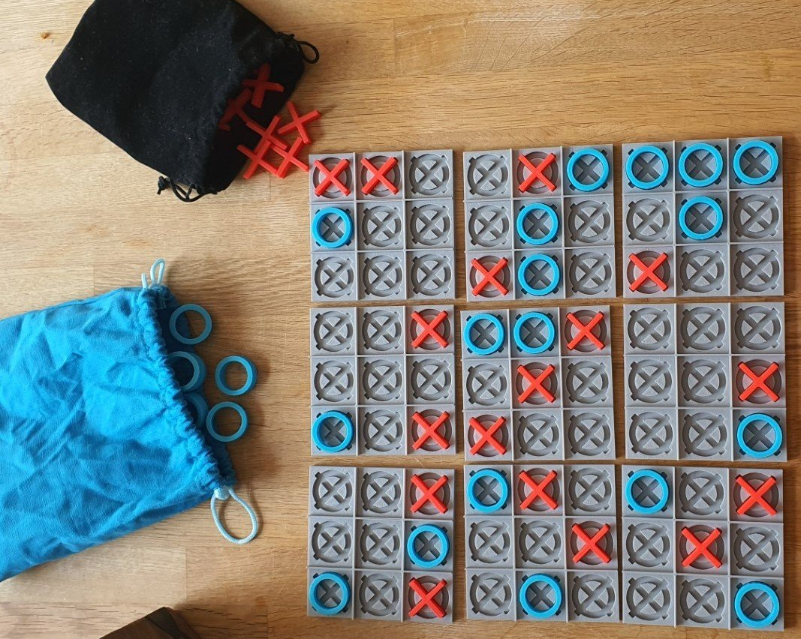
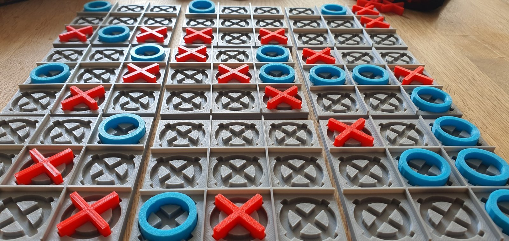

# Ultimate Tic-Tac-Toe

## Rules

- The game is played on a grid that's 3x3 Tic Tac Toe boards.
- The first player may start in any cell in any mini board.
- The board in which the next player must play is determined by the cell the previous player chose.
- If sent to a board that's already won, the player may choose any other free board.
- The game is won if a player manages to win 3 boards that add to a row on the big board.
- Else, if no further moves are possible the player with the most won mini boards wins the game.

## Game

I used these files: [Source](https://www.thingiverse.com/thing:5790641) to build this:

