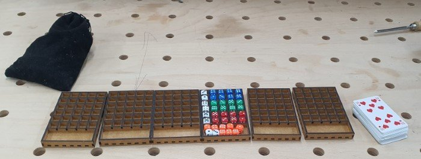
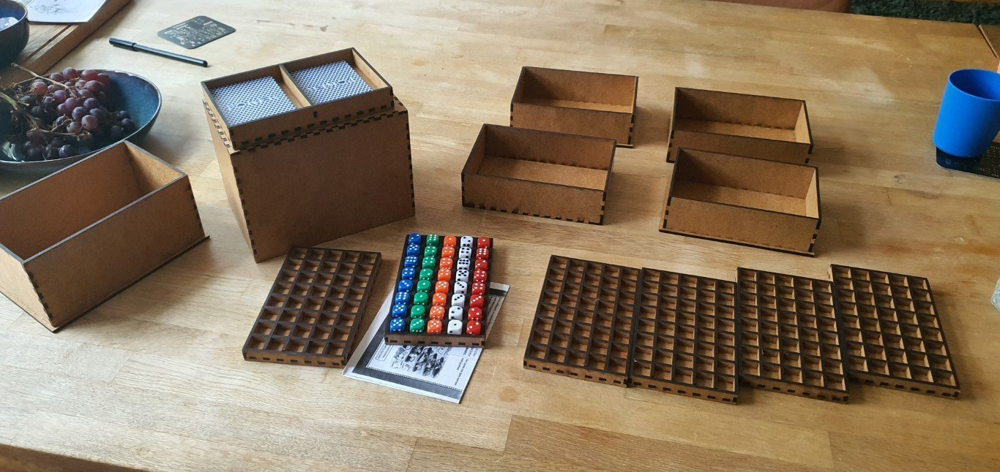
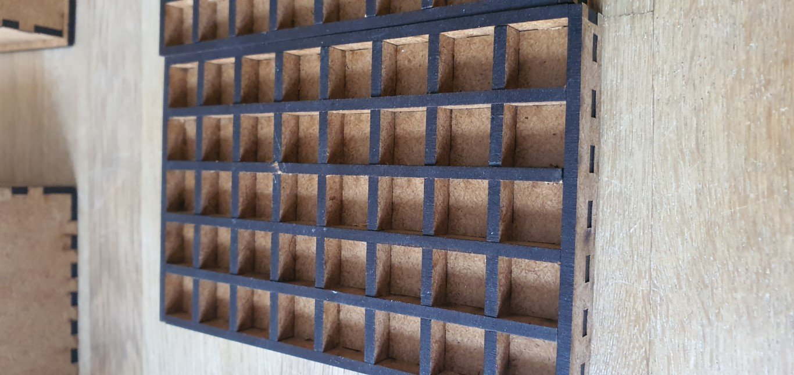

# Vegas

Details on the original game can be found here: "[Vegas](https://boardgamegeek.com/boardgame/117959/las-vegas)"

## Making the game

## Dice

You need 5 colors and 8 dice in each color. The cheapest option is usually to purchase 100 dice in 10 colors as a set. Choose smaller dice as they are cheaper and work better for the game.

## Cards instead of dollars

I use cards instead of money. You need 2 packs of cards for this game. Each number 2-10 represents 2000-10000 dollars. There is no 1000 dollar so the limit per casino is not 5000 but 6000.

The following cards are available:

- 6x number 2
- 8x number 3
- 8x number 4
- 6x number 5
- 6x number 6
- 5x number 7
- 5x number 8
- 5x number 9
- 5x number 10

## First Version

This is the first version I made:

## Secound Version

This is the secound version I made:

[Download the files here](_vegasAllFiles.7z) to make your own.

## Additional Rules

### Extra Role

Everyone gets 1 poker chip and this can be used for a re-roll of a number group.
Before the cards are dealt, one chip is placed randomly (by rolling the dice) on each casino.
Not used chips count 1 point at the end.

### Predict Wins

Lay an additional dice of your color, hidden to each bay and predict your place (1-4 or not involved = 6).
Other players will do the same and no one should see what was predicted.
For each correct predictiction you earn 3 additional points.
