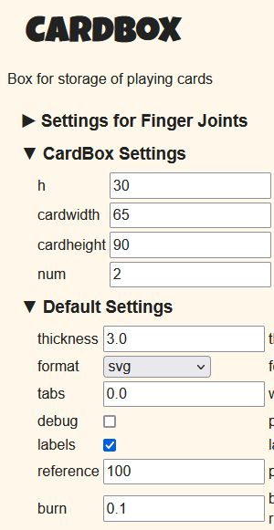

# Würfeln

Bet on your roll outcome and receive or pay rocks. Beware of the 🦄. The first player with no rocks left loses the round. All other players keep their rocks. Bet on the 🦄 and play another round.

Winner is whoever has the most rocks after an agreed amount of rounds. The game ends early if all rocks are gone and winner is the player with the most rocks at this point in the game.

## Setup

Setup the game:

- Put all rocks (> 50) in a bowl.
- Place the dice tray centrally.
- Place the round counter (a D10) in the center and set it to 1.
- Place the 🦄 (Einhorn) centrally between rock stash and dice tray.
- Each player receives 3 standard D6 (numbers 1-6) dice, a card with the roll-result overview and 6 rocks to start with.

Agree on the win condition:

- Agree on how many rounds shall be played to determine the winner. (Default is 5)

Determine who starts:

- Each player rolls all three dice once and the player with highest total number starts the game.
- If there is a draw those players roll again until a starting player is determined.
- The winner and player that starts the game receives the 🦄 (Einhorn).

## Play

The current player decides to either predict the upcoming roll attempt or to remain silent and do a passive roll; then proceeds to roll all three dice once in the dice tray.

There are 4 predictable outcomes. Below is a list of all possible results and their probability (percent of "total combinations"):

| Result                | Rule  Example                                                                   | Total Combinations |
|-----------------------|---------------------------------------------------------------------------------|--------------------|
| ⚰️ Das Unvermeidliche | ```n & n+1 & (!n / !n+1)``` </br> Example: ⚀⚁⚃ or ⚂⚃⚀                           | 96 (44,4%)         |
| 🎁 Wunsch             | ```2x n & !n``` </br> Example: ⚀⚀⚁ or ⚁⚃⚁                                       | 90 (41,7%)         |
| 🦄 Einhorn            | ```n & n+2 & (n+4 / n+5)``` </br> ```n & n+3 & n+5``` </br> Example: ⚀⚂⚄ or ⚀⚃⚅ | 24 (11,1%)         |
| ☢️ Dreifaltigkeit     | ```3x n``` </br> Example: ⚁⚁⚁ or ⚅⚅⚅                                            | 6  (2,8%)          |

Each possible roll result is represented by a symbol and name. Most common are ⚰️ (Das Unvermeidliche) and 🎁 (Wunsch). At the beginning your card with the roll-result overview may be helpful to determine the result.

Based on the players roll attempt and the prediction made, there is one possible result that leads to adding or removing rocks from the players game stash. The table looks as follows:

| Result                | Correct | Wrong | Passive |
|-----------------------|---------|-------|---------|
| ⚰️ Das Unvermeidliche | +2      | -2    | -1      |
| 🎁 Wunsch             | +2      | -2    | -1      |
| 🦄 Einhorn            | +5      | -5    | +1      |
| ☢️ Dreifaltigkeit     | +5      | +1    | +5      |

E.g., in case the roll result was a 🎁 (Wunsch) go to that line in the table, then check if the prediction was correct, wrong or passive and add or remove rocks accordingly.

It does not matter what prediction was made specifically. All that matters is if the prediction was correct, wrong or if no prediction was made. In other words: The rocks added or removed are determined by the result rolled, not by what was predicted. E.g., if a 🎁 (Wunsch) is rolled, it doesn't matter if 🦄 (Einhorn) or ☢️ (Dreifaltig) were predicted, both are wrong and the player must return 2 rocks to the central stash.

Once the rocks are taken or given the player takes back the rolled dice from the dice tray and the turn ends.

## Einhorn

Additionally, if a player that rolls an 🦄 (Einhorn) receives the 🦄 figure.

The 🦄 figure has the follow effects for the owner:

- When rolling an 🦄 no rocks are earned/paid (nothing happens).
- The player can give and take (depending on the roll attempt outcome) rocks either from the central stash or from any other player!
- The 🦄 is passed once another player rolls an 🦄.

Once the round ends the 🦄 is placed in the middle of the dice tray and all players bet with their personal rock stash (if available) to receive the 🦄 in the next round. It is recommended to not show how much you are bidding on the 🦄 to get players to bid more then they needed. You may bid zero rocks if you want. The 🦄 goes to the highest bidder but all bidders pay their rocks and place them in the central stash. In case there is a tie all highest bidders roll their 3 dice and the player with the highest total sum receives the 🦄 figure. E.g., if all bid zero, all must roll their dice. In case there is another tie the players re-roll the dice until a winner can be determined.

The player with the 🦄 starts the next round.

## How to win

Once a player has no rocks left the round ends. All other players put their remaining rocks in their rock stash.

If this is not the last round:

- All players can now bet on the 🦄 with their rocks available from their stash as described above.
- A new round begins and all players receive 6 rocks from the main stash.
- Add one to the D10 round counter.
- Players with a personal rock stash may choose to add rocks to their current game stash at this time only.

Once the agreed number of rounds are played the player with the most rocks in their stash wins the game.

## Extras

This is not needed to understand or play the game.

??? game "Example game"
    The following is an example game play with three players:

    All players agree to play 5 rounds.

    - Player 1 starts the game and bets on rolling a 🎁. Player 1 then proceeds to roll 1,2,5 which is ⚰️ and therefore loses 2 rocks. Player 1 started with 6 rocks and now has 4. Now it is the next players turn.
    - The 2nd player predicts an 🦄 and rolls a 1,3,6 and therefore gains 5 rocks.
    - The 3rd player choses to not predict anything and rolls 2,2,2 which is ☢️. In this case the player gains 5 rocks.
    - It is player 1 turn again and predicts ⚰️, then rolls 3,1,4 which is ⚰️. Player 2 takes one rock from the central stash.
    - Player 2 now has the 🦄 and predicts ⚰️ as well and rolls 4,5,6 which is ⚰️. Player 2 takes the 2 rocks from player 1 instead of the central stash.

    The game goes on like this until, in our example, player 2 loses the first round. At this point player 1 has 6 rocks and player 3 has 4 rocks.

    The 🦄 is now open for auction. Since this is the 1st round and player 2 lost the game there are no rocks to bet with for this player. Player 1 bets 3 rocks and player 3 bets 1 rock. Both players put the rocks they bet in the center stash and player 1 receives the 🦄.

    All players now receive 6 new rocks. Player 1 decides to add 2 rocks from the own stash to the current player stash. Player 1 now has 1 rock remaining in the stash and 8 rocks to play with for the round as well as the 🦄 figure. Both other players do not add rocks and start with 6 rocks.

    Player 1 with the 🦄 starts the new round and the game continues.

    At the end of round 5 player 1 has 20 rocks, player 2 has 15 rocks and player 3 has 22 rocks. Player 3 therefore wins the game.

<script src="https://polyfill.io/v3/polyfill.min.js?features=es6"></script>
<script src="https://cdn.jsdelivr.net/npm/mathjax@3/es5/tex-chtml.js"></script>

??? warning "Warning: Math"
    With 3x D6 we get a total of 216 (6x6x6 or 6^3) possible outcomes.

    Let us now look at unique rolls. To get all possible combinations we can use this formula for combination with repetition:

    \begin{align}
        \frac{(n+k-1)!}{k!*(n-1)!}
    \end{align}

    To learn more read about [Binomial coefficient](https://en.wikipedia.org/wiki/Binomial_coefficient) and [combinatorics](https://en.wikipedia.org/wiki/Combinatorics).

    With 3x D6 we get n = 6, k = 3 resulting in 56 combinations.

    \begin{align}
        \frac{(6+3-1)!}{3!*(6-1)!} = 56
    \end{align}

    You can copy ```(6+3-1)!/(3!*(6-1)!)``` to WolframAlpha to calculate it or use [this link](https://www.wolframalpha.com/input/?i=%286%2B3-1%29%21%2F%283%21*%286-1%29%21%29).

    These 56 combinations distribute as follows:

    | Result                |                                                                                                                                                                     | Amount | Percent |
    |-----------------------|---------------------------------------------------------------------------------------------------------------------------------------------------------------------|--------|---------|
    | ⚰️ Das Unvermeidliche | ⚀⚁⚃, ⚀⚁⚄, ⚀⚁⚅, ⚁⚂⚀ </br> ⚁⚂⚄, ⚁⚂⚅, ⚂⚃⚀, ⚂⚃⚁</br>⚂⚃⚅, ⚃⚄⚀, ⚃⚄⚁, ⚃⚄⚂, </br> ⚄⚅⚀, ⚄⚅⚁, ⚄⚅⚂, ⚄⚅⚃                                                                        | 16     | 29 %    |
    | 🎁 Wunsch             | ⚀⚀⚁, ⚀⚀⚂, ⚀⚀⚃, ⚀⚀⚄, ⚀⚀⚅</br>⚁⚁⚀, ⚁⚁⚂, ⚁⚁⚃, ⚁⚁⚄, ⚁⚁⚅</br>⚂⚂⚀, ⚂⚂⚁, ⚂⚂⚃, ⚂⚂⚄, ⚂⚂⚅</br>⚃⚃⚀, ⚃⚃⚁, ⚃⚃⚂, ⚃⚃⚄, ⚃⚃⚅</br>⚄⚄⚀, ⚄⚄⚁, ⚄⚄⚂, ⚄⚄⚃, ⚄⚄⚅</br>⚅⚅⚀, ⚅⚅⚁, ⚅⚅⚂, ⚅⚅⚃, ⚅⚅⚄ | 30     | 54 %    |
    | 🦄 Einhorn            | ⚀⚂⚄, ⚀⚂⚅, ⚀⚃⚅, ⚁⚃⚅                                                                                                                                                  | 4      | 7 %     |
    | ☢️ Dreifaltigkeit     | ⚀⚀⚀, ⚁⚁⚁, ⚂⚂⚂</br>⚃⚃⚃, ⚄⚄⚄, ⚅⚅⚅                                                                                                                                     | 6      | 11 %    |

    However, this is not the probability of each combination since the distinct combinations are not evenly distributed over the 216 possible outcomes.

    I do not know how to calculate this, so I created a python script and analyzed of all possible outcomes. To view the full list, expand "Full list of possible dice combinations". The outcome is as follows:

    | Result               | total      | distinct |
    |----------------------|------------|----------|
    | ⚰️ Das Unvermeidlich | 96 (44,4%) | 16 (29%) |
    | 🎁 Wunsch            | 90 (41,7%) | 30 (54%) |
    | 🦄 Einhorn           | 24 (11,1%) | 4 (7%)   |
    | ☢️ Dreifaltigkeit    | 6 (2,8%)   | 6 (11%)  |

    The result shows that Das Unvermeidliche has less distinct variations than Wunsch but more possible combinations.

??? code "Script to analyze all possible roll attempts"
    Here is the python script I wrote to calculate the result:

    ```py
    # Check groups for Würfel game:
    # Step 1 create all possible options for 3x D6 dice
    # Step 2 remove doubles -> if total is 1 = Dreifaltigkeit, 2 = Wunsch
    # Step 3 with all remaining sort numbers and count min distance between all three values. If min distance is 1 = Unvermeidlich, else Einhorn

    from itertools import product # pip install itertools
    from collections import OrderedDict
    import math

    # Dice settings
    diceFaces = 6
    diceSmallestNumber = 1
    diceHighestNumber = 6
    diceAmount = 3

    # Counter
    Dreifaltigkeit = 0
    Wunsch = 0
    Unvermeidlich = 0
    Einhorn = 0

    # Create a list of all possible roll attempts
    rolls = list(product(range(diceSmallestNumber,diceHighestNumber+1), repeat=diceAmount))

    # Iterate roll attempts and check result
    for roll in rolls:
        # Prepare list
        removedDoubleRoll = tuple(OrderedDict.fromkeys(roll).keys())
        sortedRoll = list(removedDoubleRoll)
        sortedRoll.sort() 

        # Count and print result
        if (len(sortedRoll)==2):
            print(roll, " Wunsch")
            Wunsch += 1
        elif (len(sortedRoll)==1):
            print(roll, " Dreifaltigkeit")
            Dreifaltigkeit += 1
        else:
            if ((sortedRoll[1]-sortedRoll[0]==1) or (sortedRoll[2]-sortedRoll[1]==1)):
                print(sortedRoll, " Unvermeidlich")
                Unvermeidlich += 1
            else:
                print(sortedRoll, " Einhorn")
                Einhorn += 1

    # Print stats
    print("\nTotal amount of possible rolls: ", len(rolls))
    print("Total amount of distint rolls: ", int((math.factorial(diceFaces+diceAmount-1))/(math.factorial(diceAmount)*(math.factorial(diceFaces-1)))))

    print("\nDreifaltigkeit: ", Dreifaltigkeit, "({:.1f}".format(Dreifaltigkeit / len(rolls) * 100), "%)")
    print("Wunsch: ", Wunsch, "({:.1f}".format(Wunsch / len(rolls) * 100), "%)")
    print("Unvermeidlich: ", Unvermeidlich, "({:.1f}".format(Unvermeidlich / len(rolls) * 100), "%)")
    print("Einhorn: ", Einhorn, "({:.1f}".format(Einhorn / len(rolls) * 100), "%)")
    ```

??? work "creating the game"
    Creating a box

    Using boxes.py: <https://www.festi.info/boxes.py/TwoPiece?FingerJoint_angle=90.0&FingerJoint_style=rectangular&FingerJoint_surroundingspaces=2.0&FingerJoint_edge_width=1.0&FingerJoint_finger=2.0&FingerJoint_play=0.0&FingerJoint_space=2.0&FingerJoint_width=1.0&x=182&y=182&h=65&hi=0.0&outside=0&play=0.15&thickness=3.0&format=svg&tabs=0.0&debug=0&labels=0&labels=1&reference=100&burn=0.1&render=1>

    These are the settings:

    

    Here are the files for the laser cutter: [SVG](_wuerfeln.svg), [CDR-part1](_wuerfeln.cdr) and [CDR-part2](_wuerfeln2.cdr)

??? info "Full list of possible dice combinations"
    This is a full list of all possible roll combinations in this game and the result based on the described rules above.
    
    | D1 | D2 | D3 | Result             |
    |----|----|----|--------------------|
    | 1  | 1  | 1  | Dreifaltigkeit     |
    | 1  | 1  | 2  | Wunsch             |
    | 1  | 1  | 3  | Wunsch             |
    | 1  | 1  | 4  | Wunsch             |
    | 1  | 1  | 5  | Wunsch             |
    | 1  | 1  | 6  | Wunsch             |
    | 1  | 2  | 1  | Wunsch             |
    | 1  | 2  | 2  | Wunsch             |
    | 1  | 2  | 3  | Das Unvermeidliche |
    | 1  | 2  | 4  | Das Unvermeidliche |
    | 1  | 2  | 5  | Das Unvermeidliche |
    | 1  | 2  | 6  | Das Unvermeidliche |
    | 1  | 3  | 1  | Wunsch             |
    | 1  | 2  | 3  | Das Unvermeidliche |
    | 1  | 3  | 3  | Wunsch             |
    | 1  | 3  | 4  | Das Unvermeidliche |
    | 1  | 3  | 5  | Einhorn            |
    | 1  | 3  | 6  | Einhorn            |
    | 1  | 4  | 1  | Wunsch             |
    | 1  | 2  | 4  | Das Unvermeidliche |
    | 1  | 3  | 4  | Das Unvermeidliche |
    | 1  | 4  | 4  | Wunsch             |
    | 1  | 4  | 5  | Das Unvermeidliche |
    | 1  | 4  | 6  | Einhorn            |
    | 1  | 5  | 1  | Wunsch             |
    | 1  | 2  | 5  | Das Unvermeidliche |
    | 1  | 3  | 5  | Einhorn            |
    | 1  | 4  | 5  | Das Unvermeidliche |
    | 1  | 5  | 5  | Wunsch             |
    | 1  | 5  | 6  | Das Unvermeidliche |
    | 1  | 6  | 1  | Wunsch             |
    | 1  | 2  | 6  | Das Unvermeidliche |
    | 1  | 3  | 6  | Einhorn            |
    | 1  | 4  | 6  | Einhorn            |
    | 1  | 5  | 6  | Das Unvermeidliche |
    | 1  | 6  | 6  | Wunsch             |
    | 2  | 1  | 1  | Wunsch             |
    | 2  | 1  | 2  | Wunsch             |
    | 1  | 2  | 3  | Das Unvermeidliche |
    | 1  | 2  | 4  | Das Unvermeidliche |
    | 1  | 2  | 5  | Das Unvermeidliche |
    | 1  | 2  | 6  | Das Unvermeidliche |
    | 2  | 2  | 1  | Wunsch             |
    | 2  | 2  | 2  | Dreifaltigkeit     |
    | 2  | 2  | 3  | Wunsch             |
    | 2  | 2  | 4  | Wunsch             |
    | 2  | 2  | 5  | Wunsch             |
    | 2  | 2  | 6  | Wunsch             |
    | 1  | 2  | 3  | Das Unvermeidliche |
    | 2  | 3  | 2  | Wunsch             |
    | 2  | 3  | 3  | Wunsch             |
    | 2  | 3  | 4  | Das Unvermeidliche |
    | 2  | 3  | 5  | Das Unvermeidliche |
    | 2  | 3  | 6  | Das Unvermeidliche |
    | 1  | 2  | 4  | Das Unvermeidliche |
    | 2  | 4  | 2  | Wunsch             |
    | 2  | 3  | 4  | Das Unvermeidliche |
    | 2  | 4  | 4  | Wunsch             |
    | 2  | 4  | 5  | Das Unvermeidliche |
    | 2  | 4  | 6  | Einhorn            |
    | 1  | 2  | 5  | Das Unvermeidliche |
    | 2  | 5  | 2  | Wunsch             |
    | 2  | 3  | 5  | Das Unvermeidliche |
    | 2  | 4  | 5  | Das Unvermeidliche |
    | 2  | 5  | 5  | Wunsch             |
    | 2  | 5  | 6  | Das Unvermeidliche |
    | 1  | 2  | 6  | Das Unvermeidliche |
    | 2  | 6  | 2  | Wunsch             |
    | 2  | 3  | 6  | Das Unvermeidliche |
    | 2  | 4  | 6  | Einhorn            |
    | 2  | 5  | 6  | Das Unvermeidliche |
    | 2  | 6  | 6  | Wunsch             |
    | 3  | 1  | 1  | Wunsch             |
    | 1  | 2  | 3  | Das Unvermeidliche |
    | 3  | 1  | 3  | Wunsch             |
    | 1  | 3  | 4  | Das Unvermeidliche |
    | 1  | 3  | 5  | Einhorn            |
    | 1  | 3  | 6  | Einhorn            |
    | 1  | 2  | 3  | Das Unvermeidliche |
    | 3  | 2  | 2  | Wunsch             |
    | 3  | 2  | 3  | Wunsch             |
    | 2  | 3  | 4  | Das Unvermeidliche |
    | 2  | 3  | 5  | Das Unvermeidliche |
    | 2  | 3  | 6  | Das Unvermeidliche |
    | 3  | 3  | 1  | Wunsch             |
    | 3  | 3  | 2  | Wunsch             |
    | 3  | 3  | 3  | Dreifaltigkeit     |
    | 3  | 3  | 4  | Wunsch             |
    | 3  | 3  | 5  | Wunsch             |
    | 3  | 3  | 6  | Wunsch             |
    | 1  | 3  | 4  | Das Unvermeidliche |
    | 2  | 3  | 4  | Das Unvermeidliche |
    | 3  | 4  | 3  | Wunsch             |
    | 3  | 4  | 4  | Wunsch             |
    | 3  | 4  | 5  | Das Unvermeidliche |
    | 3  | 4  | 6  | Das Unvermeidliche |
    | 1  | 3  | 5  | Einhorn            |
    | 2  | 3  | 5  | Das Unvermeidliche |
    | 3  | 5  | 3  | Wunsch             |
    | 3  | 4  | 5  | Das Unvermeidliche |
    | 3  | 5  | 5  | Wunsch             |
    | 3  | 5  | 6  | Das Unvermeidliche |
    | 1  | 3  | 6  | Einhorn            |
    | 2  | 3  | 6  | Das Unvermeidliche |
    | 3  | 6  | 3  | Wunsch             |
    | 3  | 4  | 6  | Das Unvermeidliche |
    | 3  | 5  | 6  | Das Unvermeidliche |
    | 3  | 6  | 6  | Wunsch             |
    | 4  | 1  | 1  | Wunsch             |
    | 1  | 2  | 4  | Das Unvermeidliche |
    | 1  | 3  | 4  | Das Unvermeidliche |
    | 4  | 1  | 4  | Wunsch             |
    | 1  | 4  | 5  | Das Unvermeidliche |
    | 1  | 4  | 6  | Einhorn            |
    | 1  | 2  | 4  | Das Unvermeidliche |
    | 4  | 2  | 2  | Wunsch             |
    | 2  | 3  | 4  | Das Unvermeidliche |
    | 4  | 2  | 4  | Wunsch             |
    | 2  | 4  | 5  | Das Unvermeidliche |
    | 2  | 4  | 6  | Einhorn            |
    | 1  | 3  | 4  | Das Unvermeidliche |
    | 2  | 3  | 4  | Das Unvermeidliche |
    | 4  | 3  | 3  | Wunsch             |
    | 4  | 3  | 4  | Wunsch             |
    | 3  | 4  | 5  | Das Unvermeidliche |
    | 3  | 4  | 6  | Das Unvermeidliche |
    | 4  | 4  | 1  | Wunsch             |
    | 4  | 4  | 2  | Wunsch             |
    | 4  | 4  | 3  | Wunsch             |
    | 4  | 4  | 4  | Dreifaltigkeit     |
    | 4  | 4  | 5  | Wunsch             |
    | 4  | 4  | 6  | Wunsch             |
    | 1  | 4  | 5  | Das Unvermeidliche |
    | 2  | 4  | 5  | Das Unvermeidliche |
    | 3  | 4  | 5  | Das Unvermeidliche |
    | 4  | 5  | 4  | Wunsch             |
    | 4  | 5  | 5  | Wunsch             |
    | 4  | 5  | 6  | Das Unvermeidliche |
    | 1  | 4  | 6  | Einhorn            |
    | 2  | 4  | 6  | Einhorn            |
    | 3  | 4  | 6  | Das Unvermeidliche |
    | 4  | 6  | 4  | Wunsch             |
    | 4  | 5  | 6  | Das Unvermeidliche |
    | 4  | 6  | 6  | Wunsch             |
    | 5  | 1  | 1  | Wunsch             |
    | 1  | 2  | 5  | Das Unvermeidliche |
    | 1  | 3  | 5  | Einhorn            |
    | 1  | 4  | 5  | Das Unvermeidliche |
    | 5  | 1  | 5  | Wunsch             |
    | 1  | 5  | 6  | Das Unvermeidliche |
    | 1  | 2  | 5  | Das Unvermeidliche |
    | 5  | 2  | 2  | Wunsch             |
    | 2  | 3  | 5  | Das Unvermeidliche |
    | 2  | 4  | 5  | Das Unvermeidliche |
    | 5  | 2  | 5  | Wunsch             |
    | 2  | 5  | 6  | Das Unvermeidliche |
    | 1  | 3  | 5  | Einhorn            |
    | 2  | 3  | 5  | Das Unvermeidliche |
    | 5  | 3  | 3  | Wunsch             |
    | 3  | 4  | 5  | Das Unvermeidliche |
    | 5  | 3  | 5  | Wunsch             |
    | 3  | 5  | 6  | Das Unvermeidliche |
    | 1  | 4  | 5  | Das Unvermeidliche |
    | 2  | 4  | 5  | Das Unvermeidliche |
    | 3  | 4  | 5  | Das Unvermeidliche |
    | 5  | 4  | 4  | Wunsch             |
    | 5  | 4  | 5  | Wunsch             |
    | 4  | 5  | 6  | Das Unvermeidliche |
    | 5  | 5  | 1  | Wunsch             |
    | 5  | 5  | 2  | Wunsch             |
    | 5  | 5  | 3  | Wunsch             |
    | 5  | 5  | 4  | Wunsch             |
    | 5  | 5  | 5  | Dreifaltigkeit     |
    | 5  | 5  | 6  | Wunsch             |
    | 1  | 5  | 6  | Das Unvermeidliche |
    | 2  | 5  | 6  | Das Unvermeidliche |
    | 3  | 5  | 6  | Das Unvermeidliche |
    | 4  | 5  | 6  | Das Unvermeidliche |
    | 5  | 6  | 5  | Wunsch             |
    | 5  | 6  | 6  | Wunsch             |
    | 6  | 1  | 1  | Wunsch             |
    | 1  | 2  | 6  | Das Unvermeidliche |
    | 1  | 3  | 6  | Einhorn            |
    | 1  | 4  | 6  | Einhorn            |
    | 1  | 5  | 6  | Das Unvermeidliche |
    | 6  | 1  | 6  | Wunsch             |
    | 1  | 2  | 6  | Das Unvermeidliche |
    | 6  | 2  | 2  | Wunsch             |
    | 2  | 3  | 6  | Das Unvermeidliche |
    | 2  | 4  | 6  | Einhorn            |
    | 2  | 5  | 6  | Das Unvermeidliche |
    | 6  | 2  | 6  | Wunsch             |
    | 1  | 3  | 6  | Einhorn            |
    | 2  | 3  | 6  | Das Unvermeidliche |
    | 6  | 3  | 3  | Wunsch             |
    | 3  | 4  | 6  | Das Unvermeidliche |
    | 3  | 5  | 6  | Das Unvermeidliche |
    | 6  | 3  | 6  | Wunsch             |
    | 1  | 4  | 6  | Einhorn            |
    | 2  | 4  | 6  | Einhorn            |
    | 3  | 4  | 6  | Das Unvermeidliche |
    | 6  | 4  | 4  | Wunsch             |
    | 4  | 5  | 6  | Das Unvermeidliche |
    | 6  | 4  | 6  | Wunsch             |
    | 1  | 5  | 6  | Das Unvermeidliche |
    | 2  | 5  | 6  | Das Unvermeidliche |
    | 3  | 5  | 6  | Das Unvermeidliche |
    | 4  | 5  | 6  | Das Unvermeidliche |
    | 6  | 5  | 5  | Wunsch             |
    | 6  | 5  | 6  | Wunsch             |
    | 6  | 6  | 1  | Wunsch             |
    | 6  | 6  | 2  | Wunsch             |
    | 6  | 6  | 3  | Wunsch             |
    | 6  | 6  | 4  | Wunsch             |
    | 6  | 6  | 5  | Wunsch             |
    | 6  | 6  | 6  | Dreifaltigkeit     |
