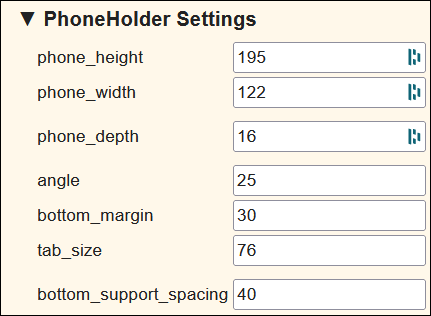
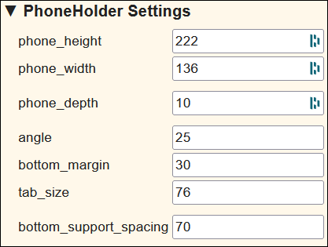
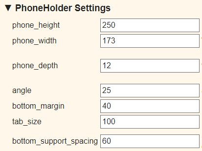

# Phone Holder

## Nexus 7

Direct link: <https://festi.info/boxes.py/PhoneHolder?FingerJoint_angle=90.0&FingerJoint_style=rectangular&FingerJoint_surroundingspaces=2.0&FingerJoint_edge_width=1.0&FingerJoint_finger=2.0&FingerJoint_play=0.0&FingerJoint_space=2.0&FingerJoint_width=1.0&phone_height=195&phone_width=122&phone_depth=16&angle=25&bottom_margin=30&tab_size=76&bottom_support_spacing=40&thickness=3.0&format=svg&tabs=0.0&debug=0&labels=0&labels=1&reference=100&burn=0.1&render=1>

Settings:

Laser cutter file: [SVG](_nexus7_holder.svg) and [CDR](_nexus7_holder.cdr)

## iPad Model A1489

Direct link: <https://festi.info/boxes.py/PhoneHolder?FingerJoint_angle=90.0&FingerJoint_style=rectangular&FingerJoint_surroundingspaces=2.0&FingerJoint_edge_width=1.0&FingerJoint_finger=2.0&FingerJoint_play=0.0&FingerJoint_space=2.0&FingerJoint_width=1.0&phone_height=222&phone_width=136&phone_depth=10&angle=25&bottom_margin=30&tab_size=76&bottom_support_spacing=70&thickness=3.0&format=svg&tabs=0.0&debug=0&labels=0&labels=1&reference=100&burn=0.1&render=1>

Settings:

Laser cutter file: [SVG](_ipad_holder.svg) and [CDR](_ipad_holder.cdr)

## S10 Note +

Laser cutter file: [SVG](_s10_note+.svg)

## Fire HD 10 (2021 - Version 11)

Direct link: <https://www.festi.info/boxes.py/PhoneHolder?FingerJoint_angle=90.0&FingerJoint_style=rectangular&FingerJoint_surroundingspaces=2.0&FingerJoint_edge_width=1.0&FingerJoint_finger=2.0&FingerJoint_play=0.0&FingerJoint_space=2.0&FingerJoint_width=1.0&phone_height=250&phone_width=173&phone_depth=12&angle=25&bottom_margin=40&tab_size=100&bottom_support_spacing=60&thickness=3.0&format=svg&tabs=0.0&debug=0&labels=0&labels=1&reference=100&burn=0.1&render=1>

Settings:

Laser cutter file: [SVG](_fire_hd10-2021.svg) and [CDR](_fire_hd10-2021.cdr)