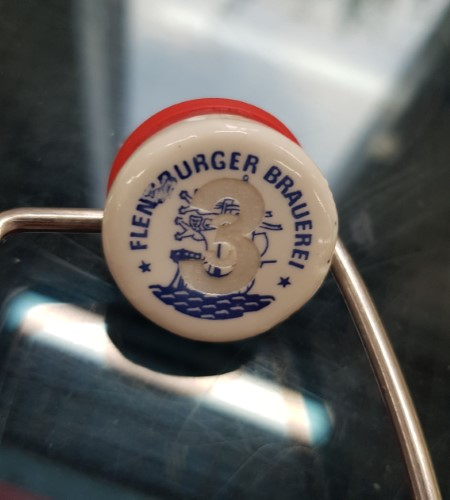

# Prömpeln

## Tests

I tested to laser the points you get at a given position on the Prömpel itself.

This didn't turn our as expected:

I guess this is not necessary and players can identify the points per prömpel position without labeling numbers on them.
