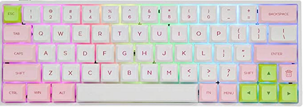
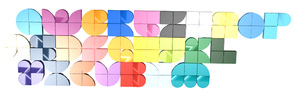

# Lego PC

## Keyboard

Base keyboard is an [EPOMAKER](https://epomaker.com/) [SKYLOONG SK64](https://epomaker.com/products/sk64abs)

I purchased lego key caps from [shapeways](https://www.shapeways.com/):

- [2x2 Cherry MX Key Caps](https://www.shapeways.com/product/PQBFDE5ZA/2x2-set-of-20-building-block-cherry-mx-key-caps?optionId=64245335)
- [Large Building Block Cherry MX Key C](https://www.shapeways.com/product/EAAWYPRN5/0003-set-of-large-building-block-cherry-mx-key-c?optionId=64588160)

I found a small [lego alphabet](https://rebrickable.com/mocs/MOC-48980/nathansonic/smallest-lego-alphabet) template on rebrickable and [tested it for the QWERTZ layout](_lego-dots-alphabet.io). Unfortunantly "W" and "M" are 2x3 spaces and the key caps are only 2x2.

