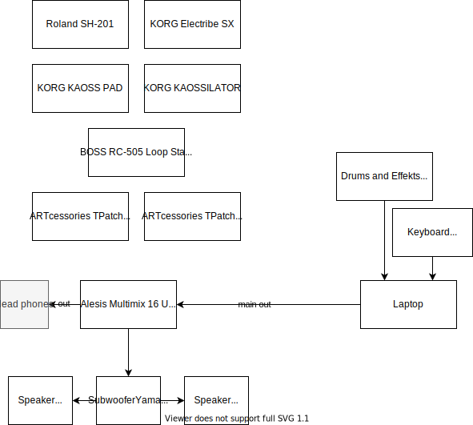
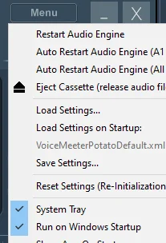
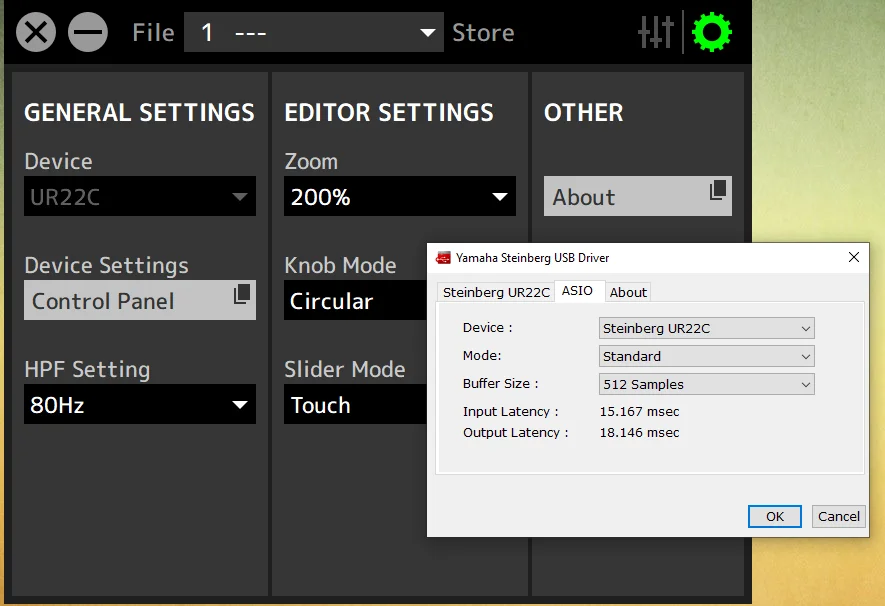
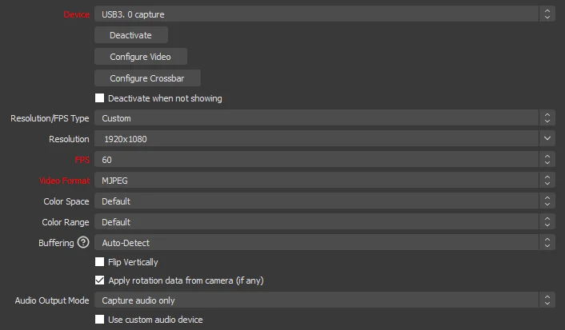

# My Setup

## Backup

Good Backup Rules:

- 3-2-1: There should be 3 copies of data on 2 different media with 1 copy being off site
- LOCKSS: Lots of Copies Keep Stuff Safe

## Music



### Windows 10 Setup

These are the relevant Windows Settings pages:

- App volume and device preferences: ```ms-settings:apps-volume```
- Sound Control Center: ```explorer shell:::{F2DDFC82-8F12-4CDD-B7DC-D4FE1425AA4D}```

### VB Audio

[VB Audio](https://vb-audio.com) offers some great tools to mix your audio for different purposes/scenarios. I use VB-CABLE and Voice Meeter.

### VB-CABLE Virtual Audio Device

### Voice Meeter Potato



#### License

You can export your device footprint on an activated licensed version of Voice Meeter. Backup this file and import it after re-installing your PC (first install all drivers, then install Voicemeeter Potato). This will ensure the license works even if the challenge code is different.

- Backup footprint
- Do changes to your system (new hardware/re-install)
- Install Voice Meeter Potato
- Enter e-mail address you used for Voice Meeter license and registration.
- Import the footprint
- Enter your previous Response code.

### Hardware

#### UR22C



### Tools

#### Cubase

## Video

### Cams



### OBS

Add GoPro 7 Black

I am using a cheap capture card called "Amozo 4K HDMI Video Capture Card, USB 3.0 Game Capture Card 1080P".

The folloing GoPro settings are setup:

To make this work no drivers need to be installed. The following OBS settings work for me:

- Add a new source, select "video capture device" → "audio and video input capture"
- Sources → Click "+"→ Find the "Video Capture Device"
- Choose "USB Video" as device
- Change the following settings:
  - Click "Deactivate"
  - Resolution/FPS choose "customize" → Resolution select "1920x1080"
  - FPS choose "60"
  - Video format select "MJPEG"


There is some delay which needs to be adjusted so that all input is synced properly:
