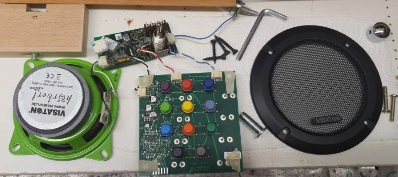
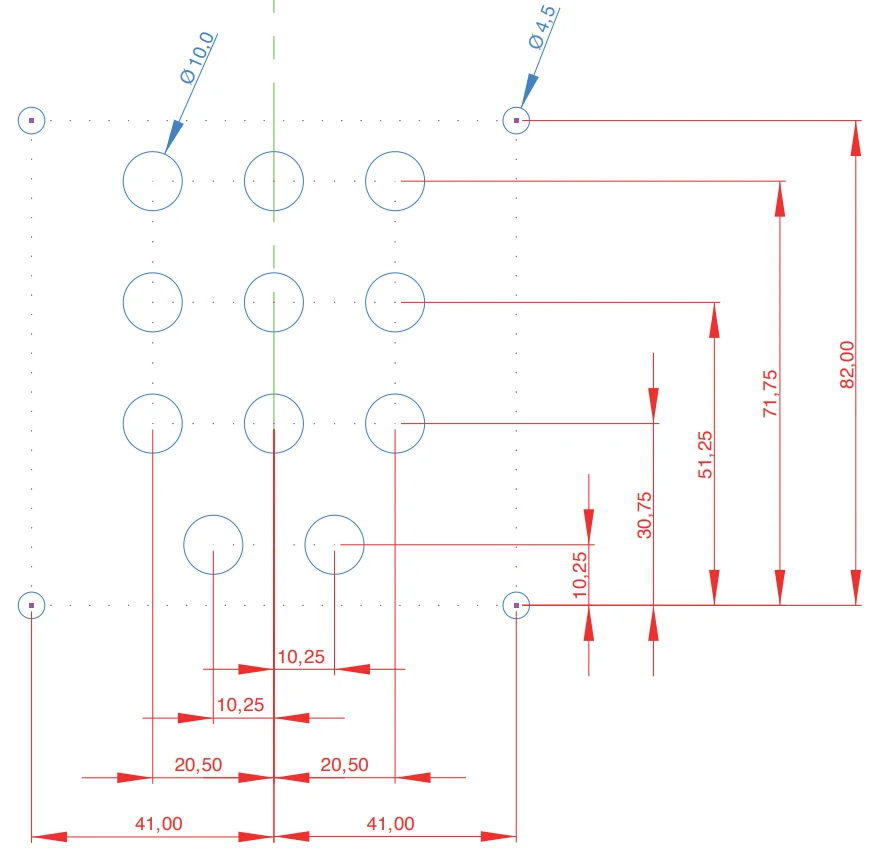
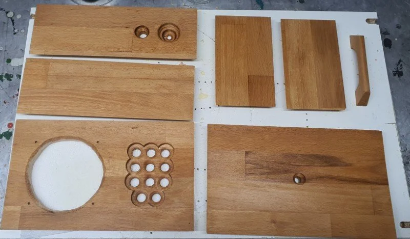
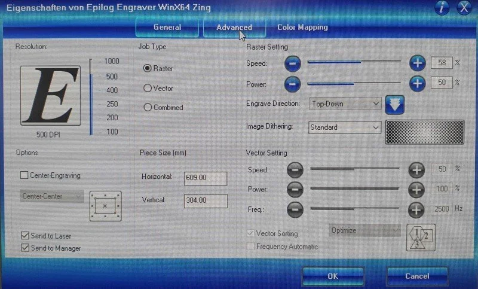
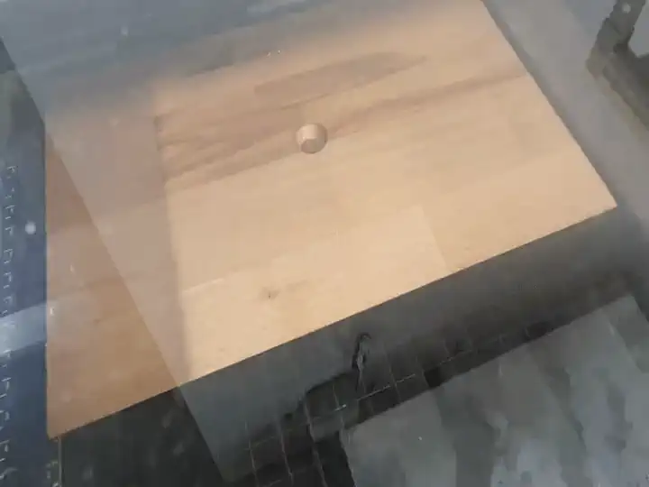
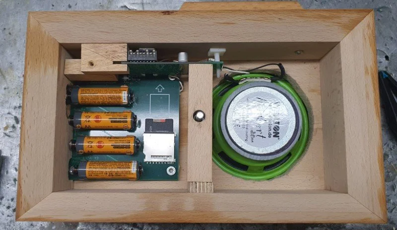
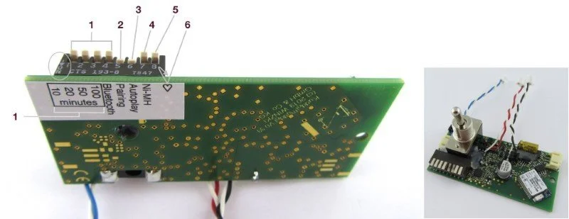
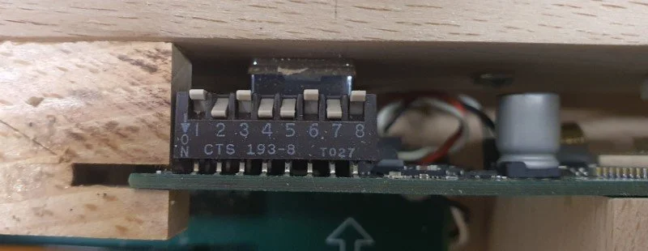
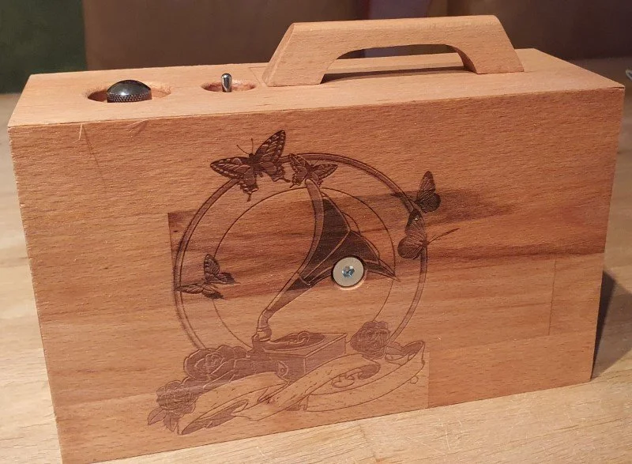

# Hörbert

I was looking for a simple music player for children and although there a million devices, most of them have a display, menu and buttons with multiple purposes. This is not suitable for small children and after researching for the best options I went with [Hörbert](https://www.hoerbert.com). My 2nd favorite option is the [phoniebox](http://phoniebox.de/).

What is nice about Hörbert is that you can buy the product itself or just the parts and build your own box. There are some great [creations](https://www.hoerbert.com/kreationen/) which inspired my to build my own Hörbert as well.

Most creations are similar to the original with buttons and speaker in the front. Another popular choice seems to be a cube. After some thoughts on what material to use and what shape to create I went with a similar approach as the original.

Purchases I made:

- Hörbert Electronics
- Hörbert Bluetooth Module
- Speaker Cover
- Bluetooth Headset

## Electronics

A first I ordered the electronics and hooked them up for a quick test if everything works as expected.

After soldering the wires I added insulating tube.
I additionally ordered a fitting front cover for the speaker.

These are all the electronic parts of the Hörbert:

## Build Case

Now that I had all pieces and was sure it all works it is time to build a case for the electronics.

### Schematics

The most challenging part is to get the holes for the 11 buttons perfectly aligned to they fit through the wood without too much extra space. I printed out the the schematics below and used them as a stencil.

If you want to build one yourself, these files may be helpful to you:

- [Schematics PNG](_hoerbert_bohrschablone.webp)
- [Schematics SVG](_hoerbert.svg)
- [Schematics PDF Part 1](_HoerbertFrontVorlage.pdf)
- [Schematics PDF Part 2](_HoerbertTastenVorlage1.pdf)

### Wood pieces

These are all wooden parts i made. The grip is the only piece i purchased. All box pieces have 45 degree corners so i can use wood glue to put them all together and have a clean corner line.

After all parts where as desired and everything fits I added a layer of wood oil to the outside.

### Laser cutter

I wanted a picture on the back and used a laser cutter to engrave an image on the removable cover.

The Epilog Zing 6040 settings I used are as follows:

This is a time lapse video of the laser cutter engraving the image:

I had to put the electronics in the case while glueing it all together as it would not fit in afterwards. This is the view of the electronics inside mounted to the box:

## Configuration

With the bluetooth module the Hörbert comes with some optional configurations.

Switches

- 1-4: Sleep timer
- 5: Turn on/off Bluetooth
- 6: Bluetooth Pairing
- 7: Auto-play (connect with last known device)
- 8: Battery saver (relevant for rechargeable batteries)

**Enable Auto-Shutdown**: I decided it would be best to automatically turn off the device after 100min of usage. This can be done by adjusting the switches 1-4.

|Switch 1 10|Switch 2|20 Switch 3 50|Switch 4 100| Time|
|--|-|--|--|--|
|ON|OFF|OFF|OFF|10 min|
|OFF|ON|OFF|OFF|20 min|
|OFF|OFF|ON|OFF|50 min|
|OFF|OFF|OFF|ON|100 min|
|OFF|OFF|OFF|OFF|no end|

This is the setup I went with:

## Final result

This is the final result of my Hörbert :)

