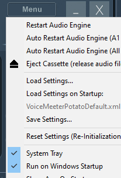
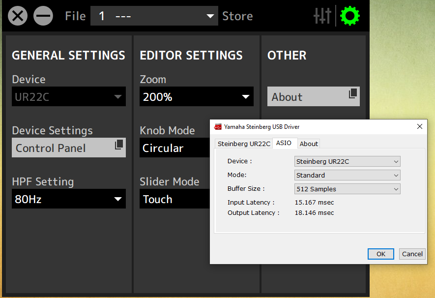

# Setup

## Voice Meeter Potato

### Licence

You can export your device footprint on a activated licensed version of Voice Meeter. Backup this file and import it after re-installing your PC (first install all drivers, then install Voicemeeter Potato. This will ensure the licence works even if the challenge code is different.

- Backup footprint
- Do changes to your system (new hardware/re-install)
- Install Voice Meeter Potato
- Enter e-mail address your used for Voice Meeter licence and registration.
- Import the footprint
- Enter your previous Response code.

## Hardware

### UR22C

