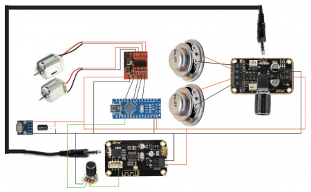
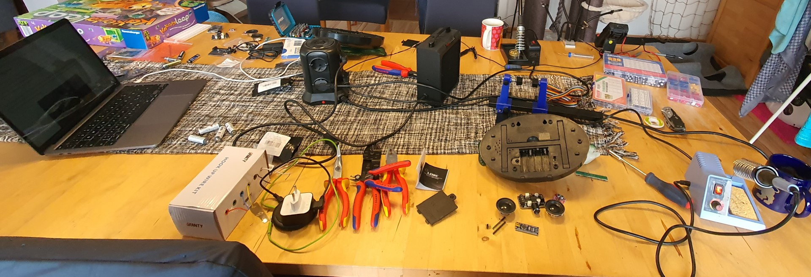
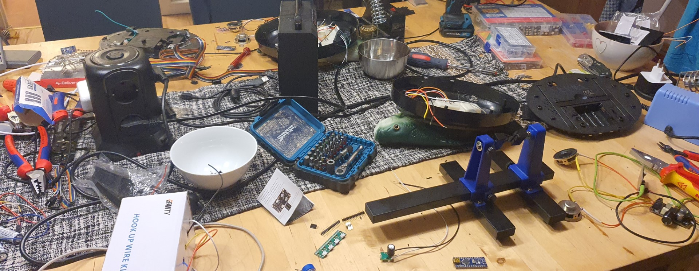
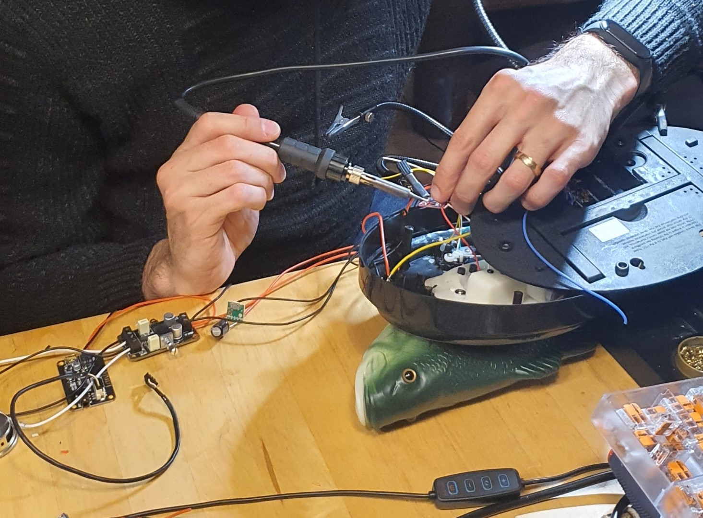
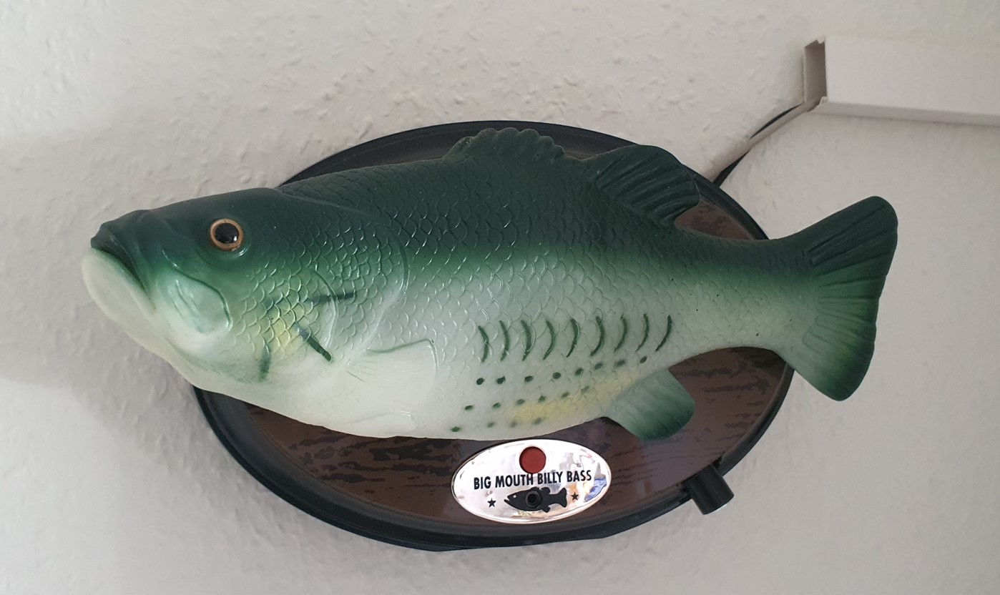

# Billy Bass

I followed this [guide](https://maker.pro/arduino/projects/how-to-animate-billy-bass-with-bluetooth-audio-source) to build my own bluetooth billy bass.

Shopping List:

- Big Mouth Billy Bass
- Arduino Nano (Nano Board CH 340/ATmega+328P Without USB Cable, Compatible with Arduino Nano V3.0)
- H-Bridge board (Aideepen 5pcs Dual H-Bridge DC Stepper 1.5A 2 Way DC Motor Driver Module Replace Stepper L298N)
- Amplifier board (Audio Amplifier Board, DROK 5W+5W Mini Amplifier Board PAM8406 DC 5V Digital Stereo Power Amp 2.0 Dual Channel Class D)
- Bluetooth module (Bluetooth Board, DROK 12V Audio Receiver Blue~Tooth Module DC 5V-12V)
- Speakers (Gikfun 4Ohm 40mm Diameter 3W Full Range Audio Speaker Stereo Woofer Loudspeaker for Arduino)
- Micro-USB board (Female Micro USB to DIP 5-Pin Pinboard 2.54mm Micro USB )

Basically remove buy a billy bass and remove all electronics except the motors. Then cable the following components as illustrated here:

Flash the arduino with this [code](_BTBillyBassCode.zip).

I tweeked the original code a little bit so that there is a faster pause whenever there is silence. This works great for spoken works. For music it doenst't really matter.

The chosen Stepper Module unfortunantly makes some sounds... possibly consider upgrading to something nicer and quiter.

Here are some pictures of Billy Bass in the making:

This is the final result:

Demo Video:

<iframe width="560" height="315" src="https://www.youtube-nocookie.com/embed/0aSd-JRkPvE" title="YouTube video player" frameborder="0" allow="accelerometer; autoplay; clipboard-write; encrypted-media; gyroscope; picture-in-picture; web-share" allowfullscreen></iframe>
