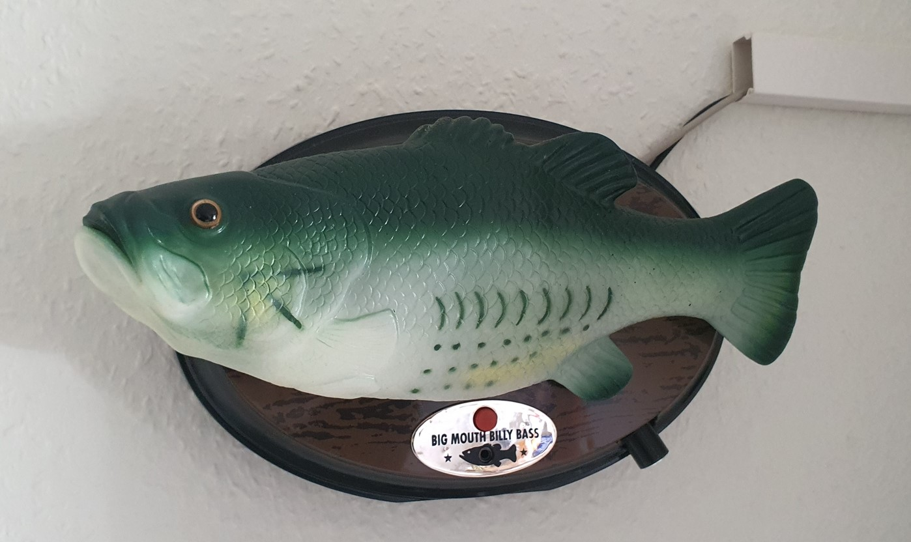
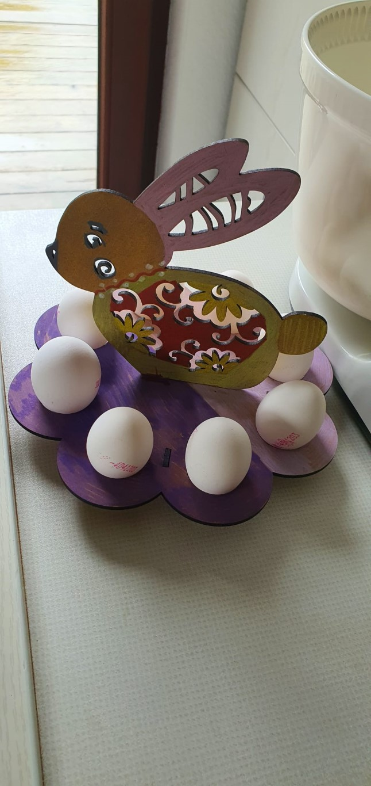
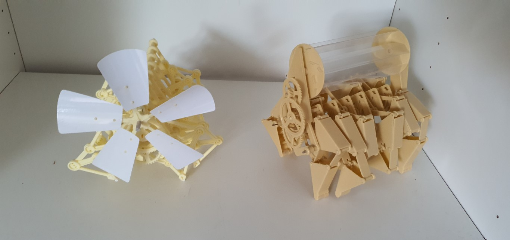

# Overview

This is an overview of the things I made and don't fit into a more specific category.

| Image                                                   | Link                                                                                          |
|---------------------------------------------------------|-----------------------------------------------------------------------------------------------|
|             | A variation of different creates to sort my AA, AAA, 9V, cell and random batteries            |
|            | Does life get any better than drinking a warm and shaken can beer after a good downhill ride? |
|      | This fish is my best friend.                                                                  |
|          | In bird culture this would considered a pro move.                                             |
|      | Bottle upgrades|
|                    | boulder bag experiments|
|                                | The cake is real. |
|                                  | Cup upgrades.                                                                                              |
|                    | A picture made with dice. Basically ASCII art but instead of chars i used dice.                                 |
|                            | Just some random stuff for easter. |
|  | Random usages of escher tessellation |
|                  | My first metal engraving using a special engraving spray. Way better results!                 |
|                        | My own Hörbert Case build using purchased electronics by Hörbert|
|      | I press buttons all day - why not have fun, right?                                            |
|               | Things I built with Lego that are not officially by Lego                                      |
|                    | Sorting pencils and other stuff...|
|    | These things don't stand by them selves... |
|                  | Building my strandbeest based on a purchased kit.|
|                  | A nice guitar that has more to offer. |
