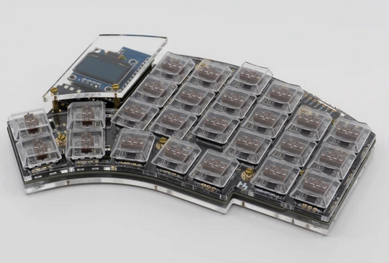

# Keyboards

## DZ60 Bambus/Wood Keyboard

Components

- OMO Universal 60% Custom Brass Plate 2U Left Shift
- DZ60/DZ60RGB USB Type-C 60% PCB - DZ60RGB ANSI (Hotswap)
- Everglide V2 Screw-In Stabilizer Set - Black
- Bamboo Wood Case 60%
- TODO: Switches
- TODO: Key caps

## Kyria Split Keyboard

Kyria by [splitkb.com](https://splitkb.com/)

Components

- 1x Kyria PCB Kit Black Kyria Kit
- 1x Kyria Acrylic Plate Case (Clear / MX and Choc / 6 columns / Full Plate)
- 2x Elite-C Low Profile (rev4) Microcontroller
- 2x SSD1306 OLED Display 128x64
- 50x Kailh Low Profile Choc Switches (Silver, linear)
- 50x Kailh Choc Transparent Keycaps

## Pi 400

Links:

- [Raspberry Pi 400 as a USB HID Keyboard & Mouse](https://github.com/Gadgetoid/pi400kb)

## Custom Keyboard with SJ@JX

### CY-1124HC

SJ@JX Development keyboard encoder board

### 126 HC

104 keys development keyboard encoder board by SJ@JX

## T500 Keyboard

I removed the keyboard from my T500:

## Duckypad

