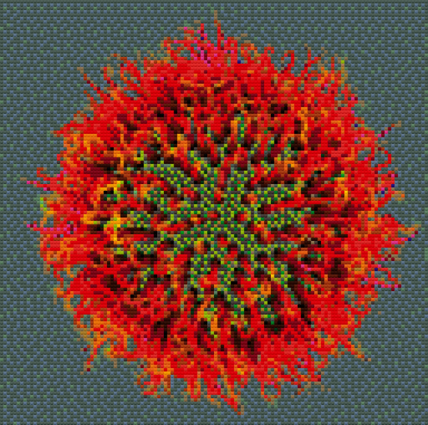

# Lego Builds

## Star Wars

My collection of official Lego Star Wars builds.

TODO

## Rubik's Cube

I built the [LEGO Rubik's Cube Lego](https://rebrickable.com/mocs/MOC-91837/puzzLEGO/working-lego-rubiks-cube-new-revised/#details) MOC Designed by [puzzLEGO](https://rebrickable.com/users/puzzLEGO/mocs/). This is a [video](https://www.youtube.com/watch?v=tolQCt76LBk) on the design. I purchased all parts from one vendor at [bricklink](https://www.bricklink.com).


## Flowers


## Pixel-Art

### Creating Pixel Art

[Legofy](https://github.com/JuanPotato/Legofy) makes images look as if they are made out of 1x1 LEGO blocks.

I tested some settings and after 128px the image looks better dither set to "on".

Install legofy with pip:

``` py
pip install legofy
```

I tried the following 4 options:

``` sh
legofy --size 32 --no-dither --palette all 0xfab1.png 0xfab1_lego32.png
legofy --size 64 --no-dither --palette all 0xfab1.png 0xfab1_lego64.png
legofy --size 128 --dither --palette all 0xfab1.png 0xfab1_lego128.png
legofy --size 256 --dither --palette all 0xfab1.png 0xfab1_lego256.png
```

This gets big and expensive quickly; so lets check when the chosen picture looks good enough:

32x32


64x64


128x128


256x256


### Building this for real

TODO

## Lego QR-Code

I created a Lego QR Code linking to [0xfab1.net](https://0xfab1.net/ "https://0xfab1.net/") with [Bricklink Studio](https://www.bricklink.com/v3/studio/download.page "https://www.bricklink.com/v3/studio/download.page").

I used [qrious](https://github.com/neocotic/qrious "https://github.com/neocotic/qrious") by [neocotic](https://neocotic.dev/ "https://neocotic.dev/") to create the QR-Code.

### QR Code creation

To match the QR-Code pixels with a valid lego base plate size I tried a few options to find a match.

Possible lego base plates

``` txt
14x14 → 14,28,42,56,70
16x16 → 16,32,48,64,72
24x24 → 24,48,72
32x32 → 32,64
48x48 → 48
50x50 → 50
```

Since a QR-Code has the same length as hight any of the above values would fit perfectly on a given lego base plate.

Unfortunately the initial idea of using the value "https://0xfab1.net/make/lego/qr-code/" and therewith referencing to this page doesn't result in a perfect match despite trying different paddings:

``` txt
7% padding:  29x29 or *2 for double width = 58x58
15% padding: 29+29 or *2 for double width = 58x58
25% padding: 33x33 or *2 for double width = 66x66
30% padding: 37x37 or *2 for double width = 74x74
```

The next attempt would to go for "https://0xfab1.net". The results are:  

``` txt
7% padding: 25x25 or *2 for double width = 50x50
15% padding: 25x25 or *2 for double width = 50x50
25% padding: 25x25 or *2 for double width = 50x50 → best option
30% padding: 29x29 or *2 for double width = 58x58
```

50x50 is a valid lego base plate and a possible result for the QR-Code. I will go with the 25% padding option as this will lead to better scanning results without any downsides.


The value "https://0xfab1.net" as QR-Code.

### Bricklink Studio

I didn't find a cool way to automatically build the QR-Code in Bricklink Studio so I just opened the image of the QR-Codes shared above and rebuilt it using different flat tiles. Classic QR-Codes have black and white pixels so i went with that look and chose a white 50x50 baseplate and used different sized black tiles for the pixels.


The result is:

- this [qrcode.io](_qrcode.io "qrcode.io") Bricklink file
- this [QR code.xml](_QRcode.xml "QRcode.xml") part-list file

as well as this cool video:

[](_qrcode.mp4 "download me")

### Bricklink Order

Fortunately you can import *.io files in Bricklink directly. It will search for sellers based on your preference (e.g. currency, location). The outcome initially was this list since i used as little amount of plates as possible:

| BLItemNo | ElementId | LdrawId | PartName               | BLColorId | LDrawColorId | ColorName | ColorCategory | Qty | Weight |
|----------|-----------|---------|------------------------|-----------|--------------|-----------|---------------|-----|--------|
| 3068b    | 306826    | 3068b   | Tile 2 x 2 with Groove | 11        | 0            | Black     | Solid Colors  | 38  | 48     |
| 69729    |           | 69729   | Tile 2 x 6             | 11        | 0            | Black     | Solid Colors  | 76  | 135    |
| 87079    | 4560182   | 87079   | Tile 2 x 4             | 11        | 0            | Black     | Solid Colors  | 38  | 9      |
| 3068b    | 306801    | 3068b   | Tile 2 x 2 with Groove | 1         | 15           | White     | Solid Colors  | 48  | 48     |
| 69729    |           | 69729   | Tile 2 x 6             | 1         | 15           | White     | Solid Colors  | 49  | 135    |
| 4186a    |           | 4186a   | Baseplate 50 x 50      | 1         | 15           | White     | Solid Colors  | 1   | 235    |
| 87079    | 4560178   | 87079   | Tile 2 x 4             | 1         | 15           | White     | Solid Colors  | 44  | 9      |

Turns out the 50x50 plate is not available and that the non 2x2 tiles are way more expensive.

So i ordered a 50x50 plate online somewhere else and changed the order to 2x2 tiles only, which reduced the price significantly (roughly 40% cheaper).

I went with 350 since 50x50/4 = 625 and I need roughly half black, half white tiles.
Since i didn't re-do the build in Bricklink Studio based on 2x2 tiles I added a few safety tiles = 350 per color which was still cheaper than to original order.

| BLItemNo | ElementId | LdrawId | PartName               | BLColorId | LDrawColorId | ColorName | ColorCategory | Qty | Weight |
|----------|-----------|---------|------------------------|-----------|--------------|-----------|---------------|-----|--------|
| 3068b    | 306801    | 3068b   | Tile 2 x 2 with Groove | 1         | 15           | White     | Solid Colors  | 350 | 48     |
| 3068b    | 306826    | 3068b   | Tile 2 x 2 with Groove | 11        | 0            | Black     | Solid Colors  | 350 | 48     |

### Delivery and building lego qr-code

All pieces finally arrived and putting it all together was easier and faster than expected.
I hope i didn't mess up any pixel - well at least scanning the lego works ¯\_(ツ)_/¯

This is the final result :)


## Lego PC

### Keyboard

Base keyboard is an [EPOMAKER](https://epomaker.com/) SKYLOONG SK64.


I purchased lego key caps from [shapeways](https://www.shapeways.com/):

- [2x2 Cherry MX Key Caps](https://www.shapeways.com/product/PQBFDE5ZA/2x2-set-of-20-building-block-cherry-mx-key-caps?optionId=64245335)
- [Large Building Block Cherry MX Key C](https://www.shapeways.com/product/EAAWYPRN5/0003-set-of-large-building-block-cherry-mx-key-c?optionId=64588160)

I found a small [lego alphabet](https://rebrickable.com/mocs/MOC-48980/nathansonic/smallest-lego-alphabet) template on rebrickable and [tested it for the QWERTZ layout](_lego-dots-alphabet.io). Unfortunantly "W" and "M" are 2x3 spaces and the key caps are only 2x2.


### PC

TODO

### Screen

TODO
