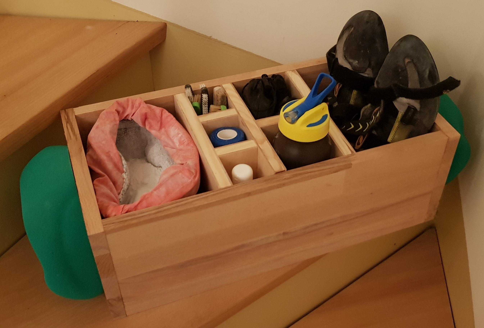
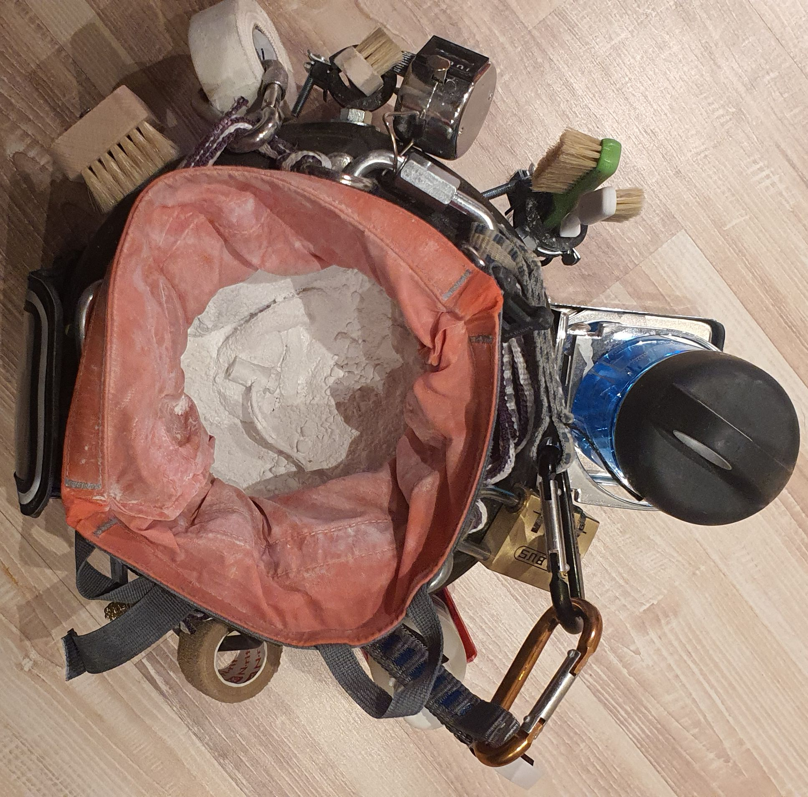
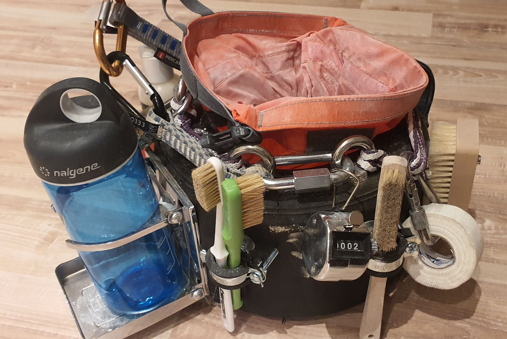
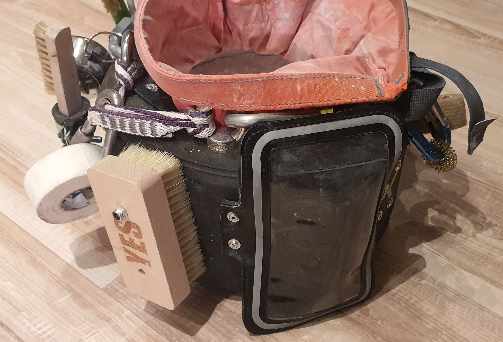
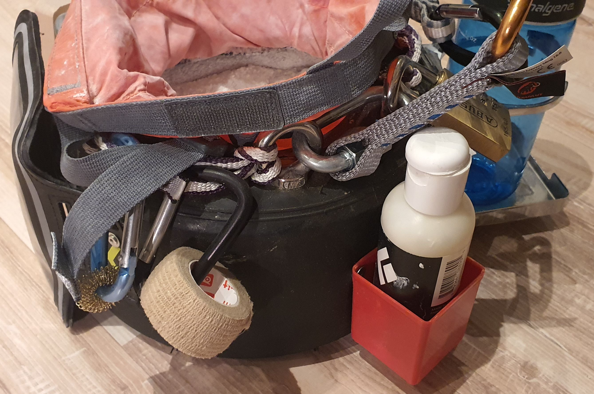
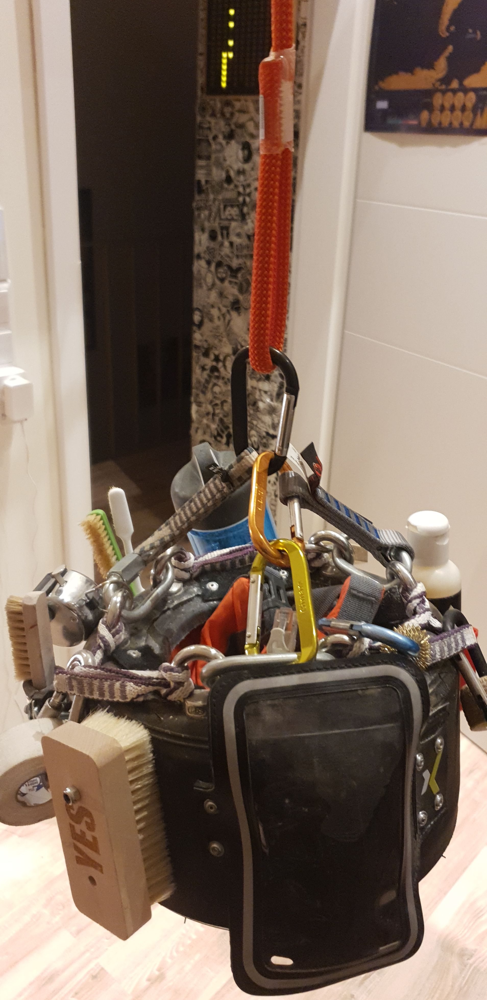
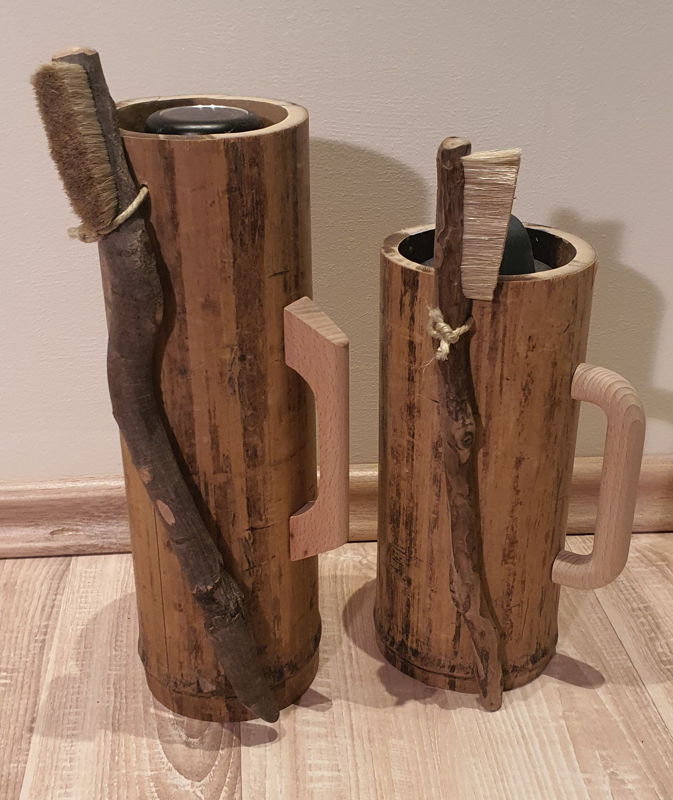

# Boulder Bag

## Boulder Bag - Heavy Duty

With two large plastic climbing grips on the side and 18mm thick wood this beast is hard to carry home after a good session. It holds chalk, brushes, tape, liquid chalk, your drink, snacks and your shoes.

Only the grips are screwed into the wood. The box itself is glued together.

## Boulder Bag - Cart Tire

Every once in a while you can get some used race cart tires at my local race cart track. Some are in really bad condition, some where just worn down but still usable e.g. for a boulder bag project :D

This version has it all: Chalk bag in the center, around it all kinds of helpful things such as a cup holder, liquid chalk holder, finger massage ring, lock for the gym, tape, mobile phone protection bag, various brushes and a counter to keep track of those many flashes.

 

 

It even is balanced and has three carabiner attached to three sides so it can hang e.g. from a rope as shown below:

## Boulder Bag 3

The brushes are purchased, but i found out that some of my water botles fit perfectly into some bamboo I no longer needed. So this is a simplistic little hipster boulder mug with brush.

