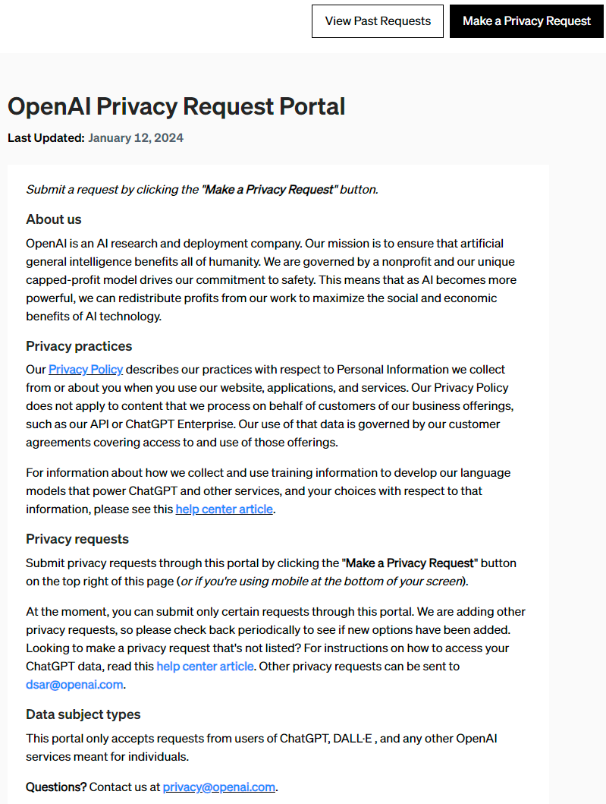
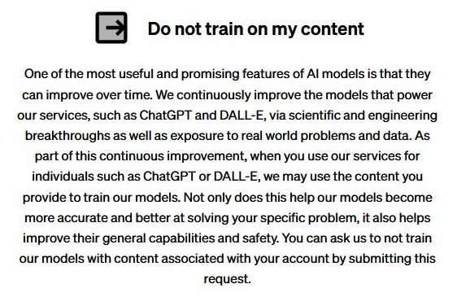
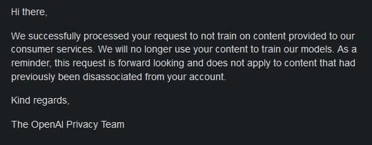

# OpenAI ChatGPT

## OpenAI Privacy Option

There is an option to opt out of OpenAI using your content to train future models. This page is quite well hidden, but allows you to send a request to OpenAI to stop using your data for training: <https://privacy.openai.com/policies>

At the time this is written this directs to the following page:

When requesting to "Make a privacy Request" I get the following message:

Less than 48 hours later I received this message confirming that from now on my dialogues with ChatGPT are no longer used to train OpenAI models.

Although the feature is rather hidden, the process itself works and the result is as expected and fine.
