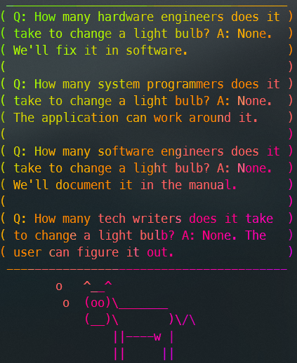
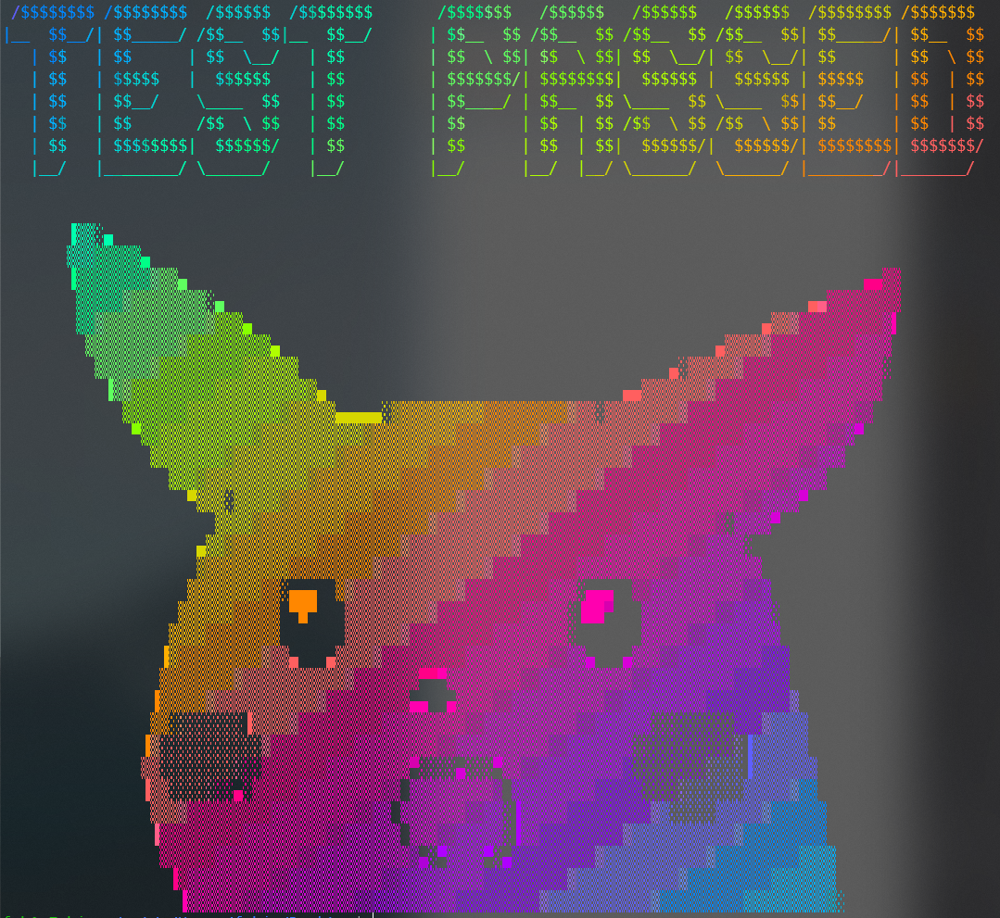
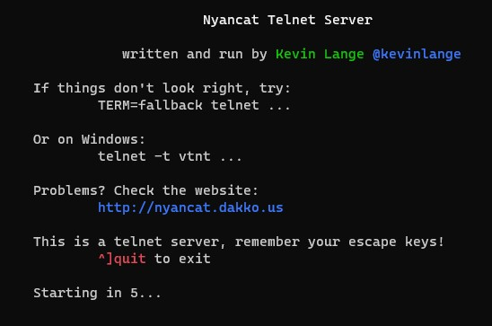
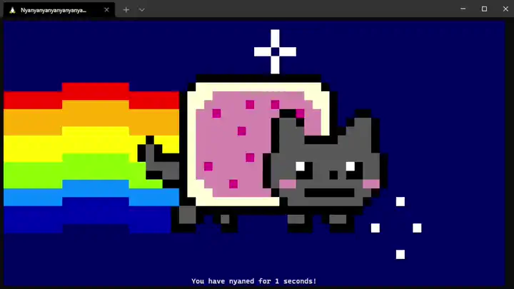
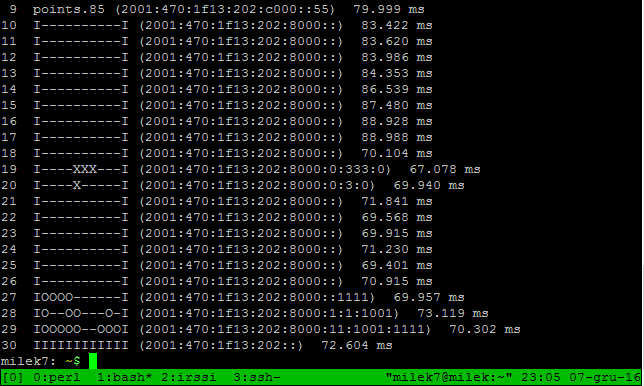

# ASCII

``` txt
                        /#,                                                     
                 ,@%&&@       @                                                 
               (   , (&***,,,,...,@*                                            
              %  &,****,.,,,.,,,.,,,..%                                         
              @&***%*,,..................                                       
              ,/*****,,,.,,,.,,,.,,,.,,,.,                                      
             @,******,.,.,.,.,.,.,.,.,.,..                                      
             @,******,,,.,,,.,,,.,,,.,,,,,.@                                    
             *,*******,.....,*,,,,,,,,,,,.,,*                                   
              @,******,,&**,.,,,..,%/,,,.,,,.,.                                 
               #*******&**,,,#@@&(/(@@#.       /                                
               .,**@#**@,,, @@       #.        @                                
                @,*@*@*&.,,         &&&(,....@@                                 
               @ @@@**%**@.,      @,,,,,.,,,,,*                                 
               %  @@&*****.,.,,,.,,,*******%@(                                  
                (,&@/*****,,*&%/****,***,***,*.*                                
                 **/******@//*,,,,,,,,,,,,,,,,,.,                @*%(#&&#       
                   /(**%*//*,***,***,***,***,**,@              @#/#&#%#((/@     
                    #***//,*,*,*,/,*,*,*,*,*,*,*,&            ,*/@#%//#((#@@    
                    &**@*/*,,**,@@@#/***,****(@@             *(&(%(@ (/&/,,,,., 
                    %****@//**,,,,,,,,**/#.                  //%%##%(##%##%@#,..
                    (*****&,/***,***,*/@                     #%//@#(#(#&....*%  
                   .,*********(@@@@%**,@                     @**@////%,.,,,,,.  
                 ,,,,,,,,/#&@@&#/*,,,,,,   /@                 @,*******%,,,,,.@ 
                ( ,,,,,,,,,       ( (,,,@ /,,*                .,*,.,@*@*,,,*,.* 
                @.,,,,,,,,       @    **,   @,,#%@@#           @**,(*,,,,,,,.,% 
              *@@@/,,,/@@%,     #            %,          #&   ***,.,,,.,.,,,@   
         .#.,,,,,,,   @,,,,,,,                 *,     @*****@***,,,,.,,,.,,@    
       & ,,,,,,,,,      %,,,,                   (,,,.**,....,**.............    
      .,,,,,,,,,.        (,,,                    (, **,,.,,,.,,,.,,,.,,,.,@     
      ,,,,,,,,,,         @,,.                     /@***,.,.,.,.,.,.,.,.,,(      
    (,,,,,,,,,,          %,,                       #****,,,,.,,,.,,,.,,,(       
     @************/@(    @,,                       %*******,...........@        
     %********,,.,,,.,@,,,,,.,                        &&%,,*******,,@,          
     ,*******,,,.,.,,,,,,,,,                             /                     
```

I love [ASCII Art](https://en.wikipedia.org/wiki/ASCII_art) and this page is dedicated to some beautiful things I found. Most of the stuff below is is the work of someone else but as I found this stuff hard to find I just want to make sure it is not lost. Links were added where known.

## SSH

### Tron

- Link: <http://sshtron.zachlatta.com>
- Play: ```ssh sshtron.zachlatta.com```
- Choose a color (e.g. red): ```ssh red@sshtron.zachlatta.com```
- Download [tron.json](_tron.json), get the [source](https://github.com/zachlatta/sshtron), or view below:

<script id="asciicast-154041" src="https://asciinema.org/a/154041.js" async></script>

## Local tools

### Image2ascii

Make own ASCII animations with [image2ascii](https://github.com/michaelkofron/image2ascii).

Requirements:

``` sh
sudo apt update
sudo apt-get install ruby-full imagemagick libmagickwand-dev
sudo gem install rmagick image2ascii rainbow
```

The expected input is .gif file. I converted a video I wanted to use from mp4 to gif using [ffmpeg](https://ffmpeg.org/).

``` sh
ffmpeg -i input.mp4 -vf "fps=12,scale=480:-1:flags=lanczos,split[s0][s1];[s0]palettegen[p];[s1][p]paletteuse" -loop 0 animation.gif
```

`run.rb` is the main script (included in the [image2ascii repo](https://github.com/michaelkofron/image2ascii/blob/main/MakingWebAnimations/run.rb). I shortend the script a little, added the option to pass an argument and use this value to create a unique json so the last one isn't overwritten.

``` rb title="run.rb"
require 'rmagick'
require 'image2ascii'
require 'json'
require 'fileutils'

def createASCII(file)
    animated = Magick::Image.read(file + ".gif")
    count = 0
    tempHash = {}
    animated.each do |x|
        x.write("./images/image#{count}.jpg")
        ascii = Image2ASCII.new("./images/image#{count}.jpg")
        ascii.chars = ascii.chars.gsub!("'", "").gsub!("<", "").gsub!(">", "")
        text = ascii.generate(hidden: true, width: 100)
        puts text
        tempHash["#{count}"] = text.gsub!("\n", "<br>")
        count = count + 1
    end

    FileUtils.rm_rf("./images/.", secure: true)

    File.open(file + ".json","w") do |f|
        f.write(tempHash.to_json)
    end
end

createASCII(ARGV[0].to_s)
```

Run ```ruby run.rb animation``` where `animation` is a gif in the same directory as `run.rb`; in this case "animation.gif".

Now we can create a web page with the animated ASCII video. The script created a file named `animation.json` containing all ASCII frames.

To display the ASCII video properly we need a monospaced font e.g. `courier.ttf`. Copy this font to the work directory and add the following HTML file:

``` html title="index.html"
<html>
<head>
    <style>
        @font-face {font-family: Courier;src: url('courier.ttf');}
        p#ascii {font-size: 6px;color:rgb(50, 255, 50); font-family: Courier; white-space: nowrap;}
        @media screen and (max-width: 750px){ p#text {font-size: 6px;}}
        html {display:table; width:100%; height:100%;}
        body {background: black;display:table-cell; text-align:center; vertical-align:middle; height:100%;}
    </style>
</head>
<body>
    <p id="ascii"></p>
    <script>
        array = []
        fetch("animation.json")
            .then(response => { return response.json(); })
            .then(json => { for (const object in json) { array.push(json[object]) } loop(array) })

        function loop(arr) {
            let count = 0
            let text = document.getElementById("ascii")
            setInterval(() => {
                text.innerHTML = arr[count]
                if (count == arr.length - 1) { count = 0 } else { count++ }
            }, 50)
        }
    </script>
</body>
</html>
```

Be sure to change `fetch("animation.json")` to the correct output file in case you named it differently.

To test this locally, run a webserver e.g. with python ```python -m http.server 8008 --bind 127.0.0.1``` to test this locally and open <http://127.0.0.1:8008/> in your browser.

### nyancat

- Link: <https://github.com/klange/nyancat>
- Install: ```git clone https://github.com/klange/nyancat && cd nyancat && make && cd src && ./nyancat```
- Host telnet server: ```nyancat -t```

Download [nyancat.json](_nyancat.json) or view below:

<script id="asciicast-23012" src="https://asciinema.org/a/23012.js" async></script>

### Steam Locomotive (sl)

- Install ```sudo apt install sl```
- Use ```sl```
- Download [sl.cast](_sl.cast) or view below:

<script id="asciicast-234381" src="https://asciinema.org/a/234381.js" async></script>

### Cowsay and Cowthink

- Install ```sudo apt install cowsay```
- Use cowsay ```cowsay 0xfab1.net```

??? output "cowsay 0xfab1.net"
    ``` txt
    ____________
    < 0xfab1.net >
    ------------
            \   ^__^
            \  (oo)\_______
                (__)\       )\/\
                    ||----w |
                    ||     ||
    ```

- Use cowthink (e.g. pipe it a fortune cookie) ```fortune | cowthink```

??? output "fortune | cowthink"
    ``` txt
    ________________________________________
    ( You will attract cultured and artistic )
    ( people to your home.                   )
    ----------------------------------------
            o   ^__^
            o  (oo)\_______
                (__)\       )\/\
                    ||----w |
                    ||     ||
    ```

A new implementation of cowsay written in go: [Neo-cowsay](https://github.com/Code-Hex/Neo-cowsay)

### Toilet

- Install ```sudo apt install toilet```
- Use Toilet ```toilet 0xfab1.net```

``` txt
  mmmm           m""         #      mmm                           m
 m"  "m m   m  mm#mm   mmm   #mmm     #           m mm    mmm   mm#mm
 #  m #  #m#     #    "   #  #" "#    #           #"  #  #"  #    #
 #    #  m#m     #    m"""#  #   #    #           #   #  #""""    #
  #mm#  m" "m    #    "mm"#  ##m#"  mm#mm    #    #   #  "#mm"    "mm
```

Another example: ```toilet -kf mono12 0xfab1.net```

``` txt
  ▄▄▄▄             ▄▄▄▄       ▄▄        ▄▄▄
 ██▀▀██           ██▀▀▀       ██       █▀██                      ██
██    ██▀██  ██▀███████▄█████▄██▄███▄    ██     ██▄████▄ ▄████▄███████
██ ██ ██  ████    ██   ▀ ▄▄▄████▀  ▀██   ██     ██▀   ████▄▄▄▄██ ██
██    ██  ▄██▄    ██  ▄██▀▀▀████    ██   ██     ██    ████▀▀▀▀▀▀ ██
 ██▄▄██  ▄█▀▀█▄   ██  ██▄▄▄██████▄▄██▀▄▄▄██▄▄▄████    ██▀██▄▄▄▄█ ██▄▄▄
  ▀▀▀▀  ▀▀▀  ▀▀▀  ▀▀   ▀▀▀▀ ▀▀▀▀ ▀▀▀  ▀▀▀▀▀▀▀▀▀▀▀▀    ▀▀  ▀▀▀▀▀   ▀▀▀▀
```

Another example with color: ```toilet -f mono12 -F metal 0xfab1```


You can also use toilet to pipe stuff e.g. this example for the current time:

``` sh
while true; do clear; echo "$(date '+%D %T' | toilet -f term -F border --gay)"; sleep 1; done
```


### Figlet

- Install ```sudo apt install figlet```
- Use Figlet ```figlet 0xfab1.net```

``` txt
  ___        __       _     _              _
 / _ \__  __/ _| __ _| |__ / |  _ __   ___| |_
| | | \ \/ / |_ / _` | '_ \| | | '_ \ / _ \ __|
| |_| |>  <|  _| (_| | |_) | |_| | | |  __/ |_
 \___//_/\_\_|  \__,_|_.__/|_(_)_| |_|\___|\__|
```

Another example: ```figlet -c -k -w 100 -f shadow 0xfab1.net```

figlet -f $font 0xfab1.net

``` txt
  _ \           _|         |    _ |                  |
 |   | \ \  /  |     _` |  __ \   |     __ \    _ \  __|
 |   |  `  <   __|  (   |  |   |  |     |   |   __/  |
\___/   _/\_\ _|   \__,_| _.__/  _| _) _|  _| \___| \__|
```

You can use any tlf-font available here ```ls /usr/share/figlet/``` and loop through all options to see what looks good e.g. as such:

``` sh
for f in /usr/share/figlet/*.tlf; do file=$(echo "${f##*/}"); font=$(echo $file| cut -d'.' -f 1); figlet -f $font 0xfab1.net; done
```

??? output "figlet with all fonts"
    ``` txt

    ░████░               ▒████             ██         ░███
    ██████               █████             ██         ████
    ▒██  ██▒              ██                ██         █▒██
    ██▒  ▒██  ███  ███  ███████    ▒████▓   ██░███▒      ██
    ██    ██   ██▒▒██   ███████    ██████▓  ███████▒     ██
    ██ ██ ██   ▒████▒     ██       █▒  ▒██  ███  ███     ██
    ██ ██ ██    ████      ██        ▒█████  ██░  ░██     ██
    ██    ██    ▒██▒      ██      ░███████  ██    ██     ██
    ██▒  ▒██    ████      ██      ██▓░  ██  ██░  ░██     ██
    ▒██  ██▒   ▒████▒     ██      ██▒  ███  ███  ███     ██        ██
    ██████    ██▒▒██     ██      ████████  ███████▒  ████████     ██
    ░████░   ███  ███    ██       ▓███░██  ██░███▒   ████████     ██


                        ██
                        ██
    ██░████    ░████▒   ███████
    ███████▓  ░██████▒  ███████
    ███  ▒██  ██▒  ▒██    ██
    ██    ██  ████████    ██
    ██    ██  ████████    ██
    ██    ██  ██          ██
    ██    ██  ███░  ▒█    ██░
    ██    ██  ░███████    █████
    ██    ██   ░█████▒    ░████


                    ▒██         █
    ▓██▓           █░          █      ███                           █
    ▒█  █▒          █           █        █                           █
    █░  ▒█ █▒ ▒█  █████  ░███░  █▓██     █           █▒██▒   ███   █████
    █    █ ░█ █░    █    █▒ ▒█  █▓ ▓█    █           █▓ ▒█  ▓▓ ▒█    █
    █  █ █  ▓█▓     █        █  █   █    █           █   █  █   █    █
    █    █  ░█░     █    ▒████  █   █    █           █   █  █████    █
    █░  ▒█  ███     █    █▒  █  █   █    █           █   █  █        █
    ▒█  █▒ ░█ █░    █    █░ ▓█  █▓ ▓█    █      █    █   █  ▓▓  █    █░
    ▓██▓  █▒ ▒█    █    ▒██▒█  █▓██   █████    █    █   █   ███▒    ▒██


    ⓪ⓧⓕⓐⓑ①⊙ⓝⓔⓣ
    ┏━┃┃ ┃┏━┛┏━┃┏━ ━┃  ┏━ ┏━┛━┏┛
    ┃┛┃ ┛ ┏━┛┏━┃┏━┃ ┃  ┃ ┃┏━┛ ┃
    ━━┛┛ ┛┛  ┛ ┛━━ ━━┛┛┛ ┛━━┛ ┛
    ╔═║║ ║╔═╝╔═║╔═ ═║  ╔═ ╔═╝═╔╝
    ║╝║ ╝ ╔═╝╔═║╔═║ ║  ║ ║╔═╝ ║
    ══╝╝ ╝╝  ╝ ╝══ ══╝╝╝ ╝══╝ ╝
    ┏━┓╻ ╻┏━╸┏━┓┏┓ ╺┓  ┏┓╻┏━╸╺┳╸
    ┃┃┃┏╋┛┣╸ ┣━┫┣┻┓ ┃  ┃┗┫┣╸  ┃
    ┗━┛╹ ╹╹  ╹ ╹┗━┛╺┻╸╹╹ ╹┗━╸ ╹
    000  X   X FFFFF   A   BBBB   1      N   N EEEEE TTTTT
    0   0  X X  F      A A  B   B 11      NN  N E       T
    0 0 0   X   FFFF  AAAAA BBBB   1      N N N EEEE    T
    0   0  X X  F     A   A B   B  1  ..  N  NN E       T
    000  X   X F     A   A BBBB  111 ..  N   N EEEEE   T


    ▄▄▄▄                 ▄▄▄▄             ▄▄          ▄▄▄
    ██▀▀██               ██▀▀▀             ██         █▀██
    ██    ██  ▀██  ██▀  ███████    ▄█████▄  ██▄███▄      ██
    ██ ██ ██    ████      ██       ▀ ▄▄▄██  ██▀  ▀██     ██
    ██    ██    ▄██▄      ██      ▄██▀▀▀██  ██    ██     ██
    ██▄▄██    ▄█▀▀█▄     ██      ██▄▄▄███  ███▄▄██▀  ▄▄▄██▄▄▄     ██
    ▀▀▀▀    ▀▀▀  ▀▀▀    ▀▀       ▀▀▀▀ ▀▀  ▀▀ ▀▀▀    ▀▀▀▀▀▀▀▀     ▀▀


                        ██
    ██▄████▄   ▄████▄   ███████
    ██▀   ██  ██▄▄▄▄██    ██
    ██    ██  ██▀▀▀▀▀▀    ██
    ██    ██  ▀██▄▄▄▄█    ██▄▄▄
    ▀▀    ▀▀    ▀▀▀▀▀      ▀▀▀▀

    ▄▄▄▄           ▄▀▀         █      ▄▄▄                           ▄
    ▄▀  ▀▄ ▄   ▄  ▄▄█▄▄   ▄▄▄   █▄▄▄     █           ▄ ▄▄    ▄▄▄   ▄▄█▄▄
    █  ▄ █  █▄█     █    ▀   █  █▀ ▀█    █           █▀  █  █▀  █    █
    █    █  ▄█▄     █    ▄▀▀▀█  █   █    █           █   █  █▀▀▀▀    █
    █▄▄█  ▄▀ ▀▄    █    ▀▄▄▀█  ██▄█▀  ▄▄█▄▄    █    █   █  ▀█▄▄▀    ▀▄▄


    ░▄▀▄░█░█░█▀▀░█▀█░█▀▄░▀█░░░░░█▀█░█▀▀░▀█▀
    ░█/█░▄▀▄░█▀▀░█▀█░█▀▄░░█░░░░░█░█░█▀▀░░█░
    ░░▀░░▀░▀░▀░░░▀░▀░▀▀░░▀▀▀░▀░░▀░▀░▀▀▀░░▀░

    .m,        mm      .,    .m
    W"W       ]P"      ][    PW                  ][
    ][ ]['W W`]WWW  dWW,]bWb   W       ]bWW, dWb ]WWW
    ][W][ ]W[  ][   `md[]P T[  W       ]P ][]bmd[ ][
    ][ ][ .W,  ][  .W"T[][ ][  W       ][ ][]P""` ][
    WmW  d"b  ][  ]bmW[]WmW`.mWm,  W  ][ ]['Wmm[ ]bm
    '"` '" "` '`   ""'`'`"` '"""`  "  '` '` '""   ""


    mm      ."     ]   .m               .
    .`',. . .dm  m, ]m,  ]      ..,  m, .dm
    ] ,[ b[  ]  ' ] ]`T  ]      ]`] ]`]  ]
    ]  [ d,  ]  ."T ] ]  ]      ] ] ]""  ]
    bd .`\  ]  'mT ]bP .dm  ]  ] ] 'b/  'm


    ▞▀▖   ▗▀▖   ▌ ▗▌         ▐
    ▌▞▌▚▗▘▐  ▝▀▖▛▀▖▌   ▛▀▖▞▀▖▜▀
    ▛ ▌▗▚ ▜▀ ▞▀▌▌ ▌▌ ▗▖▌ ▌▛▀ ▐ ▖
    ▝▀ ▘ ▘▐  ▝▀▘▀▀▝▀ ▝▘▘ ▘▝▀▘ ▀
    ⣎⣵ ⡀⢀ ⣰⡁ ⢀⣀ ⣇⡀ ⢺    ⣀⡀ ⢀⡀ ⣰⡀
    ⠫⠜ ⠜⠣ ⢸  ⠣⠼ ⠧⠜ ⠼⠄ ⠶ ⠇⠸ ⠣⠭ ⠘⠤

    ▗▄▖        ▄▄      ▗▖    ▗▄
    █▀█       ▐▛▀      ▐▌    ▛█                  ▐▌
    ▐▌ ▐▌▝█ █▘▐███  ▟██▖▐▙█▙   █       ▐▙██▖ ▟█▙ ▐███
    ▐▌█▐▌ ▐█▌  ▐▌   ▘▄▟▌▐▛ ▜▌  █       ▐▛ ▐▌▐▙▄▟▌ ▐▌
    ▐▌ ▐▌ ▗█▖  ▐▌  ▗█▀▜▌▐▌ ▐▌  █       ▐▌ ▐▌▐▛▀▀▘ ▐▌
    █▄█  ▟▀▙  ▐▌  ▐▙▄█▌▐█▄█▘▗▄█▄▖  █  ▐▌ ▐▌▝█▄▄▌ ▐▙▄
    ▝▀▘ ▝▀ ▀▘ ▝▘   ▀▀▝▘▝▘▀▘ ▝▀▀▀▘  ▀  ▝▘ ▝▘ ▝▀▀   ▀▀

    ▄▄      ▗▀     ▐   ▗▄               ▗
    ▗▘▝▖▗ ▗ ▗▟▄  ▄▖ ▐▄▖  ▐      ▗▗▖  ▄▖ ▗▟▄
    ▐ ▖▌ ▙▌  ▐  ▝ ▐ ▐▘▜  ▐      ▐▘▐ ▐▘▐  ▐
    ▐  ▌ ▟▖  ▐  ▗▀▜ ▐ ▐  ▐      ▐ ▐ ▐▀▀  ▐
    ▙▟ ▗▘▚  ▐  ▝▄▜ ▐▙▛ ▗▟▄  ▐  ▐ ▐ ▝▙▞  ▝▄

    ０ｘｆａｂ１．ｎｅｔ
    ```

### cmatrix

- Install ```sudo apt install cmatrix```
- Use cmatrix ```cmatrix```

### a Fire

- Install ```sudo apt install libaa-bin```
- Use aafire ```aafire```

### BB

- Install ```sudo apt install bb```
- Use BB ```bb```

Watch this video to see what it does without running it: <https://www.youtube.com/watch?v=9ukhOAUseKY>

### lolcat

To make any of the ASCII output more colorful use lolcat. Note: doesn't work with animations e.g. ```aafire | lolcat```

- Link: <https://github.com/busyloop/lolcat>
- Install: ```sudo apt install lolcat```
- Use lolcat: ```fortune | cowthink | lolcat```



Another cool idea is to use this fo successful tests or builds e.g.:

- Store ASCII art ([pikachu.tp](_pikachu.tp)) in a folder (~/important/)
- Set alias: ```alias success-message='if [ "$?" -eq "0" ]; then lolcat ~/important/pikachu.tp -a -s 40 -d 2; fi;'```
- Usage: ```do_tests && success-message```



### asciimatics

[Asciimatics](https://github.com/peterbrittain/asciimatics) is a package to help people create full-screen text UIs on any platform. It comes with some very cool samples!

- Install: ```pip install asciimatics``` (Note: depending on the sample/demo there are more dependencies)
- Documentation: <https://asciimatics.readthedocs.io>
- Samples: <https://github.com/peterbrittain/asciimatics/tree/master/samples>

### asciiquarium

To run asciiquarium you need Term-Animation and Perl.

First install Perl:

``` sh
sudo apt-get install libcurses-perl
```

Download and install [Term-Animation](_term-animation-2.6.tar.gz) to /tmp

``` sh
cd /tmp
wget https://cpan.metacpan.org/authors/id/K/KB/KBAUCOM/Term-Animation-2.6.tar.gz
tar -zxvf Term-Animation-2.6.tar.gz
cd Term-Animation-2.6/
perl Makefile.PL && make && make test
sudo make install
```

Download [asciiquarium](_asciiquarium.tar.gz) to /tmp

``` sh
cd /tmp
wget https://robobunny.com/projects/asciiquarium/asciiquarium.tar.gz
tar -zxvf asciiquarium.tar.gz
cd asciiquarium_1.1/
sudo cp asciiquarium /usr/local/bin
sudo chmod 0755 /usr/local/bin/asciiquarium
```

Run asciiquarium

``` sh
perl /usr/local/bin/asciiquarium
```

[](_asciiquarium.mkv)

### taoup

Ruby-powered ANSI colored fortunes

- Source: <https://github.com/globalcitizen/taoup>

### ART

ART is a Python lib for text converting to ASCII art fancy.

- Source: <https://github.com/sepandhaghighi/art>
- Docs: <https://www.4r7.ir/>
- Install: ```pip install art```

Example `art-example.py`

``` py
from art import *
Art=text2art("0xfab1",font='block',chr_ignore=True)
print(Art)
```

??? output "art-example.py"
    ```
    .----------------.  .----------------.  .----------------.  .----------------.  .----------------.  .----------------.
    | .--------------. || .--------------. || .--------------. || .--------------. || .--------------. || .--------------. |
    | |     ____     | || |  ____  ____  | || |  _________   | || |      __      | || |   ______     | || |     __       | |
    | |   .'    '.   | || | |_  _||_  _| | || | |_   ___  |  | || |     /  \     | || |  |_   _ \    | || |    /  |      | |
    | |  |  .--.  |  | || |   \ \  / /   | || |   | |_  \_|  | || |    / /\ \    | || |    | |_) |   | || |    `| |      | |
    | |  | |    | |  | || |    > `' <    | || |   |  _|      | || |   / ____ \   | || |    |  __'.   | || |     | |      | |
    | |  |  `--'  |  | || |  _/ /'`\ \_  | || |  _| |_       | || | _/ /    \ \_ | || |   _| |__) |  | || |    _| |_     | |
    | |   '.____.'   | || | |____||____| | || | |_____|      | || ||____|  |____|| || |  |_______/   | || |   |_____|    | |
    | |              | || |              | || |              | || |              | || |              | || |              | |
    | '--------------' || '--------------' || '--------------' || '--------------' || '--------------' || '--------------' |
    '----------------'  '----------------'  '----------------'  '----------------'  '----------------'  '----------------'
    ```

Example `art-random-example.py`

``` py
from art import *
for lp in range(100):
    print(randart() + "\n")
```

Don't forget to use lolcat to run this :)

``` sh
python3 art-random-example.py | lolcat
```

??? output "art-example.py"
    ```
    '-=,o

    >:)

    /V\

    |-o-| (-o-) |-o-|

    @}~}~~~

    :o + :p = 69

    < )))) ><

    (o'3'o)

    ^.--.^

    (  . Y .  )

    ><>

    [($)]

    (_!_)

    .,.,\______/,..,.,

    B-)

    --------{---(@

    < )))) ><

    [{-_-}] ZZZzz zz z...

    @(o),(o)

    (-(-_-(-_(-_(-_-)_-)-_-)_-)_-)-)

    c[_]

    ^.--.^

    (O.O)

    @__

    @__

    (///_ ;)

    (:)

    :-/

    :-I

    ^i^

    [^_^]

    (///_ ;)

    \*/

    Y_Y

    ><>

    l_D

    :-P~~~

    =:-)

    [|^^^^^^^

    o==[]::::::::::::::::>

    <-|-'_'-|->

    ~(^-^)~

    ,/\,/\,/\,/\,/\,/\,o

    @( * O * )@

    :-"

    8====D

    (. )( .)

    V(-.o)V

    ::)

    ~~~~~~\o/~~~~~/\~~~~~

    =:-)

    =:-(

    <^__)~

    8======D

    (-.-)Zzz...

    >>-;;;------;;-->

    \m/_(>_<)_\m/

    t(-_-t)

    d(-_-)b

    ===========(8888)

    >:-D

    \,,/(^_^)\,,/

    -_-

    O.o

    -_-

    O=('-'Q)

    (<>..<>)

    ::)

    (U) [^_^] (U)

    [|^^^^^^^

    (O.O)

    q:o)

    (===||:::::::::::::::>

    [^_^]

    ><>

    @}~}~~~

    O.o

    (__!__)

    <-|-'_'-|->

    <3

    :o + :p = 69

    \m/_(>_<)_\m/

    <(''<)  <( ' ' )>  (> '')>

    l_D

    <^__)~

    O==I======>

    @-}--

    V(-.o)V

    (| - _ - |)

    ^O^

    -_-

    /W\

    (===||:::::::::::::::>

    8=D

    Y_Y

    ^_^

    @(o),(o)

    (-.-)Zzz...

    ---=======[}

    .,.,\______/,..,.,
    ```

## CurL

### QR code

- Link: http://qrenco.de/
- Use: ```curl qrenco.de/0xfab1.net```

??? output "parrot.live"
    ```
    █████████████████████████████
    █████████████████████████████
    ████ ▄▄▄▄▄ █▀▀ ▄ █ ▄▄▄▄▄ ████
    ████ █   █ █▀▀▄▄ █ █   █ ████
    ████ █▄▄▄█ █▀▄█▀▄█ █▄▄▄█ ████
    ████▄▄▄▄▄▄▄█▄▀▄█▄█▄▄▄▄▄▄▄████
    ████ ▄ ▄▄▀▄▄▄▀▀ ▀ ▀ ▀▄█ ▀████
    ████ ▄██ ▄▄▀▄  ▀ ▀▄▀▀▀ ▄█████
    ██████▄█▄▄▄▄ █ █ ▀▄▀ ▀▀▀▀████
    ████ ▄▄▄▄▄ █▄▄▀▄█ █▄█▀▀▀▀████
    ████ █   █ █ ▀▀▄▀ ▄▄▀█▀█▄████
    ████ █▄▄▄█ █ ▀ █▄██ ▀  ██████
    ████▄▄▄▄▄▄▄█▄▄▄████▄███▄█████
    █████████████████████████████
    █████████████████████████████
    ```

### Parrot

- Link: https://github.com/hugomd/parrot.live
- Use: ```curl parrot.live```
- Download [parrot.cast](_parrot.cast) or view below:

<script id="asciicast-8" src="https://asciinema.org/a/239367.js" async></script>

??? output "curl parrot.live"
    ``` txt
                                .ccccc.
                            .cc;'coooxkl;.
                        .:c:::c:,,,,,;c;;,.'.
                    .clc,',:,..:xxocc;'..c;
                    .c:,';:ox:..:c,,,,,,...cd,
                    .c:'.,oxxxxl::l:.,loll;..;ol.
                    ;Oc..:xxxxxxxxx:.,llll,....oc
                .,;,',:loxxxxxxxxx:.,llll;.,,.'ld,
                .lo;..:xxxxxxxxxxxx:.'cllc,.:l:'cO;
            .:;...'cxxxxxxxxxxxxoc;,::,..cdl;;l'
            .cl;':,'';oxxxxxxdxxxxxx:....,cooc,cO;
        .,,,::;,lxoc:,,:lxxxxxxxxxxxo:,,;lxxl;'oNc
    .cdxo;':lxxxxxxc'';cccccoxxxxxxxxxxxxo,.;lc.
    .loc'.'lxxxxxxxxocc;''''';ccoxxxxxxxxx:..oc
    olc,..',:cccccccccccc:;;;;;;;;:ccccccccc,.'c,
    Ol;......................................;l'
    ```

### Run Forrest Run

- Link: https://github.com/hugomd/ascii-live
- Use: ```curl ascii.live/forrest```

??? output "curl ascii.live/forrest"
    ``` txt
                        .':xc.
                        .:ccxOd'
                        ,l';dOxo'
                        ';:ccll.
                    .,,:clol,'.
                    'lddddxdoc.
                'codxkdc:cdo;.
                'loxd:,,;:cclc.
                'ccxx;.',:ccc;.
                .;:ld:'';llccol;;,;:,.
                .;col:cdkdc:ccc:;:cl.
                    'ccdxxOOdoc....,,.
                    .;:ododkOOx:
                    .:,,,,,:oxOOo,
        ..        'c;:cc:,,;cdkko'
        'ldxl,......;:;cooooc;;;cdkd:.
    ;olodolcccloxdc;cllo:..',;:oxd'
    .clloc,,:c:;;:loc:clld;   ,l;lxd,
    .;,''.  .....'.',;:cl:.   'c;cdd,
                    .....     'l;:lo'
                            .;:;:l'
                                .:;:l:.
                                .::oxl'.
                                'c:oxxool.
                                .,,,;;;;,
    ```

### Run Forrest Run

- Link: https://github.com/hugomd/ascii-live
- Use: ```curl ascii.live/rick```

??? output "curl ascii.live/rick"
    ``` txt
    ttttttffffttfLLftff1:,ii,,,,iiiiii1ffffftt11tttt1ttt111fffttfffttttfft
    tttttttttttttfffffff1,,,,,,,iiiii1tffffffftt1ttt1111111tfftffffttttttt
    fffffffftttt1tffftft1i,,,,,,,iiii1ttfffffttt1tffft11111tfttfffttt1tttt
    ffffffft1tftt1tft1,ii,,,,,,,,ii1111ttftft11tttttfft1111tt1tffttffttfff
    ffffffft1tttt1ii,,.:i,,,i,iii111t111ttt111tffttttftt1111tt1ttttfft1tff
    fftfttt111ii,:,....,i1,,iiiii1i:,,,i11111tfffft11t11111tfftttttttt1tff
    tt1111ii,:,.........,11iiii,,11,::,,,:,1tftfffft1111111tttt11ttfft11tt
    11111:,.............:1tt1iii1t1,,:,:,,.,:1tffftt11t1111ttt11tt1tffftt1
    tttt,................:iiiiii11,:,:,:,,,,.:tttt111tt1111ttt11tf1tffffft
    ttt1,.................,,,,,:,:.,:i:,,,,,,,it11111111111tt111tft1tfffft
    ttti...................:,,,,,:,,:1,.......,t1tt11111111111t11tf1tffftt
    tt1:...................,,:,,,:..,1,.......:tt111t11t1111111111t1tffttt
    11,.....................:,:,,,..,,:.......,111tttt11111111tttt11tttfLf
    11,.....................,::,,,..,:,.......,1ttttttt111111tttffttttffLL
    1,.......................:::,,..,:,........itttttttt1111tttttfftttffff
    1,.......................,,,,,:,,:,........,11tttt11111111ttffttttffLL
    i,.....................,::,i,,,,,:.........:111tt1111111111tttttttffLL
    i.....................,:::,i,i:.,:,........,1t1111t111111t111ttfttffLL
    ,.....................,:::,,,,,.,:..........1tt111tt11111ttt1tffttffff
    :......................:::::,...,:..........:i1tttt1tt111t1111tttttftt
    i.......................... ....,,.......... .,,:i11iii11111tt1t1ttfff
    1,...     ......................,:............   .,:::,iiii1111111tftt
    1t1i,,::::......................,:..,:..   .......,::,,,,,,iii11111ttt
    11ttttttt1,.....................,:......:,..    ..,:,,,:,,,iiii1111111
    111111111i,.................,::..,.... ,tt1ii,,,.. ..,:i,,iii111111111
    111111111i,.................,,:,,,......1tttttt11i,,::itt11t1111111111
    111111111i,................ ,,:::,......it1t1tttttttttt11tt11t11111111
    111111111,................. ,,,::,......it1tttttttt1111111t11111111111
    ```

## Telnet

### mapscii

- Link: [mapscii.me](https://github.com/rastapasta/mapscii)
- Use: ```telnet mapscii.me```
- Download: https://github.com/rastapasta/mapscii/releases

### Star Wars

- Link: http://www.asciimation.co.nz/ (Service no longer available)
- Use: ```telnet towel.blinkenlights.nl```
- Download [nyancat.cast](_nyancat.cast) or view below:

<script id="asciicast-8" src="https://asciinema.org/a/8.js" async></script>

### Nyan Cat

- Install nyan cat```sudo apt install nyancat``` ([source](https://github.com/klange/nyancat)) or```sudo pip install nyancat``` ([source](https://github.com/taizilongxu/nyancat))
- Get [nyancat.cast](_nyancat.cast) or view below:

<script id="asciicast-3" src="https://asciinema.org/a/3.js" async></script>





## Tracert

Try this online tool for IPv6 tracert:

- <http://www.berkom.blazing.de/tools/traceroute.cgi>
- <https://network-tools.com/>
- <http://www.traceroute6.net/>
- <http://ipv6.my-addr.com/ipv6-traceroute.php>

### Tetris

Link: trh.milek7.pl (Service no longer available)
Use: ```traceroute -I -m 60 -q 1 trh.milek7.pl```

??? output "Tetris-traceroute"
    

### Star Wars

- Link: <https://beaglenetworks.net/post/42707829171/star-wars-traceroute>
- Use: ```traceroute -m 100 216.81.59.173 | awk '{print $2}'```

??? output "star-wars-traceroute"
    ``` txt
    *
    Episode.IV
    A.NEW.HOPE
    It.is.a.period.of.civil.war
    Rebel.spaceships
    striking.from.a.hidden.base
    have.won.their.first.victory
    against.the.evil.Galactic.Empire
    During.the.battle
    Rebel.spies.managed
    to.steal.secret.plans
    to.the.Empires.ultimate.weapon
    the.DEATH.STAR
    an.armored.space.station
    with.enough.power.to
    destroy.an.entire.planet
    Pursued.by.the.Empires
    sinister.agents
    Princess.Leia.races.home
    aboard.her.starship
    custodian.of.the.stolen.plans
    that.can.save.her
    people.and.restore
    freedom.to.the.galaxy
    0-------------------0
    0------------------0
    0-----------------0
    0----------------0
    0---------------0
    0--------------0
    0-------------0
    0------------0
    0-----------0
    0----------0
    0---------0
    0--------0
    0-------0
    0------0
    0-----0
    0----0
    0---0
    0--0
    0-0
    00
    I
    By.Ryan.Werber
    When.CCIEs.Get.Bored
    CCIE.38168
    FIN
    ```

### Star Trek

- Link: tng.prolixium.com
- Use: ```traceroute6 -m 120 tng.prolixium.com```

??? output "traceroute6 -m 120 tng.prolixium.com"
    ``` txt
    traceroute to tng.prolixium.com (2001:48c8:1:137::32), 120 hops max, 24 byte packets

    v6-seattle-ix.voxel.net (2001:504:16::745f)  209.28 ms  207.781 ms  207.18 ms
    3890.te6-2.tsr1.lga3.us.voxel.net (2001:48c8::8c9)  277.482 ms  279.604 ms  277.079 ms
    0.ae1.tsr1.lga5.us.voxel.net (2001:48c8::822)  282.205 ms  286.997 ms  276.887 ms
    0.ae2.csr2.lga6.us.voxel.net (2001:48c8::82e)  280.187 ms  284.989 ms  277.817 ms
    em0.dax.prolixium.net (2001:48c8:1:2::2)  277.495 ms  277.68 ms  277.61 ms
    si3.starfire.prolixium.net (2001:48c8:1:1ff::1a)  311.417 ms  305.949 ms  305.109 ms
    0.re0.ra.prolixium.net (2001:48c8:1:119::2)  307.72 ms  305.633 ms  305.915 ms
    0.fx0.voyager.prolixium.net (2001:48c8:1:11f::2)  304.583 ms  303.806 ms  304.216 ms
    . (2001:48c8:1:137::2)  307.199 ms  303.983 ms  303.874 ms
    Space (2001:48c8:1:137::6)  310.575 ms  308.043 ms  307.941 ms
    the.Final.Frontier (2001:48c8:1:137::a)  307.198 ms  304.489 ms  305.967 ms
    These.are.the.voyages.of.the.starship (2001:48c8:1:137::e)  306.484 ms  308.383 ms  308.094 ms
    Enterprise (2001:48c8:1:137::12)  305.924 ms  305.817 ms  307.77 ms
    Its.continuing.mission (2001:48c8:1:137::16)  308.692 ms  316.396 ms  306 ms
    to.explore.strange.new.worlds (2001:48c8:1:137::1a)  306.123 ms  307.447 ms  312.365 ms
    to.seek.out.new.life.forms (2001:48c8:1:137::1e)  308.785 ms  309.842 ms  308.362 ms
    and.new.civilizations (2001:48c8:1:137::22)  309.347 ms  315.072 ms  307.912 ms
    to.boldly.go (2001:48c8:1:137::26)  309.336 ms  306.98 ms  309.354 ms
    where.no.one.has.gone.before (2001:48c8:1:137::2a)  308.284 ms  311.138 ms  310.111 ms
    . (2001:48c8:1:137::2e)  310.227 ms  309.217 ms  309.752 ms
    EOF (2001:48c8:1:137::32)  309.623 ms  311.074 ms  313.958 ms
    ```

### traceroute hand

- Link: hand.bb0.nl
- Use: ```traceroute -6 -m 50 hand.bb0.nl```

??? output "traceroute -6 -m 50 hand.bb0.nl"
    ``` txt
    traceroute to hand.bb0.nl (2a0e:fd45:2a0a:2::cafe), 50 hops max, 80 byte packets
     7  MYLOC-MANAG.ear3.Amsterdam1.Level3.net (2001:1900:5:2:2:0:8:780a)  253.218 ms  251.177 ms  251.017 ms
     8  2a00:a7c0:e20a:20::1 (2a00:a7c0:e20a:20::1)  250.961 ms  250.912 ms  250.870 ms
     9  2a0e:fd40:1337:1::2 (2a0e:fd40:1337:1::2)  250.759 ms  250.615 ms  250.390 ms
    10  speed-ix.bakker-it.eu (2001:7f8:b7::a504:4103:1)  260.648 ms  260.656 ms  256.790 ms
    11  core.dro.bb.enpls.org (2a0e:fd40:1:114::1)  243.415 ms  243.390 ms  242.867 ms
    12  e19-vlan1-up6.vm2.dro.bb0.nl (2a0e:fd45:2a0a:b::a)  266.776 ms  291.814 ms  291.755 ms
    13  ____________36936936936936936__________________ (2a0e:fd45:2a0a:2::ca01)  291.833 ms  291.741 ms  291.643 ms
    14  ____________36936936936936936__________________ (2a0e:fd45:2a0a:2::ca02)  266.123 ms  256.651 ms  249.852 ms
    15  ____________369369369369369369_________________ (2a0e:fd45:2a0a:2::ca03)  261.516 ms  261.339 ms  258.174 ms
    16  ___________36936936936936933693________________ (2a0e:fd45:2a0a:2::ca04)  241.054 ms  243.898 ms  243.724 ms
    17  __________3693693693693693693693_______________ (2a0e:fd45:2a0a:2::ca05)  269.403 ms  254.471 ms  261.275 ms
    18  _________369369369369369369369369______________ (2a0e:fd45:2a0a:2::ca06)  244.441 ms  244.373 ms  244.325 ms
    19  _________3693693693693693693693699_____________ (2a0e:fd45:2a0a:2::ca07)  263.220 ms  251.262 ms  251.193 ms
    20  ________3693693693693693693693699369___________ (2a0e:fd45:2a0a:2::ca08)  283.519 ms  273.903 ms  262.867 ms
    21  _______36936939693693693693693693693693________ (2a0e:fd45:2a0a:2::ca09)  262.790 ms  258.498 ms  258.254 ms
    22  _____3693693693693693693693693693693636936_____ (2a0e:fd45:2a0a:2::ca0a)  260.935 ms  260.744 ms  261.780 ms
    23  ___36936936936936936936936936936___369369369___ (2a0e:fd45:2a0a:2::ca0b)  254.720 ms  257.055 ms  249.360 ms
    24  __36936___369336936369369369369________36936___ (2a0e:fd45:2a0a:2::ca0c)  249.210 ms  244.177 ms  244.089 ms
    25  _36936___36936_369369336936936_________________ (2a0e:fd45:2a0a:2::ca0d)  238.127 ms  238.067 ms  238.331 ms
    26  36933___36936__36936___3693636_________________ (2a0e:fd45:2a0a:2::ca0e)  259.337 ms  256.708 ms  256.546 ms
    27  693____36936__36936_____369363_________________ (2a0e:fd45:2a0a:2::ca0f)  245.896 ms  245.831 ms  247.166 ms
    28  ______36936__36936______369369_________________ (2a0e:fd45:2a0a:2::ca10)  252.041 ms  252.006 ms  250.902 ms
    29  _____36936___36936_______36936_________________ (2a0e:fd45:2a0a:2::ca11)  259.269 ms  259.277 ms  259.244 ms
    30  _____36936___36936________36936________________ (2a0e:fd45:2a0a:2::ca12)  255.846 ms  255.080 ms  254.934 ms
    31  _____36936___36936_________36936_______________ (2a0e:fd45:2a0a:2::ca13)  264.530 ms *  264.507 ms
    32  ______369____36936__________369________________ (2a0e:fd45:2a0a:2::ca14)  255.705 ms  283.080 ms  282.870 ms
    33  ______________369______________________________ (2a0e:fd45:2a0a:2::ca15)  257.068 ms  248.604 ms  255.563 ms
    34  _______________6_______________________________ (2a0e:fd45:2a0a:2::ca16)  255.445 ms  251.531 ms  250.614 ms
    35  _______________________________________________ (2a0e:fd45:2a0a:2::ca17)  249.952 ms  240.459 ms  240.802 ms
    36  ___00000000000000000000000000000000000000000___ (2a0e:fd45:2a0a:2::ca18)  243.548 ms  242.710 ms  242.676 ms
    37  ___0________the_traceroute_hand_is_________0___ (2a0e:fd45:2a0a:2::ca19)  260.059 ms  260.027 ms  253.016 ms
    38  ___0__________stealing_your_data___________0___ (2a0e:fd45:2a0a:2::ca1a)  252.847 ms  255.637 ms  258.055 ms
    39  ___0_______________________________________0___ (2a0e:fd45:2a0a:2::ca1b)  241.792 ms  241.658 ms  241.624 ms
    40  ___00000000000000000000000000000000000000000___ (2a0e:fd45:2a0a:2::ca1c)  237.356 ms  238.580 ms  238.545 ms
    41  _______________________________________________ (2a0e:fd45:2a0a:2::ca1d)  247.027 ms  247.011 ms  246.979 ms
    42  ______________________________________enpls.org (2a0e:fd45:2a0a:2::ca1e)  258.079 ms  254.880 ms  256.042 ms
    43  _______________________________________________ (2a0e:fd45:2a0a:2::ca1f)  256.001 ms  266.648 ms  257.876 ms
    44  _______________________________________________ (2a0e:fd45:2a0a:2::ca20)  239.803 ms  241.085 ms  241.019 ms
    45  _______________________________________________ (2a0e:fd45:2a0a:2::ca21)  278.180 ms  278.103 ms  278.055 ms
    46  * _______________________________________________ (2a0e:fd45:2a0a:2::ca22)  247.076 ms  247.464 ms
    47  ____________well_this_is_the_end.______________ (2a0e:fd45:2a0a:2::ca23)  247.424 ms *  244.341 ms
    48  _______you_can_stop_your_traceroute_here_______ (2a0e:fd45:2a0a:2::ca24)  248.702 ms  246.836 ms  248.054 ms
    49  * _______________________________________________ (2a0e:fd45:2a0a:2::ca25)  256.373 ms  255.375 ms
    50  _______________________________________________ (2a0e:fd45:2a0a:2::ca26)  245.333 ms  245.198 ms  245.186 ms
    ```

### bad horse

- Link: bad.horse
- Use: ```traceroute bad.horse```

??? output "traceroute bad.horse"
    ``` txt
    13 bad.horse (162.252.205.130) 163.913 ms 163.985 ms 164.169 ms
    14 bad.horse (162.252.205.131) 166.228 ms 169.604 ms 168.837 ms
    15 bad.horse (162.252.205.132) 172.249 ms 174.163 ms 172.610 ms
    16 bad.horse (162.252.205.133) 179.319 ms 179.022 ms 177.816 ms
    17 he.rides.across.the.nation (162.252.205.134) 185.482 ms 185.484 ms 185.454 ms
    18 the.thoroughbred.of.sin (162.252.205.135) 191.354 ms 191.344 ms 191.326 ms
    19 he.got.the.application (162.252.205.136) 197.463 ms 197.449 ms 197.421 ms
    20 that.you.just.sent.in (162.252.205.137) 203.248 ms 203.233 ms 203.213 ms
    21 it.needs.evaluation (162.252.205.138) 211.255 ms 211.224 ms 211.161 ms
    22 so.let.the.games.begin (162.252.205.139) 209.954 ms 207.521 ms 209.956 ms
    23 a.heinous.crime (162.252.205.140) 215.252 ms 215.207 ms 215.197 ms
    24 a.show.of.force (162.252.205.141) 221.786 ms 221.764 ms 221.738 ms
    25 a.murder.would.be.nice.of.course (162.252.205.142) 226.529 ms 226.508 ms 226.482 ms
    26 bad.horse (162.252.205.143) 232.953 ms 232.928 ms 232.903 ms
    27 bad.horse (162.252.205.144) 239.622 ms 233.570 ms 233.537 ms
    28 bad.horse (162.252.205.145) 238.506 ms 238.428 ms 238.412 ms
    29 he-s.bad (162.252.205.146) 245.090 ms 244.405 ms 244.384 ms
    30 the.evil.league.of.evil (162.252.205.147) 250.136 ms 250.135 ms 250.126 ms
    33 the.evil.league.of.evil (162.252.205.147) 98.387 ms 101.924 ms 98.823 ms
    34 is.watching.so.beware (162.252.205.148) 108.986 ms 107.006 ms 109.290 ms
    35 the.grade.that.you.receive (162.252.205.149) 110.415 ms 111.538 ms 111.534 ms
    36 will.be.your.last.we.swear (162.252.205.150) 116.764 ms 121.798 ms 119.857 ms
    37 so.make.the.bad.horse.gleeful (162.252.205.151) 146.249 ms 119.684 ms 122.069 ms
    38 or.he-ll.make.you.his.mare (162.252.205.152) 127.184 ms 123.016 ms 123.638 ms
    39 o_o (162.252.205.153) 135.653 ms 133.474 ms 133.790 ms
    40 you-re.saddled.up (162.252.205.154) 138.263 ms 137.055 ms 134.297 ms
    41 there-s.no.recourse (162.252.205.155) 138.434 ms 139.004 ms 137.495 ms
    42 it-s.hi-ho.silver (162.252.205.156) 150.319 ms 145.497 ms 149.632 ms
    43 signed.bad.horse (162.252.205.157) 147.734 ms 151.973 ms 167.310 ms
    ```
