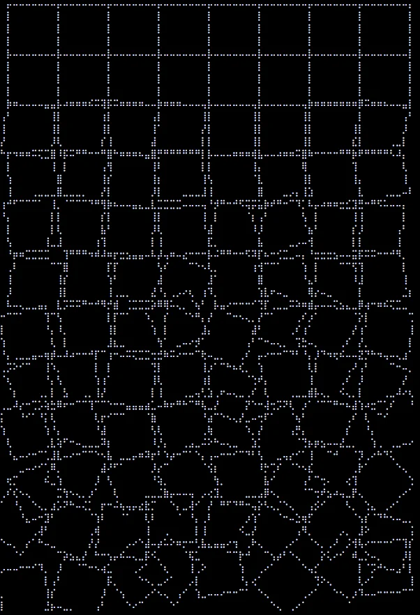

# Functions

There are some databases with built-in functions that help create digital art.

## Redis

### LOLWUT

LOLWUT is a command in Redis that is designed to be entertaining and not technologically useful.

From the code: "This file implements the LOLWUT command. The command should do something fun and interesting, and should be replaced by a new implementation at each new version of Redis."

Running LOLWUT results in an artwork inspired by Georg Nees "Schotter", Plotter on paper, 1968. "Schotter" is a computer graphic created in the 1960s using a structured process with random generators. This artwork illustrates the interplay between order and disorder, as well as the impact of change.

Sources:

- <http://antirez.com/news/123>
- <https://github.com/redis/redis/blob/unstable/src/lolwut.c>
