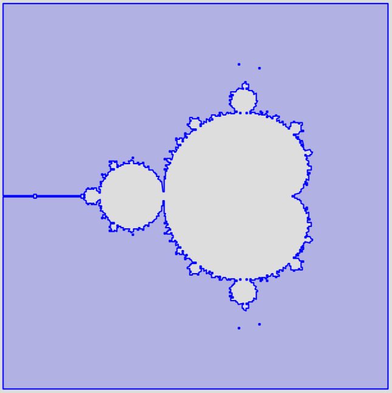
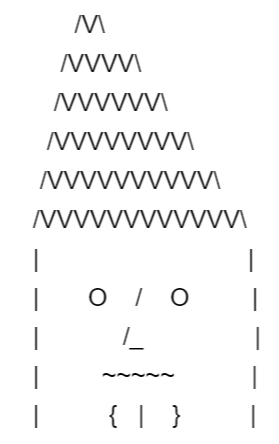

# SQL Queries

The following examples are not mine but this is soooo cool :)

## Mandelbrot Set

Source: <https://blog.jooq.org/fun-with-postgis-mandelbrot-set-game-of-life-and-more/>

With the code below, use different values for "dims" to zoom in, e.g.

``` sql
dims (r1, r2, i1, i2, s, it, p) as (values (
  (-0.925-0.032)::float, (-0.925+0.032)::float, 
  (0.266-0.032)::float, (0.266+0.032)::float, 
  0.00005::float, 100, 256.0::float)
)
```

Code

``` sql
WITH RECURSIVE

  -- These are the dimensions that you can play around with
  dims (r1, r2, i1, i2, s, it, p) AS (
    VALUES (
      
      -- The dimensions of the real axis
      -2::float, 1::float, 
      
      -- The dimensions of the imaginary axis
      -1.5::float, 1.5::float, 
      
      -- The step size on each axis, per pixel or sprite
      0.01::float, 
      
      -- The maximum number of iterations
      100, 
      
      -- "Infinity", i.e. when to stop
      256.0::float
    )
  ),
  
  -- The square again, as before
  sprites (s) AS (VALUES
    (st_polygonfromtext('polygon ((0 0, 0 1, 1 1, 1 0, 0 0))'))
  ),
  
  -- The number plane, as ints
  n1 (r, i) AS (
    SELECT r, i 
    FROM
      dims, 
      generate_series((r1 / s)::int, (r2 / s)::int) r,
      generate_series((i1 / s)::int, (i2 / s)::int) i
  ),
  
  -- The number plane as scaled floats
  n2 (r, i) AS (
    SELECT r::float * s::float, i::float * s::float
    FROM dims, n1
  ),
  
  -- The recursive calculation of the Mandelbrot formula
  -- zn = (zn-1)^2 + c
  l (cr, ci, zr, zi, g, it, p) AS (
    SELECT r, i, 0::float, 0::float, 0, it, p FROM n2, dims
    UNION ALL
    SELECT cr, ci, zr*zr - zi*zi + cr, 2*zr*zi + ci, g + 1, it, p 
    FROM l
    
    -- The recursions stops when we reach the maximum
    WHERE g < it
    
    -- Or, when we reach "infinity"
    AND zr*zr + zi*zi < p
  ),
  
  -- Find the last calculated value per point in the
  -- complex number plane c (cr, ci), discard the others
  x (cr, ci, zr, zi, g) AS (
    SELECT DISTINCT ON (cr, ci) cr, ci, zr, zi, g
    FROM l
    ORDER BY cr, ci, g DESC
  )
  
-- Turn every calculated point into a square
SELECT
  st_union(
    st_translate(sprites.s, round(cr / dims.s), round(ci / dims.s))
  )
FROM x, sprites, dims

-- Retain only the points *not* belonging to the Mandelbrot set
-- You can also inverse the equation to retain the points that
-- belong to the set
WHERE zr*zr + zi*zi > p;
```

Example output:



## Christmas Tree

ASCII art christmas tree using Recursion and CTEs.

- Source: <https://learnsql.com/blog/draw-christmas-tree-sql/>

Code

```sql
WITH small_tree(tree_depth,pine) AS (
  SELECT 1 tree_depth,
  rpad(' ',10,' ') || '*'
  || rpad(' ',20,' ') || '*'
  || rpad(' ',20,' ') || '*'
  pine
  FROM   dual
  UNION ALL
  SELECT small_tree.tree_depth +1 tree_depth,
  rpad(' ',10-small_tree.tree_depth,' ') || rpad('*',small_tree.tree_depth+1,'.') || lpad('*',small_tree.tree_depth,'.')
  || rpad(' ',20-small_tree.tree_depth-tree_depth,' ') || rpad('*',small_tree.tree_depth+1,'.') || lpad('*',small_tree.tree_depth,'.')
  || rpad(' ',20-small_tree.tree_depth-tree_depth,' ') || rpad('*',small_tree.tree_depth+1,'.') || lpad('*',small_tree.tree_depth,'.') pine
  FROM   small_tree
  where small_tree.tree_depth < 10
)
SELECT pine
FROM small_tree;
```

Result

``` txt
          *                    *                    *
          *.*                  *.*                  *.*
        *...*                *...*                *...*
        *.....*              *.....*              *.....*
      *.......*            *.......*            *.......*
      *.........*          *.........*          *.........*
    *...........*        *...........*        *...........*
    *.............*      *.............*      *.............*
  *...............*    *...............*    *...............*
  *.................*  *.................*  *.................*
```

## Man with a Hat

Draw a man with a hat using recursive queries and Common Table Expressions (CTEs).

- Source: <https://learnsql.com/blog/draw-sql-recursive-queries/>

Code

```sql
WITH RECURSIVE hat
AS (
  SELECT
    CAST(REPEAT(' ', 11) || '/V\' AS VARCHAR(100))
      AS hat_pattern,
    1 AS level
  
  UNION ALL
      
  SELECT
    CAST(
      REPEAT(' ', 10-level) || '/'
        || REPEAT('V', 2 * level + 1) || 'V\'
        AS VARCHAR(100))
      AS repeated_pattern,
    hat.level + 1
  FROM hat
  WHERE level < 6
)
  
  
SELECT hat_pattern
FROM hat
  
UNION ALL
  
SELECT
  CAST(
    REPEAT(' ', 5) || '|' || '             ' || '|'
    AS VARCHAR(100))
  AS forehead
  
UNION ALL
  
SELECT
  CAST(
    REPEAT(' ', 5) || '|' || '  O   /   O  ' || '|'
    AS VARCHAR(100))
  AS eyes
  
UNION ALL
  
SELECT
  CAST(
    REPEAT(' ', 5) || '|' || '     /_      ' || '|'
    AS VARCHAR(100))
  AS nose
  
UNION ALL
SELECT
  CAST(
    REPEAT(' ', 5) || '|' || '     ~~~~~   ' || '|'
    AS VARCHAR(100))
  AS mouth
  
UNION ALL
SELECT
  CAST(
    REPEAT(' ', 5) || '|' || '   {  |  }   ' || '|'
    AS VARCHAR(100))
  AS chin;
```


