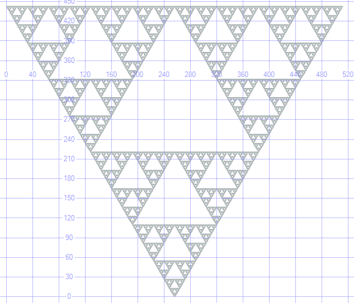

# Stored Procedures

The following examples are not mine but this is soooo cool :)

## Sierpinski triangle

SQL CLR procedure to draw a Sierpinski triangle fractal

- Source: <https://alastaira.wordpress.com/2012/03/06/drawing-fractals-with-sql-server-spatial/>

Code:

```csharp
using System;
using System.Collections.Generic;
using System.Text;
using Microsoft.SqlServer.Types;
using System.Data.SqlTypes;
using System.Data.SqlClient;
using Microsoft.SqlServer.Server;
using System.Data;
 
namespace ProSpatial
{
  public partial class StoredProcedures
  {
    [Microsoft.SqlServer.Server.SqlProcedure]
    public static void SierpinskiTriangle(int size)
    {
       // Set properties of exterior equilateral triangle
      int w = size;  // Width. e.g. 512
      int h = (int)(w * Math.Sqrt(3) / 2);  // Height
      int[] x = { 0, w, w/2 };  // x vertices
      int[] y = { h, h, 0 };  // y vertices
 
      // Create a new SqlGeometry Instance to hold the output
      SqlGeometry Triangles = new SqlGeometry();
      Triangles.STSrid = 0;
 
      // Start recursion
      Triangles = drawSierpinskiTriangle(x, y, w/2, 2, Triangles);
 
      // Send the results back to SQL Server
      SendResults(Triangles);
    } 
 
    private static SqlGeometry drawSierpinskiTriangle(int[] x, int[] y, int d, int dMin, SqlGeometry Triangles)
    {
 
      // If triangles are too small to render then make this the last recursion
      if (d <= dMin)
      {
        // Create a new triangle and add it to the collection
        SqlGeometry Polygon = TriangleFromPoints(x[0], y[0], x[1], y[1],  x[2], y[2]);
        Triangles = Triangles.STUnion(Polygon);
      }
      else
      {
        // Calculate centre of each side
        int xMc = (x[0] + x[1]) / 2, yMc = (y[0] + y[1]) / 2;
        int xMb = (x[0] + x[2]) / 2, yMb = (y[0] + y[2]) / 2;
        int xMa = (x[1] + x[2]) / 2, yMa = (y[1] + y[2]) / 2;
 
        // Subdivide into three new triangles
        int[] xNew1 = { x[0], xMc, xMb };
        int[] yNew1 = { y[0], yMc, yMb };
        Triangles = drawSierpinskiTriangle(xNew1, yNew1, d / 2, dMin, Triangles);
 
        int[] xNew2 = { x[1], xMc, xMa };
        int[] yNew2 = { y[1], yMc, yMa };
        Triangles = drawSierpinskiTriangle(xNew2, yNew2, d / 2, dMin, Triangles);
 
        int[] xNew3 = { x[2], xMb, xMa };
        int[] yNew3 = { y[2], yMb, yMa };
        Triangles = drawSierpinskiTriangle(xNew3, yNew3, d / 2, dMin, Triangles);
      }
 
      // Recursion finished - return the result
      return Triangles;
    }
 
    // Send the results back to the client
    private static void SendResults(SqlGeometry Triangles)
    {
      // Define the metadata of the results column
      SqlMetaData metadata = new SqlMetaData("Triangle", SqlDbType.Udt, typeof(SqlGeometry));
 
      // Create a record based on this metadata
      SqlDataRecord record = new SqlDataRecord(metadata);
      record.SetValue(0, Triangles);
 
      // Send the results back to the client
      SqlContext.Pipe.Send(record);
    }
 
    // Construct a triangle from 3 vertices
    private static SqlGeometry TriangleFromPoints(double x0, double y0, double x1, double y1, double x2, double y2)
    {
      SqlGeometryBuilder TriangleBuilder = new SqlGeometryBuilder();
      TriangleBuilder.SetSrid(0);
      TriangleBuilder.BeginGeometry(OpenGisGeometryType.Polygon);
      TriangleBuilder.BeginFigure(x0, y0);
      TriangleBuilder.AddLine(x1, y1);
      TriangleBuilder.AddLine(x2, y2);
      TriangleBuilder.AddLine(x0, y0);
      TriangleBuilder.EndFigure();
      TriangleBuilder.EndGeometry();
      return TriangleBuilder.ConstructedGeometry;
    }
 
  }
}
```

Import the assembly (SierpinskiTriangle.dll), register the procedure, and then execute it (using 512 as size input):

```sql
/* Import Assembly */
CREATE ASSEMBLY SierpinskiTriangle
FROM 'c:\temp\SierpinskiTriangle.dll'
WITH PERMISSION_SET = SAFE;
GO
 
/* Register function */
CREATE PROCEDURE dbo.SierpinskiTriangle(@size int)
AS EXTERNAL NAME SierpinskiTriangle.[ProSpatial.StoredProcedures].SierpinskiTriangle;
GO
 
/* Execute Procedure */
EXEC dbo.SierpinskiTriangle 512;
```

Result:


