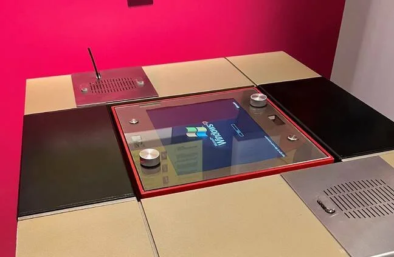
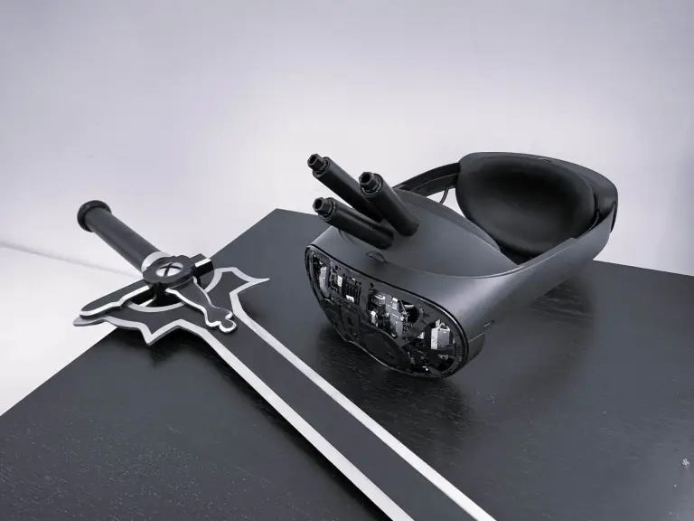
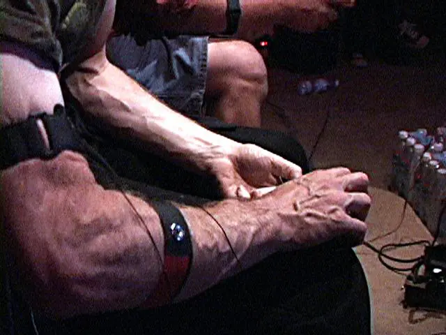

# Painstations

## PainStation

The "PainStation" is an interactive art piece and a unique twist on the classic video game Pong. In this version of Pong, the players not only play the game on a screen but also experience physical sensations based on the game's progress. These sensations can include heat, a shock, or a whipping-like effect, delivered through the console to the player's hand.

The idea behind PainStation is to explore the relationship between physical pain and virtual experiences. It challenges the conventional boundaries of video gaming by introducing real consequences to the virtual actions of the players. The piece has been both controversial and intriguing, sparking conversations about the nature of gaming, art, and the human experience of pain.

## NerveGear

While VR can distract from real world pain, there are devices that pass on the game educed pain and even kill the player.

The "NerveGear" is a fictional virtual reality (VR) headset featured in the light novel and anime series "Sword Art Online" (SAO). Created by the writer Reki Kawahara, NerveGear represents a highly advanced piece of technology in the SAO universe.

Key features of NerveGear include:

- Full-Dive Technology: NerveGear is designed to intercept signals from the user's brain, effectively allowing them to control their in-game character with their thoughts, just as they would move their physical body. This creates an immersive full-dive VR experience.
- Sensory Experience: The device is capable of simulating sensory experiences, including sight, sound, smell, taste, and touch, making the virtual world indistinguishable from the real world to the user.
- Safety Controversy: In the storyline of "Sword Art Online", the NerveGear becomes controversial because it can trap players within the virtual world and has the potential to cause real harm, up to and including death, if certain conditions in the game are met.
- Cultural Impact: NerveGear had a significant impact on popular culture, especially among fans of VR and gaming. It represents an extreme vision of the future of virtual reality, where the boundaries between the virtual and real worlds are almost entirely blurred.

## Tekken Torture Tournament

The "Tekken Torture Tournament" was a performance art event that added a physical dimension to the playing of the popular fighting video game "Tekken." Participants played the Tekken video game while wearing devices that delivered electric shocks to them in response to events in the game. For instance, when a player's character was hit in the game, the corresponding player would receive a real, albeit mild, electric shock. This added an unusual and visceral element to the gaming experience, merging the virtual and physical worlds in a very direct way.

The purpose of such an event was typically to explore and comment on the relationship between physicality and virtual experiences, similar to other art installations that blend digital technology with real-world elements. It raised questions about the nature of video gaming, entertainment, and the human threshold for experiencing pain or discomfort in a gaming context.

