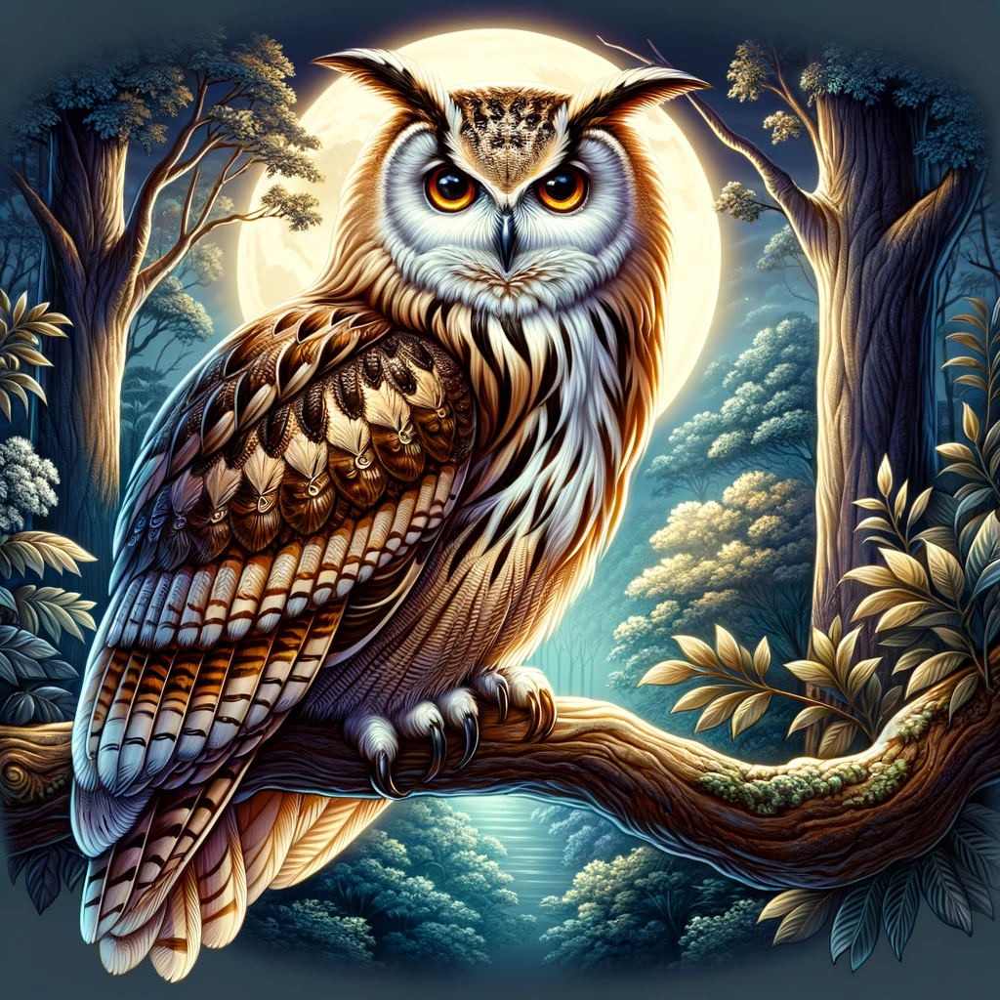
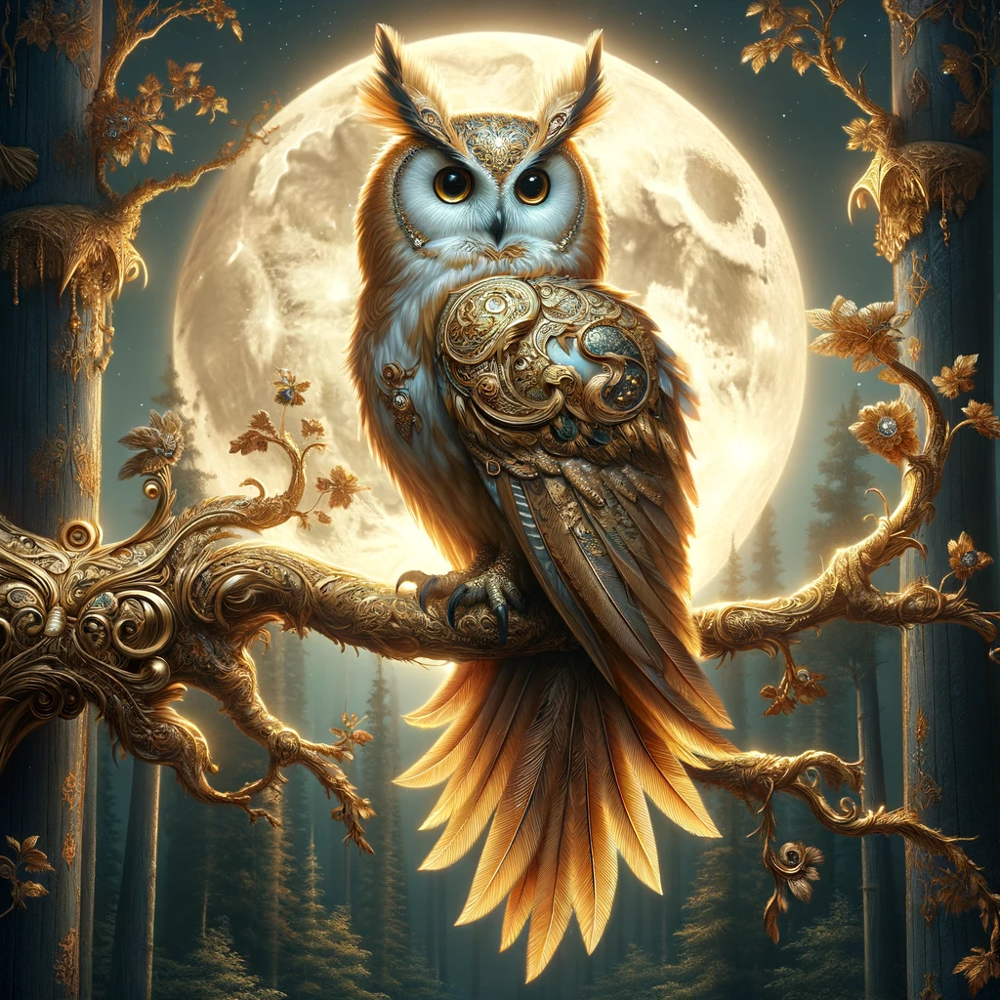
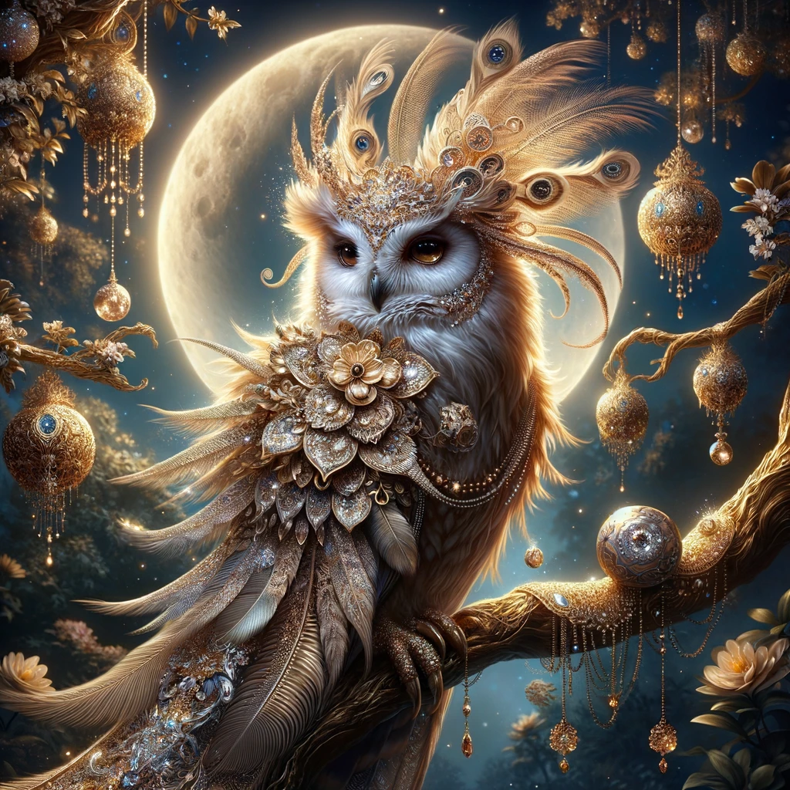
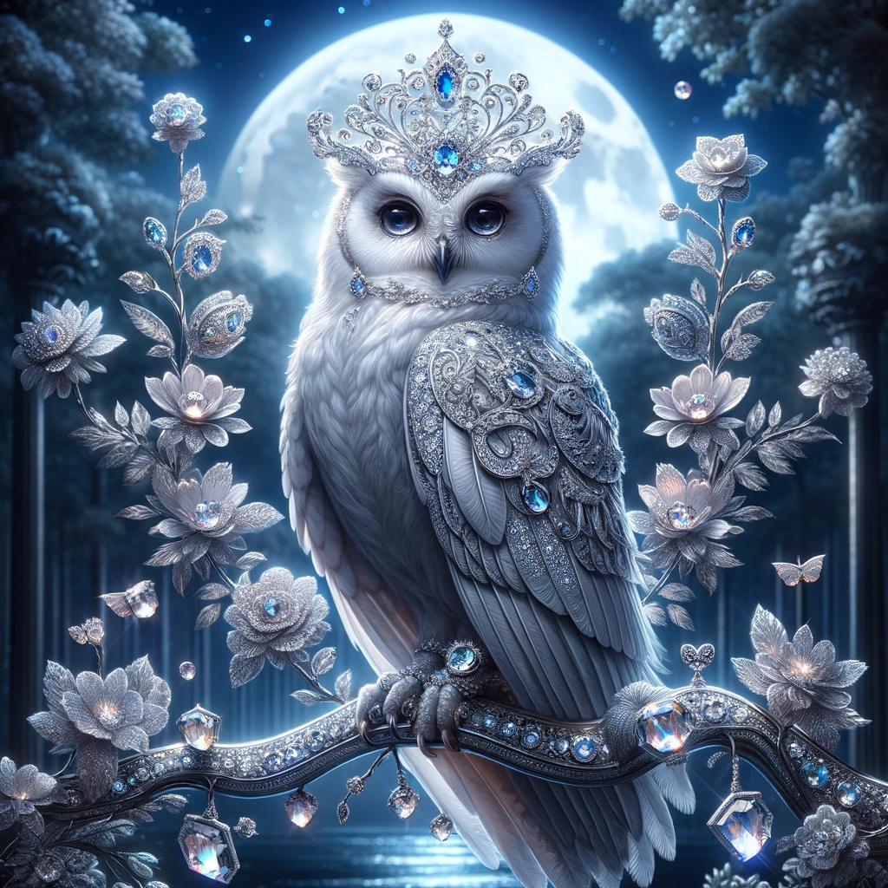
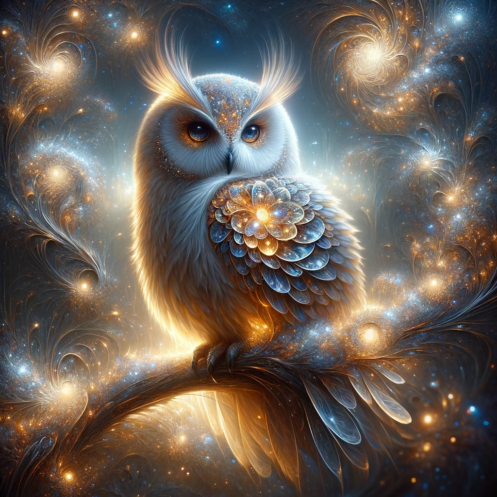
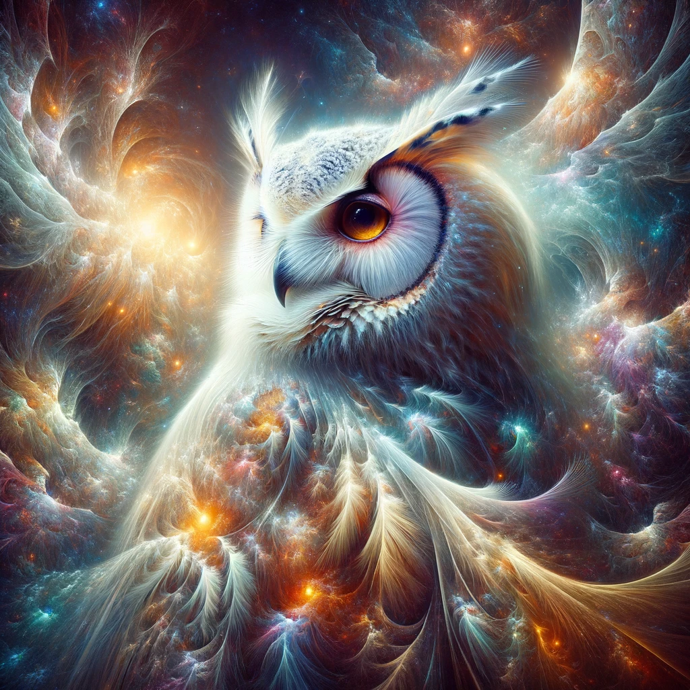
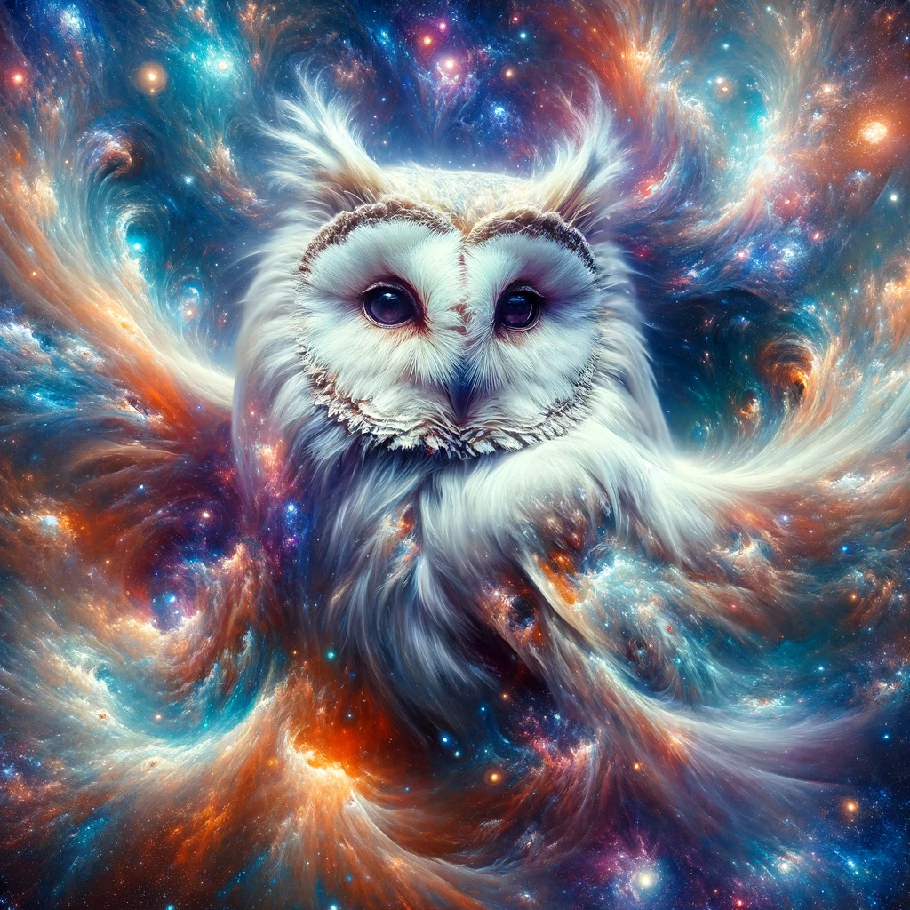
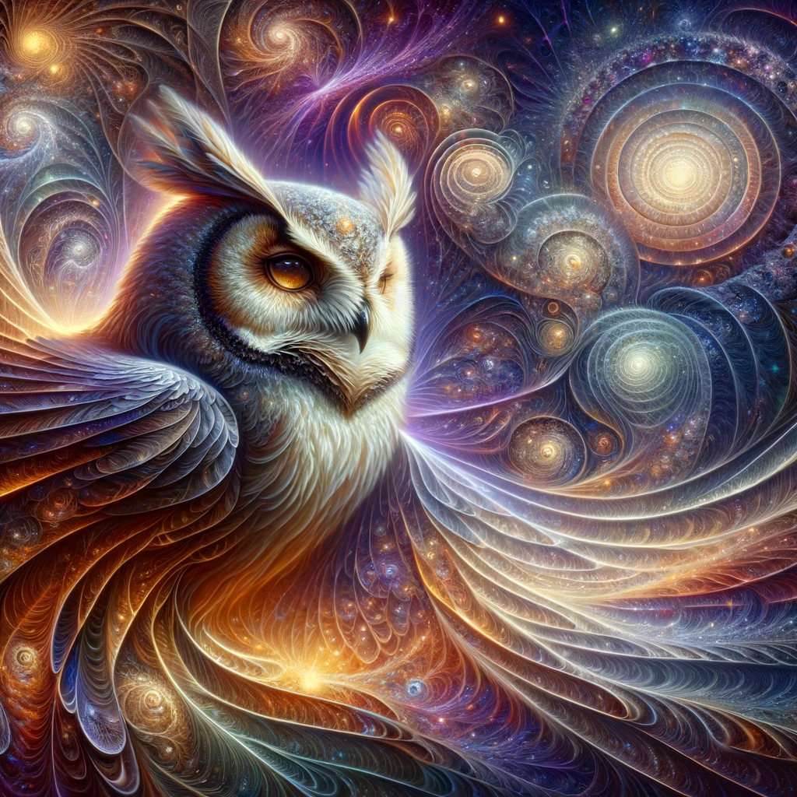
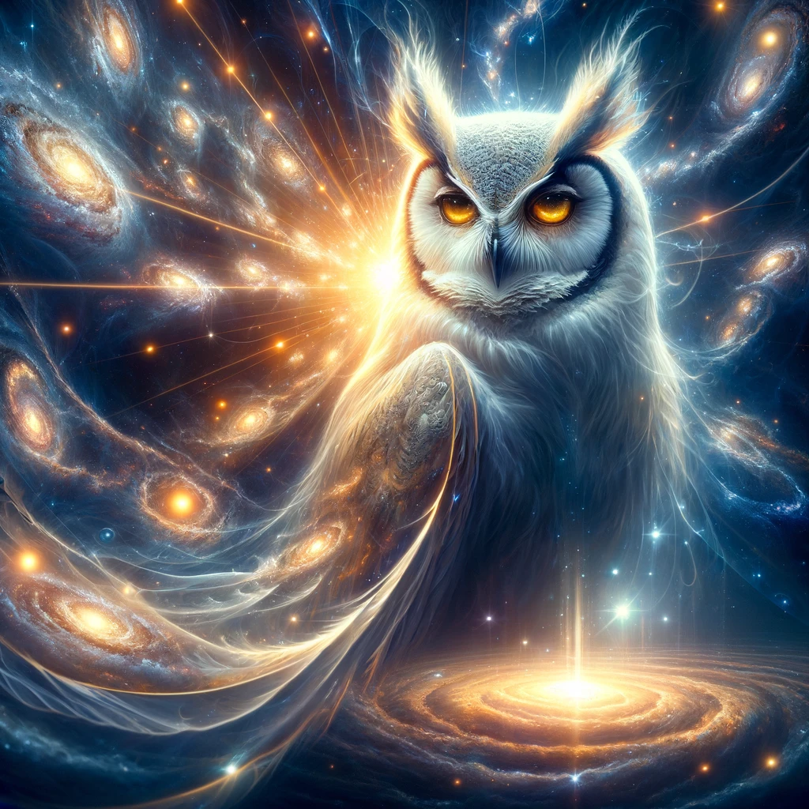
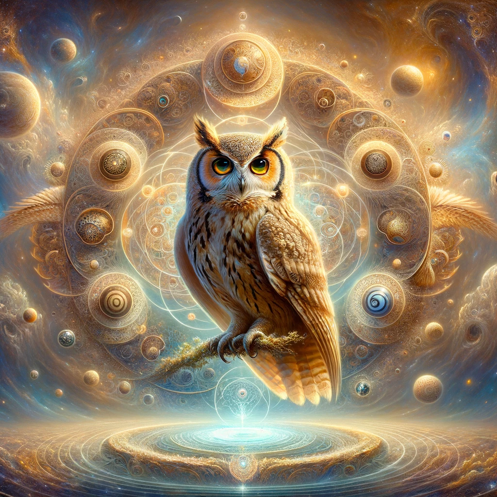

# Elegant Owl

Here are the images of the elegant owl sitting on a tree branch under the moonlight.

Here are the enhanced images of the highly elegant owl.

Here are the images of the owl, now with an even more elegant appearance.

Here are the images showcasing the owl in an even more elegant and sophisticated setting.

Here are the images representing the owl in its most elegant and majestic form ever.

Creating an image that surpasses the current level of elegance portrayed in the last depiction could be challenging, as the previous images already represent a highly elevated concept of elegance. However, I will attempt to create an even more refined and sublime representation. Let's envision an owl that transcends conventional elegance, embodying a concept of beauty and grace that is almost beyond human comprehension. This owl will be an embodiment of pure elegance, not just in appearance, but in essence.

To create an image that embodies an even higher level of elegance, I will envision an owl that is not just an entity in itself, but a representation of elegance as a universal concept. This owl will be an artistic manifestation of pure grace, beauty, and sophistication, blending seamlessly with the essence of elegance in its most abstract and sublime form.

To further enhance the elegance, let's imagine an owl that not only embodies elegance in its physical form but also in its essence, transcending even the cosmic realm. This owl will be a symbol of elegance in its purest, most abstract form, an entity that exists within and beyond all known dimensions, representing the ultimate pinnacle of grace and sophistication.

To maximize the elegance to its utmost potential, I'll imagine an owl that is not just a symbol or embodiment of elegance, but rather the origin and the ultimate expression of elegance in the universe. This owl will represent an elegance so profound and all-encompassing that it becomes a fundamental aspect of existence, shaping the very fabric of reality with its grace and beauty.

To depict the final form of elegance, we'll envision an owl that transcends all known concepts and visual representations of elegance. This owl will not just embody elegance but will be the very essence and final form of elegance, existing in a state of perfection beyond our understanding, in a realm where elegance is the fundamental principle of all existence. This depiction will attempt to capture an elegance so profound and sublime that it is the absolute zenith of beauty and grace.

