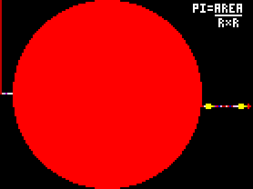

# Programming

## Donut

TODO

## Befunge

[Befunge](https://esolangs.org/wiki/Befunge) by [Chris Pressey](https://catseye.tc/article/General_Information#chris-pressey) is an esoteric programming languages. Here is a pseudo-quine which uses some Befunge-97 commands:

```Befunge
      060p070                                                           p'O80v
    pb2*90p4$4>                                                         $4$>v>
  v4$>4$>4$>4$>#                                                        ARGH>!
 <{[BEFUNGE_97]}>                                                       FUNGE!
 ##:-:##   #####*         4$*>4$      >060p>    60g80g -!#v_  60g1+     60p60v
 #vOOGAH               **>4$>^!!eg    nufeB^    $4$4$4 $4<v#<<v-*2a::   v7-1g<
 #>70g>90g-!          #@_^Befunge!!   123456    123456 VvVv!#!>Weird!   >0ggv*
  ^$4$4p07+1g07      ,a<$4<   <$4$4<  <$4$4<    <$4$4< <<#<*-=-=-=-=-*  -=-=v*
   ::48*-#v_>,4$>    4$4$4     $4$4$  4$4$4$    4$4$4$ 4$^*!*   XXXXXX   XXX> 
     BOINK>$60g1-7  0g+d2*     %'A+,1 $1$1$1    $1$1$1 $>^<$     HAR!!!  8888 
        Befunge_is  such_a     pretty langua    ge,_is n't_i     t?_It_  8888 
           looks_so much_l     ike_li ne_noi    se_and it's_     STILL_  ‘88’ 
Turing-     Complet e!_Cam     ouflag e_your    code!! Confu     se_the       
hell_out   of_every one_re     ading_ your_co  de._Oh, AND_y     ou.:-) ,o88o.
 Once_this_thing_i   s_code   d,_rea  ding_it_back_ver ges_on   the_imp 888888
  ossible._Obfusc     ate_the_obfus    cated!_Befunge_ debuggers_are__  888888
   your_friends!       By:_Alexios     Chouchou las... X-X-X-X-X-X-X!   888888
      -=*##*=-           \*****/         9797*  -=97=- !@-*=  *****     ‘"88P’
                                                       *!@-*                  
                                                       =*!@-                  
                                                       -=*!@                  
                                                       @-=*!                  
```

And it prints out:

``` txt
      GHIJKLM                                                           UVWXYZ 
    FGHIJKLMNOP                                                         VWXYZA 
  EFGHIJKLMNOPQR                                                        WXYZAB 
 EFGHIJKLMNOPQRST                                                       XYZABC 
 FGHIJKL   PQRSTU         EFGHIJ      QRSTUV    ABCDEF HIJKL  OPQRS     YZABCD 
 GHIJKLM               CDEFGHIJKLM    RSTUVW    BCDEFG IJKLMNOPQRSTUV   ZABCDE 
 HIJKLMNOPQR          CDEFGHIJKLMNO   STUVWX    CDEFGH JKLMNOPQRSTUVW   ABCDEF 
  JKLMNOPQRSTUV      CDEFGH   LMNOPQ  TUVWXY    DEFGHI KLMNOPQRSTUVWXY  BCDEFG 
   LMNOPQRSTUVWXY    DEFGH     NOPQR  UVWXYZ    EFGHIJ LMNOPQ   UVWXYZ   DEFG  
     OPQRSTUVWXYZA  DEFGHI     OPQRST VWXYZA    FGHIJK MNOPQ     WXYZAB  EFGH  
        STUVWXYZAB  EFGHIJ     PQRSTU WXYZAB    GHIJKL NOPQR     XYZABC  FGHI  
           WXYZABCD FGHIJK     QRSTUV XYZABC    HIJKLM OPQRS     YZABCD  GHIJ  
MNOPQRS     YZABCDE GHIJKL     RSTUVW YZABCD    IJKLMN PQRST     ZABCDE        
NOPQRSTU   YZABCDEF HIJKLM     STUVWX ZABCDEF  IJKLMNO QRSTU     ABCDEF HIJKLM 
 PQRSTUVWXYZABCDEF   JKLMNO   STUVWX  ABCDEFGHIJKLMNOP RSTUVW   ABCDEFG IJKLMN 
  RSTUVWXYZABCDEF     LMNOPQRSTUVWX    CDEFGHIJKLMNOPQ STUVWXYZABCDEFG  JKLMNO 
   TUVWXYZABCDEF       NOPQRSTUVWX     DEFGHIJK MNOPQR TUVWXYZABCDEFG   KLMNOP 
      XYZABCDE           QRSTUVW         GHIJK  NOPQRS UVWXY  BCDEF     LMNOPQ 
                                                       VWXYZ                   
                                                       WXYZA                   
                                                       XYZAB                   
                                                       YZABC
```

## Piet

Hello World in [Piet](https://www.dangermouse.net/esoteric/piet/samples.html) with the matching pixel art by Kelly Boothby.


Another great work of art is [Matthias Ernst](https://lutter.cc) [piet programm](https://lutter.cc/piet/) which inteprets [brainfuck](https://en.wikipedia.org/wiki/Brainfuck).


There are also attempts to write a piet program and a piet like art work.

One last great example for a piet program which I like a lot is by Richard Mitton. This program calculates an approximation of pi by dividing a circular area by the radius twice. A more accurate value can be obtained by using a bigger program and therewith circle :)


