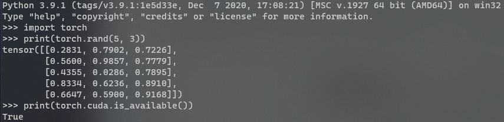
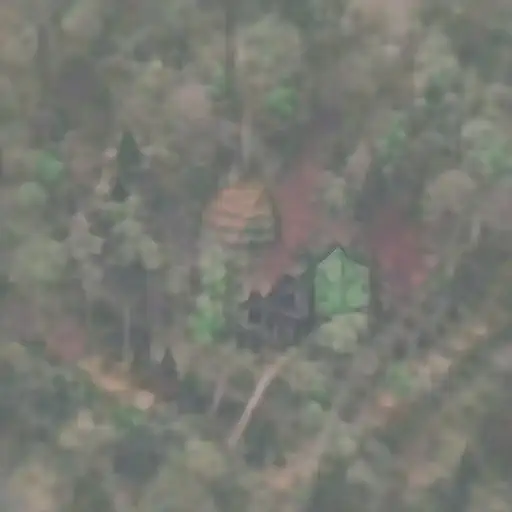

# pytorch

Install tools:

- Install CUDA: <https://developer.nvidia.com/cuda-downloads>
- Install Miniconda: <https://docs.conda.io/en/latest/miniconda.html>

Check status of nvidia settings:

``` sh
nvidia-smi
nvcc -V
```

Install tools using Miniconda CLI:

``` sh
conda install numpy ninja pyyaml mkl mkl-include setuptools cmake cffi typing_extensions future six requests dataclasses
conda install -c conda-forge libuv=1.39 # Windows
```

PyTorch does not use the systems CUDA library. You can clone and compile pytorch yourself or you need to choose the correct precompiled binaries matching your local CUDA library. So, use the right CUDA version you got from```nvcc -V``` and check the [pytorch install guide](https://pytorch.org/) for details.

Example for CUDA 11 for windows with Conda or PIP:

- Install PyTorch via Csonda:```conda install pytorch torchvision torchaudio cudatoolkit=11.1 -c pytorch -c conda-forge```
Install PyTorch via PIP:```pip install torch==1.8.1+cu111 torchvision==0.9.1+cu111 torchaudio===0.8.1 -f https://download.pytorch.org/whl/torch_stable.html```

Now, test with python if tools are installed and pytorch with CUDA works.

``` python
import torch
print(torch.rand(5, 3)) # Torch Test
print(torch.cuda.is_available()) # CUDA Test
```

Expected output:



## deep-daze

|What|Where|
|-|-|
|Source|<https://github.com/lucidrains/deep-daze>|
|Install|```pip install deep-daze```|

### deep-daze examples

- Create Image:```imagine "a house in the forest"```
- Create Image with better quality:```imagine "shattered plates on the ground" --deeper```
- Create Image and add more layers = better results:```imagine "stranger in strange lands" --num-layers 32```

I created a video of all 34 pictures created while running this command```imagine "a house in the forest"``` and the output looks like this:



This script will create a new folder on the local desktop and run deep-daze for 60min. The resulting images will be used to create an mp4 and webp video within the same folder.

``` ps11
# Add a new input
$text = "Correct Horse Battery Staple"

# Create folder and prepare variables
$DesktopPath = [System.Environment]::GetFolderPath([System.Environment+SpecialFolder]::Desktop)
Set-Location -Path $DesktopPath
$folder = $text -replace " ","_"
$fullpath = $DesktopPath +  "/" + $folder
New-Item -Path $DesktopPath -Name ($text -replace " ","_") -ItemType "directory" -Force
Set-Location -Path $fullpath

# Run imagine for 60min
$job = Start-Job -ScriptBlock { imagine $input } -InputObject ("'" + $text + "'")
Start-Sleep -s 3600
Stop-Job $job

# Create Video
ffmpeg -framerate 5 -i "$folder.%06d.jpg" -c:v libx264 "$folder.mp4"
ffmpeg -i "$folder.mp4" -vf "fps=10,scale=512:-1:flags=lanczos" -vcodec libwebp -lossless 0 -compression_level 6 -q:v 50 -loop 0 -preset picture -an -vsync 0 "$folder.webp"
```

### deep-daze script

``` python
from deep_daze import Imagine

imagine = Imagine(
    text = 'cosmic love and attention',
    num_layers = 24,
    save_every=4,
    save_progress=True,
    save_date_time=True,
)
imagine()
```

## Big Sleep

|What|Where|
|-|-|
|Source|<https://github.com/lucidrains/big-sleep>|
|Install|```pip install big-sleep```|

### Big Sleep example

- Create Image```dream "a pyramid made of ice"```

### Big Sleep script

``` python
from big_sleep import Imagine

dream = Imagine(
    text = "fire in the sky",
    lr = 5e-2,
    save_every = 25,
    save_progress = True
)

dream()
```
