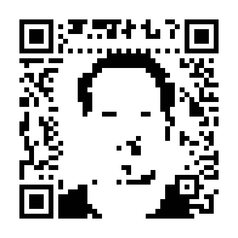

# Pixel

QR codes are encoded with [Reed-Solomon error-correcting codes](https://en.wikipedia.org/wiki/Reed%E2%80%93Solomon_error_correction), so that a QR scanner does not have to see every pixel correctly in order to decode the content. The error correction makes it possible to introduce a few errors ) in order to make an image.

The following is an example with my face as pixel art embedded into the QR-Code linking to this website. (I know, could be any face, lol)

Here is another QR code with the avatar I use:

