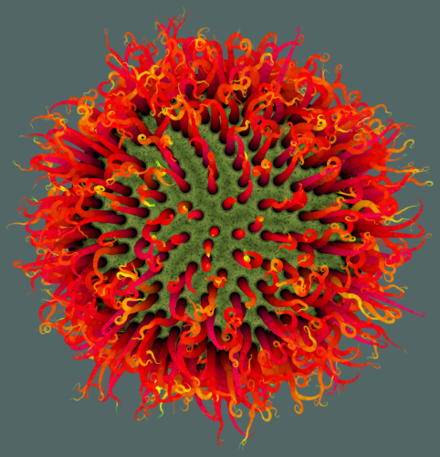
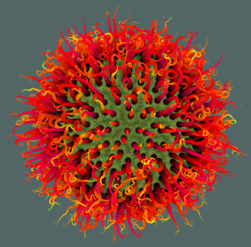
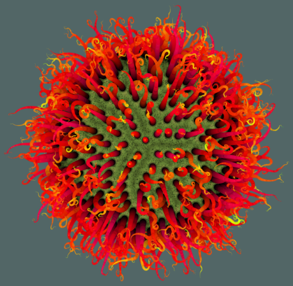
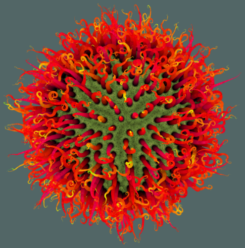
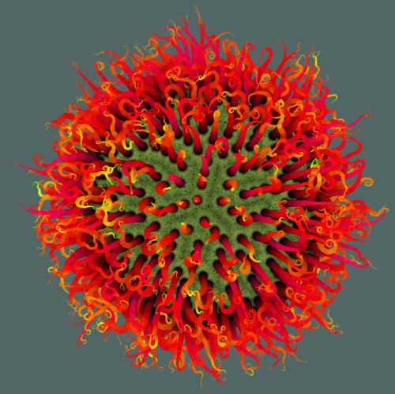
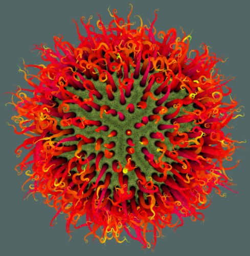

# Context Free Art
<!-- markdownlint-disable MD010 -->

Context Free is a program that generates images from written instructions called a grammar. The program follows the instructions in a few seconds to create images that can contain millions of shapes.

| What          | Where                                         |
|---------------|-----------------------------------------------|
| Official Page | <https://www.contextfreeart.org>              |
| Source        | <https://github.com/MtnViewJohn/context-free> |

## Avatar

One of my favorite creations with Context Free is [insectivore](https://www.contextfreeart.org/gallery/view.php?id=3215) by [kipling](https://www.contextfreeart.org/gallery/search.php?by=kipling)

I shortened the code and modified some values. The idea was to create a unique but same looking avatar for online accounts.
In practice it wasn't practical to create new avatars on the fly so I pre-created avatars and moved them to "used" whenever uploaded.

Here is the Context Free code to create the image:

``` cfdg
startshape X
CF::Background = [hue 180 sat 0.2 b -0.6]

shape X{
	loop i=30 [] {
		phi=(i+.5)*180/30
		rtwist=0..1
		Mtheta=floor(60/2*sin(phi))
		loop j=Mtheta [] {
			theta=(j+ rtwist)*360/Mtheta
			CELL(sin(phi)*cos(theta), sin(phi)*sin(theta), cos(phi), sin(phi))[] }}}

shape CELL(number xx, number yy, number zz, number xy) {
	BUMP(.8)[s .45 .45 .45 x xx y yy z zz h 80 sat .6]
	BUMP(0.2)[s .12 .12 0 x (1.1*xx) y (1.1*yy) z (1.1*zz) b 0 a -.95]
	SPIKE(xy,12,0)[[ x (1.1*xx) y (1.1*yy) z (1.1*zz) r atan2(yy,xx) s .08 .08 zz sat 1 h -20..0]]
	loop 88 [] CIRCLE[[x -.2 .. .2 y -.2 .. .2 x xx y yy z zz s .008 .. .015 a -.75 .. -.85]]}

shape BUMP(number target_b ){
	CIRCLE[z -2]
	BUMP(=)[s .98 .98 .95 b .02 target_b a -.05]}

shape SPIKE(number dir,number stretch,curl)
	rule 30{ SPOT[] SPIKE(=)[[z 1 x (stretch*dir) s  (1-0.02) (1-1.5*0.02) (1-0.02) x (-stretch*dir) z -1 sat .2 b .1 r (curl*0.02*20) a (-1*0.02)]] }
	rule { SPIKE(dir, stretch,-20)[h 10] }
	rule { SPIKE(dir, stretch,5)[] }
	rule { SPIKE(dir, stretch,20)[h 5] }
	rule .2 { SPIKE(=)[r -10] SPIKE(=)[r 10 f 0] }
    
shape SPOT
	rule 9 {CIRCLE[]}
	rule 1 {CIRCLE[b -.2]}
	rule 2 {SPOT[] CIRCLE[a -.5 b 1 s .5 sat -1]}
```

To create many images simply loop the image creation step. The following PowerShell script assumes the cfdg file and the ps1 script are placed in the Context Free program folder which contains the required `ContextFreeCLI.exe`.

``` ps1
function GenerateAvatars ([string] $InputFile, [string] $OutputPrefix, [int] $Amount) {
    $ContextFreeCLI = $PSScriptRoot + '\ContextFreeCLI.exe'
    $InputFile = $PSScriptRoot + "\" + $InputFile

    while($Amount -ne 0)
    {
        $Amount--        
        $OutputFile = $PSScriptRoot + '\' + $OutputPrefix + "_" + ((New-TimeSpan -Start (Get-Date "01/01/1970") -End (Get-Date)).Ticks).ToString() + ".png"
        
        $AllArgs = @('/s666', '/c', $InputFile, $OutputFile)
        & $ContextFreeCLI $AllArgs
     }    
}

GenerateAvatars "avatar.cfdg" "avatar" 10
```

Here are some examples of how the results vary:

|                                           |                                           |                                           |
|-------------------------------------------|-------------------------------------------|-------------------------------------------|
|  |  |  |
|  |  |  |
|  |  |  |
