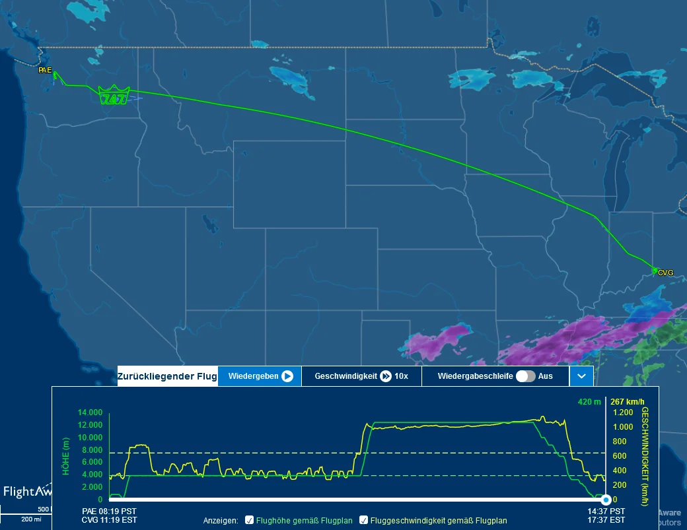
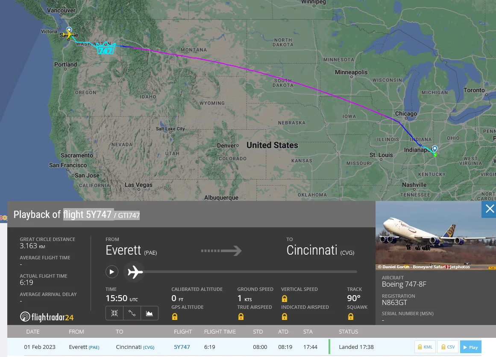
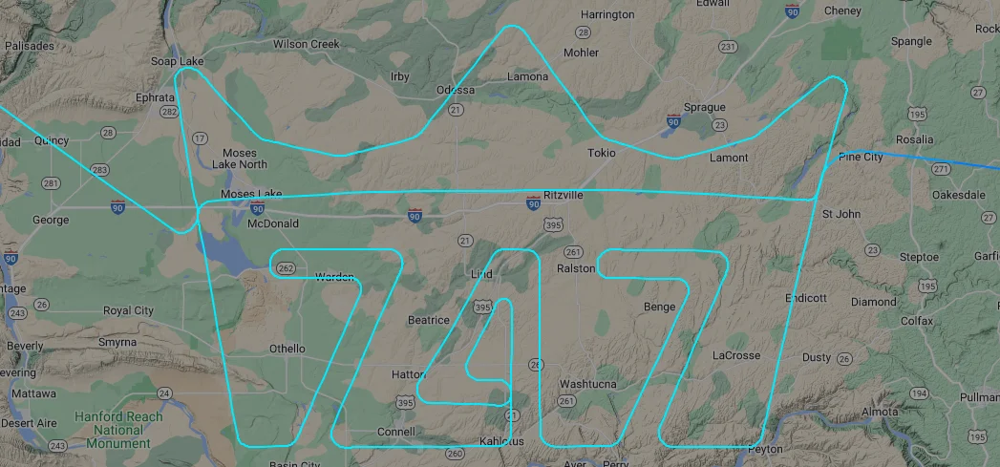
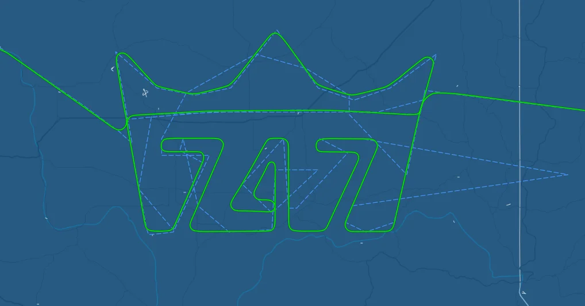
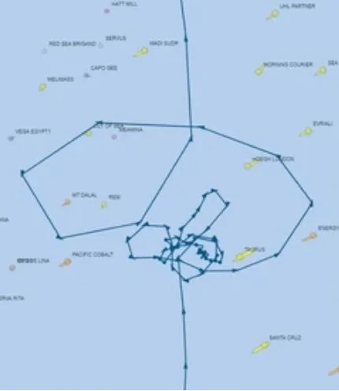
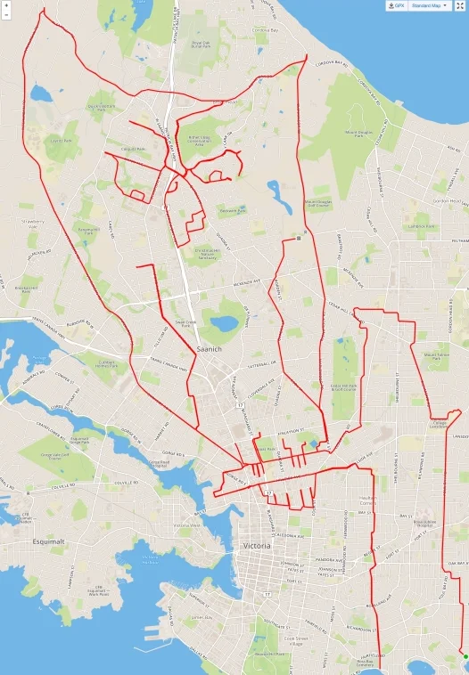
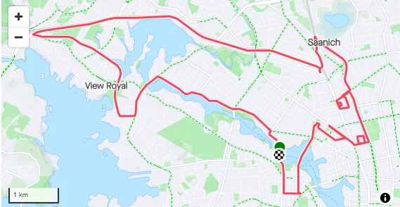

# Movement Logs

When logging movement art can be created.

## Flight 5Y747 / GTI747

Flight path of last 747 delivery flight:

Links:

- <https://www.flightradar24.com/data/aircraft/n863gt/#2f0b1162>
- <https://flightaware.com/live/flight/map/GTI747/history/20230201/1600Z/KPAE/KCVG>

## Ship Ever Given

Before getting stuck in the Suez Canal, ship "Ever Given" drew a penis.

## GPS Doodles

People run, drive, ride the bike and record their GPS tracks to create art.

Links:

- <https://gpsdoodles.com/>
