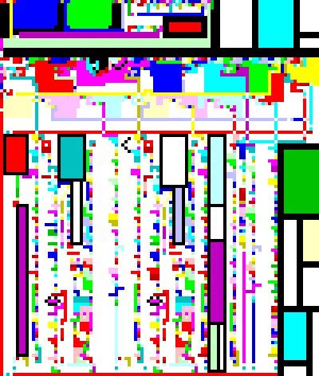
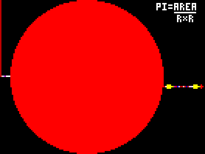
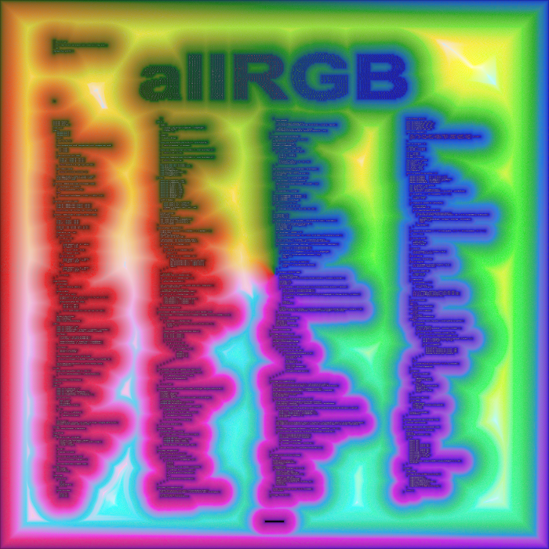

# Programming

## Piet

Hello World in [Piet](https://www.dangermouse.net/esoteric/piet/samples.html) with the matching pixel art by Kelly Boothby.


Another great work of art is [Matthias Ernst](https://lutter.cc) [piet program](https://lutter.cc/piet/) which interprets [brainfuck](https://en.wikipedia.org/wiki/Brainfuck).



There are also attempts to write a piet program and a piet like art work.

One last great example for a piet program which I like a lot is by Richard Mitton. This program calculates an approximation of pi by dividing a circular area by the radius twice. A more accurate value can be obtained by using a bigger program and therewith circle :)



## AllRGB

The objective of [allRGB](https://allrgb.com/) is simple: To create images with one pixel for every RGB color (16,777,216); not one color missing, and not one color twice.

[This picture](https://allrgb.com/recursive) from [yashe](https://allrgb.com/yashe) includes its own code.



## Donut

Code in the shape of a donut creating a rotating donut :)

Source:

- Original: <https://www.a1k0n.net/2006/09/15/obfuscated-c-donut.html>
- Update 1: <https://www.a1k0n.net/2006/09/20/obfuscated-c-donut-2.html>
- Update 2: <https://www.a1k0n.net/2011/07/20/donut-math.html>
- Update 3: <https://www.a1k0n.net/2021/01/13/optimizing-donut.html>

C code:

``` c
             i,j,k,x,y,o,N;
         main(){float z[1760],a
      #define R(t,x,y) f=x;x-=t*y\
   ;y+=t*f;f=(3-x*x-y*y)/2;x*=f;y*=f;
   =0,e=1,c=1,d=0,f,g,h,G,H,A,t,D;char
 b[1760];for(;;){memset(b,32,1760);g=0,
h=1;memset(z,0,7040);for(j=0;j<90;j++){
G=0,H=1;for(i=0;i<314;i++){A=h+2,D=1/(G*
A*a+g*e+5);t=G*A        *e-g*a;x=40+30*D
*(H*A*d-t*c);y=          12+15*D*(H*A*c+
t*d);o=x+80*y;N          =8*((g*a-G*h*e)
*d-G*h*a-g*e-H*h        *c);if(22>y&&y>
 0&&x>0&&80>x&&D>z[o]){z[o]=D;b[o]=(N>0
  ?N:0)[".,-~:;=!*#$@"];}R(.02,H,G);}R(
  .07,h,g);}for(k=0;1761>k;k++)putchar
   (k%80?b[k]:10);R(.04,e,a);R(.02,d,
     c);usleep(15000);printf('\n'+(
        " donut.c! \x1b[23A"));}}
          /*no math lib needed
             .@a1k0n 2021.*/
```

javascript version:

``` js
(function() {
var _onload = function() {
  var pretag = document.getElementById('d');
  var canvastag = document.getElementById('canvasdonut');
  var tmr1 = undefined, tmr2 = undefined;
  var cA=1, sA=0, cB=0, sB=1;

  var R=function(tanangle, x, y) {
    var tmp=x;
    x -= tanangle*y;
    y += tanangle*tmp;
    tmp = (3-x*x-y*y)/2;
    x *= tmp;
    y *= tmp;
    return [x, y];
  }

  var asciiframe=function() {
    var b=[];
    var z=[];
    var xy = R(.04, cA, sA);
    cA = xy[0]; sA = xy[1];
    xy = R(.02, cB, sB);
    cB = xy[0]; sB = xy[1];
    for(var k=0;k<1760;k++) {
      b[k]=k%80 == 79 ? "\n" : " ";
      z[k]=0;
    }
    var sj = 0, cj = 1;
    for(var j = 0; j < 90; j++) {
      var si = 0, ci = 1;
      for(var i = 0; i < 314; i++) {
        var h=cj + 2,
          D=1/(si*h*sA+sj*cA+5),
          t=si*h*cA-sj*sA;

        var x=0|(40+30*D*(ci*h*cB-t*sB)),
            y=0|(12+15*D*(ci*h*sB+t*cB)),
            o=x+80*y,
            N=0|(8*((sj*sA-si*cj*cA)*cB-si*cj*sA-sj*cA-ci*cj*sB));
        if(y<22 && y>=0 && x>=0 && x<79 && D>z[o]) {
          z[o]=D;
          b[o]=".,-~:;=!*#$@"[N>0?N:0];
        }
        xy = R(.02, ci, si);
        ci = xy[0]; si = xy[1];
      }
      xy = R(.07, cj, sj);
      cj = xy[0]; sj = xy[1];
    }
    pretag.innerHTML = b.join("");
  };

  window.anim1 = function() {
    if(tmr1 === undefined) {
      tmr1 = setInterval(asciiframe, 50);
    } else {
      clearInterval(tmr1);
      tmr1 = undefined;
    }
  };

  asciiframe();
}

if(document.all)
  window.attachEvent('onload',_onload);
else
  window.addEventListener("load",_onload,false);
})();
```

This is how it looks like:


## Stuff by Martin Kleppe aka @aemkei

This guy is amazing. Check out the [cool stuff he made](https://aem1k.com/)!

### Spinning globe

For example a [spinning globe in JS](https://aem1k.com/world/) that looks like a spinning globe (in JS) :)

```txt
eval(z='p="<"+"pre>"/* ,.oq#+     ,._, */;for(y in n="zw24l6k\
4e3t4jnt4qj24xh2 x/* =<,m#F^    A W###q. */42kty24wrt413n243n\
9h243pdxt41csb yz/* #K       q##H######Am */43iyb6k43pk7243nm\
r24".split(4)){/* dP      cpq#q##########b, */for(a in t=pars\
eInt(n[y],36)+/*         p##@###YG=[#######y */(e=x=r=[]))for\
(r=!r,i=0;t[a/*         d#qg `*PWo##q#######D */]>i;i+=.05)wi\
th(Math)x-= /*        aem1k.com Q###KWR#### W[ */.05,0>cos(o=\
new Date/1e3/*      .Q#########Md#.###OP  A@ , */+x/PI)&&(e[~\
~(32*sin(o)*/* ,    (W#####Xx######.P^     T % */sin(.5+y/7))\
+60] =-~ r);/* #y    `^TqW####P###BP           */for(x=0;122>\
x;)p+="   *#"/* b.        OQ####x#K           */[e[x++]+e[x++\
]]||(S=("eval"/* l         `X#####D  ,       */+"(z=\'"+z.spl\
it(B = "\\\\")./*           G####B" #       */join(B+B).split\
(Q="\'").join(B+Q/*          VQBP`        */)+Q+")//m1k")[x/2\
+61*y-1]).fontcolor/*         TP         */(/\\w/.test(S)&&"#\
03B");document.body.innerHTML=p+=B+"\\n"}setTimeout(z)')//
```

Here is [a video how it was created](https://www.youtube.com/watch?v=RTxtiLp1C8Y&t=1080s).

### JS mandelbrot

This is a [JS mandelbrot](https://aem1k.com/mandelcode/) code that looks like the zoomed out mandelbrot

```txt
                                  E
                                 =  1
                              ,   z=1.07 ;
                             function s(       a)
                       {  for(a&&(E=!E),H="",z *=
                        .9,T*=.8,Y=0;2>Y;Y+=.1)  {
              for      (X=0;2>X;X+=.04){for(x=y=i
            =0;99>i   &&99>=x*x+y*y;i++)t=2*x*y,x
      =   x*x-y*y+z*X -z-Z/(1-T),y=t+z*Y-z-U;(/*
   MANDELCODE=A-QUINE-BY-AEMKEI=CLICK-TO-ZOOM*/
      H   )+="  .+#"[ i%5]}H+=n}!E&&setTimeout(s
            ,99),P[   I]=H}Z=1.74909351846789013,
              U  =     3.40220976e-7,onclick=s;n
                        ="\n";P.textContent="<"  +
                          "pre id=P>\n"+P[I= "i"+
                             "nnerHTML"       ]
                              T  /*aem1k*/
                                 =  -
                                  2
```

## random dungeon generator

A random dungeon generator that fits on a business card by [Bob Nystrom aka munificent](https://github.com/munificent)

```txt
#include <time.h> //  Robert Nystrom
#include <stdio.h> // @munificentbob
#include <stdlib.h> //     for Ginny
#define  r return    //    2008-2019
#define  l(a, b, c, d) for (i y=a;y\
<b; y++) for (int x = c; x < d; x++)
typedef int i;const i H=40;const i W
=80;i m[40][80];i g(i x){r rand()%x;
}void cave(i s){i w=g(10)+5;i h=g(6)
+3;i t=g(W-w-2)+1;i u=g(H-h-2)+1;l(u
-1,u+h+2,t-1            ,t+w+2)if(m[
y][x]=='.'                  )r;i d=0
;i e,f        ;if(!s){l(      u-1,u+
h+2,t-    1,t+w+2){i s=x<t     ||x>t
+w;i    t=y<u||           y>    u+h;
if(s    ^t&&              m[      y]
[x    ]=='#'    ){d++;    if(g    (d
)     ==0)    e=x,f=y;    }}if    (d
==    0)r;    }l(u-1,u    +h+2    ,t
-1    ,t+w    +2){i s=    x< t    ||
x>    t+w;    i t= y<u    ||y>    u+
h;    m[y]      [x]= s    &&t?   '!'
:s^t    ?'#'                    :'.'
;}if    (d>0)m                  [f][
e]=g(2    )?'\'':'+';for(i j=0;j<(s?
1:g(6)        +1);j++)m[g(h)+u][g(w)
+t]=s?'@'                 :g(4) ==0?
'$':65+g(62)              ;}i main(i
argc, const char* argv[]) {srand((i)
time(NULL));l(0, H, 0,W)m[y][x]=' ';
for(i j=0;j<1000;j++)cave(j==0);l(0,
H,0,W) {i c=m[y][x]; putchar(c=='!'?
'#':c);if(x==W-1)printf("\n");}r 0;}
```

output examples

```txt

                                                             ###################
                                                             #......R...'..Q...#
                                                             #f.....$...#.$.c..#
             ########       ################   ###############...d......#s.....#
             #......#       #............$.#   #........S...##..........#......#
 ########### #......#       #I.............#   #............##########'#########
 #......N..# #......#       #..............#   #........O...#        #.`u....#  
 #.........# #....N.#       #..............#   #............#        #.......#  
 #.n.......# #......#       #..............#   #######'###############.......#  
 #.........# #......#       #..............#     #$.....# #..........+.......#  
 #.........# #......#       #..............#     #......# #........C.#########  
 ########'######+########## ######+#########     #T.....# #...m......#          
        #..........+......#    #..........#      #h.....# #..........#          
        #.....@....#$.OW..#    #..........########......# #..........#          
        #..........#......#    #....$.....'......'$.....# #..........#          
        #..........#......#    #..........#......#......# #....O.....#          
        #..........########    #.t........#..$O..######## #..........#          
        #..........#           #..........#......#        #..........#          
        #########'##############..........#..n...#        ##########'##         
               #...............#..........#.Lw...#         #..........#         
   #############...^...........'..........#......#         #.L........#         
   #...........#.....$.....w...############......#         #........w.#         
   #...T....h..+...............#          #......#         #..........#         
   #.......f...#######'#########          ############     #.Q..B.....#         
   #...........# #.......#                   #.......#     #..........#         
   ############# #.......#                   #...d...#     #..........#         
                 #.......#         ######### #.......# #####'########'#######   
                 #.......#         #$......# #.......# #......#     #.......#   
########  ########'#####'###########.......# #..$....# #.Q....#     #.......#   
#...`C.#  #.....T..#   #.m.........'.......# #.......# #......#     #.......#   
#.$u...#  #N...~...#   #...........#.......####+########......#     #.......#   
#......#  #........#   #...........#.......'C$.........'......#     #.......#   
#......#  #........#   #........h..#.......#...........#......#     #.w.....#   
#......#  #........#   #...........#########..s........#......#     #.......#   
###+########'#######   #...........#       #...........#......#    #######+###  
  #..............#     #############       #############......#    #l...$....#  
  #..........$...#                                     ########    #.........#  
  #..............#                                                 #..$......#  
  #..............#                                                 #.........#  
  ################                                                 ###########
  ```
  
## Rivulet

[Rivulet](https://github.com/rottytooth/Rivulet) is a programming language composed of flowing strands, written using semigraphic characters. These strands are not pictographic; their flow does not visually simulate computation. There are four distinct types of strands, each with its own symbolism and grammatical structure. Combined, they form glyphs—compact blocks of code in which multiple strands execute in unison.

Example (Fibonacci program)

```riv
   ╵──╮───╮╭─    ╵╵╭────────╮
    ╰─╯╰──╯│       ╰─╶ ╶╮╶╮╶╯
   ╰─────╮ │      ╭─────╯ ╰─────╮
         ╰─╯ ╷    ╰───       ───╯╷

   ╵╵─╮  ╭─╮     ╭──       ╵╵╰─╮  ──╮──╮
      ╰─╮│ ╰─╯ ╵╵╰─╯╶╮       ╴─╯  ╭─╯╭─╯
      ╰─╯╰─ ╰──╯╰────╯       ╭╴ ╵╶╯ ╶╯╶╮
        ╭─╮ ╭╴               │  ╰──────╯
        │ │ │                ╰─╮       ╭─╮ 
      │ │ ╰─╯                  │     │   │
      ╰─╯            ╷         ╰──── ╰───╯╷

   ╵╵ ╭──  ──╮  ╭─╮         ╵╰─╮
      ╰─╮  ╭─╯╭─╯ │          ╴─╯
       ╶╯╵╶╯  │ ╷╶╯          ╭─╮
     ╭─╮ ╰────╯ │   ╭─╮        │
     │ ╰────╮ ╭─╯ ╭╴│ │      ╭─╯
     ╰────╮ │ │ │ │ │ │      │
     ╭────╯ │ │ ╰─╯ │ ╷      ╰─╷
     ╰────╮ │ ╰─────╯ │  
          │ ╰─────────╯╷
```
