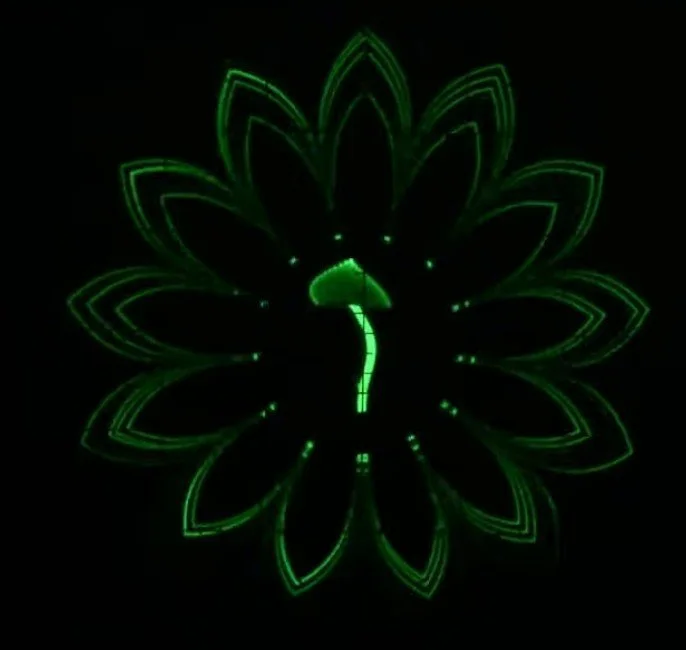
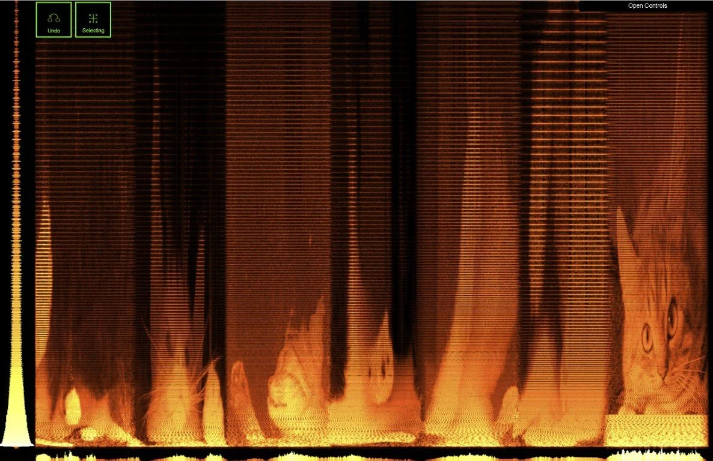
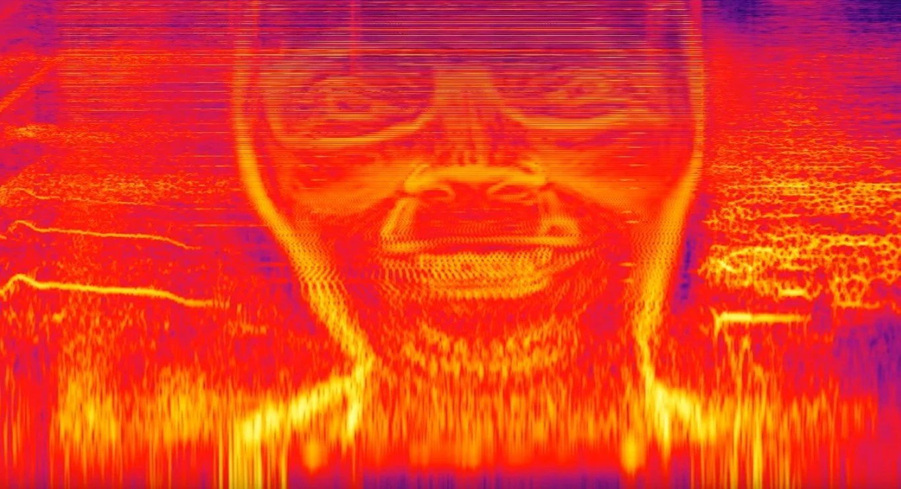
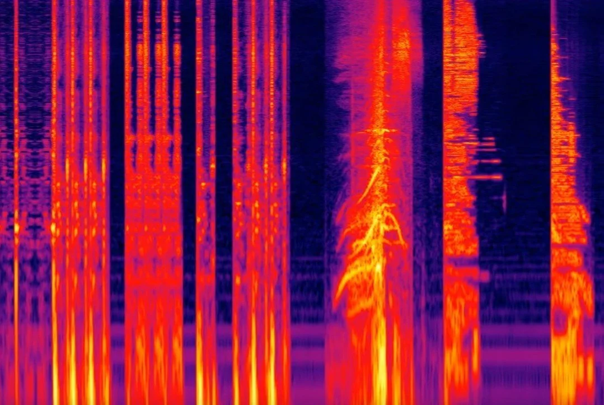
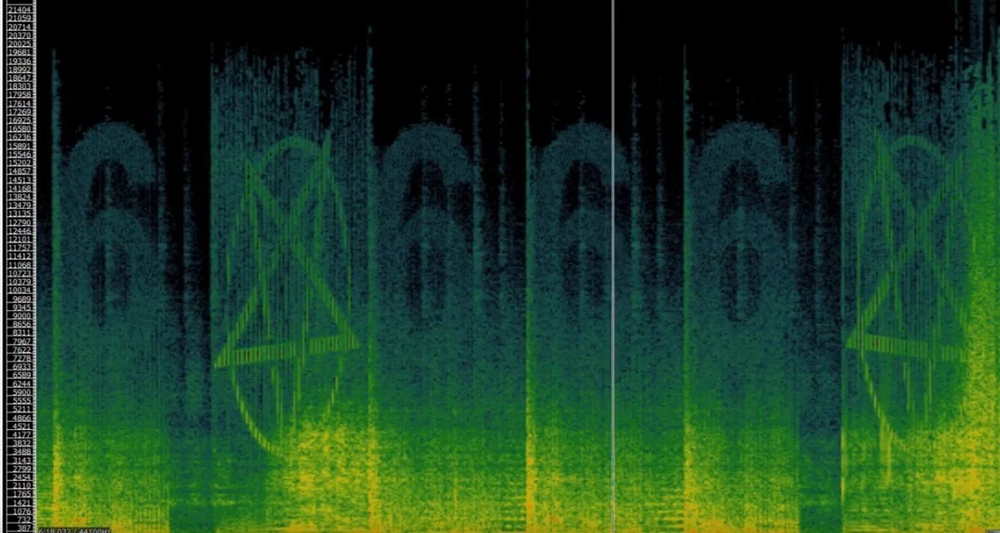
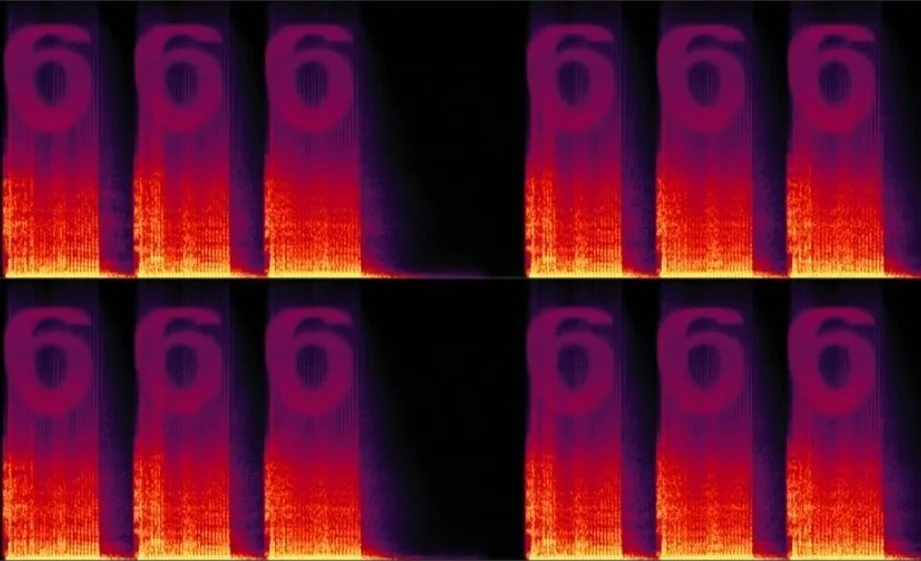
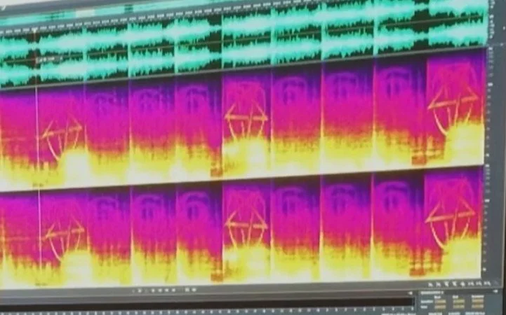

# Sound

Spectrogram imagery refers to the visual representation of a signal's frequency content over time. It is created using a mathematical technique called the Fourier transform, which decomposes a signal into its constituent frequencies. The resulting representation is a two-dimensional plot with time on the horizontal axis and frequency on the vertical axis, where the intensity or color at each point represents the strength or magnitude of the corresponding frequency component at that specific time. The following are some examples in which artists used sonification to create spectrogram imagery.

## Jerobeam Fenderson

Jerobeam Fenderson created [oscilloscope music](https://oscilloscopemusic.com/)

## Venetian Snares

This is a spectrogram of the track, [Look](https://venetiansnares.bandcamp.com/track/look) from the album, "Songs about my Cats" by Venetian Snares.

## Aphex twin

Aphex Twin’s song known as “Formula” contains multiple spectrograms encoded in the music

Aphex Twin / ΔMi−1 = −∂Σn=1NDi[n][Σj∈C{i}Fji[n − 1] + Fexti[[n−1]]

## Mick Gordon

Mick Gordon added some hidden spectrogram imagery like the number six and pentagrams in the track "CyberDemon" for the game DOOM 2016.

