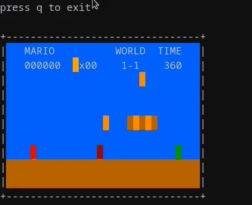

# ANSI

``` txt
▓▓▓▓▓▓▓▓▓▓▓▓▓▓▓▓▓▓▓▓▓▓▓▓▓▓▓▓▓▓▓▓▓▓▓▓▓▓▓▓▓▓▓▓▓▓▓▓▓▓▓▓▓▓▓▓▓▓▓▓▓▓▓▓▓▓▓▓▓▓▓▓▓▓▓▓▓▓▓▓
▓▓▓▓▓▓▓▓▓▓▓▓▓▓▓▓▓▓▓▓▓▓▓▓▓▓▓▓▓▓▓▓▓▓▓▓▓▓▓▓▓▓▓▓▓▓▓▓▓▓▓▓▓▓▓▓▓▓▓▓▓▓▓▓▓▓▓▓▓▓▓▓▓▓▓▓▓▓▓▓
▓▓▓▓▓▓▓▓▓▓▓▓▓▓▓▓▓▓▓▓▓▓▓▓▓▓▓▓▓▓▓▓▓▓▓▓▓▓▓░░▒▒▒▒▒▒▒▒▒▓▓▓▓▓▓▓▓▓▓▓▓▓▓▓▓▓▓▓▓▓▓▓▓▓▓▓▓▓▓
▓▓▓▓▓▓▓▓▓▓▓▓▓▓▓▓▓▓▓▓▓▓▓▓▓▓▓▓▓▓▓▓▓▓▓▓░░░░▒▒▒▒▒▒▒▒▒▒▒▒▓▓▓▓▓▓▓▓▓▓▓▓▓▓▓▓▓▓▓▓▓▓▓▓▓▓▓▓
▓▓▓▓▓▓▓▓▓▓▓▓▓▓▓▓▓▓▓▓▓▓▓▓▓▓▓▓▓▓▓▓▓▓  ░░░░▒▒▒▒▒▒▒▒▒▒▒▒▒▓▓▓▓▓▓▓▓▓▓▓▓▓▓▓▓▓▓▓▓▓▓▓▓▓▓▓
▓▓▓▓▓▓▓▓▓▓▓▓▓▓▓▓▓▓▓▓▓▓▓▓▓▓▓▓▓▓▓▓     ░░░░▒▒▒▒▒▒▒▒▒▒▒▒░▒▓▓▓▓▓▓▓▓▓▓▓▓▓▓▓▓▓▓▓▓▓▓▓▓▓
▓▓▓▓▓▓▓▓▓▓▓▓▓▓▓▓▓▓▓▓▓▓▓▓▓▓▓▓▓▓▓      ░░░▒▒▒▒▒▒▒▒▒▒▒▒▒▒░▒▒▒▓▓▓▓▓▓▓▓▓▓▓▓▓▓▓▓▓▓▓▓▓▓
▓▓▓▓▓▓▓▓▓▓▓▓▓▓▓▓▓▓▓▓▓▓▓▓▓▓▓▓▓▓      ░░░░░▒▒▒▒▒▒▒▒▒▒▒▒▒▒▒▒▒▒▓▓▓▓▓▓▓▓▓▓▓▓▓▓▓▓▓▓▓▓▓
▓▓▓▓▓▓▓▓▓▓▓▓▓▓▓▓▓▓▓▓▓▓▓▓▓▓▓▓▓▓        ░░▒▒▒▒▒▒▒▒▒▒▒▒▒░▒▒▒▒▒▒▓▓▓▓▓▓▓▓▓▓▓▓▓▓▓▓▓▓▓▓
▓▓▓▓▓▓▓▓▓▓▓▓▓▓▓▓▓▓▓▓▓▓▓▓▓▓▓▓ ░       ░░░▒▒▒▒▒▒▒▒▒▒▒▒ ░░░▒▒▒▒▒▓▒▒▒▒▓▓▓▓▓▓▓▓▓▓▓▓▓▓
▓▓▓▓▓▓▓▓▓▓▓▓▓▓▓▓▓▓▓▓▓▓▓▓▓▓   ░       ░░░▒▒▒▒▒▒▒▒▒▒▒     ░░░░░░░░░░░▒▒▒▓▓▓▓▓▓▓▓▓▓
▓▓▓▓▓▓▓▓▓▓▓▓▓▓▓▓▓░░░░░▒░░░░▒░░▒      ░░░▒▒▒▒▒▒▒▒▒░▒ ▒▒▒▒   ░░░░░░▒▒▒▒▒▒░▓▓▓▓▓▓▓▓
▓▓▓▓▓▓▓▓▓▓▓▓▓▓▓  ░░░░░▒▒░░░ ░▒▒▒   ░░░░▒▒▒▒▒▒▒░  ░▒▒▒░░░░░▒▒  ░░░▒▒▒▒▒▒▒▓▓▓▓▓▓▓▓
▓▓▓▓▓▓▓▓▓▓▓▓▓▓   ░░░░░▒▒░░ ░░░░░░░▒░░▒▒▒▒▒▒░   ▒▒░░░▒▒▒░░░▒▒▒▒░░░▒▒▒▒▒▒▒▒▓▓▓▓▓▓▓
▓▓▓▓▓▓▓▓▓▓▓▓▓    ░░░░░░▒  ░░░░░▒▒▒░░  ░░     ▒░░░░░░▒▒▒▒░▒▒▒▒▒▒ ░░▒▒▒▒▒▒░▓▓▓▓▓▓▓
▓▓▓▓▓▓▓▓▓▓ ▒▒░   ░░░░░    ░░░░░▒▒▒▒░░░░      ░░░░░░░▒▒▒▒▒░▒▒▒▒▒▒░░░▒▒▒▒▒▓▓▓▓▓▓▓▓
▓▓▓▓▓▓▓▓▓▓   ░▒▒░▒▒▒▒▒    ░░░░░▒▒▒▒▒░░░     ░░░░░░▒▒▒▒▒▒▒░░▒▒▒▒▒░ ░░░░░░▓ ▓▓▓▓▓▓
▓▓▓▓▓▓▓▓▓▓     ░░░▒▒▒░    ░░░░░▒▒▒▒▒░░░░     ▒▒▒▒▒▒▒▒▒░░░░░▒▒▒▒▒▒      ░░▒▓▓▓▓▓▓
▓▓▓▓▓▓▓▓▓▓            ░░░░▒▒▒▒▒▒▒▒░░░░ ░     ░░░▒▒▒░░░░░░   ░   ░░▒▒▒▒▒▒▒▓▓▓▓▓▓▓
▓▓▓▓▓▓▓▓▓▓                      ░░░░░░░░░░░░▒▒▒▒░░░░░░░░░▒▒▒▒▒▒▒▒▒▒▒▒▒▒▒▒▓▓▓▓▓▓▓
▓▓▓▓▓▓▓▓▓▓                       ░░░░░░░░░░░░░░░░░░░░░░░░▒▒▒▒▒▒▒▒▒▒▒▒▒▒▒▒▓▓▓▓▓▓▓
▓▓▓▓▓▓▓▓▓▓                      ░░░░░░░░░░░▒░░░░░░░░░░░░░▒▒▒▒▒▒▒▒▒▒▒▒▒▒▒▒▓▓▓▓▓▓▓
▓▓▓▓▓▓▓▓▓▓▓                     ░░░░░░░░░░░░░░░░░░░░░░░░░▒▒▒▒▒▒▒▒▒▒▒▒▒▒▒▒▓▓▓▓▓▓▓
▓▓▓▓▓▓▓▓▓▓▓                    ░░░░░░░░░░░▒░░░░░░░░░░░░░░▒▒▒▒▒▒▒▒▒▒▒▒▒▒▒▓▓▓▓▓▓▓▓
▓▓▓▓▓▓▓▓▓▓▓▓                  ░░░░░░░░░░░▒▒░░░░░░░░░░░░░▒▒▒▒▒▒▒▒▒▒▒▒▒▒▒ ▓▓▓▓▓▓▓▓
▓▓▓▓▓▓▓▓▓▓▓▓▓░               ░░░░░░░░░░░░▒░░░░░░░░░░░░░░▒▒▒▒▒▒▒▒▒▒▒▒▒▒▒▓▓▓▓▓▓▓▓▓
▓▓▓▓▓▓▓▓▓▓▓▓▓▓              ░░░░░░░░░░░░░░░░░░░░░░░░░░░▒▒▒▒▒▒▒▒▒▒▒▒▒▒▓▓▓▓▓▓▓▓▓▓▓
▓▓▓▓▓▓▓▓▓▓▓▓▓▓▓ ░          ░░░░░░░░░░░░▒░░░░░░░░░░░░░▒▒▒▒▒▒▒▒▒▒▒▒▒▒▒▓▓▓▓▓▓▓▓▓▓▓▓
▓▓▓▓▓▓▓▓▓▓▓▓▓▓▓▓▓░░░░░░░░░░░░░░░░░░░░░▒▒▒░░░░░░░░░░░▒▒▒▒▒▒▒▒▒▒▒▒▒░▓▓▓▓▓▓▓▓▓▓▓▓▓▓
▓▓▓▓▓▓▓▓▓▓▓▓▓▓▓▓▓▓▓▒░░░░░░░░░░░░░░░░░▒▒▒░░░░░░░░░░░░░░░░░░▒▒▒▒ ░ ▓▓▓▓▓▓▓▓▓▓▓▓▓▓▓
▓▓▓▓▓▓▓▓▓▓▓▓▓▓▓▓▓▓▓▓▓░░░░░░░░░░░░░░░░▒▒░░░░░░░░░░░░░░░░░░░░  ▒▓▓▓▓▓▓▓▓▓▓▓▓▓▓▓▓▓▓
▓▓▓▓▓▓▓▓▓▓▓▓▓▓▓▓▓▓▓▓▓▓▓▓░░░░░░░░░░░░▒▒░░░░░░░░░░░░░░░░░░░░▓▓▓▓▓▓▓▓▓▓▓▓▓▓▓▓▓▓▓▓▓▓
▓▓▓▓▓▓▓▓▓▓▓▓▓▓▓▓▓▓▓▓▓▓▓▓ ▓░░░░░░░░░░▒▒░░░░░░░░░░░░░░░░░░ ▓▓▓▓▓▓▓▓▓▓▓▓▓▓▓▓▓▓▓▓▓▓▓
▓▓▓▓▓▓▓▓▓▓▓▓▓▓▓▓▓▓▓▓▓▓░░░░▒▒▓▓▒▒▒░░░▒▒░░░░░░░░░░░░░░▒▒▒▒▓▓▓▓▓▓▓▓▓▓▓▓▓▓▓▓▓▓▓▓▓▓▓▓
▓▓▓▓▓▓▓▓▓▓▓▓▓▓▓▓▓▓▓ ▒▒░░░░░░░░▒▒▒▒▓▒▒▒▒▒▒▒▒▒░░▒▒▒▒▒░░░▒▒▒░▓▓▒▓▓▓▓▓▓▓▓▓▓▓▓▓▓▓▓▓▓▓
```

## Textual Paint

[Textual Paint](https://github.com/1j01/textual-paint) is MS Paint in your terminal.

## sed Super Mario

[sed Super Mario](https://github.com/chebykinn/sedmario) is the NES Super Mario Bros level 1 written in pure sed.



## Links

**Art:**

- <http://ansiart.com/>
- <http://blocktronics.org/>
- <https://www.ansilove.org/>
- <https://16colo.rs/>
- <http://www.pharcyde.org/>
- <https://www.deviantart.com/search?q=ansi%20ascii>
- <https://www.ice.org/>
- <https://defacto2.net/>
- <http://codelobe.com/>

**Tools:**

Display ANSI art and animation in the console:

Local file: ```iconv -f 437 ansi1.ans | pv --quiet --rate-limit 7000```
Online file: ```curl www.ansi-art.com/ansi/ansi1.ans | iconv -f 437 | pv --quiet --rate-limit 7000```

Terminal width should be set to 80 in case of issues.

Local Tools

- <https://github.com/ansilove/BlockZone>
- <https://github.com/ansilove/ansilove>
- <https://github.com/bengarrett/RetroTxt>
- <https://github.com/adoxa/ansicon>
- <https://github.com/peteri/Ansi-Cat>

Online Tools

- <https://glyphdrawing.club/>
