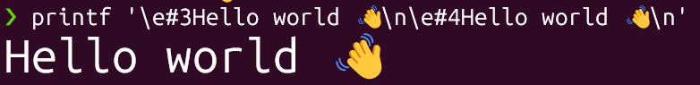
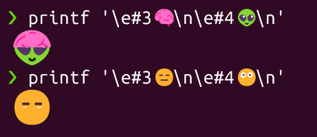

# Emoji

## Emojis in URLs

Emoji domains are made possible by browsers and TLD registries that support IDNA and emojis, while all underlying systems just use Punycode ASCII names. DNS only supports ASCII characters (letters, digits, and hyphens), so IDNA lets browsers and applications use Unicode, including emojis, by converting them into ASCII-compatible Punycode. Punycode encodes non-ASCII characters, such as emojis or accented letters, into a format that DNS can process. For example, when a user enters a domain like 🍕.ws, the browser converts it to its Punycode form (xn--vi8h.ws) before making any DNS queries. DNS servers and web hosts only see the ASCII version, so they don't need to support emojis directly.

To use emoji domains, the browser must support IDNA and display emojis, and the TLD registry must allow emoji registrations. Only a few TLDs like .ws or .to permit this; most do not. Emojis can also be used in URL paths or queries, where browsers percent-encode them as UTF-8 and web servers interpret them if they support UTF-8.

Punycode examples:

| Domain     | Punycode          |
| ---------- | ----------------- |
| 🍕.ws      | xn--vi8h.ws       |
| 😀.com     | xn--e28h.com      |
| ☕️☕️.to    | xn--jv8h3vya.to   |
| münchen.de | xn--mnchen-3ya.de |
| café.fr    | xn--caf-dma.fr    |
| 東京.jp      | xn--1lqs71d.jp    |

Who needs to support emojis in URLs?

| Who/What       | Support needed | Notes                                         |
| -------------- | -------------- | --------------------------------------------- |
| Browser        | Yes            | Converts and displays emoji, handles Punycode |
| Registrar      | Sometimes      | Must allow Unicode/emoji input, not all do    |
| TLD registry   | Yes            | Must allow emoji domains, most do not         |
| DNS hosting    | No             | Only sees Punycode                            |
| Web hosting    | No             | Uses only ASCII/Punycode domain               |
| CA             | Sometimes      | Must support IDN certificates for HTTPS       |
| ICANN          | No (usually)   | Prohibits emoji in most generic TLDs          |
| User OS/system | No (usually)   | Browser handles conversion and display        |

## DECDHL

### Examples

Using DECDHL (DEC Double-Height Line) escapes to change the "style" of the line. The result is bigger text:

```sh
printf '\e#3Hello world 👋\n\e#4Hello world 👋\n'
```



Using this technique to combine two emojis e.g.:

```sh
printf '\e#3🧠\n\e#4👽\n'
```

```sh
printf '\e#3😑\n\e#4😶\n'
```

Example Output:



### Checking DECDHL Support

[This script](_testDECDHL.sh) detects whether your terminal supports DEC double-height lines (DECDHL), and whether emoji are treated as double-width characters in your terminal. It sets three variables (EMOJI, DECDHL, DECDHL_EMOJI) that indicate what it found.

```sh
#!/usr/bin/env bash
getpos(){ r=; printf '\e[6n'>/dev/tty; read -d R r; echo "${r/*;}"; }
check_decdhl(){ [ $COLUMNS ]||{ printf '\e[10000G';COLUMNS=$(getpos);printf '\e[A';}; printf '\e[G\e[K✅'; [ $(getpos) = 3 ]&&EMOJI=1||EMOJI=0; printf '\e[G\e[2K\e#3';eval "printf ' %.0s' {1..$[1+$COLUMNS/2]}";p=$(getpos);if [ $p = 2 ];then DECDHL=1;printf '\e[M\e[F';elif [ $p = $[2+$COLUMNS/2] ];then [ "$TERM_PROGRAM" = Apple_Terminal ]&&{ DECDHL=1;DECDHL_EMOJI=1;printf '\e[M\e[G\e[2K';return; }||{ printf '\e[G\e[2Kx\e[2b🤗\e[2b'; [ $(getpos) = 6 ]&&{ DECDHL=1;DECDHL_EMOJI=1;printf '\e[M\e[G\e[2K';return; }||DECDHL=0;};else DECDHL=0;fi;printf '\e[G\e[2K\e#3';eval "printf '☑️%.0s' {1..$[1+$COLUMNS/4]}";p=$(getpos);[ $p = 3 ]&&{ DECDHL_EMOJI=1;printf '\e[M\e[F'; }||DECDHL_EMOJI=0;printf '\e[M\e[G\e[2K'; }
[ "${BASH_SOURCE[0]}" = "$0" ]&&check_decdhl&&echo "EMOJI=$EMOJI, DECDHL=$DECDHL, DECDHL_EMOJI=$DECDHL_EMOJI"
```

Result:

```sh
./_testDECDHL.sh
EMOJI=1, DECDHL=0, DECDHL_EMOJI=0
```

This output means:

- EMOJI=1: Your terminal reports emoji as double-width.
- DECDHL=0: Your terminal does not support DEC double-height lines (DECDHL).
- DECDHL_EMOJI=0: Your terminal does not support DECDHL even with emoji.
