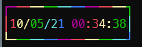
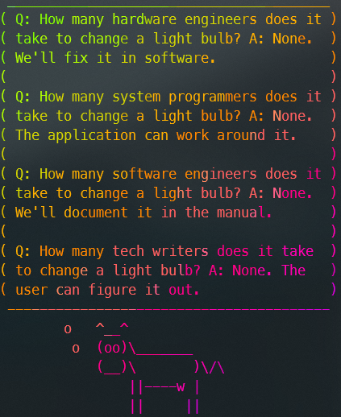
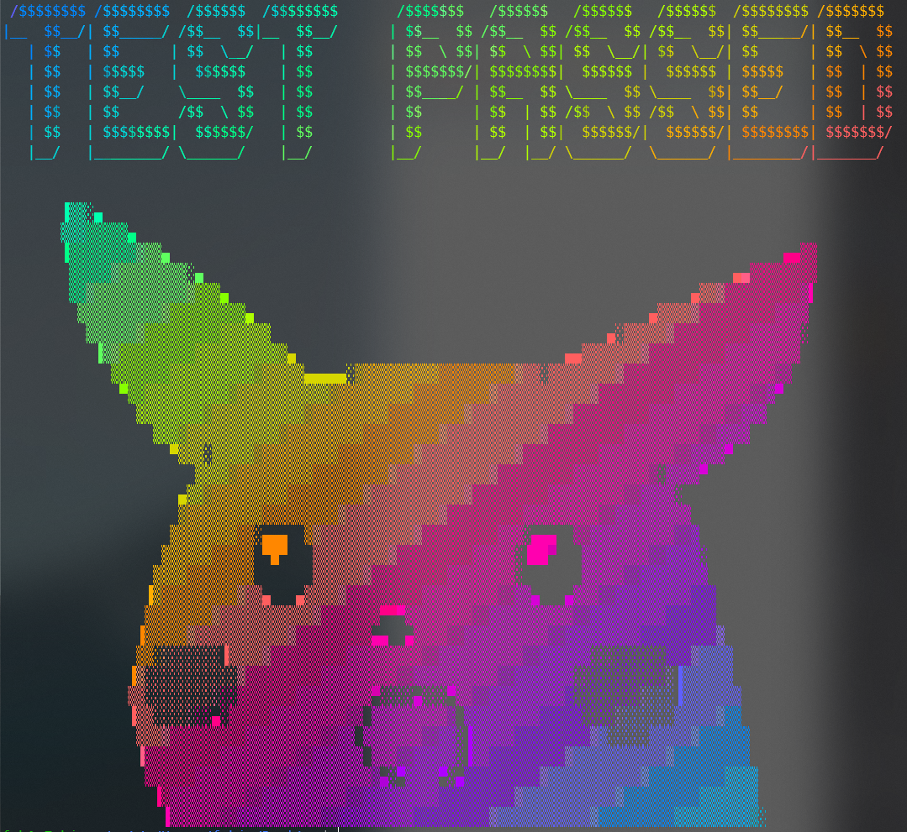

# Programs

Programs creating ASCII art.

## Nurses 2

[nurses_2](https://github.com/salt-die/nurses_2) is a widget and async-centric terminal graphics library.

## Terminal Dungeon

[terminal_dungeon](https://github.com/salt-die/terminal_dungeon) is a doom-like raycasting engine that renders to ascii for playing in terminal.

## Donut

Code in the shape of a donut creating a rotating donut :)

Source:

- Original: <https://www.a1k0n.net/2006/09/15/obfuscated-c-donut.html>
- Update 1: <https://www.a1k0n.net/2006/09/20/obfuscated-c-donut-2.html>
- Update 2: <https://www.a1k0n.net/2011/07/20/donut-math.html>
- Update 3: <https://www.a1k0n.net/2021/01/13/optimizing-donut.html>

C code:

``` c
             i,j,k,x,y,o,N;
         main(){float z[1760],a
      #define R(t,x,y) f=x;x-=t*y\
   ;y+=t*f;f=(3-x*x-y*y)/2;x*=f;y*=f;
   =0,e=1,c=1,d=0,f,g,h,G,H,A,t,D;char
 b[1760];for(;;){memset(b,32,1760);g=0,
h=1;memset(z,0,7040);for(j=0;j<90;j++){
G=0,H=1;for(i=0;i<314;i++){A=h+2,D=1/(G*
A*a+g*e+5);t=G*A        *e-g*a;x=40+30*D
*(H*A*d-t*c);y=          12+15*D*(H*A*c+
t*d);o=x+80*y;N          =8*((g*a-G*h*e)
*d-G*h*a-g*e-H*h        *c);if(22>y&&y>
 0&&x>0&&80>x&&D>z[o]){z[o]=D;b[o]=(N>0
  ?N:0)[".,-~:;=!*#$@"];}R(.02,H,G);}R(
  .07,h,g);}for(k=0;1761>k;k++)putchar
   (k%80?b[k]:10);R(.04,e,a);R(.02,d,
     c);usleep(15000);printf('\n'+(
        " donut.c! \x1b[23A"));}}
          /*no math lib needed
             .@a1k0n 2021.*/
```

??? code "javascript version"
    ``` js
    (function() {
    var _onload = function() {
      var pretag = document.getElementById('d');
      var canvastag = document.getElementById('canvasdonut');
      var tmr1 = undefined, tmr2 = undefined;
      var cA=1, sA=0, cB=0, sB=1;

      var R=function(tanangle, x, y) {
        var tmp=x;
        x -= tanangle*y;
        y += tanangle*tmp;
        tmp = (3-x*x-y*y)/2;
        x *= tmp;
        y *= tmp;
        return [x, y];
      }

      var asciiframe=function() {
        var b=[];
        var z=[];
        var xy = R(.04, cA, sA);
        cA = xy[0]; sA = xy[1];
        xy = R(.02, cB, sB);
        cB = xy[0]; sB = xy[1];
        for(var k=0;k<1760;k++) {
          b[k]=k%80 == 79 ? "\n" : " ";
          z[k]=0;
        }
        var sj = 0, cj = 1;
        for(var j = 0; j < 90; j++) {
          var si = 0, ci = 1;
          for(var i = 0; i < 314; i++) {
            var h=cj + 2,
              D=1/(si*h*sA+sj*cA+5),
              t=si*h*cA-sj*sA;

            var x=0|(40+30*D*(ci*h*cB-t*sB)),
                y=0|(12+15*D*(ci*h*sB+t*cB)),
                o=x+80*y,
                N=0|(8*((sj*sA-si*cj*cA)*cB-si*cj*sA-sj*cA-ci*cj*sB));
            if(y<22 && y>=0 && x>=0 && x<79 && D>z[o]) {
              z[o]=D;
              b[o]=".,-~:;=!*#$@"[N>0?N:0];
            }
            xy = R(.02, ci, si);
            ci = xy[0]; si = xy[1];
          }
          xy = R(.07, cj, sj);
          cj = xy[0]; sj = xy[1];
        }
        pretag.innerHTML = b.join("");
      };

      window.anim1 = function() {
        if(tmr1 === undefined) {
          tmr1 = setInterval(asciiframe, 50);
        } else {
          clearInterval(tmr1);
          tmr1 = undefined;
        }
      };

      asciiframe();
    }

    if(document.all)
      window.attachEvent('onload',_onload);
    else
      window.addEventListener("load",_onload,false);
    })();
    ```

This is how it looks like:


## Befunge

[Befunge](https://esolangs.org/wiki/Befunge) by [Chris Pressey](https://catseye.tc/article/General_Information#chris-pressey) is an esoteric programming languages. Here is a pseudo-quine which uses some Befunge-97 commands:

``` Befunge
      060p070                                                           p'O80v
    pb2*90p4$4>                                                         $4$>v>
  v4$>4$>4$>4$>#                                                        ARGH>!
 <{[BEFUNGE_97]}>                                                       FUNGE!
 ##:-:##   #####*         4$*>4$      >060p>    60g80g -!#v_  60g1+     60p60v
 #vOOGAH               **>4$>^!!eg    nufeB^    $4$4$4 $4<v#<<v-*2a::   v7-1g<
 #>70g>90g-!          #@_^Befunge!!   123456    123456 VvVv!#!>Weird!   >0ggv*
  ^$4$4p07+1g07      ,a<$4<   <$4$4<  <$4$4<    <$4$4< <<#<*-=-=-=-=-*  -=-=v*
   ::48*-#v_>,4$>    4$4$4     $4$4$  4$4$4$    4$4$4$ 4$^*!*   XXXXXX   XXX> 
     BOINK>$60g1-7  0g+d2*     %'A+,1 $1$1$1    $1$1$1 $>^<$     HAR!!!  8888 
        Befunge_is  such_a     pretty langua    ge,_is n't_i     t?_It_  8888 
           looks_so much_l     ike_li ne_noi    se_and it's_     STILL_  ‘88’ 
Turing-     Complet e!_Cam     ouflag e_your    code!! Confu     se_the       
hell_out   of_every one_re     ading_ your_co  de._Oh, AND_y     ou.:-) ,o88o.
 Once_this_thing_i   s_code   d,_rea  ding_it_back_ver ges_on   the_imp 888888
  ossible._Obfusc     ate_the_obfus    cated!_Befunge_ debuggers_are__  888888
   your_friends!       By:_Alexios     Chouchou las... X-X-X-X-X-X-X!   888888
      -=*##*=-           \*****/         9797*  -=97=- !@-*=  *****     ‘"88P’
                                                       *!@-*                  
                                                       =*!@-                  
                                                       -=*!@                  
                                                       @-=*!                  
```

And it prints out:

``` txt
      GHIJKLM                                                           UVWXYZ 
    FGHIJKLMNOP                                                         VWXYZA 
  EFGHIJKLMNOPQR                                                        WXYZAB 
 EFGHIJKLMNOPQRST                                                       XYZABC 
 FGHIJKL   PQRSTU         EFGHIJ      QRSTUV    ABCDEF HIJKL  OPQRS     YZABCD 
 GHIJKLM               CDEFGHIJKLM    RSTUVW    BCDEFG IJKLMNOPQRSTUV   ZABCDE 
 HIJKLMNOPQR          CDEFGHIJKLMNO   STUVWX    CDEFGH JKLMNOPQRSTUVW   ABCDEF 
  JKLMNOPQRSTUV      CDEFGH   LMNOPQ  TUVWXY    DEFGHI KLMNOPQRSTUVWXY  BCDEFG 
   LMNOPQRSTUVWXY    DEFGH     NOPQR  UVWXYZ    EFGHIJ LMNOPQ   UVWXYZ   DEFG  
     OPQRSTUVWXYZA  DEFGHI     OPQRST VWXYZA    FGHIJK MNOPQ     WXYZAB  EFGH  
        STUVWXYZAB  EFGHIJ     PQRSTU WXYZAB    GHIJKL NOPQR     XYZABC  FGHI  
           WXYZABCD FGHIJK     QRSTUV XYZABC    HIJKLM OPQRS     YZABCD  GHIJ  
MNOPQRS     YZABCDE GHIJKL     RSTUVW YZABCD    IJKLMN PQRST     ZABCDE        
NOPQRSTU   YZABCDEF HIJKLM     STUVWX ZABCDEF  IJKLMNO QRSTU     ABCDEF HIJKLM 
 PQRSTUVWXYZABCDEF   JKLMNO   STUVWX  ABCDEFGHIJKLMNOP RSTUVW   ABCDEFG IJKLMN 
  RSTUVWXYZABCDEF     LMNOPQRSTUVWX    CDEFGHIJKLMNOPQ STUVWXYZABCDEFG  JKLMNO 
   TUVWXYZABCDEF       NOPQRSTUVWX     DEFGHIJK MNOPQR TUVWXYZABCDEFG   KLMNOP 
      XYZABCDE           QRSTUVW         GHIJK  NOPQRS UVWXY  BCDEF     LMNOPQ 
                                                       VWXYZ                   
                                                       WXYZA                   
                                                       XYZAB                   
                                                       YZABC
```

## Image2ascii

Make own ASCII animations with [image2ascii](https://github.com/michaelkofron/image2ascii).

Requirements:

``` sh
sudo apt update
sudo apt-get install ruby-full imagemagick libmagickwand-dev
sudo gem install rmagick image2ascii rainbow
```

The expected input is .gif file. I converted a video I wanted to use from mp4 to gif using [ffmpeg](https://ffmpeg.org/).

``` sh
ffmpeg -i input.mp4 -vf "fps=12,scale=480:-1:flags=lanczos,split[s0][s1];[s0]palettegen[p];[s1][p]paletteuse" -loop 0 animation.gif
```

`run.rb` is the main script (included in the [image2ascii repo](https://github.com/michaelkofron/image2ascii/blob/main/MakingWebAnimations/run.rb). I shortend the script a little, added the option to pass an argument and use this value to create a unique json so the last one isn't overwritten.

``` rb title="run.rb"
require 'rmagick'
require 'image2ascii'
require 'json'
require 'fileutils'

def createASCII(file)
    animated = Magick::Image.read(file + ".gif")
    count = 0
    tempHash = {}
    animated.each do |x|
        x.write("./images/image#{count}.jpg")
        ascii = Image2ASCII.new("./images/image#{count}.jpg")
        ascii.chars = ascii.chars.gsub!("'", "").gsub!("<", "").gsub!(">", "")
        text = ascii.generate(hidden: true, width: 100)
        puts text
        tempHash["#{count}"] = text.gsub!("\n", "<br>")
        count = count + 1
    end

    FileUtils.rm_rf("./images/.", secure: true)

    File.open(file + ".json","w") do |f|
        f.write(tempHash.to_json)
    end
end

createASCII(ARGV[0].to_s)
```

Run ```ruby run.rb animation``` where `animation` is a gif in the same directory as `run.rb`; in this case "animation.gif".

Now we can create a web page with the animated ASCII video. The script created a file named `animation.json` containing all ASCII frames.

To display the ASCII video properly we need a monospaced font e.g. `courier.ttf`. Copy this font to the work directory and add the following HTML file:

``` html title="index.html"
<html>
<head>
    <style>
        @font-face {font-family: Courier;src: url('courier.ttf');}
        p#ascii {font-size: 6px;color:rgb(50, 255, 50); font-family: Courier; white-space: nowrap;}
        @media screen and (max-width: 750px){ p#text {font-size: 6px;}}
        html {display:table; width:100%; height:100%;}
        body {background: black;display:table-cell; text-align:center; vertical-align:middle; height:100%;}
    </style>
</head>
<body>
    <p id="ascii"></p>
    <script>
        array = []
        fetch("animation.json")
            .then(response => { return response.json(); })
            .then(json => { for (const object in json) { array.push(json[object]) } loop(array) })

        function loop(arr) {
            let count = 0
            let text = document.getElementById("ascii")
            setInterval(() => {
                text.innerHTML = arr[count]
                if (count == arr.length - 1) { count = 0 } else { count++ }
            }, 50)
        }
    </script>
</body>
</html>
```

Be sure to change `fetch("animation.json")` to the correct output file in case you named it differently.

To test this locally, run a webserver e.g. with python ```python -m http.server 8008 --bind 127.0.0.1``` to test this locally and open <http://127.0.0.1:8008/> in your browser.

## nyancat

- Link: <https://github.com/klange/nyancat>
- Install: ```git clone https://github.com/klange/nyancat && cd nyancat && make && cd src && ./nyancat```
- Host telnet server: ```nyancat -t```

Download [nyancat.json](_nyancat.json) or view below:

<script id="asciicast-23012" src="https://asciinema.org/a/23012.js" async></script>

## Steam Locomotive (sl)

- Install ```sudo apt install sl```
- Use ```sl```
- Download [sl.cast](_sl.cast) or view below:

<script id="asciicast-234381" src="https://asciinema.org/a/234381.js" async></script>

## Cowsay and Cowthink

- Install ```sudo apt install cowsay```
- Use cowsay ```cowsay 0xfab1.net```

??? output "cowsay 0xfab1.net"
    ``` txt
    ____________
    < 0xfab1.net >
    ------------
            \   ^__^
            \  (oo)\_______
                (__)\       )\/\
                    ||----w |
                    ||     ||
    ```

- Use cowthink (e.g. pipe it a fortune cookie) ```fortune | cowthink```

??? output "fortune | cowthink"
    ``` txt
    ________________________________________
    ( You will attract cultured and artistic )
    ( people to your home.                   )
    ----------------------------------------
            o   ^__^
            o  (oo)\_______
                (__)\       )\/\
                    ||----w |
                    ||     ||
    ```

A new implementation of cowsay written in go: [Neo-cowsay](https://github.com/Code-Hex/Neo-cowsay)

## Toilet

- Install ```sudo apt install toilet```
- Use Toilet ```toilet 0xfab1.net```

``` txt
  mmmm           m""         #      mmm                           m
 m"  "m m   m  mm#mm   mmm   #mmm     #           m mm    mmm   mm#mm
 #  m #  #m#     #    "   #  #" "#    #           #"  #  #"  #    #
 #    #  m#m     #    m"""#  #   #    #           #   #  #""""    #
  #mm#  m" "m    #    "mm"#  ##m#"  mm#mm    #    #   #  "#mm"    "mm
```

Another example: ```toilet -kf mono12 0xfab1.net```

``` txt
  ▄▄▄▄             ▄▄▄▄       ▄▄        ▄▄▄
 ██▀▀██           ██▀▀▀       ██       █▀██                      ██
██    ██▀██  ██▀███████▄█████▄██▄███▄    ██     ██▄████▄ ▄████▄███████
██ ██ ██  ████    ██   ▀ ▄▄▄████▀  ▀██   ██     ██▀   ████▄▄▄▄██ ██
██    ██  ▄██▄    ██  ▄██▀▀▀████    ██   ██     ██    ████▀▀▀▀▀▀ ██
 ██▄▄██  ▄█▀▀█▄   ██  ██▄▄▄██████▄▄██▀▄▄▄██▄▄▄████    ██▀██▄▄▄▄█ ██▄▄▄
  ▀▀▀▀  ▀▀▀  ▀▀▀  ▀▀   ▀▀▀▀ ▀▀▀▀ ▀▀▀  ▀▀▀▀▀▀▀▀▀▀▀▀    ▀▀  ▀▀▀▀▀   ▀▀▀▀
```

Another example with color: ```toilet -f mono12 -F metal 0xfab1```


You can also use toilet to pipe stuff e.g. this example for the current time:

``` sh
while true; do clear; echo "$(date '+%D %T' | toilet -f term -F border --gay)"; sleep 1; done
```



## Figlet

- Install ```sudo apt install figlet```
- Use Figlet ```figlet 0xfab1.net```

``` txt
  ___        __       _     _              _
 / _ \__  __/ _| __ _| |__ / |  _ __   ___| |_
| | | \ \/ / |_ / _` | '_ \| | | '_ \ / _ \ __|
| |_| |>  <|  _| (_| | |_) | |_| | | |  __/ |_
 \___//_/\_\_|  \__,_|_.__/|_(_)_| |_|\___|\__|
```

Another example: ```figlet -c -k -w 100 -f shadow 0xfab1.net```

figlet -f $font 0xfab1.net

``` txt
  _ \           _|         |    _ |                  |
 |   | \ \  /  |     _` |  __ \   |     __ \    _ \  __|
 |   |  `  <   __|  (   |  |   |  |     |   |   __/  |
\___/   _/\_\ _|   \__,_| _.__/  _| _) _|  _| \___| \__|
```

You can use any tlf-font available here ```ls /usr/share/figlet/``` and loop through all options to see what looks good e.g. as such:

``` sh
for f in /usr/share/figlet/*.tlf; do file=$(echo "${f##*/}"); font=$(echo $file| cut -d'.' -f 1); figlet -f $font 0xfab1.net; done
```

??? output "figlet with all fonts"
    ``` txt

    ░████░               ▒████             ██         ░███
    ██████               █████             ██         ████
    ▒██  ██▒              ██                ██         █▒██
    ██▒  ▒██  ███  ███  ███████    ▒████▓   ██░███▒      ██
    ██    ██   ██▒▒██   ███████    ██████▓  ███████▒     ██
    ██ ██ ██   ▒████▒     ██       █▒  ▒██  ███  ███     ██
    ██ ██ ██    ████      ██        ▒█████  ██░  ░██     ██
    ██    ██    ▒██▒      ██      ░███████  ██    ██     ██
    ██▒  ▒██    ████      ██      ██▓░  ██  ██░  ░██     ██
    ▒██  ██▒   ▒████▒     ██      ██▒  ███  ███  ███     ██        ██
    ██████    ██▒▒██     ██      ████████  ███████▒  ████████     ██
    ░████░   ███  ███    ██       ▓███░██  ██░███▒   ████████     ██


                        ██
                        ██
    ██░████    ░████▒   ███████
    ███████▓  ░██████▒  ███████
    ███  ▒██  ██▒  ▒██    ██
    ██    ██  ████████    ██
    ██    ██  ████████    ██
    ██    ██  ██          ██
    ██    ██  ███░  ▒█    ██░
    ██    ██  ░███████    █████
    ██    ██   ░█████▒    ░████


                    ▒██         █
    ▓██▓           █░          █      ███                           █
    ▒█  █▒          █           █        █                           █
    █░  ▒█ █▒ ▒█  █████  ░███░  █▓██     █           █▒██▒   ███   █████
    █    █ ░█ █░    █    █▒ ▒█  █▓ ▓█    █           █▓ ▒█  ▓▓ ▒█    █
    █  █ █  ▓█▓     █        █  █   █    █           █   █  █   █    █
    █    █  ░█░     █    ▒████  █   █    █           █   █  █████    █
    █░  ▒█  ███     █    █▒  █  █   █    █           █   █  █        █
    ▒█  █▒ ░█ █░    █    █░ ▓█  █▓ ▓█    █      █    █   █  ▓▓  █    █░
    ▓██▓  █▒ ▒█    █    ▒██▒█  █▓██   █████    █    █   █   ███▒    ▒██


    ⓪ⓧⓕⓐⓑ①⊙ⓝⓔⓣ
    ┏━┃┃ ┃┏━┛┏━┃┏━ ━┃  ┏━ ┏━┛━┏┛
    ┃┛┃ ┛ ┏━┛┏━┃┏━┃ ┃  ┃ ┃┏━┛ ┃
    ━━┛┛ ┛┛  ┛ ┛━━ ━━┛┛┛ ┛━━┛ ┛
    ╔═║║ ║╔═╝╔═║╔═ ═║  ╔═ ╔═╝═╔╝
    ║╝║ ╝ ╔═╝╔═║╔═║ ║  ║ ║╔═╝ ║
    ══╝╝ ╝╝  ╝ ╝══ ══╝╝╝ ╝══╝ ╝
    ┏━┓╻ ╻┏━╸┏━┓┏┓ ╺┓  ┏┓╻┏━╸╺┳╸
    ┃┃┃┏╋┛┣╸ ┣━┫┣┻┓ ┃  ┃┗┫┣╸  ┃
    ┗━┛╹ ╹╹  ╹ ╹┗━┛╺┻╸╹╹ ╹┗━╸ ╹
    000  X   X FFFFF   A   BBBB   1      N   N EEEEE TTTTT
    0   0  X X  F      A A  B   B 11      NN  N E       T
    0 0 0   X   FFFF  AAAAA BBBB   1      N N N EEEE    T
    0   0  X X  F     A   A B   B  1  ..  N  NN E       T
    000  X   X F     A   A BBBB  111 ..  N   N EEEEE   T


    ▄▄▄▄                 ▄▄▄▄             ▄▄          ▄▄▄
    ██▀▀██               ██▀▀▀             ██         █▀██
    ██    ██  ▀██  ██▀  ███████    ▄█████▄  ██▄███▄      ██
    ██ ██ ██    ████      ██       ▀ ▄▄▄██  ██▀  ▀██     ██
    ██    ██    ▄██▄      ██      ▄██▀▀▀██  ██    ██     ██
    ██▄▄██    ▄█▀▀█▄     ██      ██▄▄▄███  ███▄▄██▀  ▄▄▄██▄▄▄     ██
    ▀▀▀▀    ▀▀▀  ▀▀▀    ▀▀       ▀▀▀▀ ▀▀  ▀▀ ▀▀▀    ▀▀▀▀▀▀▀▀     ▀▀


                        ██
    ██▄████▄   ▄████▄   ███████
    ██▀   ██  ██▄▄▄▄██    ██
    ██    ██  ██▀▀▀▀▀▀    ██
    ██    ██  ▀██▄▄▄▄█    ██▄▄▄
    ▀▀    ▀▀    ▀▀▀▀▀      ▀▀▀▀

    ▄▄▄▄           ▄▀▀         █      ▄▄▄                           ▄
    ▄▀  ▀▄ ▄   ▄  ▄▄█▄▄   ▄▄▄   █▄▄▄     █           ▄ ▄▄    ▄▄▄   ▄▄█▄▄
    █  ▄ █  █▄█     █    ▀   █  █▀ ▀█    █           █▀  █  █▀  █    █
    █    █  ▄█▄     █    ▄▀▀▀█  █   █    █           █   █  █▀▀▀▀    █
    █▄▄█  ▄▀ ▀▄    █    ▀▄▄▀█  ██▄█▀  ▄▄█▄▄    █    █   █  ▀█▄▄▀    ▀▄▄


    ░▄▀▄░█░█░█▀▀░█▀█░█▀▄░▀█░░░░░█▀█░█▀▀░▀█▀
    ░█/█░▄▀▄░█▀▀░█▀█░█▀▄░░█░░░░░█░█░█▀▀░░█░
    ░░▀░░▀░▀░▀░░░▀░▀░▀▀░░▀▀▀░▀░░▀░▀░▀▀▀░░▀░

    .m,        mm      .,    .m
    W"W       ]P"      ][    PW                  ][
    ][ ]['W W`]WWW  dWW,]bWb   W       ]bWW, dWb ]WWW
    ][W][ ]W[  ][   `md[]P T[  W       ]P ][]bmd[ ][
    ][ ][ .W,  ][  .W"T[][ ][  W       ][ ][]P""` ][
    WmW  d"b  ][  ]bmW[]WmW`.mWm,  W  ][ ]['Wmm[ ]bm
    '"` '" "` '`   ""'`'`"` '"""`  "  '` '` '""   ""


    mm      ."     ]   .m               .
    .`',. . .dm  m, ]m,  ]      ..,  m, .dm
    ] ,[ b[  ]  ' ] ]`T  ]      ]`] ]`]  ]
    ]  [ d,  ]  ."T ] ]  ]      ] ] ]""  ]
    bd .`\  ]  'mT ]bP .dm  ]  ] ] 'b/  'm


    ▞▀▖   ▗▀▖   ▌ ▗▌         ▐
    ▌▞▌▚▗▘▐  ▝▀▖▛▀▖▌   ▛▀▖▞▀▖▜▀
    ▛ ▌▗▚ ▜▀ ▞▀▌▌ ▌▌ ▗▖▌ ▌▛▀ ▐ ▖
    ▝▀ ▘ ▘▐  ▝▀▘▀▀▝▀ ▝▘▘ ▘▝▀▘ ▀
    ⣎⣵ ⡀⢀ ⣰⡁ ⢀⣀ ⣇⡀ ⢺    ⣀⡀ ⢀⡀ ⣰⡀
    ⠫⠜ ⠜⠣ ⢸  ⠣⠼ ⠧⠜ ⠼⠄ ⠶ ⠇⠸ ⠣⠭ ⠘⠤

    ▗▄▖        ▄▄      ▗▖    ▗▄
    █▀█       ▐▛▀      ▐▌    ▛█                  ▐▌
    ▐▌ ▐▌▝█ █▘▐███  ▟██▖▐▙█▙   █       ▐▙██▖ ▟█▙ ▐███
    ▐▌█▐▌ ▐█▌  ▐▌   ▘▄▟▌▐▛ ▜▌  █       ▐▛ ▐▌▐▙▄▟▌ ▐▌
    ▐▌ ▐▌ ▗█▖  ▐▌  ▗█▀▜▌▐▌ ▐▌  █       ▐▌ ▐▌▐▛▀▀▘ ▐▌
    █▄█  ▟▀▙  ▐▌  ▐▙▄█▌▐█▄█▘▗▄█▄▖  █  ▐▌ ▐▌▝█▄▄▌ ▐▙▄
    ▝▀▘ ▝▀ ▀▘ ▝▘   ▀▀▝▘▝▘▀▘ ▝▀▀▀▘  ▀  ▝▘ ▝▘ ▝▀▀   ▀▀

    ▄▄      ▗▀     ▐   ▗▄               ▗
    ▗▘▝▖▗ ▗ ▗▟▄  ▄▖ ▐▄▖  ▐      ▗▗▖  ▄▖ ▗▟▄
    ▐ ▖▌ ▙▌  ▐  ▝ ▐ ▐▘▜  ▐      ▐▘▐ ▐▘▐  ▐
    ▐  ▌ ▟▖  ▐  ▗▀▜ ▐ ▐  ▐      ▐ ▐ ▐▀▀  ▐
    ▙▟ ▗▘▚  ▐  ▝▄▜ ▐▙▛ ▗▟▄  ▐  ▐ ▐ ▝▙▞  ▝▄

    ０ｘｆａｂ１．ｎｅｔ
    ```

## cmatrix

- Install ```sudo apt install cmatrix```
- Use cmatrix ```cmatrix```

## a Fire

- Install ```sudo apt install libaa-bin```
- Use aafire ```aafire```

## BB

- Install ```sudo apt install bb```
- Use BB ```bb```

Watch this video to see what it does without running it: <https://www.youtube.com/watch?v=9ukhOAUseKY>

## lolcat

To make any of the ASCII output more colorful use lolcat. Note: doesn't work with animations e.g. ```aafire | lolcat```

- Link: <https://github.com/busyloop/lolcat>
- Install: ```sudo apt install lolcat```
- Use lolcat: ```fortune | cowthink | lolcat```



Another cool idea is to use this fo successful tests or builds e.g.:

- Store ASCII art ([pikachu.tp](_pikachu.tp)) in a folder (~/important/)
- Set alias: ```alias success-message='if [ "$?" -eq "0" ]; then lolcat ~/important/pikachu.tp -a -s 40 -d 2; fi;'```
- Usage: ```do_tests && success-message```



## asciimatics

[Asciimatics](https://github.com/peterbrittain/asciimatics) is a package to help people create full-screen text UIs on any platform. It comes with some very cool samples!

- Install: ```pip install asciimatics``` (Note: depending on the sample/demo there are more dependencies)
- Documentation: <https://asciimatics.readthedocs.io>
- Samples: <https://github.com/peterbrittain/asciimatics/tree/master/samples>

## asciiquarium

To run asciiquarium you need Term-Animation and Perl.

First install Perl:

``` sh
sudo apt-get install libcurses-perl
```

Download and install [Term-Animation](_term-animation-2.6.tar.gz) to /tmp

``` sh
cd /tmp
wget https://cpan.metacpan.org/authors/id/K/KB/KBAUCOM/Term-Animation-2.6.tar.gz
tar -zxvf Term-Animation-2.6.tar.gz
cd Term-Animation-2.6/
perl Makefile.PL && make && make test
sudo make install
```

Download [asciiquarium](_asciiquarium.tar.gz) to /tmp

``` sh
cd /tmp
wget https://robobunny.com/projects/asciiquarium/asciiquarium.tar.gz
tar -zxvf asciiquarium.tar.gz
cd asciiquarium_1.1/
sudo cp asciiquarium /usr/local/bin
sudo chmod 0755 /usr/local/bin/asciiquarium
```

Run asciiquarium

``` sh
perl /usr/local/bin/asciiquarium
```

[](_asciiquarium.mkv)

## taoup

Ruby-powered ANSI colored fortunes

- Source: <https://github.com/globalcitizen/taoup>

## ART

ART is a Python lib for text converting to ASCII art fancy.

- Source: <https://github.com/sepandhaghighi/art>
- Docs: <https://www.4r7.ir/>
- Install: ```pip install art```

Example `art-example.py`

``` py
from art import *
Art=text2art("0xfab1",font='block',chr_ignore=True)
print(Art)
```

??? output "art-example.py"
    ```
    .----------------.  .----------------.  .----------------.  .----------------.  .----------------.  .----------------.
    | .--------------. || .--------------. || .--------------. || .--------------. || .--------------. || .--------------. |
    | |     ____     | || |  ____  ____  | || |  _________   | || |      __      | || |   ______     | || |     __       | |
    | |   .'    '.   | || | |_  _||_  _| | || | |_   ___  |  | || |     /  \     | || |  |_   _ \    | || |    /  |      | |
    | |  |  .--.  |  | || |   \ \  / /   | || |   | |_  \_|  | || |    / /\ \    | || |    | |_) |   | || |    `| |      | |
    | |  | |    | |  | || |    > `' <    | || |   |  _|      | || |   / ____ \   | || |    |  __'.   | || |     | |      | |
    | |  |  `--'  |  | || |  _/ /'`\ \_  | || |  _| |_       | || | _/ /    \ \_ | || |   _| |__) |  | || |    _| |_     | |
    | |   '.____.'   | || | |____||____| | || | |_____|      | || ||____|  |____|| || |  |_______/   | || |   |_____|    | |
    | |              | || |              | || |              | || |              | || |              | || |              | |
    | '--------------' || '--------------' || '--------------' || '--------------' || '--------------' || '--------------' |
    '----------------'  '----------------'  '----------------'  '----------------'  '----------------'  '----------------'
    ```

Example `art-random-example.py`

``` py
from art import *
for lp in range(100):
    print(randart() + "\n")
```

Don't forget to use lolcat to run this :)

``` sh
python3 art-random-example.py | lolcat
```

??? output "art-example.py"
    ```
    '-=,o

    >:)

    /V\

    |-o-| (-o-) |-o-|

    @}~}~~~

    :o + :p = 69

    < )))) ><

    (o'3'o)

    ^.--.^

    (  . Y .  )

    ><>

    [($)]

    (_!_)

    .,.,\______/,..,.,

    B-)

    --------{---(@

    < )))) ><

    [{-_-}] ZZZzz zz z...

    @(o),(o)

    (-(-_-(-_(-_(-_-)_-)-_-)_-)_-)-)

    c[_]

    ^.--.^

    (O.O)

    @__

    @__

    (///_ ;)

    (:)

    :-/

    :-I

    ^i^

    [^_^]

    (///_ ;)

    \*/

    Y_Y

    ><>

    l_D

    :-P~~~

    =:-)

    [|^^^^^^^

    o==[]::::::::::::::::>

    <-|-'_'-|->

    ~(^-^)~

    ,/\,/\,/\,/\,/\,/\,o

    @( * O * )@

    :-"

    8====D

    (. )( .)

    V(-.o)V

    ::)

    ~~~~~~\o/~~~~~/\~~~~~

    =:-)

    =:-(

    <^__)~

    8======D

    (-.-)Zzz...

    >>-;;;------;;-->

    \m/_(>_<)_\m/

    t(-_-t)

    d(-_-)b

    ===========(8888)

    >:-D

    \,,/(^_^)\,,/

    -_-

    O.o

    -_-

    O=('-'Q)

    (<>..<>)

    ::)

    (U) [^_^] (U)

    [|^^^^^^^

    (O.O)

    q:o)

    (===||:::::::::::::::>

    [^_^]

    ><>

    @}~}~~~

    O.o

    (__!__)

    <-|-'_'-|->

    <3

    :o + :p = 69

    \m/_(>_<)_\m/

    <(''<)  <( ' ' )>  (> '')>

    l_D

    <^__)~

    O==I======>

    @-}--

    V(-.o)V

    (| - _ - |)

    ^O^

    -_-

    /W\

    (===||:::::::::::::::>

    8=D

    Y_Y

    ^_^

    @(o),(o)

    (-.-)Zzz...

    ---=======[}

    .,.,\______/,..,.,
    ```
