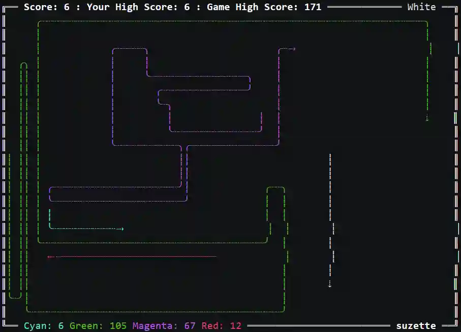
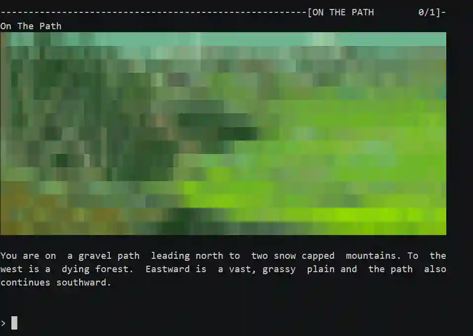

# SSH

SSH ASCII Art

## Tron

- Link: <http://sshtron.zachlatta.com>
- Play: ```ssh sshtron.zachlatta.com```
- Choose a color (e.g. red): ```ssh red@sshtron.zachlatta.com```
- Download [tron.json](_tron.json), get the [source](https://github.com/zachlatta/sshtron), or view below:

Tron Example:



## Magnetic Scrolls

- Link: <https://magneticscrolls.net/>
- Play: ```ssh -p 8080 -l magnetic magneticscrolls.net```

Magnetic Scrolls Example:


