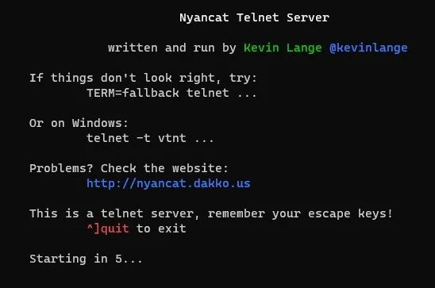

# Telnet

## mapscii

- Link: [mapscii.me](https://github.com/rastapasta/mapscii)
- Use: ```telnet mapscii.me```
- Download: https://github.com/rastapasta/mapscii/releases

## Star Wars

- Link: http://www.asciimation.co.nz/ (Service no longer available)
- Use: ```telnet towel.blinkenlights.nl```
- Download [nyancat.cast](_nyancat.cast) or view below:

<script id="asciicast-8" src="https://asciinema.org/a/8.js" async></script>

## Nyan Cat

- Install nyan cat```sudo apt install nyancat``` ([source](https://github.com/klange/nyancat)) or```sudo pip install nyancat``` ([source](https://github.com/taizilongxu/nyancat))
- Get [nyancat.cast](_nyancat.cast) or view below:

<script id="asciicast-3" src="https://asciinema.org/a/3.js" async></script>



