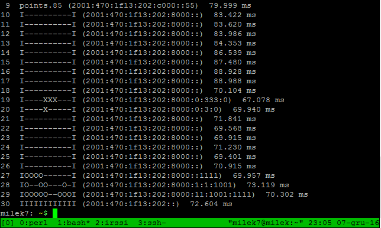
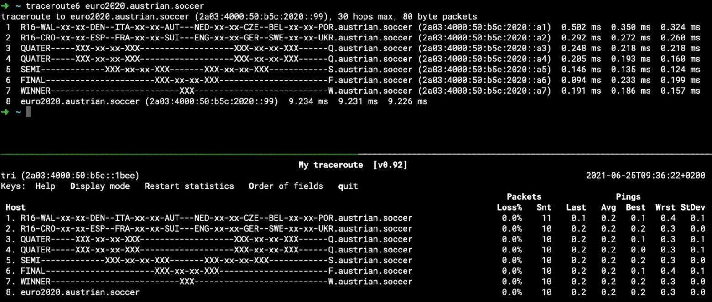
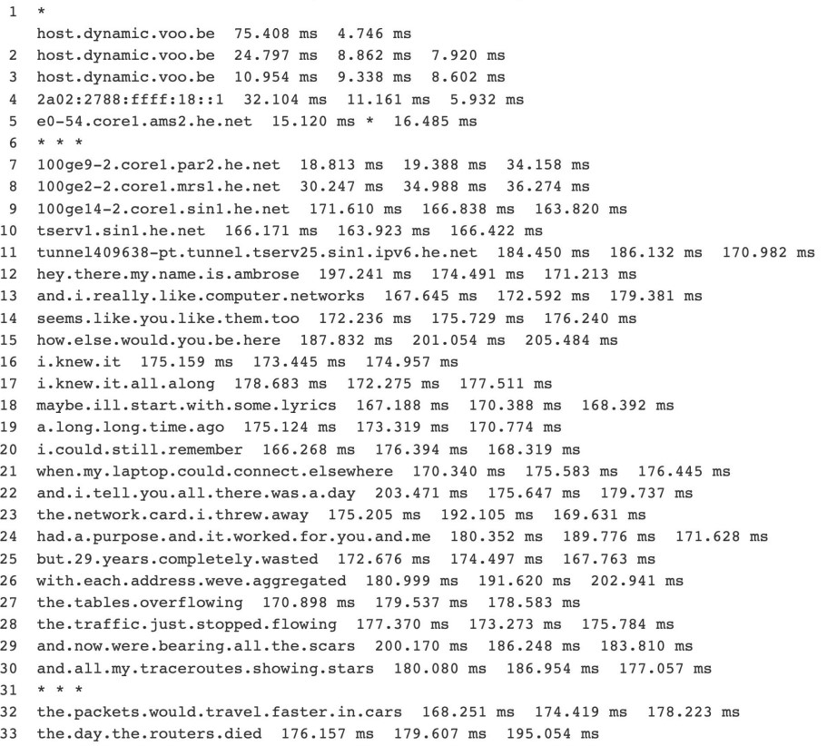

# Tracert

## Tools

Online tools for IPv6 tracert:

- <http://www.berkom.blazing.de/tools/traceroute.cgi>
- <https://network-tools.com/>
- <http://www.traceroute6.net/>
- <http://ipv6.my-addr.com/ipv6-traceroute.php>

Tools to create your own tracert art:

- <https://github.com/blechschmidt/fakeroute>
- <https://github.com/antifork/hopfake>
- <https://github.com/sehaas/fakert>

## Tetris

Link: trh.milek7.pl (Service no longer available)
Use: ```traceroute -I -m 60 -q 1 trh.milek7.pl```

Output:



## Star Wars

- Old link: beaglenetworks.net/post/42707829171/star-wars-traceroute
- Use: ```traceroute -m 100 216.81.59.173 | awk '{print $2}'```

Output:

``` txt
*
Episode.IV
A.NEW.HOPE
It.is.a.period.of.civil.war
Rebel.spaceships
striking.from.a.hidden.base
have.won.their.first.victory
against.the.evil.Galactic.Empire
During.the.battle
Rebel.spies.managed
to.steal.secret.plans
to.the.Empires.ultimate.weapon
the.DEATH.STAR
an.armored.space.station
with.enough.power.to
destroy.an.entire.planet
Pursued.by.the.Empires
sinister.agents
Princess.Leia.races.home
aboard.her.starship
custodian.of.the.stolen.plans
that.can.save.her
people.and.restore
freedom.to.the.galaxy
0-------------------0
0------------------0
0-----------------0
0----------------0
0---------------0
0--------------0
0-------------0
0------------0
0-----------0
0----------0
0---------0
0--------0
0-------0
0------0
0-----0
0----0
0---0
0--0
0-0
00
I
By.Ryan.Werber
When.CCIEs.Get.Bored
CCIE.38168
FIN
```

## Star Trek

- Link: tng.prolixium.com
- Use: ```traceroute6 -m 120 tng.prolixium.com```

Output:

``` txt
traceroute to tng.prolixium.com (2001:48c8:1:137::32), 120 hops max, 24 byte packets
v6-seattle-ix.voxel.net (2001:504:16::745f)  209.28 ms  207.781 ms  207.18 ms
3890.te6-2.tsr1.lga3.us.voxel.net (2001:48c8::8c9)  277.482 ms  279.604 ms  277.079 ms
0.ae1.tsr1.lga5.us.voxel.net (2001:48c8::822)  282.205 ms  286.997 ms  276.887 ms
0.ae2.csr2.lga6.us.voxel.net (2001:48c8::82e)  280.187 ms  284.989 ms  277.817 ms
em0.dax.prolixium.net (2001:48c8:1:2::2)  277.495 ms  277.68 ms  277.61 ms
si3.starfire.prolixium.net (2001:48c8:1:1ff::1a)  311.417 ms  305.949 ms  305.109 ms
0.re0.ra.prolixium.net (2001:48c8:1:119::2)  307.72 ms  305.633 ms  305.915 ms
0.fx0.voyager.prolixium.net (2001:48c8:1:11f::2)  304.583 ms  303.806 ms  304.216 ms
. (2001:48c8:1:137::2)  307.199 ms  303.983 ms  303.874 ms
Space (2001:48c8:1:137::6)  310.575 ms  308.043 ms  307.941 ms
the.Final.Frontier (2001:48c8:1:137::a)  307.198 ms  304.489 ms  305.967 ms
These.are.the.voyages.of.the.starship (2001:48c8:1:137::e)  306.484 ms  308.383 ms  308.094 ms
Enterprise (2001:48c8:1:137::12)  305.924 ms  305.817 ms  307.77 ms
Its.continuing.mission (2001:48c8:1:137::16)  308.692 ms  316.396 ms  306 ms
to.explore.strange.new.worlds (2001:48c8:1:137::1a)  306.123 ms  307.447 ms  312.365 ms
to.seek.out.new.life.forms (2001:48c8:1:137::1e)  308.785 ms  309.842 ms  308.362 ms
and.new.civilizations (2001:48c8:1:137::22)  309.347 ms  315.072 ms  307.912 ms
to.boldly.go (2001:48c8:1:137::26)  309.336 ms  306.98 ms  309.354 ms
where.no.one.has.gone.before (2001:48c8:1:137::2a)  308.284 ms  311.138 ms  310.111 ms
. (2001:48c8:1:137::2e)  310.227 ms  309.217 ms  309.752 ms
EOF (2001:48c8:1:137::32)  309.623 ms  311.074 ms  313.958 ms
```

## traceroute hand

- Link: hand.bb0.nl
- Use: ```traceroute -6 -m 50 hand.bb0.nl```

Output:

``` txt
traceroute to hand.bb0.nl (2a0e:fd45:2a0a:2::cafe), 50 hops max, 80 byte packets
    7  MYLOC-MANAG.ear3.Amsterdam1.Level3.net (2001:1900:5:2:2:0:8:780a)  253.218 ms  251.177 ms  251.017 ms
    8  2a00:a7c0:e20a:20::1 (2a00:a7c0:e20a:20::1)  250.961 ms  250.912 ms  250.870 ms
    9  2a0e:fd40:1337:1::2 (2a0e:fd40:1337:1::2)  250.759 ms  250.615 ms  250.390 ms
10  speed-ix.bakker-it.eu (2001:7f8:b7::a504:4103:1)  260.648 ms  260.656 ms  256.790 ms
11  core.dro.bb.enpls.org (2a0e:fd40:1:114::1)  243.415 ms  243.390 ms  242.867 ms
12  e19-vlan1-up6.vm2.dro.bb0.nl (2a0e:fd45:2a0a:b::a)  266.776 ms  291.814 ms  291.755 ms
13  ____________36936936936936936__________________ (2a0e:fd45:2a0a:2::ca01)  291.833 ms  291.741 ms  291.643 ms
14  ____________36936936936936936__________________ (2a0e:fd45:2a0a:2::ca02)  266.123 ms  256.651 ms  249.852 ms
15  ____________369369369369369369_________________ (2a0e:fd45:2a0a:2::ca03)  261.516 ms  261.339 ms  258.174 ms
16  ___________36936936936936933693________________ (2a0e:fd45:2a0a:2::ca04)  241.054 ms  243.898 ms  243.724 ms
17  __________3693693693693693693693_______________ (2a0e:fd45:2a0a:2::ca05)  269.403 ms  254.471 ms  261.275 ms
18  _________369369369369369369369369______________ (2a0e:fd45:2a0a:2::ca06)  244.441 ms  244.373 ms  244.325 ms
19  _________3693693693693693693693699_____________ (2a0e:fd45:2a0a:2::ca07)  263.220 ms  251.262 ms  251.193 ms
20  ________3693693693693693693693699369___________ (2a0e:fd45:2a0a:2::ca08)  283.519 ms  273.903 ms  262.867 ms
21  _______36936939693693693693693693693693________ (2a0e:fd45:2a0a:2::ca09)  262.790 ms  258.498 ms  258.254 ms
22  _____3693693693693693693693693693693636936_____ (2a0e:fd45:2a0a:2::ca0a)  260.935 ms  260.744 ms  261.780 ms
23  ___36936936936936936936936936936___369369369___ (2a0e:fd45:2a0a:2::ca0b)  254.720 ms  257.055 ms  249.360 ms
24  __36936___369336936369369369369________36936___ (2a0e:fd45:2a0a:2::ca0c)  249.210 ms  244.177 ms  244.089 ms
25  _36936___36936_369369336936936_________________ (2a0e:fd45:2a0a:2::ca0d)  238.127 ms  238.067 ms  238.331 ms
26  36933___36936__36936___3693636_________________ (2a0e:fd45:2a0a:2::ca0e)  259.337 ms  256.708 ms  256.546 ms
27  693____36936__36936_____369363_________________ (2a0e:fd45:2a0a:2::ca0f)  245.896 ms  245.831 ms  247.166 ms
28  ______36936__36936______369369_________________ (2a0e:fd45:2a0a:2::ca10)  252.041 ms  252.006 ms  250.902 ms
29  _____36936___36936_______36936_________________ (2a0e:fd45:2a0a:2::ca11)  259.269 ms  259.277 ms  259.244 ms
30  _____36936___36936________36936________________ (2a0e:fd45:2a0a:2::ca12)  255.846 ms  255.080 ms  254.934 ms
31  _____36936___36936_________36936_______________ (2a0e:fd45:2a0a:2::ca13)  264.530 ms *  264.507 ms
32  ______369____36936__________369________________ (2a0e:fd45:2a0a:2::ca14)  255.705 ms  283.080 ms  282.870 ms
33  ______________369______________________________ (2a0e:fd45:2a0a:2::ca15)  257.068 ms  248.604 ms  255.563 ms
34  _______________6_______________________________ (2a0e:fd45:2a0a:2::ca16)  255.445 ms  251.531 ms  250.614 ms
35  _______________________________________________ (2a0e:fd45:2a0a:2::ca17)  249.952 ms  240.459 ms  240.802 ms
36  ___00000000000000000000000000000000000000000___ (2a0e:fd45:2a0a:2::ca18)  243.548 ms  242.710 ms  242.676 ms
37  ___0________the_traceroute_hand_is_________0___ (2a0e:fd45:2a0a:2::ca19)  260.059 ms  260.027 ms  253.016 ms
38  ___0__________stealing_your_data___________0___ (2a0e:fd45:2a0a:2::ca1a)  252.847 ms  255.637 ms  258.055 ms
39  ___0_______________________________________0___ (2a0e:fd45:2a0a:2::ca1b)  241.792 ms  241.658 ms  241.624 ms
40  ___00000000000000000000000000000000000000000___ (2a0e:fd45:2a0a:2::ca1c)  237.356 ms  238.580 ms  238.545 ms
41  _______________________________________________ (2a0e:fd45:2a0a:2::ca1d)  247.027 ms  247.011 ms  246.979 ms
42  ______________________________________enpls.org (2a0e:fd45:2a0a:2::ca1e)  258.079 ms  254.880 ms  256.042 ms
43  _______________________________________________ (2a0e:fd45:2a0a:2::ca1f)  256.001 ms  266.648 ms  257.876 ms
44  _______________________________________________ (2a0e:fd45:2a0a:2::ca20)  239.803 ms  241.085 ms  241.019 ms
45  _______________________________________________ (2a0e:fd45:2a0a:2::ca21)  278.180 ms  278.103 ms  278.055 ms
46  * _______________________________________________ (2a0e:fd45:2a0a:2::ca22)  247.076 ms  247.464 ms
47  ____________well_this_is_the_end.______________ (2a0e:fd45:2a0a:2::ca23)  247.424 ms *  244.341 ms
48  _______you_can_stop_your_traceroute_here_______ (2a0e:fd45:2a0a:2::ca24)  248.702 ms  246.836 ms  248.054 ms
49  * _______________________________________________ (2a0e:fd45:2a0a:2::ca25)  256.373 ms  255.375 ms
50  _______________________________________________ (2a0e:fd45:2a0a:2::ca26)  245.333 ms  245.198 ms  245.186 ms
```

## bad horse

- Link: bad.horse
- Use: ```traceroute bad.horse```

Output:

``` txt
13 bad.horse (162.252.205.130) 163.913 ms 163.985 ms 164.169 ms
14 bad.horse (162.252.205.131) 166.228 ms 169.604 ms 168.837 ms
15 bad.horse (162.252.205.132) 172.249 ms 174.163 ms 172.610 ms
16 bad.horse (162.252.205.133) 179.319 ms 179.022 ms 177.816 ms
17 he.rides.across.the.nation (162.252.205.134) 185.482 ms 185.484 ms 185.454 ms
18 the.thoroughbred.of.sin (162.252.205.135) 191.354 ms 191.344 ms 191.326 ms
19 he.got.the.application (162.252.205.136) 197.463 ms 197.449 ms 197.421 ms
20 that.you.just.sent.in (162.252.205.137) 203.248 ms 203.233 ms 203.213 ms
21 it.needs.evaluation (162.252.205.138) 211.255 ms 211.224 ms 211.161 ms
22 so.let.the.games.begin (162.252.205.139) 209.954 ms 207.521 ms 209.956 ms
23 a.heinous.crime (162.252.205.140) 215.252 ms 215.207 ms 215.197 ms
24 a.show.of.force (162.252.205.141) 221.786 ms 221.764 ms 221.738 ms
25 a.murder.would.be.nice.of.course (162.252.205.142) 226.529 ms 226.508 ms 226.482 ms
26 bad.horse (162.252.205.143) 232.953 ms 232.928 ms 232.903 ms
27 bad.horse (162.252.205.144) 239.622 ms 233.570 ms 233.537 ms
28 bad.horse (162.252.205.145) 238.506 ms 238.428 ms 238.412 ms
29 he-s.bad (162.252.205.146) 245.090 ms 244.405 ms 244.384 ms
30 the.evil.league.of.evil (162.252.205.147) 250.136 ms 250.135 ms 250.126 ms
33 the.evil.league.of.evil (162.252.205.147) 98.387 ms 101.924 ms 98.823 ms
34 is.watching.so.beware (162.252.205.148) 108.986 ms 107.006 ms 109.290 ms
35 the.grade.that.you.receive (162.252.205.149) 110.415 ms 111.538 ms 111.534 ms
36 will.be.your.last.we.swear (162.252.205.150) 116.764 ms 121.798 ms 119.857 ms
37 so.make.the.bad.horse.gleeful (162.252.205.151) 146.249 ms 119.684 ms 122.069 ms
38 or.he-ll.make.you.his.mare (162.252.205.152) 127.184 ms 123.016 ms 123.638 ms
39 o_o (162.252.205.153) 135.653 ms 133.474 ms 133.790 ms
40 you-re.saddled.up (162.252.205.154) 138.263 ms 137.055 ms 134.297 ms
41 there-s.no.recourse (162.252.205.155) 138.434 ms 139.004 ms 137.495 ms
42 it-s.hi-ho.silver (162.252.205.156) 150.319 ms 145.497 ms 149.632 ms
43 signed.bad.horse (162.252.205.157) 147.734 ms 151.973 ms 167.310 ms
```

## Soccer Scores

- Link: <https://austrian.soccer/>
- Use: ```traceroute6 euro2020.austrian.soccer```

Output:



## XMAS

- Link: <https://xmas.futile.net>
- Use: ```traceroute -Mil -m128 xmas.futile.net```

``` txt
traceroute to xmas.futile.net (77.75.106.106), 128 hops max, 52 byte packets                               
11  xoxoxoxoxoxo.ho.ho.ho.xoxoxoxoxoxo (93.89.84.75)  28.217 ms  26.863 ms  29.068 ms                      
12  ooooxooooooxooo.v.ooooooxooooxoooo (82.133.91.37)  32.520 ms  85.029 ms  84.417 ms                     
13  ooxoooooxooooo.mmm.ooooooooxxoooxo (82.133.91.18)  28.508 ms  29.413 ms  159.747 ms                    
14  oooxoooooxooo.eeeee.oooxoooooxoooo (82.133.91.63)  30.813 ms  27.738 ms  28.727 ms                     
15  ooooxooxooox.rrrrrrr.ooooooxooooox (82.133.91.56)  98.966 ms  26.433 ms  26.304 ms                     
16  oxooooooxoo.rrrrrrrrr.oooxooooooxo (82.133.91.55)  25.990 ms  25.856 ms  175.046 ms                    
17  xoooxooooo.yyyyyyyyyyy.oooxooooxoo (82.133.91.58)  35.091 ms  28.833 ms  27.252 ms                     
18  ooxoooooxooooo.ccc.ooooooooxoooxoo (82.133.91.96)  33.924 ms  27.624 ms  28.044 ms                     
19  oooooxooo.hhhhhhhhhhhhh.oxoooxoooo (82.133.91.23)  26.037 ms  27.727 ms  27.233 ms                     
20  ooxooxoo.rrrrrrrrrrrrrrr.ooxoooxoo (82.133.91.49)  27.114 ms  26.809 ms  27.727 ms                     
21  oxoooxo.iiiiiiiiiiiiiiiii.oooxooxo (82.133.91.60)  27.393 ms  79.425 ms  35.691 ms                     
22  oooxoo.sssssssssssssssssss.ooxoooo (82.133.91.42)  38.394 ms  26.477 ms  27.073 ms                     
23  oooxoooxoooooo.ttt.ooooooooooooxoo (82.133.91.61)  26.567 ms  27.164 ms  27.260 ms                     
24  ooxoo.mmmmmmmmmmmmmmmmmmmmmm.oooxo (82.133.91.34)  26.268 ms  26.292 ms  27.335 ms                     
25  xxoo.aaaaaaaaaaaaaaaaaaaaaaaa.oxoo (82.133.91.80)  27.087 ms  26.545 ms  25.758 ms                     
26  oxo.ssssssssssssssssssssssssss.ooo (82.133.91.40)  28.201 ms  26.604 ms  31.071 ms                     
27  ooxooooooooooo.xxx.oooooooooooooxo (82.133.91.35)  27.685 ms  34.823 ms  27.358 ms                     
28  oxoooooooooooo.xxx.ooooooooooooxxo (82.133.91.10)  26.663 ms  30.052 ms  28.420 ms                     
29  oh.the.weather.outside.is.frightful (82.133.91.41)  28.655 ms  27.795 ms  28.863 ms                    
30  but.the.fire.is.so.delightful (82.133.91.19)  26.172 ms  26.577 ms  26.777 ms                          
31  and.since.weve.no.place.to.go (82.133.91.77)  26.537 ms  28.931 ms  35.163 ms                          
32  let.it.snow.let.it.snow.let.it.snow (82.133.91.43)  28.258 ms  30.653 ms  43.191 ms                    
33  xxx (82.133.91.24)  30.019 ms  30.663 ms  31.834 ms                                                    
34  it.doesnt.show.signs.of.stopping (82.133.91.36)  26.373 ms  29.913 ms  25.671 ms   
35  and.ive.bought.some.corn.for.popping (82.133.91.73)  27.470 ms  26.959 ms  26.904 ms                   
36  the.lights.are.turned.way.down.low (82.133.91.76)  26.997 ms  28.610 ms  32.095 ms                     
37  let.it.snow.let.it.snow.let.it.snow (82.133.91.67)  27.307 ms  30.789 ms  27.416 ms                    
38  xxx (82.133.91.38)  26.952 ms  30.147 ms  36.314 ms                                                    
39  when.we.finally.kiss.good.night (82.133.91.62)  27.668 ms  26.648 ms  29.534 ms                        
40  how.ill.hate.going.out.in.the.storm (82.133.91.45)  32.121 ms  26.947 ms  27.316 ms                    
41  but.if.youll.really.hold.me.tight (82.133.91.78)  30.627 ms  27.475 ms  27.042 ms                      
42  all.the.way.home.ill.be.warm (82.133.91.17)  27.192 ms  28.589 ms  26.737 ms                           
43  xxx (82.133.91.70)  28.294 ms  23.131 ms  32.349 ms                                                    
44  the.fire.is.slowly.dying (82.133.91.95)  85.946 ms  26.752 ms  26.423 ms                               
45  and.my.dear.were.still.goodbying (82.133.91.57)  27.532 ms  27.294 ms  26.963 ms                       
46  but.as.long.as.you.love.me.so (82.133.91.31)  27.795 ms  32.741 ms  27.507 ms                          
47  let.it.snow.let.it.snow.let.it.snow (82.133.91.53)  30.495 ms  28.559 ms  29.827 ms                    
48  ooo (82.133.91.94)  26.729 ms  27.750 ms  29.489 ms                                                    
49  ho.ho.ho.are.we.having.fun.yet (82.133.91.64)  26.953 ms  33.688 ms  28.336 ms     
50  m.e.r.r.y.c.h.r.i.s.t.m.a.s (82.133.91.86)  26.223 ms  26.537 ms  26.000 ms                            
51  ooo (82.133.91.15)  29.105 ms  27.439 ms  26.671 ms                                                    
52  dashing.through.the.snow (82.133.91.14)  26.206 ms  28.259 ms  26.404 ms                               
53  in.a.one-horse.open.sleigh (82.133.91.83)  27.678 ms  26.767 ms  30.898 ms                             
54  over.the.fields.we.go (82.133.91.27)  30.598 ms  24.778 ms  28.216 ms                                  
55  laughing.all.the.way (82.133.91.71)  27.948 ms  27.078 ms  30.960 ms                                   
56  bells.on.bobtail.ring (82.133.91.79)  30.960 ms  26.951 ms  26.911 ms                                  
57  making.spirits.bright (82.133.91.75)  31.464 ms  35.006 ms  25.653 ms                                  
58  what.fun.it.is.to.ride.and.sing (82.133.91.82)  18.389 ms  28.401 ms  26.408 ms                        
59  a.sleighing.song.tonight (82.133.91.98)  28.837 ms  28.528 ms  27.813 ms                               
60  ooo (82.133.91.29)  27.075 ms  27.174 ms  36.786 ms                                                    
61  jingle.bells.jingle.bells (82.133.91.91)  25.621 ms  26.540 ms  28.744 ms                              
62  jingle.all.the.way (82.133.91.81)  26.783 ms  31.709 ms  28.478 ms                                     
63  oh.what.fun.it.is.to.ride (82.133.91.21)  26.256 ms  43.007 ms  26.497 ms                              
64  in.a.one-horse.open.sleigh (82.133.91.30)  27.362 ms  26.841 ms  36.803 ms                             
65  jingle.bells.jingle.bells (82.133.91.59)  27.108 ms  36.984 ms  28.996 ms                              
66  jingle.all.the.way (82.133.91.32)  34.041 ms  28.892 ms  28.107 ms                                     
67  oh.what.fun.it.is.to.ride (82.133.91.74)  28.268 ms  27.125 ms  29.263 ms                              
68  in.a.one-horse.open.sleigh (82.133.91.87)  26.599 ms  30.933 ms  26.964 ms                             
69  m-e-r-r-y--c-h-r-i-s-t-m-a-s (82.133.91.72)  27.170 ms  27.218 ms  26.985 ms                           
70  have.yourself.a.merry.little.christmas (82.133.91.90)  27.656 ms  27.879 ms  30.087 ms                 
71  let.your.heart.be.light (82.133.91.47)  31.182 ms  28.436 ms  27.273 ms  
50  m.e.r.r.y.c.h.r.i.s.t.m.a.s (82.133.91.86)  26.223 ms  26.537 ms  26.000 ms                            
51  ooo (82.133.91.15)  29.105 ms  27.439 ms  26.671 ms                                                    
52  dashing.through.the.snow (82.133.91.14)  26.206 ms  28.259 ms  26.404 ms                               
53  in.a.one-horse.open.sleigh (82.133.91.83)  27.678 ms  26.767 ms  30.898 ms                             
54  over.the.fields.we.go (82.133.91.27)  30.598 ms  24.778 ms  28.216 ms                                  
55  laughing.all.the.way (82.133.91.71)  27.948 ms  27.078 ms  30.960 ms                                   
56  bells.on.bobtail.ring (82.133.91.79)  30.960 ms  26.951 ms  26.911 ms                                  
57  making.spirits.bright (82.133.91.75)  31.464 ms  35.006 ms  25.653 ms                                  
58  what.fun.it.is.to.ride.and.sing (82.133.91.82)  18.389 ms  28.401 ms  26.408 ms                        
59  a.sleighing.song.tonight (82.133.91.98)  28.837 ms  28.528 ms  27.813 ms                               
60  ooo (82.133.91.29)  27.075 ms  27.174 ms  36.786 ms                                                    
61  jingle.bells.jingle.bells (82.133.91.91)  25.621 ms  26.540 ms  28.744 ms                              
62  jingle.all.the.way (82.133.91.81)  26.783 ms  31.709 ms  28.478 ms                                     
63  oh.what.fun.it.is.to.ride (82.133.91.21)  26.256 ms  43.007 ms  26.497 ms                              
64  in.a.one-horse.open.sleigh (82.133.91.30)  27.362 ms  26.841 ms  36.803 ms                             
65  jingle.bells.jingle.bells (82.133.91.59)  27.108 ms  36.984 ms  28.996 ms                              
66  jingle.all.the.way (82.133.91.32)  34.041 ms  28.892 ms  28.107 ms                                     
67  oh.what.fun.it.is.to.ride (82.133.91.74)  28.268 ms  27.125 ms  29.263 ms                              
68  in.a.one-horse.open.sleigh (82.133.91.87)  26.599 ms  30.933 ms  26.964 ms                             
69  m-e-r-r-y--c-h-r-i-s-t-m-a-s (82.133.91.72)  27.170 ms  27.218 ms  26.985 ms                           
70  have.yourself.a.merry.little.christmas (82.133.91.90)  27.656 ms  27.879 ms  30.087 ms                 
71  let.your.heart.be.light (82.133.91.47)  31.182 ms  28.436 ms  27.273 ms  27.273 ms                                
72  from.now.on (82.133.91.12)  27.500 ms  31.647 ms  28.323 ms                                            
73  our.troubles.will.be.out.of.sight (82.133.91.99)  26.377 ms  27.472 ms  26.910 ms                      
74  ooo (82.133.91.22)  27.478 ms  164.460 ms  26.068 ms                                                   
75  have.yourself.a.merry.little.christmas (82.133.91.68)  26.228 ms  26.186 ms  27.270 ms                 
76  make.the.yule-tide.gay (82.133.91.52)  63.139 ms  61.441 ms  26.317 ms                                 
77  from.now.on (82.133.91.66)  31.926 ms  28.122 ms  26.905 ms                                            
78  our.troubles.will.be.miles.away (82.133.91.54)  148.668 ms  27.207 ms  26.286 ms                       
79  ooo (82.133.91.93)  28.672 ms  33.939 ms  27.036 ms                                                    
80  here.we.are.as.in.olden.days (82.133.91.25)  32.706 ms  26.079 ms  26.587 ms                           
81  happy.golden.days.of.yore (82.133.91.89)  50.062 ms  26.390 ms  30.187 ms                              
82  faithful.friends.who.are.dear.to.us (82.133.91.46)  27.485 ms  30.765 ms  93.946 ms                    
83  gather.near.to.us.once.more (82.133.91.69)  27.378 ms  26.881 ms  27.034 ms                            
84  ooo (82.133.91.85)  27.817 ms  26.144 ms  16.604 ms                                                    
85  through.the.years (82.133.91.39)  74.115 ms  54.589 ms  26.828 ms                                      
86  we.all.will.be.together (82.133.91.33)  26.759 ms  26.103 ms  26.689 ms                                
87  if.the.fates.allow (82.133.91.44)  26.491 ms  27.828 ms *                                              
88  hang.a.shining.star.upon.the.highest.bough (82.133.91.97)  32.609 ms  27.139 ms  27.529 ms             
89  and.have.yourself.a.merry.little.christmas.now (82.133.91.88)  28.920 ms  31.280 ms  27.679 ms         
90  o.o (82.133.91.11)  26.670 ms  27.996 ms  27.238 ms                                                    
91  48.61.70.70.79.20.48.6f.6c.69.64.61.79.73.20.46.72.65.65.6e.6f.64.65.20.23.63.69.73.63.6f (82.133.91.51)  26.987 ms  34.554 ms  28.649 ms                                                                         
92  ooooooooooooooooooooooo.mysst.ooooooooooooooooooooooo (77.75.106.106)  28.272 ms  26.661 ms  26.218 ms 
```

## American Pie


