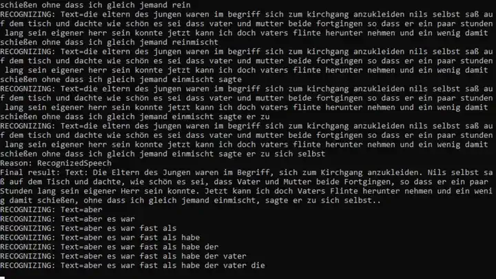

# Speech Service

Azure offers a service to convert text to speech and speech to text. Here are some examples on how this works.

## Speech-to-text demo

I followed this guide: <https://docs.microsoft.com/en-us/azure/cognitive-services/speech-service/index-speech-to-text>.

Here are the steps i took to make it work.

**Convert input to wav**

Make sure the input is a wav file. You can use FFMPEG for this task e.g.

``` sh
ffmpeg -i input.mp4 -vn -acodec pcm_s16le -ar 44100 -ac 2 output.wav
```

For more options view my [FFMPEG notes](https://0xfab1.net/tech/tools/ffmpeg/) or visit <https://ffmpeg.org/documentation.html>

**Install required tools**

``` ps11
Install-Package Microsoft.CognitiveServices.Speech # If not possible, run: Register-PackageSource -Name MyNuGet -Location https://www.nuget.org/api/v2 -ProviderName NuGet
Set-ExecutionPolicy Bypass -Scope Process -Force; [System.Net.ServicePointManager]::SecurityProtocol = [System.Net.ServicePointManager]::SecurityProtocol -bor 3072; iex ((New-Object System.Net.WebClient).DownloadString('https://chocolatey.org/install.ps1'))
choco install -y vscode # vscode
choco install -y dotnet # .NET
Start-Process "vscode:extension/ms-dotnettools.csharp"
dotnet add package Microsoft.CognitiveServices.Speech # Speech Package
```

**Create new Csharp Project**

``` ps11
New-Item -Path SpeechTest -Type Directory 
cd SpeechTest
dotnet new console
```

**Create new azure speech service resource**

I create this manually as I was to lazy to script this:
Fill out the form: <https://portal.azure.com/#create/Microsoft.CognitiveServicesAllInOne>
And you are ready to go.

**Code of Program.cs**

The program is not optimized, kept simple and is based on the example provided by the microsoft guide.
Change the parts where comments are added to make it work for you.

```csharp
using System;
using System.IO;
using System.Threading.Tasks;
using Microsoft.CognitiveServices.Speech;
using Microsoft.CognitiveServices.Speech.Audio;

namespace SpeechTest
{
    class Program
    {
        async static Task Main(string[] args)
        {
            var speechConfig = SpeechConfig.FromSubscription("Cognitive Service API KEY1", "WestEurope"); //change
            speechConfig.SpeechRecognitionLanguage = "de-de"; // change
            using var audioConfig = AudioConfig.FromWavFileInput("Path\\File.wav"); // change

            using (var recognizer = new SpeechRecognizer(speechConfig, audioConfig))
            {
                recognizer.Recognizing += (s, e) => { Console.WriteLine($"RECOGNIZING: Text={e.Result.Text}"); };

                recognizer.Recognized += (s, e) => {
                    var result = e.Result;
                    Console.WriteLine($"Reason: {result.Reason.ToString()}");

                    switch (result.Reason)
                    {
                        case ResultReason.RecognizedSpeech:
                            Console.WriteLine($"Final result: Text: {result.Text}.");
                            File.AppendAllText("Output.txt", Environment.NewLine);
                            File.AppendAllText("Output.txt", result.Text);
                            break;
                        case ResultReason.NoMatch:
                            Console.WriteLine($"NOMATCH: Speech could not be recognized.");
                            break;
                        case ResultReason.Canceled:
                            var cancellation = CancellationDetails.FromResult(result);
                            Console.WriteLine($"CANCELED: Reason={cancellation.Reason}");
                            if (cancellation.Reason == CancellationReason.Error)
                            {
                                Console.WriteLine($"CANCELED: ErrorCode={cancellation.ErrorCode}");
                                Console.WriteLine($"CANCELED: ErrorDetails={cancellation.ErrorDetails}");
                                Console.WriteLine($"CANCELED: Did you update the subscription info?");
                            }
                            break;
                    }
                };

                recognizer.Canceled += (s, e) => { Console.WriteLine($"\n    Canceled. Reason: {e.Reason.ToString()}, CanceledReason: {e.Reason}"); };
                recognizer.SessionStarted += (s, e) => { Console.WriteLine("\n    Session started event."); };
                recognizer.SessionStopped += (s, e) => { Console.WriteLine("\n    Session stopped event."); };

                await recognizer.StartContinuousRecognitionAsync().ConfigureAwait(false);

                do { Console.WriteLine("Press Enter to stop");
                } while (Console.ReadKey().Key != ConsoleKey.Enter);

                await recognizer.StopContinuousRecognitionAsync().ConfigureAwait(false);
            }
        }
    }
}
```

Run the code with:

``` ps11
dotnet run
```

This example output shows how the program first checks word for word and once the sentence  is over commits a sentence. Sometimes content of the sentence changes based on the following word(s). The example is analyzing a story by Nils Holgersson in german language:


