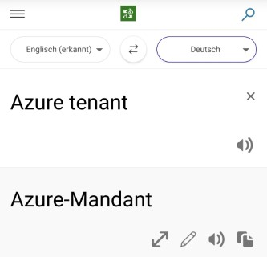
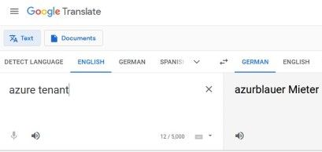

# Azure

 vs 

## Accounts

DevOps:

- Add Alias für DevOps here: <https://my.visualstudio.com/Subscriptions>
- Demos/Solutions: <https://cdx.transform.microsoft.com/>
- Your Test-Tenant: <https://cdx.transform.microsoft.com/my-tenants>
- MSDN: <https://my.visualstudio.com>

- Microsoft Azure Portal <https://portal.azure.com>
- Exchange Online <https://outlook.office.com> or <https://outlook.office365.com>
- M365 Online <https://portal.office.com>

- M365 Device Management Portal <https://devicemanagement.microsoft.com>
- Preview Azure Portal <https://preview.portal.azure.com>
- Security Only Azure Portal <https://security.microsoft.com>
- Compliance Only Azure Portal <https://compliance.microsoft.com>
- Microsoft Teams Portal <https://teams.microsoft.com>
- Azure Actice Directory: <https://aad.portal.azure.com>

## Architecture

- Getting started overview: <https://github.com/ricmmartins/AzureGovernance>
- Azure governance docs: <https://github.com/microsoft/azuredevopsgenerator/tree/master/azuregovernance/docs>
- curated guidance from Microsoft Assessments: <https://docs.microsoft.com/en-us/assessments/?mode=pre-assessment>
- Azure Migration: <https://azure.microsoft.com/en-us/migration/>
- Azure security best practices and patterns: <https://docs.microsoft.com/en-us/azure/security/fundamentals/best-practices-and-patterns>
- Azure Architecture templates: <https://docs.microsoft.com/en-us/azure/architecture/browse/>
- Templates and scripts for deploying Azure Reference Architectures: <https://github.com/mspnp/reference-architectures>
- Cloud Design Patterns: <https://docs.microsoft.com/en-us/azure/architecture/patterns/>
- Azure Architecture Center: <https://github.com/mspnp/architecture-center>
- Microsoft Cloud Adoption Framework for Azure: <https://docs.microsoft.com/en-us/azure/cloud-adoption-framework/>
- Cloud Adoption Framework Tools and Templates: <https://docs.microsoft.com/en-us/azure/cloud-adoption-framework/reference/tools-templates>
- Enterprise-Scale Reference Implementation: <https://github.com/Azure/Enterprise-Scale>
- Policy Templates: <https://github.com/Azure/Community-Policy>
- Migration Assistant: <https://azure.microsoft.com/en-us/services/app-service/migration-assistant/>

### Implement these tools within Azure

- Host own ARM Visualizer: <https://github.com/shenglol/arm-visualizer>

Optimization Tools:

- Continuous Cloud Optimization Power BI Dashboards Project: <https://github.com/Azure/ccodashboard>
- Azure Optimization Engine: <https://github.com/helderpinto/AzureOptimizationEngine>

Policy Management:

- Policy Overview: <https://github.com/JulianHayward/Azure-MG-Sub-Governance-Reporting>
- Scripts for Policies Management <https://github.com/marketplace/actions/manage-azure-policy>
- Management of Azure Diagnostic Policies: <https://github.com/JimGBritt/AzurePolicy/tree/master/AzureMonitor/Scripts>

Augmenting Azure Advisor Cost Recommendations for Automated Continuous Optimization:

- Part 1: <https://techcommunity.microsoft.com/t5/core-infrastructure-and-security/augmenting-azure-advisor-cost-recommendations-for-automated/ba-p/1339298>
- Part 2: <https://techcommunity.microsoft.com/t5/core-infrastructure-and-security/augmenting-azure-advisor-cost-recommendations-for-automated/ba-p/1457687>
- Part 3: <https://techcommunity.microsoft.com/t5/core-infrastructure-and-security/augmenting-azure-advisor-cost-recommendations-for-automated/ba-p/1544796>
- Part 4: <https://techcommunity.microsoft.com/t5/core-infrastructure-and-security/automating-continuous-optimization-with-the-azure-optimization/ba-p/1851317>

### Azure Code Templates

- Azure PowerShell cmdlets: <https://github.com/Azure/azure-powershell/tree/master>
- Powershell scripts <https://github.com/Azure/azure-powershell>
- ARM-Template Resources (1): <https://github.com/Azure/azure-quickstart-templates>
- ARM-Template Resources (2): <https://azure.microsoft.com/en-us/resources/templates/>
- Runbooks: <https://docs.microsoft.com/de-de/azure/automation/manage-runbooks>

## Learning Azure

### Microsoft Learning Material

- Microsoft Learning: <https://docs.microsoft.com/en-us/learn/azure/>
- Azure Online-Training <https://www.microsoft.com/de-de/learning/azure-skills-training.aspx>
- Certification Overview: <https://docs.microsoft.com/de-de/learn/certifications/browse/>
- Azure Online Events: <https://events.microsoft.com/?timeperiod=all&isSharedInLocalViewMode=false&category=Online&product=Cloud%20Platform&product=Developer%20Tools&product=Microsoft%20Azure&language=English>
- Microsoft OpenHack: <https://openhack.microsoft.com>
- Getting started with Azure DevOps: <https://azuredevopslabs.com/>
- DevOps Training Days: <https://azuredevcollege.com/trainingdays/>
- Azure CSAs in Microsoft OCP team in Germany: <https://github.com/CSA-OCP-GER>

### Other Learning Material

- AzureAcadamy: <https://www.youtube.com/c/AzureAcademy/videos>
- Pluralsight: <https://app.pluralsight.com>
- Certbase <https://www.certbase.de/>
- Fastlane: <https://www.fastlane.live/de_en>
- Skillpipe: <https://www.Skillpipe.com>
- Whizlabs: <https://www.whizlabs.com/>
- Midhub: <https://www.mindhub.com/>
- Udemy Azure Courses: <https://www.udemy.com/topic/microsoft-azure/>
- Cloud Security based training: <http://flaws.cloud/> and <http://flaws2.cloud/>
- CS349D: Cloud Computing Technology: <https://web.stanford.edu/class/cs349d/>

### Azure Forums

- Azure Knowledge Center: <https://azure.microsoft.com/de-de/resources/knowledge-center/>
- MSDN Forum: <https://social.msdn.microsoft.com/Forums/en-US/home>
- Server Fault: <https://serverfault.com/questions/tagged/azure>
- Stack Overflow: <https://stackoverflow.com/questions/tagged/azure>

## Azure News

Overview of links to regularly check to stay up-to-date on Azure.

- Azure Tips And Tricks: <https://microsoft.github.io/AzureTipsAndTricks>
- Azure Case Studies: <https://azure.microsoft.com/de-de/case-studies/>
- Heise Azure News: <https://www.heise.de/suche/?q=azure&search_submit.x=0&search_submit.y=0&rm=search>
- Hacker News Azure: <https://hn.algolia.com/?query=azure&sort=byPopularity&prefix&page=0&dateRange=pastYear&type=all>
- Azure Update heat map: <https://azurecharts.com/>
- Cloud News: <https://www.cloudnews.dev/>
- Azure AppService Blog: <https://azure.github.io/AppService/>
- Sapico Cloudnews: <http://cloudnews.sapico.me/>

### Blogs and Feeds

- Azure Updates News: [Link](https://azure.microsoft.com/en-in/updates/) + [Feed](https://azurecomcdn.azureedge.net/en-in/updates/feed/)
- Azure Blog by James Randall: [Link](https://www.azurefromthetrenches.com/) + [Feed](https://www.azurefromthetrenches.com/feed)
- Azure Official Blog: [Link](https://azure.microsoft.com/en-us/blog/#popular) + [Feed](https://azure.microsoft.com/en-us/blog/feed)
- Azure Blog Michael Collier: [Link](https://michaelcollier.wordpress.com/) + [Feed](https://michaelcollier.wordpress.com/feed)
- Azure Blog Brent Stineman: [Link](https://brentdacodemonkey.wordpress.com/) + [Feed](https://brentdacodemonkey.wordpress.com/feed/)
- Azure Blog "we do azure": [Link](https://wedoazure.ie/) + [Feed](https://wedoazure.ie/feed)
- Last week in Azure: [Link](https://azure.microsoft.com/en-us/blog/topics/last-week-in-azure/) + [Feed](https://azurecomcdn.azureedge.net/en-us/blog/topics/last-week-in-azure/feed/)
- Azure Friday: [Link](https://azure.microsoft.com/en-us/resources/videos/azure-friday)
- Cloud Expert: [Link](http://azurecloud.expert/category/news/) + [Feed](http://azurecloud.expert/feed/)
- Microsoft Open Source: [Link](https://cloudblogs.microsoft.com/opensource/) + [Feed](https://cloudblogs.microsoft.com/opensource/feed)
- Microsoft .NET Blog: [Link](https://devblogs.microsoft.com/dotnet/) + [Feed](https://devblogs.microsoft.com/dotnet/feed)
- Heise on Azure: [Link](https://www.heise.de/thema/Microsoft-Azure) + [Feed](https://www.heise.de/thema/Microsoft-Azure?view=atom)
- Azure Weekly: [Link](https://azureweekly.info/) + [Feed](https://azureweekly.info/rss.xml)

### YouTube Channels and Lists

- Microsoft Ignite: <https://www.youtube.com/channel/UCrhJmfAGQ5K81XQ8_od1iTg>
- Microsoft Mechanics: <https://www.youtube.com/channel/UCJ9905MRHxwLZ2jeNQGIWxA>
- Microsoft Cloud: <https://www.youtube.com/user/MSCloudOS>
- Microsoft Developer: <https://www.youtube.com/channel/UCsMica-v34Irf9KVTh6xx-g>
- Azure Academy: <https://www.youtube.com/channel/UC-MXgaFhsYU8PkqgKBdnusQ>
- John Savill: <https://www.youtube.com/user/NTFAQGuy>
- DEV205: <https://www.youtube.com/channel/UCD6bUAm2vnOslaepTJBtSHg>
- Cloud Academy: <https://www.youtube.com/channel/UCeRY0LppLWdxWAymRANTb0g>
- Tim Warner: <https://www.youtube.com/channel/UCim7PFtynyPuzMHtbNyYOXA>
- Azure 4 Everyone: <https://www.youtube.com/channel/UCdmEIMC3LBil4o0tjaTbj0w>
- Tips and Tricks: <https://www.youtube.com/playlist?list=PLLasX02E8BPCNCK8Thcxu-Y-XcBUbhFWC>

## Other Lists

- Awesome Azure: <https://github.com/kristofferandreasen/awesome-azure>
