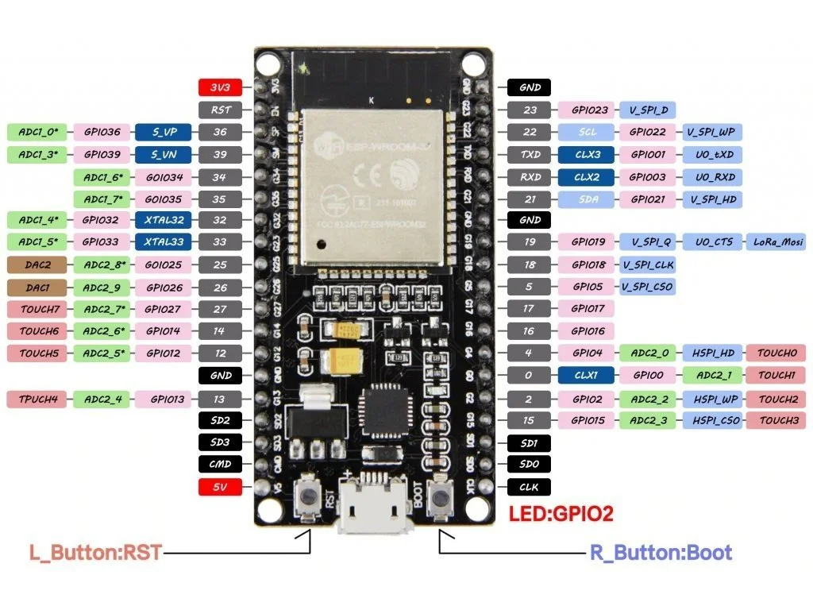
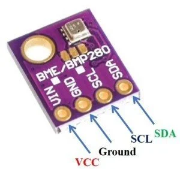
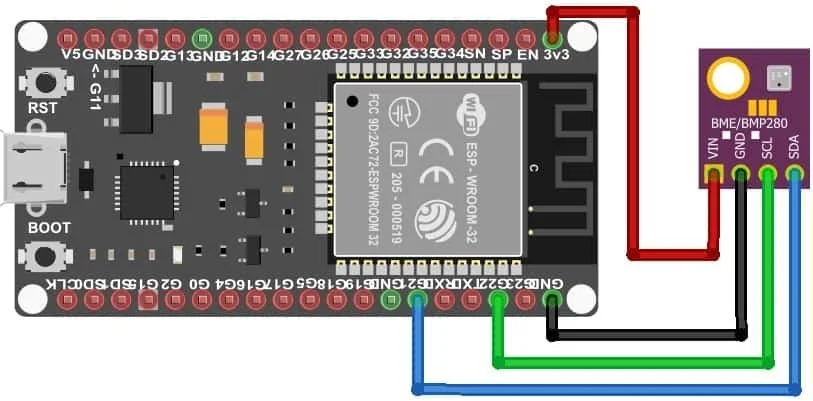
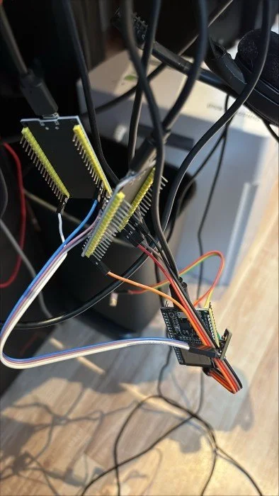
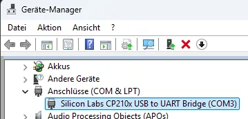
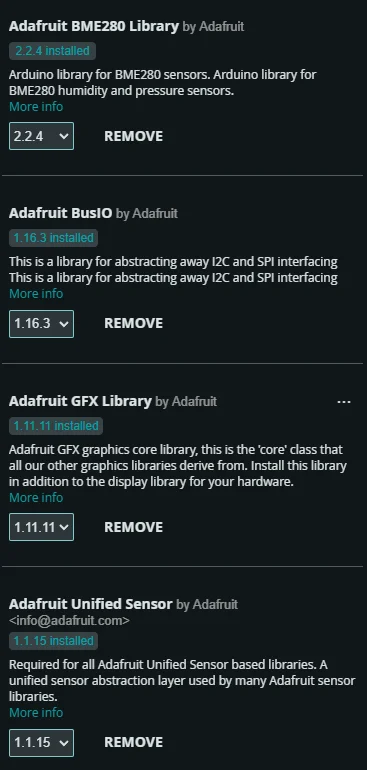
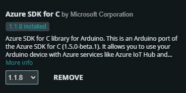

# IoT Hub

## Getting started

Install iot extension

```shell
az extension add --name azure-iot
```

add device:

```shell
az iot hub device-identity create -d simDevice -n iothub.azure-devices.net
```

simulate activity:

```shell
az iot device simulate -d simDevice -n iothub.azure-devices.net
```

View Events:

```shell
az iot hub monitor-events --output table -p all -n iothub.azure-devices.net
```

Example message with no properties

```json
{ 'Message Properties': { 'content_encoding': 'utf-8',
                          'content_type': 'text/plain; charset=UTF-8'},
  'Payload': 'lol',
  'Topic': '/devices/simDevice/messages/devicebound'}
```

Example message with one property

```json
{ 'Message Properties': { 'content_encoding': 'utf-8',
                          'content_type': 'text/plain; charset=UTF-8',
                          'key_test': 'value_test'},
  'Payload': 'test',
  'Topic': '/devices/simDevice/messages/devicebound'}
 ```

Example message with multiple properties

```json
{ 'Message Properties': { '1': '1',
                          '2': '2',
                          'content_encoding': 'utf-8',
                          'content_type': 'text/plain; charset=UTF-8',
                          'key_test': 'value_test'},
  'Payload': 'multi test',
  'Topic': '/devices/simDevice/messages/devicebound'}
```

One you have devices it is possible to query the device data e.g.:

```sql
SELECT devices.jobs.deviceId, devices.jobs.status, devices.jobs.connectionState FROM devices
```

## Ubuntu Demo

Requirements

```py
pip3 install azure-iot-device
```

```py
import time
import random
from azure.iot.device import IoTHubDeviceClient, Message

# Replace with your device's connection string from the IoT Hub device details page (see devices)
CONNECTION_STRING = "HostName=<your-iot-hub-hostname>;DeviceId=<your-device-id>;SharedAccessKey=<your-device-key>"

# Define a telemetry format
MSG_TXT = '{{"temperature": {temperature}, "humidity": {humidity}}}'

def main():
    # Create a device client
    device_client = IoTHubDeviceClient.create_from_connection_string(CONNECTION_STRING)

    # Connect to IoT Hub
    print("Connecting to IoT Hub...")
    device_client.connect()
    print("Connected.")

    try:
        while True:
            # Generate random telemetry data
            temperature = 20.0 + (5.0 * random.random())
            humidity = 60.0 + (10.0 * random.random())

            # Create the message by formatting the JSON payload
            msg_text_formatted = MSG_TXT.format(temperature=temperature, humidity=humidity)
            message = Message(msg_text_formatted)

            # (Optional) Add custom application properties if needed
            # message.custom_properties["sensortype"] = "bme280"

            print("Sending message: {}".format(message))
            device_client.send_message(message)
            print("Message successfully sent.")

            # Wait some time before sending the next message
            time.sleep(5)
    except KeyboardInterrupt:
        print("Simulation stopped by user.")
    finally:
        device_client.disconnect()

if __name__ == "__main__":
    main()
```

## ESP32 Weather Report

### Prepare ESP32

For a BME280 Sensor (I2C Setup) use the following connections:

- ESP32 3.3V to BME280 VIN
- ESP32 GND to BME280 GND
- ESP32 GPIO 21 (SDA) to BME280 SDA
- ESP32 GPIO 22 (SCL) to BME280 SCL

Pinout of my ESP32:



Pinout of my BME280 Sensor:



So the connection should look like this:



Once you are done, your IoT Device should look like this or better:



### Prepare PC

Install azure-iot:

```ps1
az extension add --name azure-iot
```

or

```sh
curl -sL https://aka.ms/InstallAzureCLIDeb | sudo bash
az extension add --name azure-iot
```

Install Arduino IDE and make sure the following Additional Boards manger URLs are added (comma separated): 

```txt
https://dl.espressif.com/dl/package_esp32_index.json,https://espressif.github.io/arduino-esp32/package_esp32_index.json
```

Connect the ESP32 and check if you see the device on any COM port.
On Windows, your attached ESP32 should appear in the device manager for example like this:



### Arduino IDE

Install the Azure SDK for Embedded C library:

- Go to Sketch, Include Library, Manage Libraries... and search for and install azure-sdk-for-c.

Here is the example code i used (other parts where not modified):

- [Azure_IoT_Hub_ESP32.ino](_Azure_IoT_Hub_ESP32.ino)
- [Variables in iot_config.h](_Variables in iot_config.h)

You need to change the variables in "Variables in iot_config.h".

Then install the following libraries:

- Adafruit_BME280_Library
- Azure SDK for C

Installed libraries for reference should look like this (probably newer versions):





Now follow these instructions

- Then go to menu File, Examples, azure-sdk-for-c and click on az_esp32 to open the sample.
- Enter your Azure IoT Hub and WIFI information into the sample's iot_configs.h.
- Go to menu Tools, Board and select ESP32.
- Upload the sketch by navigating to Sketch and click on Upload.

Optionally check the configure settings under the Tools menu, set the following:

- Upload Speed: 115200 (default is also acceptable, but faster speeds like 921600 can be used).
- CPU Frequency: 240 MHz (recommended for full performance).
- Flash Frequency: 40 MHz.
- Partition Scheme: Use "Default 4MB with spiffs" unless you have a specific reason to choose another.
- Port: Select the COM port that appears when you connect the ESP32 to your computer.
