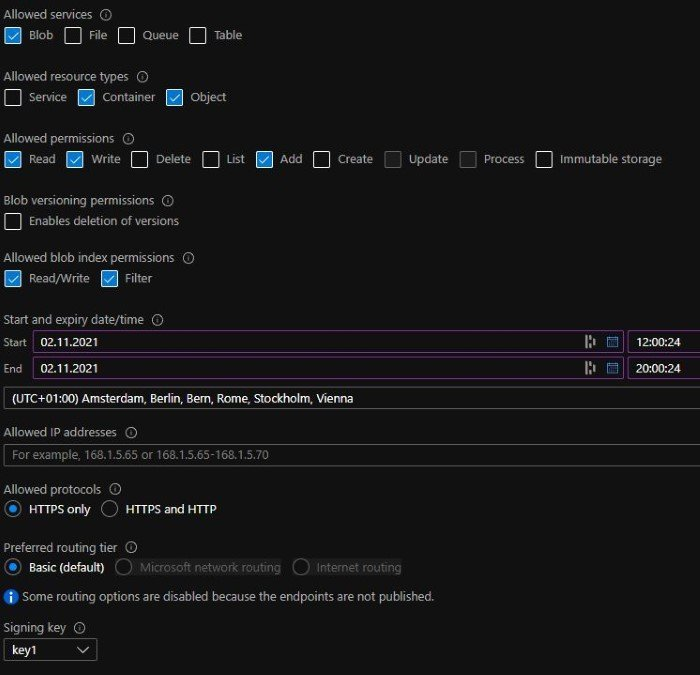
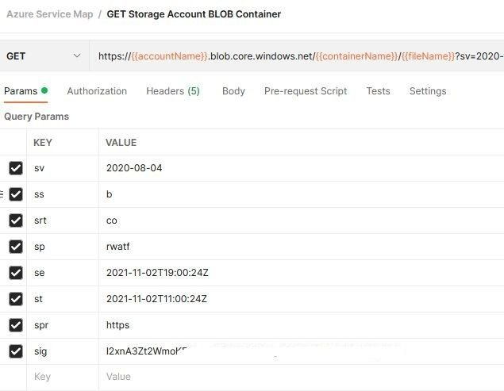
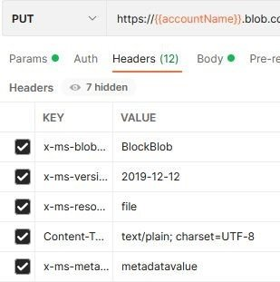
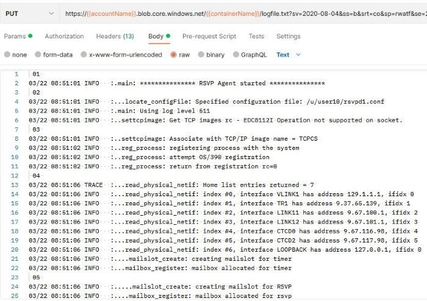
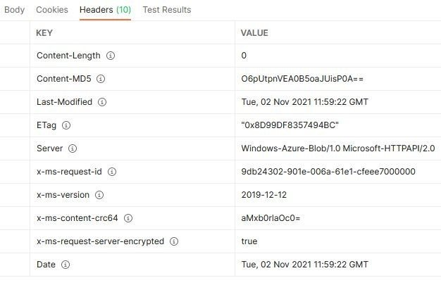
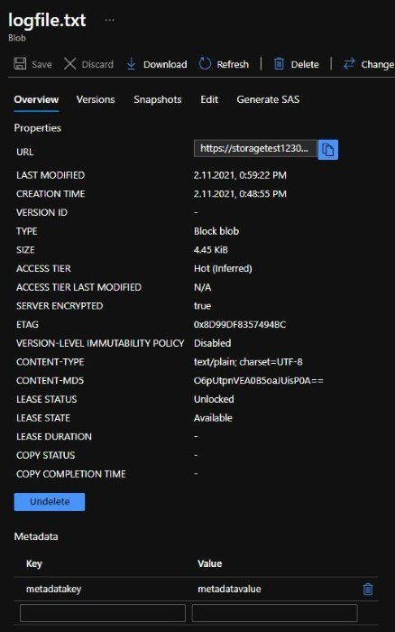
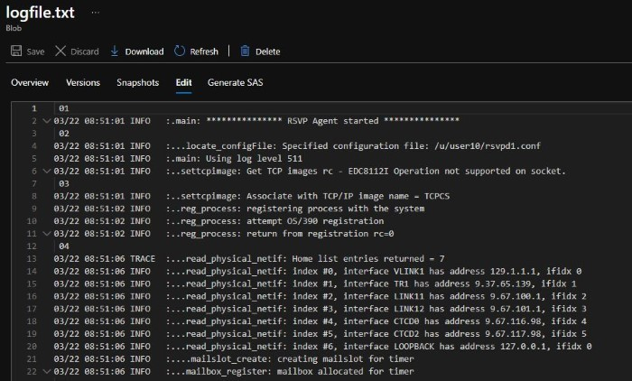

# Storage Account

## REST API

More details on the REST API:

- SAS Token: <https://docs.microsoft.com/en-us/rest/api/storageservices/authorize-with-shared-key>
- Get BLOB: <https://docs.microsoft.com/en-us/rest/api/storageservices/get-blob>
- Set BLOB Properties: <https://docs.microsoft.com/en-us/rest/api/storageservices/set-blob-properties>
- Call REST API Auth: <https://docs.microsoft.com/en-us/azure/storage/common/storage-rest-api-auth>

### PowerShell

Example how to upload a file to a BLOB storage container using SAS token authentication:

``` ps1
function UploadToBLOB ($file, $storage, $container, $sastoken) {
    $filename = (Get-Item $file).Name
    $uri = https://$($storage).blob.core.windows.net/$($container)/$($filename)$($sastoken)

    $headers = @{
        'x-ms-blob-type' = 'BlockBlob'
    }

    Invoke-RestMethod -Uri $uri -Method Put -Headers $headers -InFile $file
}

UploadToBLOB "D:\file\path\file.txt" "storage-account-name" "container-name" "SAS-token"
```

### Postman

#### GET

Running GET with Postman for a given BLOB storage container using SAS token authentication:

Create a SAS token for the Azure storage account you want to use:



Use this SAS token in the postman GET request and postman will automatically show you the parameters of the SAS token:



I modified the GET request a little bit to use [environment variables](https://learning.postman.com/docs/sending-requests/variables/) for storage account name, container name and file name:

``` txt
https://{{accountName}}.blob.core.windows.net/{{containerName}}/{{fileName}}?sv=...
```

If you have a file available at `{{containerName}}`/`{{fileName}}` you should get a `200` response with the file content e.g.:


#### POST

Running POST with Postman for a given BLOB storage container using SAS token authentication:



The values I used:

| KEY                   | VALUE                     |
|-----------------------|---------------------------|
| x-ms-blob-type        | BlockBlob                 |
| x-ms-version          | 2019-12-12                |
| x-ms-resource-type    | file                      |
| Content-Type          | text/plain; charset=UTF-8 |
| x-ms-meta-metadatakey | metadatavalue             |

I put some [example log data](https://www.ibm.com/docs/en/zos/2.1.0?topic=problems-example-log-file) in the body as raw input:



Running the POST command gives us the following result in Postman:



Viewing this file in Azure confirms the POST was successful. Here you can also see the optional header key `x-ms-meta-metadatakey` with value `metadatavalue` is set.



We can also view the file content and see it matches with what we added in the body of the POST command:


