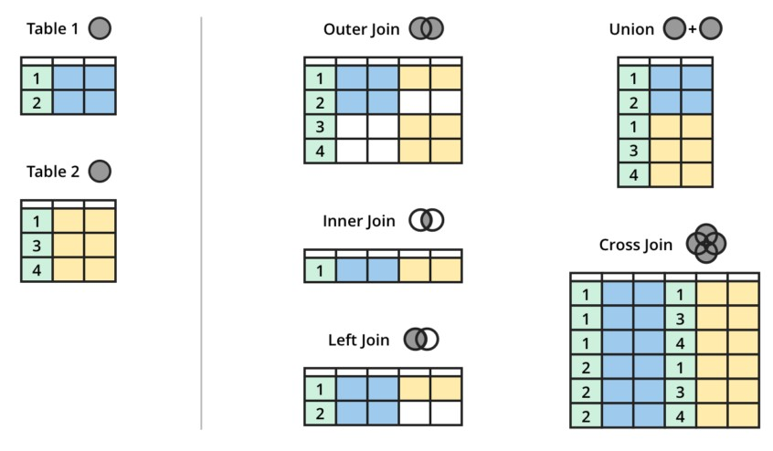

# MS SQL

```txt
   _..------.._
.-~            ~-.
|                |
|"-..________..-"|
|                |  ____   ___  _
|                | / ___| / _ \| |
|"-..________..-"| \___ \| | | | |
|                |  ___) | |_| | |___
|                | |____/ \__\_|_____|
|"-..________..-"|
|                |
|                |
 "-..________..-"
```

## JOIN

Assume table1 has the following columns and data:

- id (unique identifier)
- name (name of an individual)

| id | name    |
|----|---------|
| 1  | Alice   |
| 2  | Bob     |
| 3  | Charlie |

And table2 has the following columns and data:

- id (unique identifier)
- table1_id (foreign key referencing id in table1)
- hobby (hobby of the individual)

| id | table1_id | hobby    |
|----|-----------|----------|
| 1  | 1         | Reading  |
| 2  | 2         | Swimming |
| 3  | 3         | Painting |
| 4  | 3         | Dancing  |



### INNER JOIN

This join returns rows when there is a match in both tables.

```SQL
SELECT table1.id, table1.name, table2.hobby
FROM dbo.table1
INNER JOIN dbo.table2 ON table1.id = table2.table1_id;
```

### LEFT JOIN (or LEFT OUTER JOIN)

This join returns all rows from the left table, and the matched rows from the right table. If there is no match, NULLs are returned for columns of the right table.

```SQL
SELECT table1.id, table1.name, table2.hobby
FROM dbo.table1
LEFT JOIN dbo.table2 ON table1.id = table2.table1_id;
```

### RIGHT JOIN (or RIGHT OUTER JOIN)

This join returns all rows from the right table, and the matched rows from the left table. If there is no match, NULLs are returned for columns of the left table.

```SQL
SELECT table1.id, table1.name, table2.hobby
FROM dbo.table1
RIGHT JOIN dbo.table2 ON table1.id = table2.table1_id;
```

### FULL OUTER JOIN

This join returns rows when there is a match in one of the tables. It combines the result of both LEFT and RIGHT joins.

```SQL
SELECT table1.id, table1.name, table2.hobby
FROM dbo.table1
FULL OUTER JOIN dbo.table2 ON table1.id = table2.table1_id;
```

### CROSS JOIN

This join returns the Cartesian product of the two tables, meaning every combination of rows from the two tables.

```SQL
SELECT table1.id, table1.name, table2.hobby
FROM dbo.table1
CROSS JOIN dbo.table2;
```

## CASE

This example translates```[table1].[statusID]``` into a given text value.

```SQL
SELECT [Table] =
CASE [Table].[statusID]
    WHEN 0 THEN 'Created'
    WHEN 200 THEN 'Running'
    WHEN 300 THEN 'HALTED'
    WHEN 400 THEN 'Canceled'
    WHEN 500 THEN 'Finished'
    ELSE '-undefined-'
END
FROM [dbo].[table1]
```

## COALESCE

```SQL
COALESCE((SELECT [...] option1), (SELECT [...] option2), (SELECT [...] option3))
```

## Receive XML as query result

```SQL
FOR XML AUTO, TYPE, XMLSCHEMA, ELEMENTS XSINIL
```

## Enter Ids manually (bad!)

```SQL
SET IDENTITY_INSERT [dbo].[Table] ON
\-- DO STUFF
SET IDENTITY_INSERT [dbo].[Table] OFF
```

## Builtin functions

```SQL
SELECT HOST_NAME() -- GET Local System Name
SELECT GETUTCDATE() -- GET Local Time (UTC - Zone)
SELECT SUSER_NAME() -- GET SuperUser Name of DB
```
