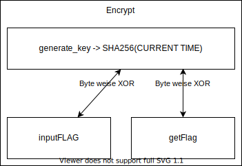

# CryptoHack.org

Notes from challenges I did @ <https://cryptohack.org>.

## XOR starter

```python
text = "label"

number1= []
for c in text:
  number1.append(int.from_bytes(c.encode(), 'big')) 
print(number1)

number2 = 13

solution1 = []
for element in number1:
    solution1.append(element ^ number2)
print(solution1)

solution2 = []
for element in solution1:
    solution2.append(chr(element))
print(solution2)
```

## XORProperties

```python
from pwn import xor

KEY1 = "a6c8b6733c9b22de7bc0253266a3867df55acde8635e19c73313"
key2x = "37dcb292030faa90d07eec17e3b1c6d8daf94c35d4c9191a5e1e"
KEY3x = "c1545756687e7573db23aa1c3452a098b71a7fbf0fddddde5fc1"
FLAGx = "04ee9855208a2cd59091d04767ae47963170d1660df7f56f5faf"

KEY2 = (xor(bytes.fromhex(KEY1), bytes.fromhex(key2x))) # XOR for KEY2
KEY3 = (xor(KEY2, bytes.fromhex(KEY3x))) # XOR for KEY3
FLAG = (xor(bytes.fromhex(KEY1), KEY2, KEY3, bytes.fromhex(FLAGx))) # XOR for FLAG

print(FLAG)
```

## XOR you dont

```python
from pwn import xor

key = bytes.fromhex("0e0b213f26041e480b26217f27342e175d0e070a3c5b103e2526217f27342e175d0e077e263451150104")

# Alt 1
print((xor(key, "crypto{")).decode())
print((xor(key, "myXORkey")).decode())

# Alt 2
print(xor(flag, 'crypto{'.encode()))
print(xor(flag, 'myXORkey'.encode()))

```

## FavByte

```python
from pwn import xor

KEY1x = bytes.fromhex("73626960647f6b206821204f21254f7d694f7624662065622127234f726927756d")

count = 0
while count < 55:
    count += 1
    try:
        possibleKey = (xor(KEY1x, count)).decode()
        if possibleKey.startswith("crypto"):
            print(possibleKey)
    except:
        print("An exception occurred wtih ", str(count)) 
```

## LemurXOR

```python
import os
import cv2 # pip3 install opencv-python 

fullpathPIC1 = os.path.dirname(__file__) + "/_flag_7ae18c704272532658c10b5faad06d74.png"
fullpathPIC2 = os.path.dirname(__file__) + "/_lemur_ed66878c338e662d3473f0d98eedbd0d.png"
fullpathnewPIC = os.path.dirname(__file__) + "/result.png"

key = cv2.bitwise_xor(cv2.imread(fullpathPIC1), cv2.imread(fullpathPIC2))
cv2.imwrite(fullpathnewPIC, key)
print("View ", fullpathnewPIC, " for result.")
```

PNGs used in this exercise:

|Flag|Lemur|Result|
|--|--|---|
|||

## Gotta go fast

**Client**

```python
from pwn import * # pip3 install pwntools
import json
import time
from Crypto.Util.number import long_to_bytes
import hashlib

def GetChallenge(JSON):
    r.sendline(json.dumps(JSON).encode())
    return r.recvline()
    
def encrypt(b):
    key = hashlib.sha256(long_to_bytes(int(time.time()))).digest()
    ciphertext = b''
    for i in range(len(b)):
        ciphertext += bytes([b[i] ^ key[i]])
    return ciphertext.hex()

# Connect
r = remote('socket.cryptohack.org', 13372) 
getFlagJSON = { "option": str("get_flag") } # JSON string to get flag
GetChallenge(getFlagJSON) # Say Hi

# Do This While there is no error
result = None
while result is None:
    try:
        receivedflag = json.loads(GetChallenge(getFlagJSON).decode())['encrypted_flag'] #63727970746f7b7430305f663473745f7430305f667572693075357d
        result = bytearray.fromhex(encrypt(bytes.fromhex(receivedflag))).decode()
        print(result)
    except:
         pass
```

**Server**

```python
#!/usr/bin/env python3

import time
from Crypto.Util.number import long_to_bytes
import hashlib
from utils import listener

FLAG = b'crypto{????????????????????}'


def generate_key():
    current_time = int(time.time())
    key = long_to_bytes(current_time)
    return hashlib.sha256(key).digest()


def encrypt(b):
    key = generate_key()
    assert len(b) <= len(key), "Data package too large to encrypt"
    ciphertext = b''
    for i in range(len(b)):
        ciphertext += bytes([b[i] ^ key[i]])
    return ciphertext.hex()


class Challenge():
    def __init__(self):
        self.before_input = "Gotta go fast!\n"

    def challenge(self, your_input):
        if not 'option' in your_input:
            return {"error": "You must send an option to this server"}

        elif your_input['option'] == 'get_flag':
            return {"encrypted_flag": encrypt(FLAG)}

        elif your_input['option'] == 'encrypt_data':
            input_data = bytes.fromhex(your_input['input_data'])
            return {"encrypted_data": encrypt(input_data)}

        else:
            return {"error": "Invalid option"}


"""
When you connect, the 'challenge' function will be called on your JSON
input.
"""
listener.start_server(port=13372)
```

## Encoding Challenge

**Server**

```python
#!/usr/bin/env python3

from Crypto.Util.number import bytes_to_long, long_to_bytes
from utils import listener
import base64
import codecs
import random

FLAG = "crypto{????????????????????}"
ENCODINGS = [
    "base64",
    "hex",
    "rot13",
    "bigint",
    "utf-8",
]
with open('/usr/share/dict/words') as f:
    WORDS = [line.strip().replace("'", "") for line in f.readlines()]


class Challenge():
    def __init__(self):
        self.challenge_words = ""
        self.stage = 0

    def create_level(self):
        self.stage += 1
        self.challenge_words = "_".join(random.choices(WORDS, k=3))
        encoding = random.choice(ENCODINGS)

        if encoding == "base64":
            encoded = base64.b64encode(self.challenge_words.encode()).decode() # wow so encode
        elif encoding == "hex":
            encoded = self.challenge_words.encode().hex()
        elif encoding == "rot13":
            encoded = codecs.encode(self.challenge_words, 'rot_13')
        elif encoding == "bigint":
            encoded = hex(bytes_to_long(self.challenge_words.encode()))
        elif encoding == "utf-8":
            encoded = [ord(b) for b in self.challenge_words]

        return {"type": encoding, "encoded": encoded}

    #
    # This challenge function is called on your input, which must be JSON
    # encoded
    #
    def challenge(self, your_input):
        if self.stage == 0:
            return self.create_level()
        elif self.stage == 100:
            self.exit = True
            return {"flag": FLAG}

        if self.challenge_words == your_input["decoded"]:
            return self.create_level()

        return {"error": "Decoding fail"}


listener.start_server(port=13377)
```

**Client**

```python
from pwn import * # pip3 install pwntools
import json
from Crypto.Util.number import bytes_to_long, long_to_bytes
import base64
import codecs
import random

r = remote('socket.cryptohack.org', 13377, level = 'debug') 

def json_recv():
    line = r.recvline()
    return json.loads(line.decode())

def json_send(jsonstring):
    request = json.dumps(jsonstring).encode()
    r.sendline(request)

count = 0
while (count < 100):     
    count = count + 1
    print("--------------" + str(count) + "--------------") 

    received = json_recv()

    receivedtype = received["type"]
    encoded = received["encoded"]

    if receivedtype == "base64":
        decoded = base64.b64decode(encoded)
    elif receivedtype == "hex":
        decoded =  bytearray.fromhex(encoded).decode()
    elif receivedtype == "rot13":
        decoded = codecs.decode(encoded, 'rot_13')
    elif receivedtype == "bigint":
        decoded = bytearray.fromhex(encoded[2:]).decode()
    elif receivedtype == "utf-8":
        decoded_temp = [chr(b) for b in encoded]
        decoded = ''.join([str(elem) for elem in decoded_temp]) 

    to_send = {
        "decoded": str(decoded)
    }

    print(to_send)

    json_send(to_send)    

else: 
    print("We are done here")
    json_recv()
```

## No Leaks 13372

Little note:



**Decode**

```python
from pwn import * # pip3 install pwntools
import json
import time
from Crypto.Util.number import long_to_bytes
import hashlib

def GetChallenge(JSON):
    r.sendline(json.dumps(JSON).encode())
    return r.recvline()
    
def encrypt(b):
    key = hashlib.sha256(long_to_bytes(int(time.time()))).digest()
    ciphertext = b''
    for i in range(len(b)):
        ciphertext += bytes([b[i] ^ key[i]])
    return ciphertext.hex()

# Connect
r = remote('socket.cryptohack.org', 13372) 
getFlagJSON = { "option": str("get_flag") } # JSON string to get flag
GetChallenge(getFlagJSON) # Say Hi

# Do This While there is no error
result = None
while result is None:
    try:
        receivedflag = json.loads(GetChallenge(getFlagJSON).decode())['encrypted_flag'] #63727970746f7b7430305f663473745f7430305f667572693075357d
        result = bytearray.fromhex(encrypt(bytes.fromhex(receivedflag))).decode()
        print(result)
    except:
         pass
```

**Program**

```python
import base64
import os
from utils import listener

FLAG = "crypto{????????????}"


def xor_flag_with_otp():
    flag_ord = [ord(c) for c in FLAG]
    otp = os.urandom(20)

    xored = bytearray([a ^ b for a, b in zip(flag_ord, otp)])

    # make sure our OTP doesnt leak any bytes from the flag
    for c, p in zip(xored, flag_ord):
        assert c != p

    return xored

class Challenge():
    def __init__(self):
        self.before_input = "No leaks\n"

    def challenge(self, your_input):
        if your_input == {"msg": "request"}:
            try:
                ciphertext = xor_flag_with_otp()
            except AssertionError:
                return {"error": "Leaky ciphertext"}

            ct_b64 = base64.b64encode(ciphertext)
            return {"ciphertext": ct_b64.decode()}
        else:
            self.exit = True
            return {"error": "Please request OTP"}


"""
When you connect, the 'challenge' function will be called on your JSON
input.
"""
listener.start_server(port=13370)

```
