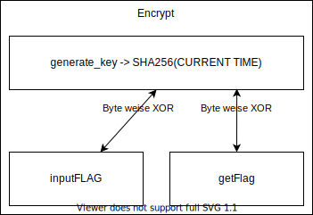

# No Leaks 13372

Notes from challenges I did @ <https://cryptohack.org>.

Little note:



**Decode**

```python
from pwn import * # pip3 install pwntools
import json
import time
from Crypto.Util.number import long_to_bytes
import hashlib

def GetChallenge(JSON):
    r.sendline(json.dumps(JSON).encode())
    return r.recvline()
    
def encrypt(b):
    key = hashlib.sha256(long_to_bytes(int(time.time()))).digest()
    ciphertext = b''
    for i in range(len(b)):
        ciphertext += bytes([b[i] ^ key[i]])
    return ciphertext.hex()

# Connect
r = remote('socket.cryptohack.org', 13372) 
getFlagJSON = { "option": str("get_flag") } # JSON string to get flag
GetChallenge(getFlagJSON) # Say Hi

# Do This While there is no error
result = None
while result is None:
    try:
        receivedflag = json.loads(GetChallenge(getFlagJSON).decode())['encrypted_flag'] #63727970746f7b7430305f663473745f7430305f667572693075357d
        result = bytearray.fromhex(encrypt(bytes.fromhex(receivedflag))).decode()
        print(result)
    except:
         pass
```

**Program**

```python
import base64
import os
from utils import listener

FLAG = "crypto{????????????}"


def xor_flag_with_otp():
    flag_ord = [ord(c) for c in FLAG]
    otp = os.urandom(20)

    xored = bytearray([a ^ b for a, b in zip(flag_ord, otp)])

    # make sure our OTP doesnt leak any bytes from the flag
    for c, p in zip(xored, flag_ord):
        assert c != p

    return xored

class Challenge():
    def __init__(self):
        self.before_input = "No leaks\n"

    def challenge(self, your_input):
        if your_input == {"msg": "request"}:
            try:
                ciphertext = xor_flag_with_otp()
            except AssertionError:
                return {"error": "Leaky ciphertext"}

            ct_b64 = base64.b64encode(ciphertext)
            return {"ciphertext": ct_b64.decode()}
        else:
            self.exit = True
            return {"error": "Please request OTP"}


"""
When you connect, the 'challenge' function will be called on your JSON
input.
"""
listener.start_server(port=13370)

```
