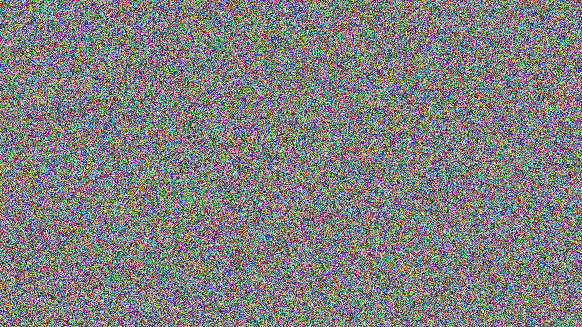
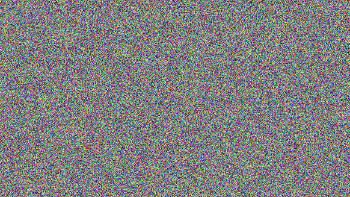
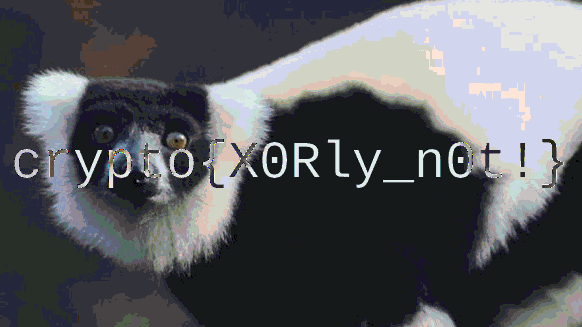

# LemurXOR

Notes from challenges I did @ <https://cryptohack.org>.

``` python
import os
import cv2 # pip3 install opencv-python 

fullpathPIC1 = os.path.dirname(__file__) + "/_flag_7ae18c704272532658c10b5faad06d74.png"
fullpathPIC2 = os.path.dirname(__file__) + "/_lemur_ed66878c338e662d3473f0d98eedbd0d.png"
fullpathnewPIC = os.path.dirname(__file__) + "/result.png"

key = cv2.bitwise_xor(cv2.imread(fullpathPIC1), cv2.imread(fullpathPIC2))
cv2.imwrite(fullpathnewPIC, key)
print("View ", fullpathnewPIC, " for result.")
```

PNGs used in this exercise:

|Flag|Lemur|Result|
|--|--|---|
|||
