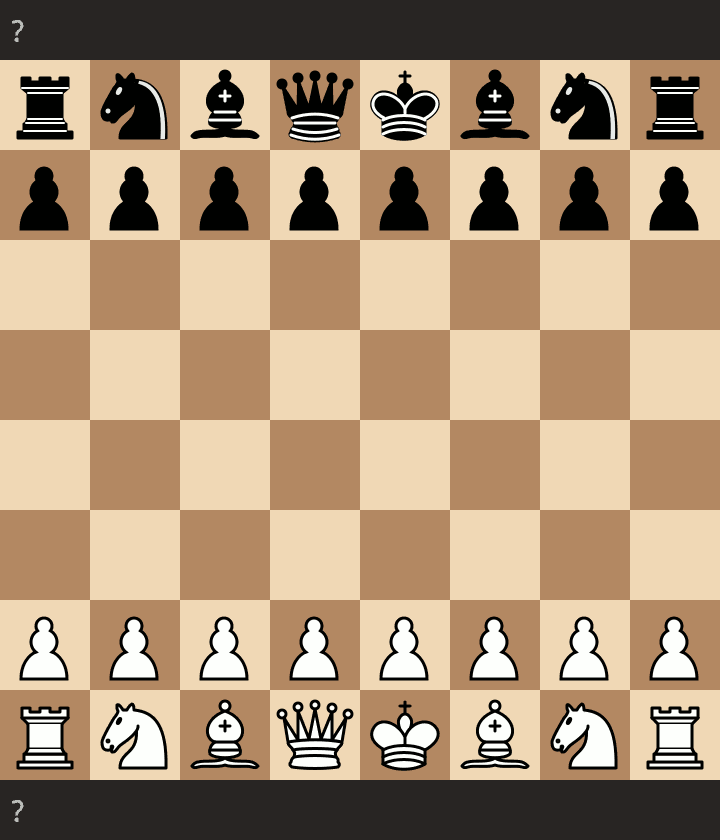

# Steganography

## Chess

James Stanley showed a cool way to [hide messages in chess games](https://incoherency.co.uk/blog/stories/chess-steg.html). View the code [here](https://github.com/jes/chess-steg).

### Example 1

Here is an example using [this implementation](https://incoherency.co.uk/chess-steg/)

Clear text

``` txt
Hello World! Greetings from 0xfab1.net :)
```

Chess notation

``` txt
1. e3 b6 2. d3 d6 3. h3 Bxh3 4. Qh5 Nh6 5. a4 g5 6. Ke2 Be6 7. Rh4 Bc4 8. Ra3 c6 9. b4 Qc8 10. Qxg5 c5 11. Qg7 Ba2 12. Kd1 e6 13. Qxf8+ Rxf8 14. Rc3 Kd8 15. Rxh6 c4 16. a5 Kd7 17. Rf6 e5 18. Rf3 Qd8 19. Rxc4 Qe7 20. Ba3 Re8 21. Rc7+ Kd8 22. Rg3 b5 23. Nf3 Nc6 24. d4 h6 25. Nh2 h5 26. Nc3 Qh4 27. Rxf7 Nxd4 28. Ne2 Be6 29. Rff3 Qxg3 30. Ke1 Bb3 31. Nxd4 Qh3 32. Rf6 Re6 33. Rf3 Re7 34. Kd1 Ba4 { White resigns. } 0-1
```

### Example 2

Here is another implementation example using [this implementation](https://github.com/carpetscheme/scalachess-steg/)

Clear text

``` txt
Hello World! Greetings from 0xfab1.net :)
```

Chess notation

``` txt
Nc3 b5 a3 g5 d4 Nc6 Qd2 Bg7 Kd1 d6 Qe3 b4 Rb1 Nf6 Nb5 Be6 Qh3 Nxd4 f3 O-O Nxa7 Ne4 fxe4 Rxa7 Qxh7+ Kxh7 axb4 Kg8 e5 Ra2 Bd2 Nxe2 b3 Bh6 Bc3 Nxg1 h4 Ra3 b5 gxh4 Bd4 Bg4+ Ke1 e6 c3 Ne2 c4 Qc8 Bc5 Kg7 Rh3 Qb7 b4 Qb8 b6 Bh5 Be3 f6 Rc1 Rb3 Kd2 cxb6 Rf3 Rxe3 Kd1 Bf7 Rc2 Bh5
```

The game ([download as lichess file](_lichess-stego-game.pgn)):


