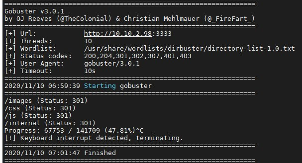

# GoBuster

Find dirs that work

- Source: <https://github.com/OJ/gobuster>
- Install: ```sudo apt-get install gobuster```

Example:

```sh
gobuster dir -w /usr/share/dirbuster/wordlists/directory-list-2.3-medium.txt -u http://10.10.112.131:80
```


