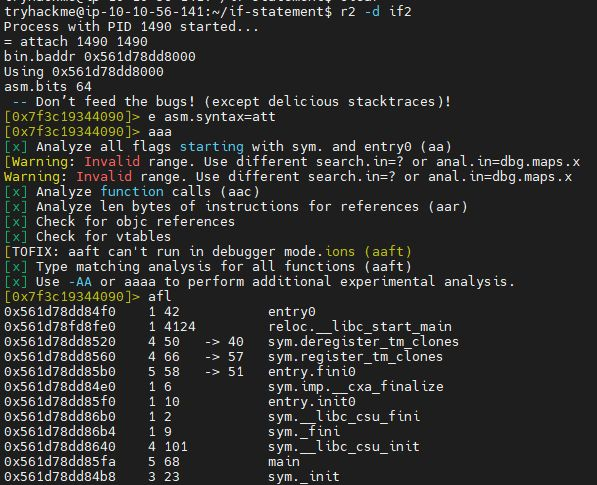
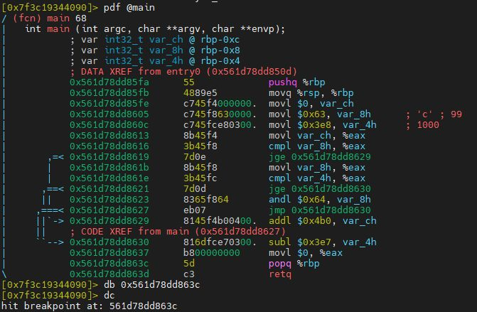
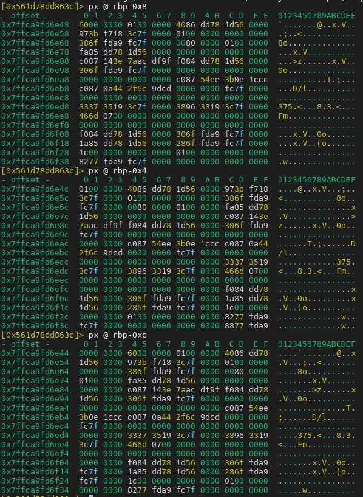

# Radare2

|What|Where|
|-|-|
|Official Page|<https://www.radare.org>|
|Source|<https://github.com/radareorg/radare2>|
|Download|<https://github.com/radareorg/radare2/releases/>|
|Install|sys/install.sh|

## Example usage

Example from doing this tryhackme challenge <https://tryhackme.com/room/adventofcyber2> -> "[Day 17] Reverse Engineering ReverseELFneering"

```shell
r2 -d ./challenge1

b+1024
e anal.bb.maxsize=2048
aa

afl | grep main
pdf @main
db 0x00400b62
px @rbp-0xc
ds
dr
px @rbp-0x8
```

## Cheat Sheet

load without any analysis (file header at offset 0x0): `r2 -n /path/to/file`

- analyze all: `aa`
- show sections: `iS`
- list functions: `afl`
- list imports: `ii`
- list entrypoints: `ie`
- seek to function: `s sym.main`
- open project: `Po <name>`
- save project: `Ps <name>`
- edit project notes: `Pn -`

## inspecting a function

- show basic block disassembly: `pdb`
- show function disassembly: `pdf`
- show function arguments: `afa`
- show function variables: `afv`
- rename function variable: `afvn`
- set function variable type: `afvt`
- add/analyze function: `af`

## visual mode

- enter visual mode: `V`
- select function, variable, xref: `v`
- quick command/seek: `_ <search string>`
- custom quick command list: `??`
- update the list of commands by changing `$R2HOME/hud`.
- show cursor: `c`
- set function name: `d`
- add comment: `;`
- remove comment: `;-`

## graph mode

graph mode is not visual mode!

- enter graph modes: `VV`
- cycle types of graphs:
- forward: `p`
- backwards: `P`

- types of graphs:
- graph view
- graph view + opcode bytes
- esil
- esil + comments
- overview

- seek to function: `g<identifier>`
- undo seek: `u`
- define new function at cursor: `df`
- rename function at cursor: `dr`
- show comments: `'`
- add comment: `/`
- add comment (complex): `:CC!`
- select bb: `???`
- seek to next bb: `tab`
- seek to previous bb: `TAB`
- if bb has conditional branch:
- seek to True target: `t`
- seek to False target: `f`

## pipe,grep,etc

- exec multiple cmd: `;`
- pipeline cmd: `|`
- run shell cmd: '!' , and give output back to r2 buffer: '!!'
- grep:
- `<cmd>~<string>` grep string from command output
- `<cmd>~[n]` grep also the 'n' column
- `<cmd>~:n` grep also the 'n' row

## analysis, assembly, memory

- analyze functions: `af`
- analyze stack: `ad@rsp` or `ad@esp`
- search for opcode: `/a`
- search for rop/jop/etc: `/R`
- search for bytes: `/x `
- get offset for the actual seek point address: `?p`

## Tryhackme tutorial notes

Just some notes from the tryhackme tutorials [intro to x86-64](https://tryhackme.com/room/introtox8664) and [Dumping Router Firmware](https://tryhackme.com/room/rfirmware)

Open "if2" to analyses the program:

```shell
r2 -d if2
e asm.syntax=att
aaa
afl
```

Output:



Set breakpoint at popq %rbp

```shell
pdf @main
db 0x561d78dd863c
```

Output:



Start execution of the program:

```shell
dc
px @ rbp-0x8
px @ rbp-0x4
px @ rbp-0xc
```

Output:



Read value of var_ch, var_8h, var_4h before popq/retq as requested.

Task 5 open loop2

```shell
r2 -d loop2
e asm.syntax=att
aaa
afl
pdf @main

db 0x55ffc9760620 # sarl
dc
dc
```

Read at secound loop

```shell
px @ rbp-0x8
px @ rbp-0xc
```

Read at end of loop

```shell
dc
px @ rbp-0x8
px @ rbp-0xc
```

task6 - crackme1

```shell
r2 -d crackme1
e asm.syntax=att
aaa
afl
pdf @main

px @ rbp-0x48 (var_48h)
px @ rbp-0x54 (var_54h) pw
```
