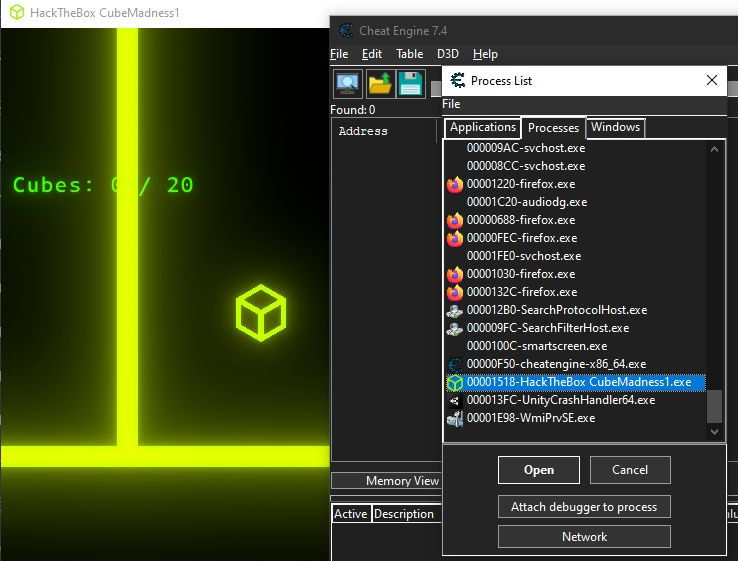
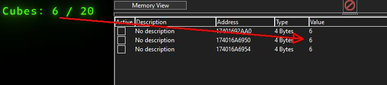
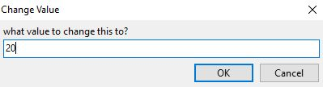
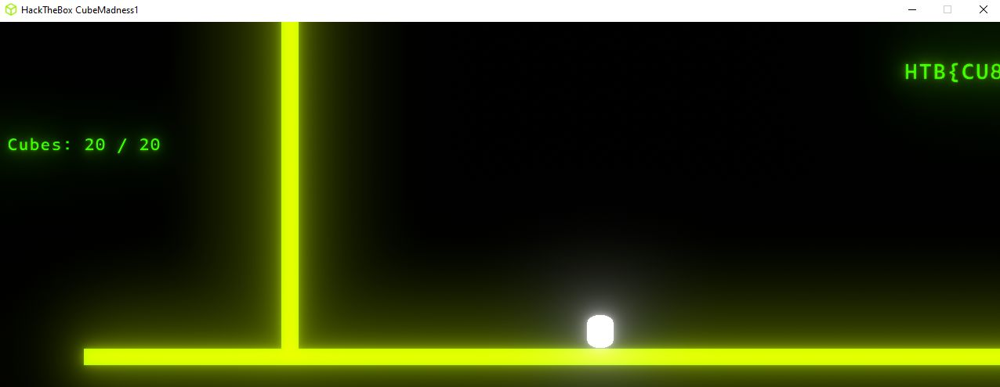

# Cube Madness 1

These notes are from a challenge I did @[hackthebox](https://hackthebox.com) called [CubeMadness1](https://app.hackthebox.com/challenges/cubemadness1).

Download the Files and ...

- Start the game "HackTheBox CubeMadness1.exe"
- Run [Cheat Engine](https://cheatengine.org/)
- Open Process "<processId>-HackTheBox CubeMadness1.exe"

In Cheat Engine lets find the variable:

- I start my first scan with an unknown inital value of 4 bytes.
- Next scan with unchanged value
- Next scan with increased value (after collecting one box)
- Repeat above a few time until only 4 or so values are left

Change the value to 20 :)

Once 20 is written to memory the score changes and the flag is shown in the middle of the map:

